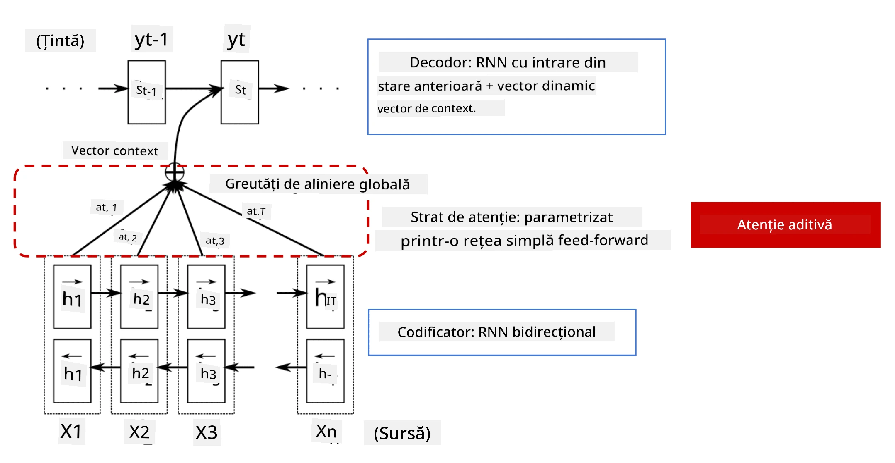
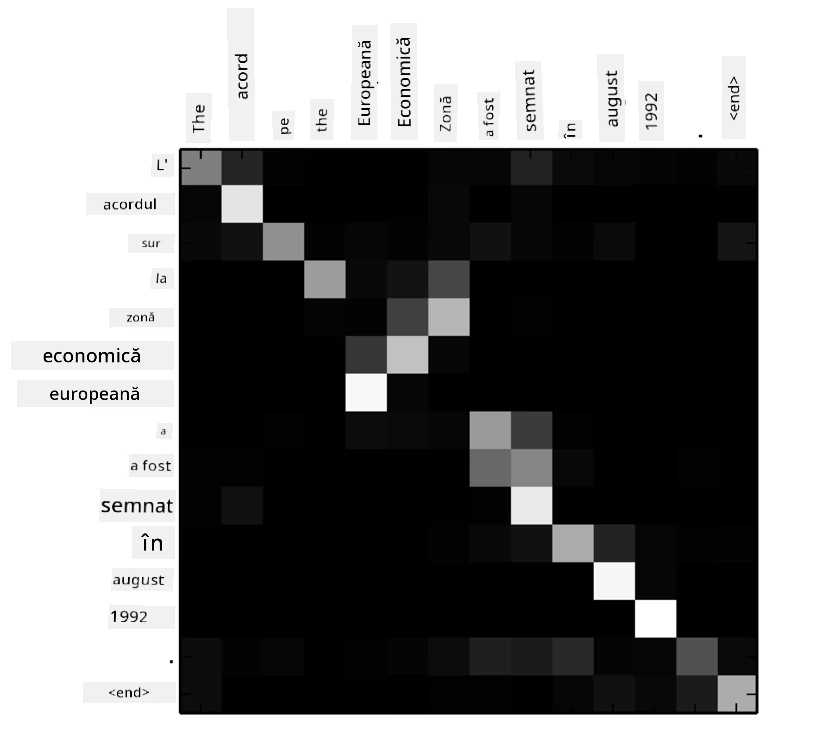
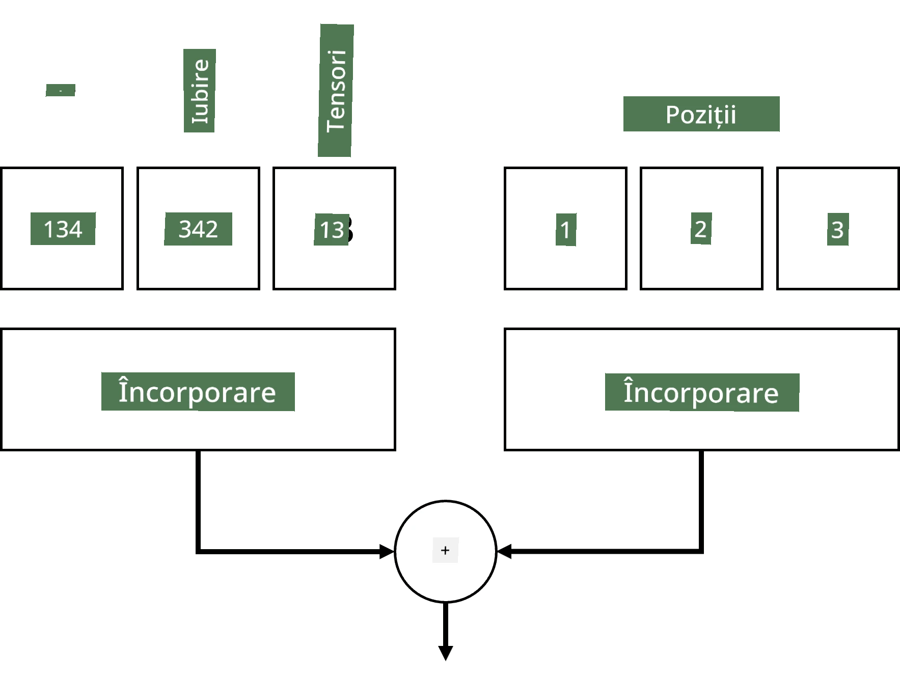
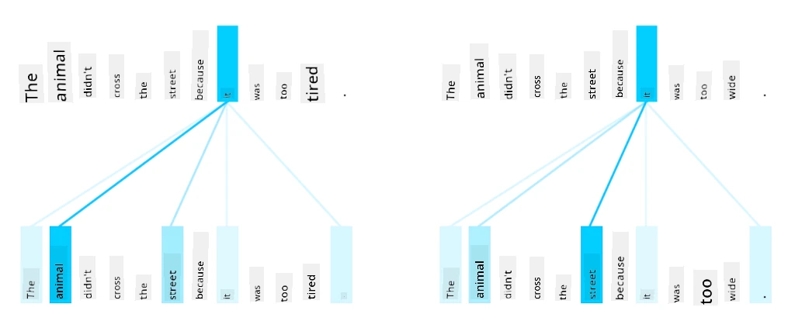
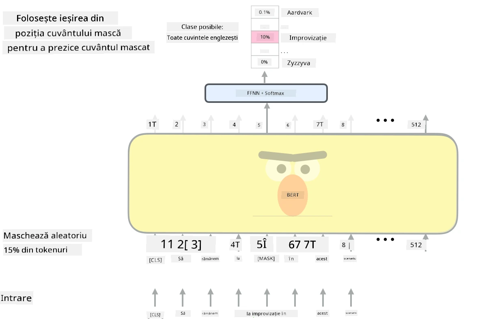

# Mecanisme de Atenție și Transformere

## [Chestionar înainte de lecție](https://ff-quizzes.netlify.app/en/ai/quiz/35)

Una dintre cele mai importante probleme din domeniul NLP este **traducerea automată**, o sarcină esențială care stă la baza unor instrumente precum Google Translate. În această secțiune, ne vom concentra pe traducerea automată sau, mai general, pe orice sarcină de tip *sequence-to-sequence* (care este numită și **transducția propozițiilor**).

Cu RNN-uri, sarcinile de tip sequence-to-sequence sunt implementate prin două rețele recurente, unde o rețea, **encoder-ul**, comprimă o secvență de intrare într-o stare ascunsă, iar cealaltă rețea, **decoder-ul**, desfășoară această stare ascunsă într-un rezultat tradus. Există câteva probleme cu această abordare:

* Starea finală a rețelei encoder are dificultăți în a-și aminti începutul unei propoziții, ceea ce duce la o calitate slabă a modelului pentru propoziții lungi.
* Toate cuvintele dintr-o secvență au același impact asupra rezultatului. În realitate, însă, anumite cuvinte din secvența de intrare au un impact mai mare asupra ieșirilor secvențiale decât altele.

**Mecanismele de Atenție** oferă o modalitate de a pondera impactul contextual al fiecărui vector de intrare asupra fiecărei predicții de ieșire a RNN-ului. Modul în care este implementat constă în crearea unor scurtături între stările intermediare ale RNN-ului de intrare și RNN-ul de ieșire. Astfel, atunci când generăm simbolul de ieșire yt, vom lua în considerare toate stările ascunse de intrare hi, cu diferiți coeficienți de greutate &alpha;t,i.

> Modelul encoder-decoder cu mecanism de atenție aditiv din [Bahdanau et al., 2015](https://arxiv.org/pdf/1409.0473.pdf), citat din [acest articol de blog](https://lilianweng.github.io/lil-log/2018/06/24/attention-attention.html)

Matricea de atenție {&alpha;i,j} ar reprezenta gradul în care anumite cuvinte de intrare contribuie la generarea unui cuvânt dat în secvența de ieșire. Mai jos este un exemplu al unei astfel de matrice:

> Figură din [Bahdanau et al., 2015](https://arxiv.org/pdf/1409.0473.pdf) (Fig.3)

Mecanismele de atenție sunt responsabile pentru o mare parte din starea actuală sau aproape actuală a artei în NLP. Totuși, adăugarea atenției crește semnificativ numărul de parametri ai modelului, ceea ce a dus la probleme de scalare cu RNN-urile. O constrângere cheie în scalarea RNN-urilor este că natura recurentă a modelelor face dificilă gruparea și paralelizarea antrenării. În cazul unui RNN, fiecare element al unei secvențe trebuie procesat în ordine secvențială, ceea ce înseamnă că nu poate fi paralelizat cu ușurință.

> Figură din [Blogul Google](https://research.googleblog.com/2016/09/a-neural-network-for-machine.html)

Adoptarea mecanismelor de atenție combinată cu această constrângere a dus la crearea modelelor Transformer, care reprezintă acum starea de artă, precum BERT sau Open-GPT3.

## Modele Transformer

Una dintre ideile principale din spatele transformatoarelor este evitarea naturii secvențiale a RNN-urilor și crearea unui model care poate fi paralelizat în timpul antrenării. Acest lucru este realizat prin implementarea a două idei:

* codificarea pozițională
* utilizarea mecanismului de auto-atenție pentru a captura tipare în loc de RNN-uri (sau CNN-uri) (de aceea lucrarea care introduce transformerele se numește *[Attention is all you need](https://arxiv.org/abs/1706.03762)*)

### Codificare/Încorporare pozițională

Ideea codificării poziționale este următoarea. 
1. Când folosim RNN-uri, poziția relativă a tokenilor este reprezentată de numărul de pași și, astfel, nu trebuie să fie reprezentată explicit. 
2. Totuși, odată ce trecem la atenție, trebuie să știm pozițiile relative ale tokenilor într-o secvență. 
3. Pentru a obține codificarea pozițională, augmentăm secvența noastră de tokeni cu o secvență de poziții ale tokenilor în secvență (adică o secvență de numere 0,1, ...).
4. Apoi combinăm poziția tokenului cu un vector de încorporare a tokenului. Pentru a transforma poziția (un număr întreg) într-un vector, putem folosi diferite abordări:

* Încorporare antrenabilă, similară cu încorporarea tokenilor. Aceasta este abordarea pe care o considerăm aici. Aplicăm straturi de încorporare atât pe tokeni, cât și pe pozițiile lor, rezultând vectori de încorporare de aceeași dimensiune, pe care îi adunăm.
* Funcție fixă de codificare pozițională, așa cum este propusă în lucrarea originală.

> Imagine de autor

Rezultatul pe care îl obținem cu încorporarea pozițională încorporează atât tokenul original, cât și poziția sa într-o secvență.

### Auto-atenție Multi-Head

Următorul pas este capturarea unor tipare în cadrul secvenței noastre. Pentru a face acest lucru, transformerele folosesc un mecanism de **auto-atenție**, care este, în esență, atenție aplicată aceleași secvențe ca intrare și ieșire. Aplicarea auto-atenției ne permite să luăm în considerare **contextul** din propoziție și să vedem care cuvinte sunt inter-relaționate. De exemplu, ne permite să vedem care cuvinte sunt referite prin coreferințe, cum ar fi *it*, și să luăm contextul în considerare:

> Imagine din [Blogul Google](https://research.googleblog.com/2017/08/transformer-novel-neural-network.html)

În transformere, folosim **Atenție Multi-Head** pentru a oferi rețelei puterea de a captura mai multe tipuri de dependențe, de exemplu, relații pe termen lung vs. termen scurt între cuvinte, coreferințe vs. altceva, etc.

[Notebook TensorFlow](TransformersTF.ipynb) conține mai multe detalii despre implementarea straturilor transformer.

### Atenție Encoder-Decoder

În transformere, atenția este utilizată în două locuri:

* Pentru a captura tipare în textul de intrare folosind auto-atenție
* Pentru a realiza traducerea secvenței - este stratul de atenție între encoder și decoder.

Atenția encoder-decoder este foarte similară cu mecanismul de atenție utilizat în RNN-uri, așa cum este descris la începutul acestei secțiuni. Acest diagramă animată explică rolul atenției encoder-decoder.

Deoarece fiecare poziție de intrare este mapată independent la fiecare poziție de ieșire, transformerele pot paraleliza mai bine decât RNN-urile, ceea ce permite modele de limbaj mult mai mari și mai expresive. Fiecare cap de atenție poate fi utilizat pentru a învăța relații diferite între cuvinte, ceea ce îmbunătățește sarcinile de procesare a limbajului natural.

## BERT

**BERT** (Bidirectional Encoder Representations from Transformers) este o rețea transformer foarte mare, cu mai multe straturi: 12 straturi pentru *BERT-base* și 24 pentru *BERT-large*. Modelul este mai întâi pre-antrenat pe un corpus mare de date text (Wikipedia + cărți) folosind antrenare nesupravegheată (prezicerea cuvintelor mascate într-o propoziție). În timpul pre-antrenării, modelul dobândește niveluri semnificative de înțelegere a limbajului, care pot fi apoi utilizate cu alte seturi de date prin ajustare fină. Acest proces se numește **învățare transferabilă**.

> Imagine [sursă](http://jalammar.github.io/illustrated-bert/)

## ✍️ Exerciții: Transformere

Continuă învățarea în următoarele notebook-uri:

* [Transformere în PyTorch](TransformersPyTorch.ipynb)
* [Transformere în TensorFlow](TransformersTF.ipynb)

## Concluzie

În această lecție ai învățat despre Transformere și Mecanismele de Atenție, instrumente esențiale în trusa NLP. Există multe variații ale arhitecturilor Transformer, inclusiv BERT, DistilBERT, BigBird, OpenGPT3 și altele, care pot fi ajustate fin. Pachetul [HuggingFace](https://github.com/huggingface/) oferă un depozit pentru antrenarea multor dintre aceste arhitecturi atât cu PyTorch, cât și cu TensorFlow.

## 🚀 Provocare

## [Chestionar după lecție](https://ff-quizzes.netlify.app/en/ai/quiz/36)

## Recapitulare și Studiu Individual

* [Articol de blog](https://mchromiak.github.io/articles/2017/Sep/12/Transformer-Attention-is-all-you-need/), care explică lucrarea clasică [Attention is all you need](https://arxiv.org/abs/1706.03762) despre transformere.
* [O serie de articole de blog](https://towardsdatascience.com/transformers-explained-visually-part-1-overview-of-functionality-95a6dd460452) despre transformere, care explică arhitectura în detaliu.

## [Temă](assignment.md)

---

