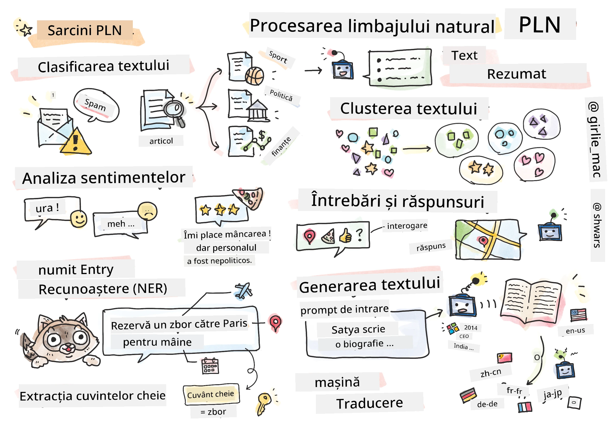

# Procesarea Limbajului Natural



În această secțiune, ne vom concentra pe utilizarea Rețelelor Neuronale pentru a rezolva sarcini legate de **Procesarea Limbajului Natural (NLP)**. Există multe probleme NLP pe care ne dorim ca calculatoarele să le poată rezolva:

* **Clasificarea textului** este o problemă tipică de clasificare care implică secvențe de text. Exemple includ clasificarea mesajelor e-mail ca spam sau non-spam, sau categorisirea articolelor ca sport, afaceri, politică etc. De asemenea, atunci când dezvoltăm chatboți, trebuie adesea să înțelegem ce a vrut să spună utilizatorul – în acest caz ne confruntăm cu **clasificarea intenției**. Adesea, în clasificarea intenției, trebuie să gestionăm multe categorii.
* **Analiza sentimentelor** este o problemă tipică de regresie, unde trebuie să atribuim un număr (un sentiment) care corespunde cât de pozitiv/negativ este sensul unei propoziții. O versiune mai avansată a analizei sentimentelor este **analiza sentimentelor bazată pe aspecte** (ABSA), unde atribuim sentimente nu întregii propoziții, ci diferitelor părți ale acesteia (aspecte), de exemplu: *La acest restaurant, mi-a plăcut bucătăria, dar atmosfera a fost groaznică*.
* **Recunoașterea Entităților Numite** (NER) se referă la problema extragerii anumitor entități din text. De exemplu, trebuie să înțelegem că în fraza *Trebuie să zbor la Paris mâine* cuvântul *mâine* se referă la DATA, iar *Paris* este o LOCAȚIE.  
* **Extracția de cuvinte cheie** este similară cu NER, dar trebuie să extragem automat cuvinte importante pentru sensul propoziției, fără antrenare prealabilă pentru tipuri specifice de entități.
* **Clusterele de text** pot fi utile atunci când dorim să grupăm propoziții similare, de exemplu, cereri similare în conversațiile de asistență tehnică.
* **Răspunsul la întrebări** se referă la abilitatea unui model de a răspunde la o întrebare specifică. Modelul primește un pasaj de text și o întrebare ca intrări și trebuie să furnizeze un loc în text unde se află răspunsul la întrebare (sau, uneori, să genereze textul răspunsului).
* **Generarea de text** este abilitatea unui model de a genera text nou. Poate fi considerată o sarcină de clasificare care prezice următoarea literă/cuvânt pe baza unui *text prompt*. Modelele avansate de generare de text, cum ar fi GPT-3, pot rezolva alte sarcini NLP folosind o tehnică numită [programare prin prompturi](https://towardsdatascience.com/software-3-0-how-prompting-will-change-the-rules-of-the-game-a982fbfe1e0) sau [ingineria prompturilor](https://medium.com/swlh/openai-gpt-3-and-prompt-engineering-dcdc2c5fcd29).
* **Sumarizarea textului** este o tehnică prin care dorim ca un computer să "citească" un text lung și să-l rezume în câteva propoziții.
* **Traducerea automată** poate fi privită ca o combinație între înțelegerea textului într-o limbă și generarea textului într-o altă limbă.

Inițial, majoritatea sarcinilor NLP erau rezolvate folosind metode tradiționale, cum ar fi gramaticile. De exemplu, în traducerea automată, se foloseau parsere pentru a transforma propoziția inițială într-un arbore sintactic, apoi se extrăgeau structuri semantice de nivel superior pentru a reprezenta sensul propoziției, iar pe baza acestui sens și a gramaticii limbii țintă se genera rezultatul. În prezent, multe sarcini NLP sunt rezolvate mai eficient folosind rețele neuronale.

> Multe metode clasice NLP sunt implementate în biblioteca Python [Natural Language Processing Toolkit (NLTK)](https://www.nltk.org). Există o excelentă [Carte NLTK](https://www.nltk.org/book/) disponibilă online, care acoperă modul în care diferite sarcini NLP pot fi rezolvate folosind NLTK.

În cadrul acestui curs, ne vom concentra în principal pe utilizarea Rețelelor Neuronale pentru NLP și vom folosi NLTK acolo unde este necesar.

Am învățat deja despre utilizarea rețelelor neuronale pentru a lucra cu date tabelare și imagini. Principala diferență între aceste tipuri de date și text este că textul este o secvență de lungime variabilă, în timp ce dimensiunea intrării în cazul imaginilor este cunoscută în avans. Deși rețelele convoluționale pot extrage tipare din datele de intrare, tiparele din text sunt mai complexe. De exemplu, putem avea o negație separată de subiect printr-un număr arbitrar de cuvinte (de exemplu: *Nu îmi plac portocalele* vs. *Nu îmi plac acele portocale mari, colorate și gustoase*), iar acest lucru ar trebui interpretat tot ca un singur tipar. Astfel, pentru a gestiona limbajul, trebuie să introducem noi tipuri de rețele neuronale, cum ar fi *rețelele recurente* și *transformerele*.

## Instalarea Bibliotecilor

Dacă utilizați o instalare locală de Python pentru a rula acest curs, este posibil să fie nevoie să instalați toate bibliotecile necesare pentru NLP folosind următoarele comenzi:

**Pentru PyTorch**
```bash
pip install -r requirements-torch.txt
```
**Pentru TensorFlow**
```bash
pip install -r requirements-tf.txt
```

> Puteți încerca NLP cu TensorFlow pe [Microsoft Learn](https://docs.microsoft.com/learn/modules/intro-natural-language-processing-tensorflow/?WT.mc_id=academic-77998-cacaste)

## Avertisment GPU

În această secțiune, în unele exemple vom antrena modele destul de mari.
* **Utilizați un computer cu GPU**: Este recomandat să rulați notebook-urile pe un computer cu GPU pentru a reduce timpii de așteptare atunci când lucrați cu modele mari.
* **Constrângeri de memorie GPU**: Rularea pe un GPU poate duce la situații în care rămâneți fără memorie GPU, mai ales când antrenați modele mari.
* **Consum de memorie GPU**: Cantitatea de memorie GPU consumată în timpul antrenării depinde de diverși factori, inclusiv dimensiunea minibatch-ului.
* **Minimizați dimensiunea minibatch-ului**: Dacă întâmpinați probleme de memorie GPU, luați în considerare reducerea dimensiunii minibatch-ului în codul dvs. ca o soluție posibilă.
* **Eliberarea memoriei GPU în TensorFlow**: Versiunile mai vechi de TensorFlow pot să nu elibereze corect memoria GPU atunci când antrenați mai multe modele într-un singur kernel Python. Pentru a gestiona eficient utilizarea memoriei GPU, puteți configura TensorFlow să aloce memorie GPU doar atunci când este necesar.
* **Includerea codului**: Pentru a seta TensorFlow să crească alocarea memoriei GPU doar când este necesar, includeți următorul cod în notebook-urile dvs.:

```python
physical_devices = tf.config.list_physical_devices('GPU') 
if len(physical_devices)>0:
    tf.config.experimental.set_memory_growth(physical_devices[0], True) 
```

Dacă sunteți interesat să învățați despre NLP dintr-o perspectivă clasică a ML, vizitați [această suită de lecții](https://github.com/microsoft/ML-For-Beginners/tree/main/6-NLP)

## În această secțiune
În această secțiune vom învăța despre:

* [Reprezentarea textului ca tensori](13-TextRep/README.md)
* [Încorporări de cuvinte](14-Emdeddings/README.md)
* [Modelarea limbajului](15-LanguageModeling/README.md)
* [Rețele Neuronale Recurente](16-RNN/README.md)
* [Rețele Generative](17-GenerativeNetworks/README.md)
* [Transformere](18-Transformers/README.md)

**Declinare de responsabilitate**:  
Acest document a fost tradus folosind serviciul de traducere AI [Co-op Translator](https://github.com/Azure/co-op-translator). Deși ne străduim să asigurăm acuratețea, vă rugăm să fiți conștienți că traducerile automate pot conține erori sau inexactități. Documentul original în limba sa natală ar trebui considerat sursa autoritară. Pentru informații critice, se recomandă traducerea profesională realizată de un specialist uman. Nu ne asumăm responsabilitatea pentru eventualele neînțelegeri sau interpretări greșite care pot apărea din utilizarea acestei traduceri.