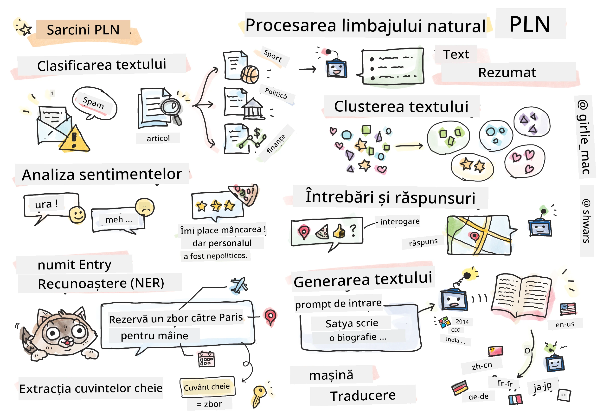

# Procesarea Limbajului Natural



În această secțiune, ne vom concentra pe utilizarea Rețelelor Neuronale pentru a gestiona sarcini legate de **Procesarea Limbajului Natural (NLP)**. Există multe probleme NLP pe care dorim ca calculatoarele să le poată rezolva:

* **Clasificarea textului** este o problemă tipică de clasificare referitoare la secvențe de text. Exemple includ clasificarea mesajelor de e-mail ca spam vs. non-spam, sau clasificarea articolelor ca sport, afaceri, politică etc. De asemenea, când dezvoltăm chat bots, adesea trebuie să înțelegem ce a dorit să spună un utilizator -- în acest caz ne ocupăm de **clasificarea intențiilor**. Adesea, în clasificarea intențiilor trebuie să gestionăm multe categorii.
* **Analiza sentimentelor** este o problemă tipică de regresie, unde trebuie să atribuim un număr (un sentiment) corespunzător cât de pozitiv/negativ este înțelesul unei propoziții. O versiune mai avansată a analizei sentimentelor este **analiza sentimentului bazată pe aspecte** (ABSA), unde atribuim sentiment nu întregii propoziții, ci diferitelor părți ale acesteia (aspecte), de ex. *În acest restaurant, mi-a plăcut bucătăria, dar atmosfera a fost groaznică*.
* **Recunoașterea Entităților Nume (NER)** se referă la problema extragerii anumitor entități din text. De exemplu, poate fi necesar să înțelegem că în expresia *Trebuie să zbor la Paris mâine* cuvântul *mâine* se referă la DATĂ, iar *Paris* este o LOCAȚIE.  
* **Extracția de cuvinte cheie** este similară cu NER, dar trebuie să extragem automat cuvinte importante pentru înțelesul propoziției, fără a pre-antrena pentru tipuri specifice de entități.
* **Clusterizarea textului** poate fi utilă când dorim să grupăm propoziții similare, de exemplu, solicitări similare în conversații de suport tehnic.
* **Răspunsul la întrebări** se referă la abilitatea unui model de a răspunde la o întrebare specifică. Modelul primește un pasaj de text și o întrebare ca intrări și trebuie să indice un loc în text unde se conține răspunsul la întrebare (sau, uneori, să genereze textul răspunsului).
* **Generarea textului** este abilitatea unui model de a genera text nou. Poate fi considerată o sarcină de clasificare care prezice următoarea literă/cuvânt bazat pe un *prompt de text*. Modelele avansate de generare de text, cum ar fi GPT-3, sunt capabile să rezolve și alte sarcini NLP precum clasificarea folosind o tehnică numită [programare prin prompt](https://towardsdatascience.com/software-3-0-how-prompting-will-change-the-rules-of-the-game-a982fbfe1e0) sau [inginerie de prompt](https://medium.com/swlh/openai-gpt-3-and-prompt-engineering-dcdc2c5fcd29)
* **Sumarizarea textului** este o tehnică când dorim ca un calculator să "citească" un text lung și să-l rezume în câteva propoziții.
* **Traducerea automată** poate fi privită ca o combinație între înțelegerea textului într-o limbă și generarea textului în alta.

Inițial, majoritatea sarcinilor NLP erau rezolvate folosind metode tradiționale cum ar fi gramatica. De exemplu, în traducerea automată se foloseau parseri pentru a transforma propoziția inițială într-un arbore sintactic, apoi se extrăgeau structuri semantice de nivel înalt pentru a reprezenta sensul propoziției și, pe baza acestui sens și a gramaticii limbii țintă, se genera rezultatul. În prezent, multe sarcini NLP sunt rezolvate mai eficient folosind rețele neuronale.

> Multe metode clasice NLP sunt implementate în biblioteca Python [Natural Language Processing Toolkit (NLTK)](https://www.nltk.org). Există o excelentă [Carte NLTK](https://www.nltk.org/book/) disponibilă online care acoperă modul în care diferite sarcini NLP pot fi rezolvate folosind NLTK.

În cursul nostru, ne vom concentra mai ales pe utilizarea Rețelelor Neuronale pentru NLP și vom folosi NLTK când este necesar.

Am învățat deja despre utilizarea rețelelor neuronale pentru gestionarea datelor tabelare și a imaginilor. Diferența principală dintre aceste tipuri de date și text este că textul este o secvență de lungime variabilă, în timp ce dimensiunea intrării în cazul imaginilor este cunoscută dinainte. În timp ce rețelele convoluționale pot extrage modele din date de intrare, modelele din text sunt mai complexe. De exemplu, putem avea negarea separată de subiect printr-un număr arbitrar de cuvinte (ex. *Nu îmi plac portocalele*, vs. *Nu îmi plac acele portocale mari colorate și gustoase*), iar aceasta ar trebui să fie interpretată tot ca un pattern. Astfel, pentru a gestiona limbajul, trebuie să introducem noi tipuri de rețele neuronale, cum ar fi *rețelele recurente* și *transformer-ele*.

## Instalarea Bibliotecilor

Dacă folosești o instalare locală de Python pentru a rula acest curs, poate fi nevoie să instalezi toate bibliotecile necesare pentru NLP folosind următoarele comenzi:

**Pentru PyTorch**
```bash
pip install -r requirements-pytorch.txt
```
**Pentru TensorFlow**
```bash
pip install -r requirements-tf.txt
```

> Poți încerca NLP cu TensorFlow pe [Microsoft Learn](https://docs.microsoft.com/learn/modules/intro-natural-language-processing-tensorflow/?WT.mc_id=academic-77998-cacaste)

## Atenționare GPU

În această secțiune, în unele exemple vom antrena modele destul de mari.
* **Folosește un calculator cu GPU activat**: Este recomandat să rulezi notebook-urile pe un calculator cu GPU activat pentru a reduce timpii de așteptare când lucrezi cu modele mari.
* **Limitări ale memoriei GPU**: Rularea pe GPU poate duce la situații în care memoria GPU se epuizează, mai ales când se antrenează modele mari.
* **Consum de memorie GPU**: Cantitatea de memorie GPU consumată în timpul antrenării depinde de diverși factori, inclusiv dimensiunea minibatch-ului.
* **Minimizează dimensiunea Minibatch-ului**: Dacă întâmpini probleme cu memoria GPU, ia în considerare reducerea dimensiunii minibatch-ului în codul tău ca soluție potențială.
* **Eliberarea memoriei GPU în TensorFlow**: Versiunile mai vechi de TensorFlow pot să nu elibereze corect memoria GPU când antrenezi mai multe modele într-un singur kernel Python. Pentru a gestiona eficient utilizarea memoriei GPU, poți configura TensorFlow să aloce memoria GPU doar după necesitate.
* **Includerea codului**: Pentru a seta TensorFlow să mărească alocarea memoriei GPU doar când este necesar, include următorul cod în notebook-uri:

```python
physical_devices = tf.config.list_physical_devices('GPU') 
if len(physical_devices)>0:
    tf.config.experimental.set_memory_growth(physical_devices[0], True) 
```

Dacă ești interesat să înveți despre NLP dintr-o perspectivă clasică ML, vizitează [această suită de lecții](https://github.com/microsoft/ML-For-Beginners/tree/main/6-NLP)

## În această Secțiune
În această secțiune vom învăța despre:

* [Reprezentarea textului ca tensori](13-TextRep/README.md)
* [Cuvinte încorporate (Word Embeddings)](14-Embeddings/README.md)
* [Modelarea limbajului](15-LanguageModeling/README.md)
* [Rețele neuronale recurente](16-RNN/README.md)
* [Rețele generative](17-GenerativeNetworks/README.md)
* [Transformere](18-Transformers/README.md)

---

<!-- CO-OP TRANSLATOR DISCLAIMER START -->
**Declinare a responsabilității**:
Acest document a fost tradus folosind serviciul de traducere AI [Co-op Translator](https://github.com/Azure/co-op-translator). În timp ce ne străduim pentru acuratețe, vă rugăm să rețineți că traducerile automate pot conține erori sau inexactități. Documentul original în limba sa nativă trebuie considerat sursa autorizată. Pentru informații critice, se recomandă traducerea profesională realizată de un om. Nu ne asumăm responsabilitatea pentru eventualele neînțelegeri sau interpretări greșite care decurg din utilizarea acestei traduceri.
<!-- CO-OP TRANSLATOR DISCLAIMER END -->