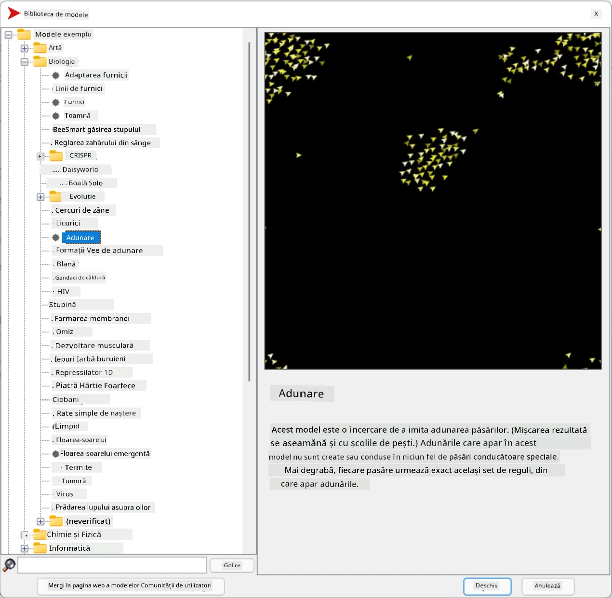

# Sisteme Multi-Agent

Una dintre modalitățile posibile de a obține inteligență este abordarea așa-numită **emergentă** (sau **sinergică**), care se bazează pe faptul că comportamentul combinat al multor agenți relativ simpli poate duce la un comportament general mai complex (sau inteligent) al sistemului în ansamblu. Teoretic, aceasta se bazează pe principiile [Inteligenței Colective](https://en.wikipedia.org/wiki/Collective_intelligence), [Emergentismului](https://en.wikipedia.org/wiki/Global_brain) și [Ciberneticii Evolutive](https://en.wikipedia.org/wiki/Global_brain), care afirmă că sistemele de nivel superior obțin un fel de valoare adăugată atunci când sunt combinate corespunzător din sisteme de nivel inferior (așa-numitul *principiu al tranziției metasistemului*).

## [Chestionar înainte de lecție](https://ff-quizzes.netlify.app/en/ai/quiz/45)

Direcția **Sistemelor Multi-Agent** a apărut în AI în anii 1990 ca răspuns la creșterea Internetului și a sistemelor distribuite. Unul dintre manualele clasice de AI, [Artificial Intelligence: A Modern Approach](https://en.wikipedia.org/wiki/Artificial_Intelligence:_A_Modern_Approach), se concentrează pe perspectiva AI clasică din punctul de vedere al sistemelor multi-agent.

Central în abordarea multi-agent este noțiunea de **Agent** - o entitate care trăiește într-un anumit **mediu**, pe care îl poate percepe și asupra căruia poate acționa. Aceasta este o definiție foarte largă, iar agenții pot fi clasificați în multe moduri diferite:

* După abilitatea lor de a raționa:
   - Agenții **reactivi** au de obicei un comportament simplu de tip cerere-răspuns
   - Agenții **deliberativi** folosesc un fel de raționament logic și/sau capacități de planificare
* După locul unde agentul își execută codul:
   - Agenții **statici** funcționează pe un nod de rețea dedicat
   - Agenții **mobili** își pot muta codul între nodurile de rețea
* După comportamentul lor:
   - Agenții **pasivi** nu au scopuri specifice. Acești agenți pot reacționa la stimuli externi, dar nu vor iniția acțiuni singuri.
   - Agenții **activi** au anumite scopuri pe care le urmăresc
   - Agenții **cognitivi** implică planificare și raționament complex

Sistemele multi-agent sunt utilizate în prezent într-o serie de aplicații:

* În jocuri, mulți personaje non-jucător folosesc un fel de AI și pot fi considerați agenți inteligenți
* În producția video, redarea scenelor 3D complexe care implică mulțimi se face de obicei folosind simulări multi-agent
* În modelarea sistemelor, abordarea multi-agent este utilizată pentru a simula comportamentul unui model complex. De exemplu, abordarea multi-agent a fost utilizată cu succes pentru a prezice răspândirea bolii COVID-19 la nivel mondial. O abordare similară poate fi utilizată pentru a modela traficul dintr-un oraș și pentru a vedea cum reacționează la schimbările regulilor de circulație.
* În sistemele complexe de automatizare, fiecare dispozitiv poate acționa ca un agent independent, ceea ce face ca întregul sistem să fie mai puțin monolitic și mai robust.

Nu vom petrece mult timp aprofundând sistemele multi-agent, dar vom analiza un exemplu de **Modelare Multi-Agent**.

## NetLogo

[NetLogo](https://ccl.northwestern.edu/netlogo/) este un mediu de modelare multi-agent bazat pe o versiune modificată a limbajului de programare [Logo](https://en.wikipedia.org/wiki/Logo_(programming_language)). Acest limbaj a fost dezvoltat pentru a învăța concepte de programare copiilor și îți permite să controlezi un agent numit **turtle** (broască țestoasă), care se poate deplasa, lăsând o urmă în spate. Acest lucru permite crearea de figuri geometrice complexe, fiind o modalitate foarte vizuală de a înțelege comportamentul unui agent.

În NetLogo, putem crea multe broaște țestoase folosind comanda `create-turtles`. Putem apoi comanda tuturor broaștelor țestoase să facă anumite acțiuni (în exemplul de mai jos - să se deplaseze înainte cu 10 puncte):

```
create-turtles 10
ask turtles [
  forward 10
]
```

Desigur, nu este interesant când toate broaștele țestoase fac același lucru, așa că putem `ask` grupuri de broaște țestoase, de exemplu, cele care se află în apropierea unui anumit punct. De asemenea, putem crea broaște țestoase de diferite *rase* folosind comanda `breed [cats cat]`. Aici `cat` este numele unei rase, iar trebuie să specificăm atât forma singulară, cât și cea plurală, deoarece diferite comenzi folosesc forme diferite pentru claritate.

> ✅ Nu vom învăța limbajul NetLogo în detaliu - poți vizita excelenta resursă [Beginner's Interactive NetLogo Dictionary](https://ccl.northwestern.edu/netlogo/bind/) dacă ești interesat să afli mai multe.

Poți [descărca](https://ccl.northwestern.edu/netlogo/download.shtml) și instala NetLogo pentru a-l încerca.

### Biblioteca de modele

Un lucru grozav despre NetLogo este că conține o bibliotecă de modele funcționale pe care le poți încerca. Mergi la **File &rightarrow; Models Library**, și vei avea multe categorii de modele din care să alegi.



> O captură de ecran a bibliotecii de modele de Dmitry Soshnikov

Poți deschide unul dintre modele, de exemplu **Biology &rightarrow; Flocking**.

### Principii de bază

După ce deschizi modelul, vei fi dus la ecranul principal NetLogo. Iată un model exemplu care descrie populația de lupi și oi, având resurse finite (iarbă).


> Captură de ecran de Dmitry Soshnikov

Pe acest ecran, poți vedea:

* Secțiunea **Interface**, care conține:
  - Câmpul principal, unde trăiesc toți agenții
  - Diferite controale: butoane, glisoare etc.
  - Grafice pe care le poți folosi pentru a afișa parametrii simulării
* Fila **Code**, care conține editorul unde poți scrie programul NetLogo

În cele mai multe cazuri, interfața va avea un buton **Setup**, care inițializează starea simulării, și un buton **Go**, care începe execuția. Acestea sunt gestionate de manipulatoare corespunzătoare în cod, care arată astfel:

```
to go [
...
]
```

Lumea NetLogo constă din următoarele obiecte:

* **Agenți** (broaște țestoase) care se pot deplasa pe câmp și pot face ceva. Comanzi agenții folosind sintaxa `ask turtles [...]`, iar codul din paranteze este executat de toți agenții în *modul broască țestoasă*.
* **Patch-uri** sunt zone pătrate ale câmpului, pe care trăiesc agenții. Poți face referire la toți agenții de pe același patch sau poți schimba culorile patch-urilor și alte proprietăți. De asemenea, poți `ask patches` să facă ceva.
* **Observer** este un agent unic care controlează lumea. Toate manipulatoarele de butoane sunt executate în *modul observator*.

> ✅ Frumusețea unui mediu multi-agent constă în faptul că codul care rulează în modul broască țestoasă sau în modul patch este executat simultan de toți agenții în paralel. Astfel, scriind puțin cod și programând comportamentul unui agent individual, poți crea un comportament complex al sistemului de simulare în ansamblu.

### Flocking

Ca exemplu de comportament multi-agent, să analizăm **[Flocking](https://en.wikipedia.org/wiki/Flocking_(behavior))**. Flocking este un model complex foarte asemănător cu modul în care zboară stolurile de păsări. Privindu-le zburând, ai putea crede că urmează un fel de algoritm colectiv sau că posedă o formă de *inteligență colectivă*. Totuși, acest comportament complex apare atunci când fiecare agent individual (în acest caz, o *pasăre*) observă doar alți agenți pe o distanță scurtă și urmează trei reguli simple:

* **Aliniere** - se îndreaptă spre direcția medie a agenților vecini
* **Coeziune** - încearcă să se îndrepte spre poziția medie a vecinilor (*atracție pe termen lung*)
* **Separare** - când se apropie prea mult de alte păsări, încearcă să se îndepărteze (*repulsie pe termen scurt*)

Poți rula exemplul de flocking și observa comportamentul. De asemenea, poți ajusta parametrii, cum ar fi *gradul de separare* sau *distanța de vizualizare*, care definește cât de departe poate vedea fiecare pasăre. Observă că dacă reduci distanța de vizualizare la 0, toate păsările devin oarbe și flocking-ul se oprește. Dacă reduci separarea la 0, toate păsările se adună într-o linie dreaptă.

> ✅ Comută la fila **Code** și vezi unde sunt implementate cele trei reguli de flocking (aliniere, coeziune și separare) în cod. Observă cum facem referire doar la acei agenți care sunt în câmpul vizual.

### Alte modele de explorat

Există câteva modele interesante pe care le poți experimenta:

* **Art &rightarrow; Fireworks** arată cum un foc de artificii poate fi considerat un comportament colectiv al fluxurilor individuale de foc
* **Social Science &rightarrow; Traffic Basic** și **Social Science &rightarrow; Traffic Grid** arată modelul traficului urban în 1D și grilă 2D, cu sau fără semafoare. Fiecare mașină din simulare urmează următoarele reguli:
   - Dacă spațiul din față este gol - accelerează (până la o anumită viteză maximă)
   - Dacă vede un obstacol în față - frânează (și poți ajusta cât de departe poate vedea șoferul)
* **Social Science &rightarrow; Party** arată cum oamenii se grupează în timpul unei petreceri cocktail. Poți găsi combinația de parametri care duce la cea mai rapidă creștere a fericirii grupului.

După cum poți vedea din aceste exemple, simulările multi-agent pot fi o modalitate foarte utilă de a înțelege comportamentul unui sistem complex format din indivizi care urmează aceeași logică sau una similară. De asemenea, poate fi utilizat pentru a controla agenți virtuali, cum ar fi [NPC-uri](https://en.wikipedia.org/wiki/NPC) în jocuri pe calculator sau agenți în lumi animate 3D.

## Agenți Deliberativi

Agenții descriși mai sus sunt foarte simpli, reacționând la schimbările din mediu folosind un fel de algoritm. Astfel, ei sunt **agenți reactivi**. Totuși, uneori agenții pot raționa și planifica acțiunile lor, caz în care sunt numiți **deliberativi**.

Un exemplu tipic ar fi un agent personal care primește o instrucțiune de la un om pentru a rezerva un tur de vacanță. Să presupunem că există mulți agenți care trăiesc pe internet și care îl pot ajuta. Acesta ar trebui să contacteze alți agenți pentru a vedea ce zboruri sunt disponibile, care sunt prețurile hotelurilor pentru diferite date și să încerce să negocieze cel mai bun preț. Când planul de vacanță este complet și confirmat de proprietar, poate continua cu rezervarea.

Pentru a face acest lucru, agenții trebuie să **comunice**. Pentru o comunicare de succes, ei au nevoie de:

* Unele **limbaje standard pentru schimbul de cunoștințe**, cum ar fi [Knowledge Interchange Format](https://en.wikipedia.org/wiki/Knowledge_Interchange_Format) (KIF) și [Knowledge Query and Manipulation Language](https://en.wikipedia.org/wiki/Knowledge_Query_and_Manipulation_Language) (KQML). Aceste limbaje sunt proiectate pe baza [teoriei actului de vorbire](https://en.wikipedia.org/wiki/Speech_act).
* Aceste limbaje ar trebui să includă și **protocoale pentru negocieri**, bazate pe diferite **tipuri de licitații**.
* O **ontologie comună** de utilizat, astfel încât să se refere la aceleași concepte cunoscând semantica lor
* O modalitate de a **descoperi** ce pot face diferiți agenți, bazată tot pe un fel de ontologie

Agenții deliberativi sunt mult mai complexi decât cei reactivi, deoarece nu doar reacționează la schimbările din mediu, ci trebuie să fie capabili să *inițieze* acțiuni. Una dintre arhitecturile propuse pentru agenții deliberativi este așa-numitul agent Credință-Dorință-Intenție (BDI):

* **Credințele** formează un set de cunoștințe despre mediul agentului. Acestea pot fi structurate ca o bază de cunoștințe sau un set de reguli pe care agentul le poate aplica unei situații specifice din mediu.
* **Dorințele** definesc ceea ce agentul dorește să facă, adică scopurile sale. De exemplu, scopul agentului asistent personal de mai sus este să rezerve un tur, iar scopul unui agent hotelier este să maximizeze profitul.
* **Intențiile** sunt acțiuni specifice pe care un agent le planifică pentru a-și atinge scopurile. Acțiunile schimbă de obicei mediul și determină comunicarea cu alți agenți.

Există câteva platforme disponibile pentru construirea sistemelor multi-agent, cum ar fi [JADE](https://jade.tilab.com/). [Acest articol](https://arxiv.org/ftp/arxiv/papers/2007/2007.08961.pdf) conține o revizuire a platformelor multi-agent, împreună cu o scurtă istorie a sistemelor multi-agent și diferitele lor scenarii de utilizare.

## Concluzie

Sistemele Multi-Agent pot lua forme foarte diferite și pot fi utilizate în multe aplicații diferite. 
Toate tind să se concentreze pe comportamentul mai simplu al unui agent individual și să obțină un comportament mai complex al sistemului general datorită **efectului sinergic**.

## 🚀 Provocare

Aplică această lecție în lumea reală și încearcă să conceptualizezi un sistem multi-agent care poate rezolva o problemă. Ce ar trebui să facă, de exemplu, un sistem multi-agent pentru a optimiza ruta unui autobuz școlar? Cum ar putea funcționa într-o brutărie?

## [Chestionar după lecție](https://ff-quizzes.netlify.app/en/ai/quiz/46)

## Revizuire & Studiu Individual

Revizuiește utilizarea acestui tip de sistem în industrie. Alege un domeniu, cum ar fi producția sau industria jocurilor video, și descoperă cum sistemele multi-agent pot fi utilizate pentru a rezolva probleme unice.

## [Temă NetLogo](assignment.md)

---

