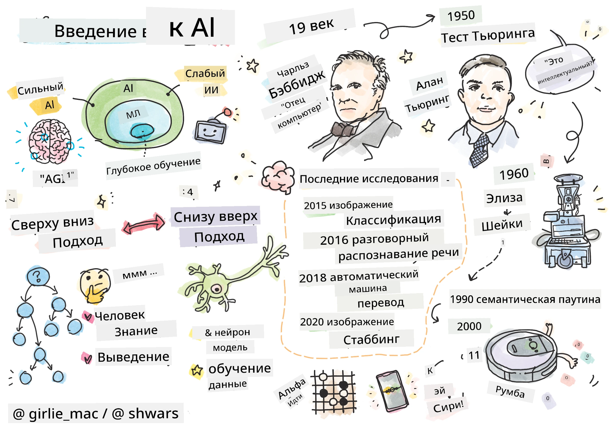
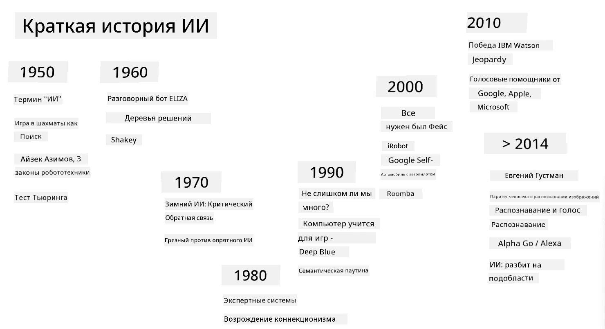
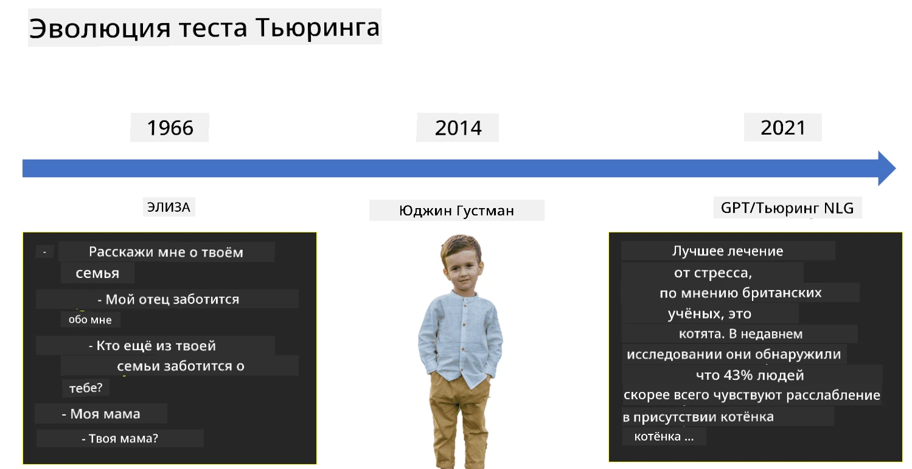

# Введение в искусственный интеллект

> Рисунок от [Tomomi Imura](https://twitter.com/girlie_mac)

## [Тест перед лекцией](https://ff-quizzes.netlify.app/en/ai/quiz/1)

**Искусственный интеллект** — это увлекательная научная дисциплина, изучающая, как можно заставить компьютеры демонстрировать интеллектуальное поведение, например, выполнять те задачи, в которых люди преуспевают.

Изначально компьютеры были изобретены [Чарльзом Бэббиджем](https://en.wikipedia.org/wiki/Charles_Babbage) для работы с числами, следуя четко определенной процедуре — алгоритму. Современные компьютеры, хотя и значительно более продвинуты, чем оригинальная модель, предложенная в XIX веке, все еще основываются на той же идее управляемых вычислений. Таким образом, можно запрограммировать компьютер на выполнение задачи, если мы знаем точную последовательность шагов, необходимых для достижения цели.

> Фото от [Викки Сошниковой](http://twitter.com/vickievalerie)

> ✅ Определение возраста человека по его фотографии — это задача, которую невозможно явно запрограммировать, потому что мы не знаем, как именно приходим к числу в голове, когда делаем это.

---

Однако существуют задачи, которые мы не знаем, как решить явно. Например, определение возраста человека по его фотографии. Мы каким-то образом учимся это делать, потому что видели множество примеров людей разного возраста, но не можем точно объяснить, как это происходит, и не можем запрограммировать компьютер на выполнение этой задачи. Именно такие задачи интересны **искусственному интеллекту** (сокращенно ИИ).

✅ Подумайте о задачах, которые вы могли бы передать компьютеру, чтобы он использовал ИИ. Рассмотрите области финансов, медицины и искусства — как эти области уже сегодня выигрывают от использования ИИ?

## Слабый ИИ vs. Сильный ИИ

Слабый ИИ | Сильный ИИ
---------------------------------------|-------------------------------------
Слабый ИИ относится к системам ИИ, которые разработаны и обучены для выполнения конкретной задачи или узкого набора задач.|Сильный ИИ, или Искусственный Общий Интеллект (AGI), относится к системам ИИ с уровнем интеллекта и понимания, сопоставимым с человеческим.
Эти системы ИИ не обладают общей интеллектуальностью; они превосходны в выполнении заранее определенной задачи, но лишены истинного понимания или сознания.|Эти системы ИИ способны выполнять любые интеллектуальные задачи, которые может выполнять человек, адаптироваться к различным областям и обладать формой сознания или самосознания.
Примеры слабого ИИ включают виртуальных помощников, таких как Siri или Alexa, алгоритмы рекомендаций, используемые стриминговыми сервисами, и чат-ботов, разработанных для конкретных задач обслуживания клиентов.|Достижение сильного ИИ является долгосрочной целью исследований в области ИИ и потребует разработки систем ИИ, способных рассуждать, учиться, понимать и адаптироваться к широкому спектру задач и контекстов.
Слабый ИИ высоко специализирован и не обладает когнитивными способностями, подобными человеческим, или способностями к решению общих проблем за пределами своей узкой области.|Сильный ИИ в настоящее время является теоретической концепцией, и ни одна система ИИ не достигла этого уровня общего интеллекта.

Для получения дополнительной информации обратитесь к **[Искусственному Общему Интеллекту](https://en.wikipedia.org/wiki/Artificial_general_intelligence)** (AGI).

## Определение интеллекта и тест Тьюринга

Одна из проблем при работе с термином **[интеллект](https://en.wikipedia.org/wiki/Intelligence)** заключается в том, что нет четкого определения этого термина. Можно утверждать, что интеллект связан с **абстрактным мышлением** или **самосознанием**, но мы не можем точно его определить.

> [Фото](https://unsplash.com/photos/75715CVEJhI) от [Amber Kipp](https://unsplash.com/@sadmax) с Unsplash

Чтобы увидеть неоднозначность термина *интеллект*, попробуйте ответить на вопрос: "Кот — это интеллектуальное существо?". Разные люди склонны давать разные ответы на этот вопрос, так как нет универсально принятого теста, чтобы доказать истинность утверждения. А если вы думаете, что такой тест есть — попробуйте провести IQ-тест для вашего кота...

✅ Подумайте минуту о том, как вы определяете интеллект. Ворона, которая может пройти лабиринт и добраться до еды, — это интеллектуальное существо? А ребенок?

---

Когда мы говорим об AGI, нам нужно иметь способ определить, создали ли мы действительно интеллектуальную систему. [Алан Тьюринг](https://en.wikipedia.org/wiki/Alan_Turing) предложил способ, называемый **[тестом Тьюринга](https://en.wikipedia.org/wiki/Turing_test)**, который также служит определением интеллекта. Тест сравнивает данную систему с чем-то изначально интеллектуальным — реальным человеком, и поскольку любое автоматическое сравнение может быть обмануто компьютерной программой, мы используем человеческого интеррогатора. Таким образом, если человек не может отличить реального человека от компьютерной системы в текстовом диалоге — система считается интеллектуальной.

> Чат-бот под названием [Eugene Goostman](https://en.wikipedia.org/wiki/Eugene_Goostman), разработанный в Санкт-Петербурге, приблизился к прохождению теста Тьюринга в 2014 году, используя хитрый трюк с личностью. Он сразу заявил, что является 13-летним украинским мальчиком, что объясняло недостаток знаний и некоторые несоответствия в тексте. Бот убедил 30% судей, что он человек, после 5-минутного диалога — метрика, которую Тьюринг считал достижимой машиной к 2000 году. Однако следует понимать, что это не означает, что мы создали интеллектуальную систему или что компьютерная система обманула человеческого интеррогатора — людей обманули создатели бота, а не сама система!

✅ Вас когда-нибудь обманывал чат-бот, заставляя думать, что вы разговариваете с человеком? Как он вас убедил?

## Различные подходы к ИИ

Если мы хотим, чтобы компьютер вел себя как человек, нам нужно каким-то образом смоделировать внутри компьютера наш способ мышления. Следовательно, нам нужно попытаться понять, что делает человека интеллектуальным.

> Чтобы запрограммировать интеллект в машине, нам нужно понять, как работают наши собственные процессы принятия решений. Если вы немного поразмышляете, вы поймете, что некоторые процессы происходят подсознательно — например, мы можем отличить кошку от собаки, не задумываясь об этом, — в то время как другие включают рассуждения.

Существует два возможных подхода к этой проблеме:

Подход сверху вниз (символическое рассуждение) | Подход снизу вверх (нейронные сети)
---------------------------------------|-------------------------------------
Подход сверху вниз моделирует способ, которым человек рассуждает для решения задачи. Он включает извлечение **знаний** от человека и представление их в форме, читаемой компьютером. Также необходимо разработать способ моделирования **рассуждений** внутри компьютера. | Подход снизу вверх моделирует структуру человеческого мозга, состоящего из огромного количества простых единиц, называемых **нейронами**. Каждый нейрон действует как взвешенное среднее своих входов, и мы можем обучить сеть нейронов решать полезные задачи, предоставляя **обучающие данные**.

Существуют также другие возможные подходы к интеллекту:

* **Эмерджентный**, **синергетический** или **многоагентный подход** основан на том, что сложное интеллектуальное поведение может быть получено благодаря взаимодействию большого количества простых агентов. Согласно [эволюционной кибернетике](https://en.wikipedia.org/wiki/Global_brain#Evolutionary_cybernetics), интеллект может *возникнуть* из более простого, реактивного поведения в процессе *перехода к метасистеме*.

* **Эволюционный подход**, или **генетический алгоритм**, представляет собой процесс оптимизации, основанный на принципах эволюции.

Мы рассмотрим эти подходы позже в курсе, но сейчас сосредоточимся на двух основных направлениях: сверху вниз и снизу вверх.

### Подход сверху вниз

В **подходе сверху вниз** мы пытаемся моделировать наше рассуждение. Поскольку мы можем следить за своими мыслями, когда рассуждаем, мы можем попытаться формализовать этот процесс и запрограммировать его внутри компьютера. Это называется **символическим рассуждением**.

Люди склонны иметь в голове определенные правила, которые направляют их процессы принятия решений. Например, когда врач ставит диагноз пациенту, он или она может понять, что у человека высокая температура, а значит, возможно, в организме происходит воспаление. Применяя большой набор правил к конкретной проблеме, врач может прийти к окончательному диагнозу.

Этот подход сильно зависит от **представления знаний** и **рассуждений**. Извлечение знаний от человеческого эксперта может быть самой сложной частью, потому что врач во многих случаях не знает точно, почему он или она приходит к определенному диагнозу. Иногда решение просто приходит в голову без явного размышления. Некоторые задачи, такие как определение возраста человека по фотографии, вообще не могут быть сведены к манипуляции знаниями.

### Подход снизу вверх

Альтернативно, мы можем попытаться смоделировать самые простые элементы внутри нашего мозга — нейрон. Мы можем построить так называемую **искусственную нейронную сеть** внутри компьютера, а затем попытаться научить ее решать задачи, предоставляя ей примеры. Этот процесс похож на то, как новорожденный ребенок узнает о своем окружении, делая наблюдения.

✅ Проведите небольшое исследование о том, как дети учатся. Какие основные элементы мозга ребенка?

> | А как насчет ML?         |      |
> |--------------|-----------|
> | Часть искусственного интеллекта, основанная на обучении компьютера решать задачу на основе данных, называется **машинным обучением**. Мы не будем рассматривать классическое машинное обучение в этом курсе — мы рекомендуем вам отдельный учебный курс [Машинное обучение для начинающих](http://aka.ms/ml-beginners). |       |

## Краткая история ИИ

Искусственный интеллект как область начался в середине двадцатого века. Изначально подход символического рассуждения был преобладающим и привел к ряду важных успехов, таких как экспертные системы — компьютерные программы, способные действовать как эксперт в некоторых ограниченных областях. Однако вскоре стало ясно, что такой подход плохо масштабируется. Извлечение знаний от эксперта, представление их в компьютере и поддержание базы знаний в актуальном состоянии оказалось очень сложной задачей и слишком дорогой для практического применения во многих случаях. Это привело к так называемой [зиме ИИ](https://en.wikipedia.org/wiki/AI_winter) в 1970-х годах.

> Изображение от [Дмитрия Сошникова](http://soshnikov.com)

Со временем вычислительные ресурсы стали дешевле, и появилось больше данных, поэтому подходы с нейронными сетями начали демонстрировать отличные результаты в конкуренции с людьми во многих областях, таких как компьютерное зрение или распознавание речи. В последнее десятилетие термин "искусственный интеллект" в основном используется как синоним нейронных сетей, потому что большинство успехов ИИ, о которых мы слышим, основаны на них.

Мы можем наблюдать, как подходы менялись, например, при создании компьютерной программы для игры в шахматы:

* Ранние шахматные программы основывались на поиске — программа явно пыталась оценить возможные ходы противника на заданное количество следующих ходов и выбирала оптимальный ход на основе оптимальной позиции, которую можно достичь за несколько ходов. Это привело к разработке так называемого алгоритма поиска [альфа-бета отсечения](https://en.wikipedia.org/wiki/Alpha%E2%80%93beta_pruning).
* Стратегии поиска хорошо работают ближе к концу игры, где пространство поиска ограничено небольшим количеством возможных ходов. Однако в начале игры пространство поиска огромное, и алгоритм можно улучшить, обучаясь на существующих матчах между человеческими игроками. Последующие эксперименты использовали так называемое [рассуждение на основе случаев](https://en.wikipedia.org/wiki/Case-based_reasoning), где программа искала случаи в базе знаний, очень похожие на текущую позицию в игре.
* Современные программы, которые выигрывают у человеческих игроков, основаны на нейронных сетях и [обучении с подкреплением](https://en.wikipedia.org/wiki/Reinforcement_learning), где программы учатся играть, играя долгое время против самих себя и обучаясь на своих ошибках — так же, как люди учатся играть в шахматы. Однако компьютерная программа может сыграть гораздо больше игр за гораздо меньшее время, и, следовательно, может учиться гораздо быстрее.

✅ Проведите небольшое исследование о других играх, в которые играли ИИ.

Аналогично, мы можем увидеть, как подход к созданию "говорящих программ" (которые могут пройти тест Тьюринга) изменился:

* Ранние программы такого рода, такие как [Eliza](https://en.wikipedia.org/wiki/ELIZA), основывались на очень простых грамматических правилах и переформулировке входного предложения в вопрос.
* Современные помощники, такие как Cortana, Siri или Google Assistant, являются гибридными системами, которые используют нейронные сети для преобразования речи в текст и распознавания нашего намерения, а затем применяют некоторые рассуждения или явные алгоритмы для выполнения необходимых действий.
* В будущем мы можем ожидать полной нейронной модели, способной самостоятельно вести диалог. Недавние нейронные сети семейства GPT и [Turing-NLG](https://www.microsoft.com/research/blog/turing-nlg-a-17-billion-parameter-language-model-by-microsoft) демонстрируют большие успехи в этом.

> Изображение Дмитрия Сошникова, [фото](https://unsplash.com/photos/r8LmVbUKgns) Марина Абросимова, [Unsplash](https://unsplash.com/@abrosimova_marina_foto)

## Недавние исследования в области ИИ

Огромный рост исследований в области нейронных сетей начался примерно в 2010 году, когда стали доступны крупные публичные наборы данных. Огромная коллекция изображений под названием [ImageNet](https://en.wikipedia.org/wiki/ImageNet), содержащая около 14 миллионов аннотированных изображений, дала начало [ImageNet Large Scale Visual Recognition Challenge](https://image-net.org/challenges/LSVRC/).

> Изображение [Дмитрия Сошникова](http://soshnikov.com)

В 2012 году [сверточные нейронные сети](../4-ComputerVision/07-ConvNets/README.md) впервые были использованы для классификации изображений, что привело к значительному снижению ошибок классификации (с почти 30% до 16,4%). В 2015 году архитектура ResNet от Microsoft Research [достигла уровня точности, сопоставимого с человеческим](https://doi.org/10.1109/ICCV.2015.123).

С тех пор нейронные сети продемонстрировали очень успешное поведение во многих задачах:

---

Год | Достигнут паритет с человеком
-----|--------
2015 | [Классификация изображений](https://doi.org/10.1109/ICCV.2015.123)
2016 | [Распознавание разговорной речи](https://arxiv.org/abs/1610.05256)
2018 | [Автоматический машинный перевод](https://arxiv.org/abs/1803.05567) (с китайского на английский)
2020 | [Подписи к изображениям](https://arxiv.org/abs/2009.13682)

За последние несколько лет мы стали свидетелями огромных успехов в разработке крупных языковых моделей, таких как BERT и GPT-3. Это стало возможным в основном благодаря большому количеству доступных текстовых данных, которые позволяют обучать модели для понимания структуры и смысла текстов, предварительно обучать их на общих текстовых коллекциях, а затем специализировать эти модели для более конкретных задач. Мы подробнее изучим [обработку естественного языка](../5-NLP/README.md) позже в этом курсе.

## 🚀 Задание

Изучите интернет, чтобы определить, где, по вашему мнению, ИИ используется наиболее эффективно. Это может быть приложение для карт, сервис преобразования речи в текст или видеоигра. Исследуйте, как была построена эта система.

## [Викторина после лекции](https://ff-quizzes.netlify.app/en/ai/quiz/2)

## Обзор и самостоятельное изучение

Изучите историю ИИ и машинного обучения, прочитав [этот урок](https://github.com/microsoft/ML-For-Beginners/tree/main/1-Introduction/2-history-of-ML). Выберите элемент из скетчноута в начале этого урока или текущего и исследуйте его более подробно, чтобы понять культурный контекст, повлиявший на его развитие.

**Задание**: [Game Jam](assignment.md)

---

<!-- CO-OP TRANSLATOR DISCLAIMER START -->
**Отказ от ответственности**:  
Этот документ был переведен с использованием сервиса автоматического перевода [Co-op Translator](https://github.com/Azure/co-op-translator). Несмотря на наши усилия обеспечить точность, автоматические переводы могут содержать ошибки или неточности. Оригинальный документ на его родном языке следует считать авторитетным источником. Для получения критически важной информации рекомендуется профессиональный перевод человеком. Мы не несем ответственности за любые недоразумения или неправильные интерпретации, возникающие в результате использования данного перевода.
<!-- CO-OP TRANSLATOR DISCLAIMER END -->