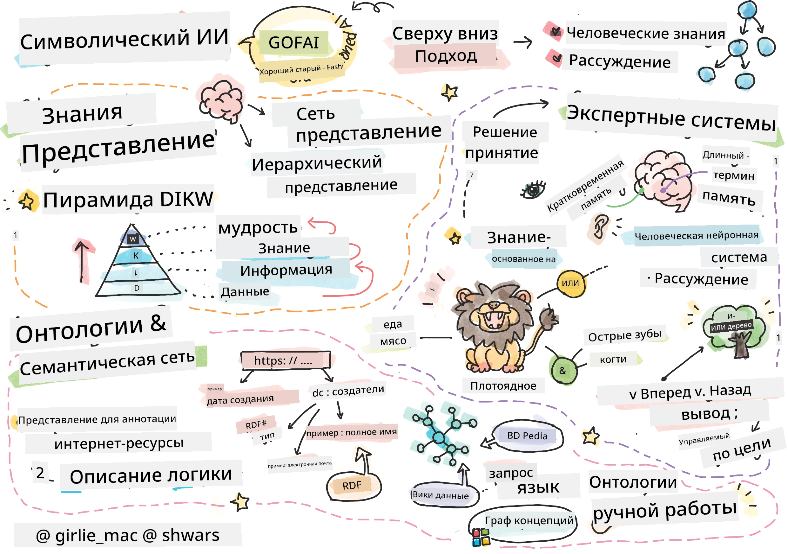
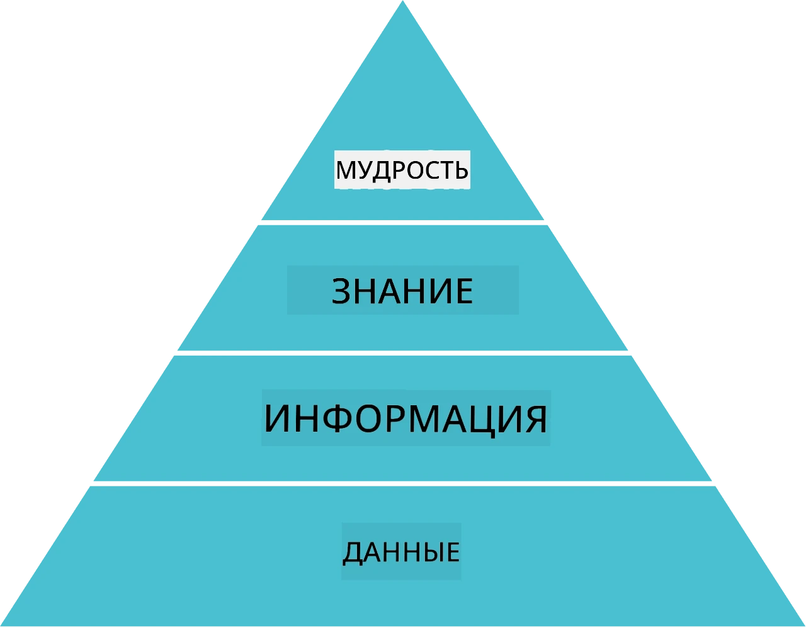
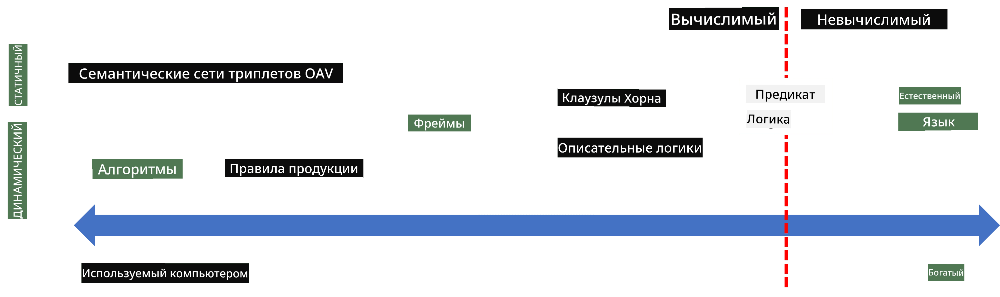
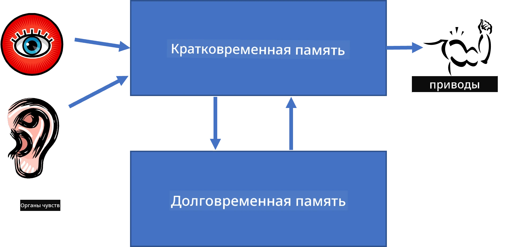
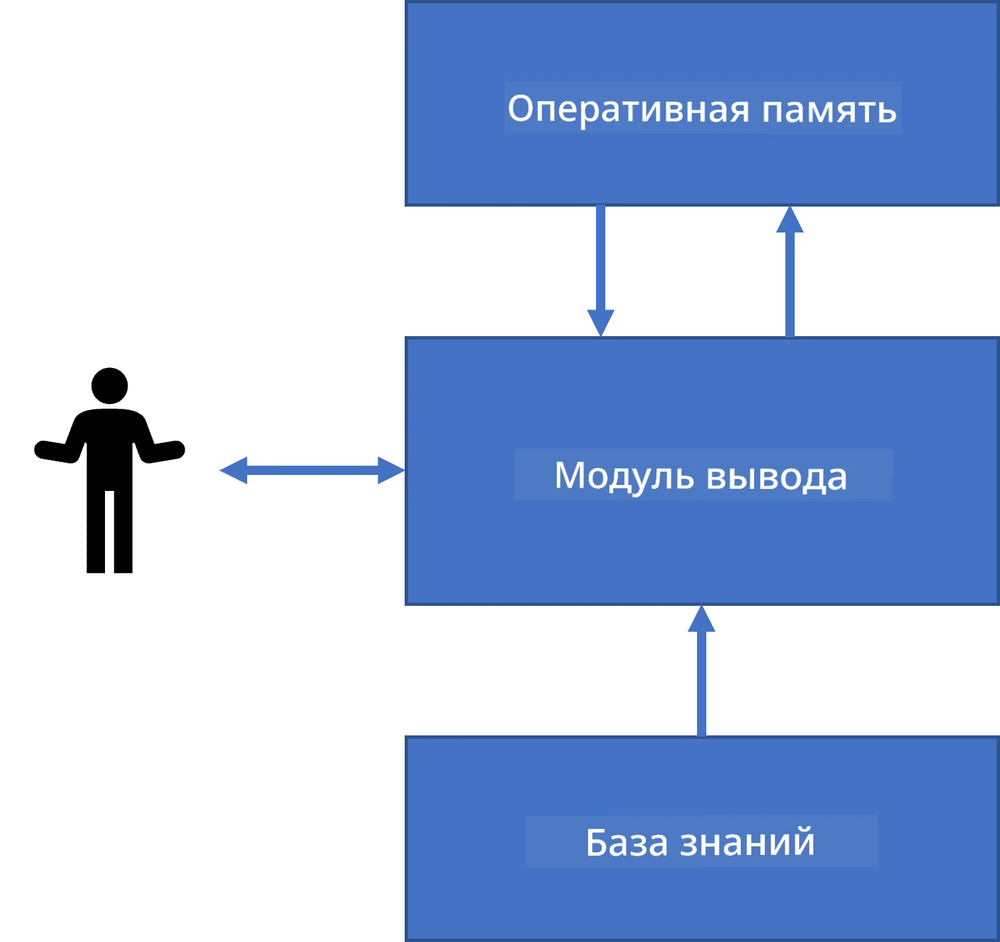
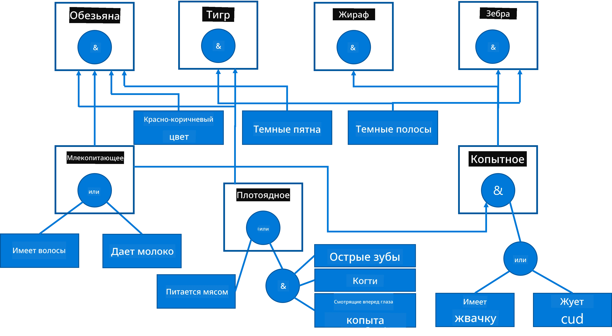
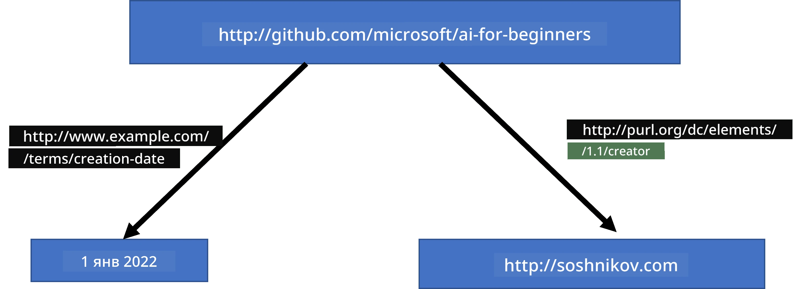
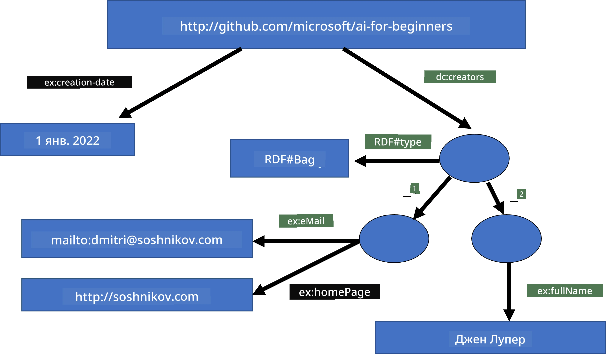
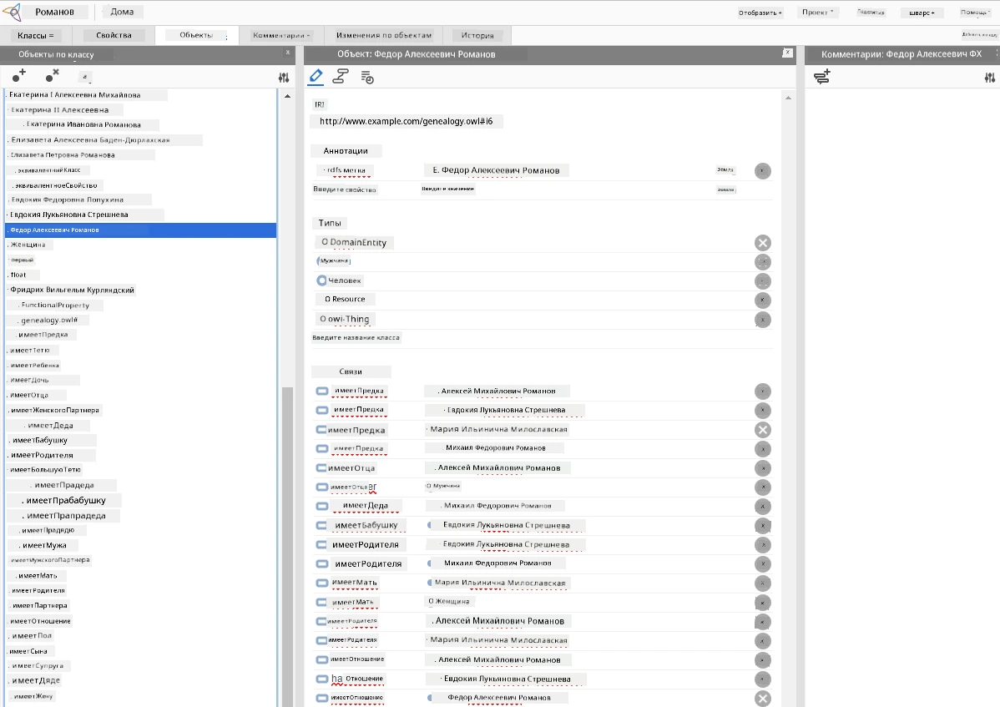

# Представление Знаний и Экспертные Системы



> Набросок от [Tomomi Imura](https://twitter.com/girlie_mac)

Поиск искусственного интеллекта основан на поиске знаний, чтобы понять мир так же, как это делают люди. Но как можно это сделать?

## [Викторина перед лекцией](https://ff-quizzes.netlify.app/en/ai/quiz/3)

В ранние дни ИИ популярным был подход сверху вниз к созданию интеллектуальных систем (обсуждалось в предыдущем уроке). Идея состояла в том, чтобы извлечь знания от людей в некоторую машиночитаемую форму, а затем использовать их для автоматического решения задач. Этот подход основывался на двух больших идеях:

* Представление знаний
* Рассуждение

## Представление знаний

Одним из важных понятий в Символическом ИИ является **знание**. Важно отличать знание от *информации* или *данных*. Например, можно сказать, что книги содержат знания, потому что можно изучать книги и стать экспертом. Однако то, что содержат книги, на самом деле называется *данными*, и, читая книги и интегрируя эти данные в нашу модель мира, мы преобразуем их в знания.

> ✅ **Знание** — это то, что содержится в нашей голове и представляет наше понимание мира. Оно получается в процессе активного **обучения**, которое интегрирует фрагменты информации, получаемой нами, в нашу активную модель мира.

Как правило, мы не даём строгого определения знания, но согласуем его с другими связанными понятиями с помощью [пирамиды DIKW](https://ru.wikipedia.org/wiki/Пирамида_DIKW). Она включает в себя следующие концепции:

* **Данные** — это нечто, представленное в физической среде, например, в виде письменного текста или устных слов. Данные существуют независимо от людей и могут передаваться между ними.
* **Информация** — это то, как мы интерпретируем данные в своей голове. Например, когда мы слышим слово *компьютер*, у нас есть некоторое представление о том, что это такое.
* **Знание** — это информация, интегрированная в нашу модель мира. Например, когда мы узнаём, что такое компьютер, у нас появляются идеи о том, как он работает, сколько стоит и для чего используется. Эта сеть взаимосвязанных концепций формирует наше знание.
* **Мудрость** — это ещё один уровень нашего понимания мира, который представляет *метазнание*, например, представление о том, как и когда знания должны использоваться.



*Изображение [из Википедии](https://commons.wikimedia.org/w/index.php?curid=37705247), автор Longlivetheux - собственная работа, лицензия CC BY-SA 4.0*

Таким образом, задача **представления знаний** состоит в том, чтобы найти эффективный способ представления знаний внутри компьютера в виде данных, чтобы они могли использоваться автоматически. Это можно рассматривать как спектр:



> Изображение от [Dmitry Soshnikov](http://soshnikov.com)

* Слева находятся очень простые типы представления знаний, которые могут быть эффективно использованы компьютерами. Самый простой — алгоритмический, когда знание представлено компьютерной программой. Однако это не самый лучший способ представления знаний, так как он не гибок. Знания в нашей голове часто неалгоритмичны.
* Справа — представления, такие как естественный текст. Это самый мощный способ, но он не может быть использован для автоматического рассуждения.

> ✅ Подумайте минуту, как вы представляете знания в своей голове и как преобразуете их в заметки. Есть ли какой-то формат, который помогает вам лучше запоминать?

## Классификация методов представления знаний в компьютерах

Мы можем классифицировать различные методы компьютерного представления знаний следующим образом:

* **Сетевые представления** основаны на том, что у нас в голове есть сеть взаимосвязанных понятий. Мы можем попытаться воспроизвести такие же сети в виде графа в компьютере — так называемую **семантическую сеть**.

1. **Тройки "Объект-Атрибут-Значение"** или **пары атрибут-значение**. Поскольку граф в компьютере может быть представлен списком узлов и рёбер, семантическую сеть можно представить списком троек, содержащих объекты, атрибуты и значения. Например, можно построить такие тройки о языках программирования:

Объект | Атрибут | Значение
-------|---------|---------
Python | является | необъявленным языком
Python | создан | Гвидо ван Россумом
Python | синтаксис блоков | отступы
Необъявленный язык | не имеет | определений типов

> ✅ Подумайте, как тройки можно использовать для представления других типов знаний.

2. **Иерархические представления** подчёркивают, что мы часто создаём иерархии объектов в голове. Например, мы знаем, что канарейка — это птица, а у всех птиц есть крылья. Мы также представляем, какого цвета обычно канарейка и какова их скорость полёта.

   - **Представление в виде фреймов** основано на том, что каждый объект или класс объектов представлен как **фрейм** с **слотами**. Слоты имеют возможные значения по умолчанию, ограничения или хранимые процедуры, которые можно вызвать для получения значения слота. Все фреймы формируют иерархию, похожую на иерархию объектов в объектно-ориентированных языках программирования.
   - **Сценарии** — особый вид фреймов, которые представляют сложные ситуации, разворачивающиеся во времени.

**Python**

Слот | Значение | Значение по умолчанию | Интервал |
-----|----------|-----------------------|----------|
Имя | Python | | |
Является | необъявленным языком | | |
Регистронезависимость переменных | | CamelCase | |
Длина программы | | | 5-5000 строк |
Синтаксис блоков | отступы | | |

3. **Процедурные представления** основаны на представлении знаний в виде списка действий, которые могут быть выполнены при наступлении определённого условия.
   - Правила продукций — это выражения типа "если-то", которые позволяют делать выводы. Например, у врача может быть правило: **ЕСЛИ** у пациента высокая температура **ИЛИ** высокий уровень С-реактивного белка в анализе крови, **ТО** у него воспаление. При появлении одного из условий можно сделать вывод о воспалении и использовать его в дальнейших рассуждениях.
   - Алгоритмы можно рассматривать как другой вид процедурного представления, хотя их почти никогда не используют напрямую в системах на основе знаний.

4. **Логика** изначально была предложена Аристотелем как способ представления универсальных человеческих знаний.
   - Предикатная логика как математическая теория слишком объёмна для вычисления, поэтому обычно используется её подмножество, например, роговые предложения, применяемые в Prolog.
   - Описательная логика — это семейство логических систем, используемых для представления и рассуждения о иерархиях объектов и распределённых представлениях знаний, таких как *семантическая паутина*.

## Экспертные системы

Одним из ранних успехов символического ИИ стали так называемые **экспертные системы** — компьютерные системы, предназначенные для работы в качестве эксперта в ограниченной предметной области. Они базировались на **базе знаний**, извлечённой от одного или нескольких человеческих экспертов, и содержали **выводящую машину**, выполняющую логическое рассуждение на её основе.

 | 
---------------------------------------------|------------------------------------------------
Упрощённая структура человеческой нервной системы | Архитектура системы на основе знаний

Экспертные системы строятся по образцу системы рассуждения человека, которая содержит **кратковременную память** и **долговременную память**. Аналогично, в системах на основе знаний различают следующие компоненты:

* **Память задачи**: содержит знания о текущей решаемой задаче, например, температуру или давление пациента, наличие у него воспаления и т. д. Эти знания называются **статическими**, так как содержат снимок того, что мы сейчас знаем о задаче — так называемое *состояние задачи*.
* **База знаний**: представляет долгосрочные знания о предметной области. Извлекается вручную у экспертов и не меняется во время консультаций. Поскольку она позволяет переходить от одного состояния задачи к другому, называют также **динамическими знаниями**.
* **Выводящая машина**: управляет всем процессом поиска в пространстве состояний задачи, задаёт вопросы пользователю при необходимости. Также отвечает за поиск правил, применимых в каждом состоянии.

В качестве примера рассмотрим следующую экспертную систему определения животного по его физическим характеристикам:



> Изображение от [Dmitry Soshnikov](http://soshnikov.com)

Эта диаграмма называется **AND-OR деревом**, и представляет собой графическое изображение набора правил продукций. Рисование дерева полезно на начальном этапе извлечения знаний от эксперта. Для представления знаний внутри компьютера удобнее использовать правила:

```
IF the animal eats meat
OR (animal has sharp teeth
    AND animal has claws
    AND animal has forward-looking eyes
) 
THEN the animal is a carnivore
```

Вы можете заметить, что каждое условие слева от правила и действие по сути являются тройками "объект-атрибут-значение" (OAV). **Рабочая память** содержит набор OAV-троек, соответствующих решаемой в данный момент задаче. **Машина правил** ищет правила, для которых условие удовлетворено, и применяет их, добавляя новую тройку в рабочую память.

> ✅ Нарисуйте собственное AND-OR дерево на любую вам интересующую тему!

### Прямой и обратный вывод

Процесс, описанный выше, называется **прямым выводом**. Он начинается с некоторых исходных данных о задаче, содержащихся в рабочей памяти, и затем выполняет следующий цикл рассуждений:

1. Если целевой атрибут присутствует в рабочей памяти — остановиться и выдать результат.
2. Найти все правила, условие которых удовлетворено в данный момент — получить **множество конфликтных правил**.
3. Выполнить **разрешение конфликта** — выбрать одно правило для применения на этом шаге. Существуют разные стратегии разрешения конфликтов:
   - Выбрать первое применимое правило из базы знаний
   - Выбрать случайное правило
   - Выбрать *более специфическое* правило, то есть правило, у которого условие (слева) удовлетворяет наибольшему числу критериев.
4. Применить выбранное правило и добавить новый фрагмент знаний в состояние задачи.
5. Повторять с шага 1.

Однако в некоторых случаях нам может потребоваться начать с пустых знаний о проблеме и задавать вопросы, которые помогут прийти к заключению. Например, при медицинской диагностике обычно не проводят все анализы заранее, а проводят их по мере необходимости.

Этот процесс моделируется с помощью **обратного вывода**. Он управляется **целью** — значением атрибута, которое мы хотим найти:

1. Выбрать все правила, которые могут дать значение цели (т. е. с нужным значением в "правой части" — RHS) — получить множество конфликтных правил.
1. Если таких правил нет или есть правило, которое требует запроса значения у пользователя — запросить значение, иначе:
1. Применить стратегию разрешения конфликта для выбора одного правила, которое будет использовано как *гипотеза* — мы постараемся её доказать.
1. Рекурсивно повторить процесс для всех атрибутов в левой части правила, пытаясь доказать их как цели.
1. Если в любой момент процесс завершится неудачей — использовать другое правило на шаге 3.

> ✅ В каких ситуациях более уместен прямой вывод? А в каких — обратный?

### Реализация экспертных систем

Экспертные системы можно реализовать с помощью разных инструментов:

* Программирование их напрямую на каком-либо высокоуровневом языке. Это не лучшая идея, так как главное преимущество системы на основе знаний — разделение знаний и механизма вывода, и эксперт по предметной области потенциально может писать правила без понимания деталей процесса вывода.
* Использование **экспертных оболочек** — систем, специально созданных для наполнения знаниями с помощью языка представления знаний.

## ✍️ Упражнение: Определение животного

Посмотрите [Animals.ipynb](https://github.com/microsoft/AI-For-Beginners/blob/main/lessons/2-Symbolic/Animals.ipynb) для примера реализации экспертной системы с прямым и обратным выводом.

> **Примечание**: этот пример достаточно простой и даёт лишь общее представление о том, как выглядит экспертная система. Когда вы начнёте создавать такую систему, вы заметите *интеллектуальное* поведение лишь при достижении определённого количества правил, примерно от 200 и выше. В какой-то момент правила становятся слишком сложными, чтобы удерживать их все в голове, и возникает вопрос, почему система принимает те или иные решения. Однако важным свойством систем на основе знаний является то, что вы всегда можете *объяснить* точно, как было принято любое решение.

## Онтологии и Семантическая паутина

В конце XX века появилась инициатива использовать представление знаний для аннотации интернет-ресурсов, чтобы можно было находить ресурсы, соответствующие очень специфическим запросам. Это движение получило название **Семантическая паутина** и основывалось на нескольких концепциях:

- Специальном представлении знаний, основанном на **[описательных логиках](https://en.wikipedia.org/wiki/Description_logic)** (DL). Оно похоже на фреймовое представление, так как строит иерархию объектов с их свойствами, но имеет формальную логическую семантику и вывод. Существует целое семейство описательных логик, балансирующих между выразительностью и алгоритмической сложностью вывода.
- Распределённом представлении знаний, при котором все концепты имеют глобальный URI-идентификатор, что позволяет создавать иерархии знаний, охватывающие интернет.
- Семейство XML-основанных языков для описания знаний: RDF (Resource Description Framework), RDFS (RDF Schema), OWL (Ontology Web Language).

Основное понятие в Семантической паутине — это концепция **Онтологии**. Она означает явное определение области предмета с использованием некоторого формального представления знаний. Самая простая онтология может быть просто иерархией объектов в области предмета, но более сложные онтологии будут включать правила, которые могут использоваться для логического вывода.

В семантической паутине все представления основаны на триплетах. Каждый объект и каждое отношение уникально идентифицируются URI. Например, если мы хотим зафиксировать факт, что этот курс по ИИ был разработан Дмитрием Сошниковым 1 января 2022 года — вот какие триплеты мы можем использовать:



```
http://github.com/microsoft/ai-for-beginners http://www.example.com/terms/creation-date “Jan 1, 2022”
http://github.com/microsoft/ai-for-beginners http://purl.org/dc/elements/1.1/creator http://soshnikov.com
```

> ✅ Здесь `http://www.example.com/terms/creation-date` и `http://purl.org/dc/elements/1.1/creator` — это хорошо известные и универсально принятые URI для выражения понятий *создатель* и *дата создания*.

В более сложном случае, если мы хотим определить список создателей, мы можем использовать некоторые структуры данных, определённые в RDF.



> Диаграммы выше — Дмитрий Сошников (http://soshnikov.com)

Развитие Семантической паутины в некоторой степени замедлилось из-за успехов поисковых систем и технологий обработки естественного языка, которые позволяют извлекать структурированные данные из текста. Однако в некоторых областях всё ещё прилагаются значительные усилия для поддержки онтологий и баз знаний. Несколько проектов, заслуживающих внимания:

* [WikiData](https://wikidata.org/) — это коллекция машинно-читаемых баз знаний, связанных с Википедией. Большая часть данных собирается из *инфо-боксов* Википедии, фрагментов структурированного контента на страницах Википедии. Можно [запрашивать](https://query.wikidata.org/) wikidata с помощью SPARQL, специального языка запросов для Семантической паутины. Вот пример запроса, который показывает самые популярные цвета глаз среди людей:

```sparql
#defaultView:BubbleChart
SELECT ?eyeColorLabel (COUNT(?human) AS ?count)
WHERE
{
  ?human wdt:P31 wd:Q5.       # human instance-of homo sapiens
  ?human wdt:P1340 ?eyeColor. # human eye-color ?eyeColor
  SERVICE wikibase:label { bd:serviceParam wikibase:language "en". }
}
GROUP BY ?eyeColorLabel
```

* [DBpedia](https://www.dbpedia.org/) — ещё одна инициатива, подобная WikiData.

> ✅ Если вы хотите поэкспериментировать с созданием собственных онтологий или открыть существующие, существует отличный визуальный редактор онтологий под названием [Protégé](https://protege.stanford.edu/). Скачайте его или используйте онлайн.



*Web-редактор Protégé открыт с онтологией семьи Романовых. Скриншот Дмитрия Сошникова*

## ✍️ Упражнение: Онтология семьи

См. [FamilyOntology.ipynb](https://github.com/Ezana135/AI-For-Beginners/blob/main/lessons/2-Symbolic/FamilyOntology.ipynb) для примера использования техник Семантической паутины для рассуждений о семейных отношениях. Мы возьмем генеалогическое древо, представленное в распространённом формате GEDCOM, и онтологию семейных отношений, чтобы построить граф всех семейных связей для заданного набора лиц.

## Microsoft Concept Graph

В большинстве случаев онтологии тщательно создаются вручную. Однако возможно также **выделять** онтологии из неструктурированных данных, например, из текстов на естественном языке.

Одна из таких попыток была сделана исследователями Microsoft, и это привело к созданию [Microsoft Concept Graph](https://blogs.microsoft.com/ai/microsoft-researchers-release-graph-that-helps-machines-conceptualize/?WT.mc_id=academic-77998-cacaste).

Это большая коллекция сущностей, сгруппированных с помощью отношения наследования `is-a`. Это позволяет отвечать на вопросы вроде «Что такое Microsoft?» — ответом будет что-то вроде «компания с вероятностью 0.87 и бренд с вероятностью 0.75».

Граф доступен либо через REST API, либо в виде большого загружаемого текстового файла, в котором перечислены пары сущностей.

## ✍️ Упражнение: Граф концепций

Попробуйте блокнот [MSConceptGraph.ipynb](https://github.com/microsoft/AI-For-Beginners/blob/main/lessons/2-Symbolic/MSConceptGraph.ipynb), чтобы увидеть, как можно использовать Microsoft Concept Graph для группировки новостных статей по нескольким категориям.

## Заключение

Сегодня искусственный интеллект часто рассматривается как синоним *машинного обучения* или *нейронных сетей*. Однако человек также обладает явным рассуждением, и это то, что пока не обрабатывается нейронными сетями. В реальных проектах явное рассуждение всё ещё используется для выполнения задач, требующих объяснений или возможности управляемого изменения поведения системы.

## 🚀 Задание

В блокноте онтологии семьи, связанном с этим уроком, есть возможность поэкспериментировать с другими семейными отношениями. Попробуйте обнаружить новые связи между людьми в генеалогическом дереве.

## [Викторина после лекции](https://ff-quizzes.netlify.app/en/ai/quiz/4)

## Обзор и самостоятельное изучение

Поищите информацию в интернете о сферах, в которых люди пытались количественно описать и кодифицировать знания. Ознакомьтесь с таксономией Блума и вернитесь к истории, чтобы узнать, как люди пытались понять свой мир. Изучите работу Линнея по созданию таксономии организмов, а также обратите внимание на способ, которым Дмитрий Менделеев создал способ описания и группировки химических элементов. Какие ещё интересные примеры вы можете найти?

**Задание**: [Создать онтологию](assignment.md)

---

<!-- CO-OP TRANSLATOR DISCLAIMER START -->
**Отказ от ответственности**:  
Данный документ был переведен с использованием автоматического сервиса перевода [Co-op Translator](https://github.com/Azure/co-op-translator). Несмотря на наши усилия обеспечить точность, имейте в виду, что автоматический перевод может содержать ошибки или неточности. Оригинальный документ на исходном языке следует считать авторитетным источником. Для критически важной информации рекомендуется прибегать к профессиональному переводу человеком. Мы не несем ответственности за любые недоразумения или неправильные толкования, возникающие при использовании данного перевода.
<!-- CO-OP TRANSLATOR DISCLAIMER END -->