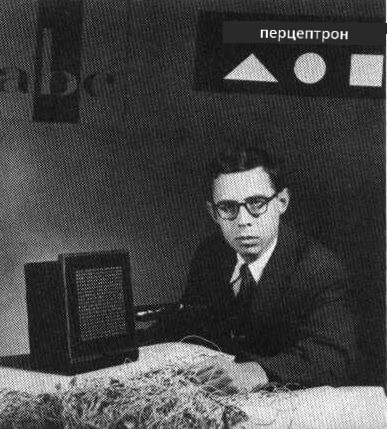

# Введение в нейронные сети: Перцептрон

## [Тест перед лекцией](https://ff-quizzes.netlify.app/en/ai/quiz/5)

Одной из первых попыток создать что-то похожее на современную нейронную сеть была работа Фрэнка Розенблатта из Корнельской аэрокосмической лаборатории в 1957 году. Это была аппаратная реализация под названием "Mark-1", предназначенная для распознавания простых геометрических фигур, таких как треугольники, квадраты и круги.

|      |      |
|--------------|-----------|
| | |

> Изображения [с Википедии](https://en.wikipedia.org/wiki/Perceptron)

Входное изображение представлялось массивом из 20x20 фотоячеек, так что нейронная сеть имела 400 входов и один бинарный выход. Простая сеть содержала один нейрон, также называемый **блоком логики порога**. Веса нейронной сети работали как потенциометры, которые требовали ручной настройки в процессе обучения.

> ✅ Потенциометр — это устройство, позволяющее пользователю регулировать сопротивление в цепи.

> В то время газета The New York Times писала о перцептроне: *эмбрион электронного компьютера, который [ВМС] ожидают, сможет ходить, говорить, видеть, писать, воспроизводить себя и осознавать свое существование.*

## Модель перцептрона

Предположим, у нас есть N признаков в модели, тогда входной вектор будет иметь размер N. Перцептрон — это модель **бинарной классификации**, то есть он может различать два класса входных данных. Мы будем считать, что для каждого входного вектора x выход нашего перцептрона будет либо +1, либо -1, в зависимости от класса. Выход вычисляется по формуле:

y(x) = f(w<sup>T</sup>x)

где f — это ступенчатая функция активации.

<!-- img src="http://www.sciweavers.org/tex2img.php?eq=f%28x%29%20%3D%20%5Cbegin%7Bcases%7D%0A%20%20%20%20%20%20%20%20%20%2B1%20%26%20x%20%5Cgeq%200%20%5C%5C%0A%20%20%20%20%20%20%20%20%20-1%20%26%20x%20%3C%200%0A%20%20%20%20%20%20%20%5Cend%7Bcases%7D%20%5C%5C%0A&bc=White&fc=Black&im=jpg&fs=12&ff=arev&edit=0" align="center" border="0" alt="f(x) = \begin{cases} +1 & x \geq 0 \\ -1 & x < 0 \end{cases} \\" width="154" height="50" / -->


## Обучение перцептрона

Чтобы обучить перцептрон, нам нужно найти вектор весов w, который классифицирует большинство значений правильно, то есть приводит к минимальной **ошибке**. Эта ошибка E определяется **критерием перцептрона** следующим образом:

E(w) = -&sum;w<sup>T</sup>x<sub>i</sub>t<sub>i</sub>

где:

* сумма берется по тем точкам обучающих данных i, которые приводят к неправильной классификации,
* x<sub>i</sub> — входные данные, а t<sub>i</sub> — это либо -1, либо +1 для отрицательных и положительных примеров соответственно.

Этот критерий рассматривается как функция весов w, и его нужно минимизировать. Часто используется метод **градиентного спуска**, при котором мы начинаем с начальных весов w<sup>(0)</sup>, а затем на каждом шаге обновляем веса по формуле:

w<sup>(t+1)</sup> = w<sup>(t)</sup> - &eta;&nabla;E(w)

Здесь &eta; — это так называемая **скорость обучения**, а &nabla;E(w) обозначает **градиент** E. После вычисления градиента мы получаем:

w<sup>(t+1)</sup> = w<sup>(t)</sup> + &sum;&eta;x<sub>i</sub>t<sub>i</sub>

Алгоритм на Python выглядит следующим образом:

```python
def train(positive_examples, negative_examples, num_iterations = 100, eta = 1):

    weights = [0,0,0] # Initialize weights (almost randomly :)
        
    for i in range(num_iterations):
        pos = random.choice(positive_examples)
        neg = random.choice(negative_examples)

        z = np.dot(pos, weights) # compute perceptron output
        if z < 0: # positive example classified as negative
            weights = weights + eta*weights.shape

        z  = np.dot(neg, weights)
        if z >= 0: # negative example classified as positive
            weights = weights - eta*weights.shape

    return weights
```

## Заключение

В этом уроке вы узнали о перцептроне, который является моделью бинарной классификации, и о том, как его обучать, используя вектор весов.

## 🚀 Задание

Если вы хотите попробовать создать свой собственный перцептрон, попробуйте [эту лабораторную работу на Microsoft Learn](https://docs.microsoft.com/en-us/azure/machine-learning/component-reference/two-class-averaged-perceptron?WT.mc_id=academic-77998-cacaste), которая использует [Azure ML designer](https://docs.microsoft.com/en-us/azure/machine-learning/concept-designer?WT.mc_id=academic-77998-cacaste).

## [Тест после лекции](https://ff-quizzes.netlify.app/en/ai/quiz/6)

## Обзор и самостоятельное изучение

Чтобы увидеть, как можно использовать перцептрон для решения учебной задачи, а также реальных задач, и продолжить обучение — перейдите в ноутбук [Perceptron](Perceptron.ipynb).

Вот интересная [статья о перцептронах](https://towardsdatascience.com/what-is-a-perceptron-basics-of-neural-networks-c4cfea20c590).

## [Задание](lab/README.md)

В этом уроке мы реализовали перцептрон для задачи бинарной классификации и использовали его для классификации двух рукописных цифр. В этой лабораторной работе вам предлагается решить задачу классификации цифр полностью, то есть определить, какая цифра наиболее вероятно соответствует данному изображению.

* [Инструкции](lab/README.md)
* [Ноутбук](lab/PerceptronMultiClass.ipynb)

---

