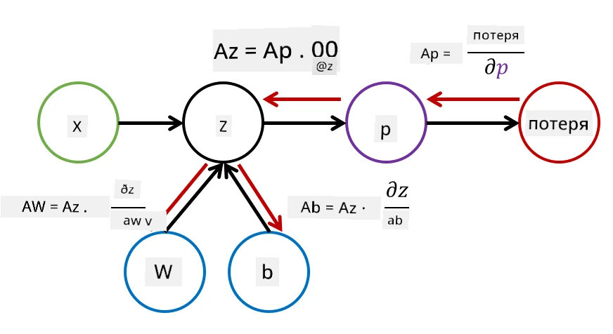

# Введение в нейронные сети. Многослойный перцептрон

В предыдущем разделе вы познакомились с самой простой моделью нейронной сети — однослойным перцептроном, который представляет собой линейную модель для двухклассовой классификации.

В этом разделе мы расширим эту модель, чтобы создать более гибкую структуру, которая позволит:

* выполнять **многоклассовую классификацию** в дополнение к двухклассовой,
* решать задачи **регрессии** в дополнение к классификации,
* разделять классы, которые не являются линейно разделимыми.

Мы также разработаем собственный модульный фреймворк на Python, который позволит нам строить различные архитектуры нейронных сетей.

## [Вопросы перед лекцией](https://ff-quizzes.netlify.app/en/ai/quiz/7)

## Формализация задачи машинного обучения

Начнем с формализации задачи машинного обучения. Предположим, у нас есть обучающая выборка **X** с метками **Y**, и нам нужно построить модель *f*, которая будет делать наиболее точные предсказания. Качество предсказаний измеряется с помощью **функции потерь** &lagran;. Часто используются следующие функции потерь:

* Для задачи регрессии, когда нужно предсказать число, можно использовать **абсолютную ошибку** &sum;i|f(x(i))-y(i)| или **квадратичную ошибку** &sum;i(f(x(i))-y(i))2.
* Для классификации используется **0-1 потеря** (которая по сути эквивалентна **точности** модели) или **логистическая потеря**.

Для однослойного перцептрона функция *f* определялась как линейная функция *f(x)=wx+b* (где *w* — это матрица весов, *x* — вектор входных признаков, а *b* — вектор смещений). Для различных архитектур нейронных сетей эта функция может принимать более сложную форму.

> В случае классификации часто желательно получить вероятности соответствующих классов на выходе сети. Чтобы преобразовать произвольные числа в вероятности (например, нормализовать выходные данные), часто используется функция **softmax** &sigma;, и функция *f* становится *f(x)=&sigma;(wx+b)*.

В определении *f* выше, *w* и *b* называются **параметрами** &theta;=⟨*w,b*⟩. Имея набор данных ⟨**X**,**Y**⟩, мы можем вычислить общую ошибку на всем наборе данных как функцию параметров &theta;.

> ✅ **Цель обучения нейронной сети — минимизировать ошибку, изменяя параметры &theta;**

## Оптимизация методом градиентного спуска

Существует известный метод оптимизации функций, называемый **градиентным спуском**. Идея заключается в том, что мы можем вычислить производную (в многомерном случае — **градиент**) функции потерь по параметрам и изменять параметры так, чтобы ошибка уменьшалась. Это можно формализовать следующим образом:

* Инициализировать параметры случайными значениями w(0), b(0).
* Повторять следующие шаги много раз:
    - w(i+1) = w(i)-&eta;&part;&lagran;/&part;w
    - b(i+1) = b(i)-&eta;&part;&lagran;/&part;b

Во время обучения шаги оптимизации предполагается вычислять с учетом всего набора данных (помните, что функция потерь вычисляется как сумма по всем обучающим примерам). Однако на практике мы берем небольшие части набора данных, называемые **минибатчами**, и вычисляем градиенты на основе подмножества данных. Поскольку подмножество выбирается случайно каждый раз, такой метод называется **стохастическим градиентным спуском** (SGD).

## Многослойные перцептроны и обратное распространение ошибки

Однослойная сеть, как мы видели выше, способна классифицировать линейно разделимые классы. Чтобы построить более сложную модель, мы можем объединить несколько слоев сети. Математически это означает, что функция *f* будет иметь более сложную форму и вычисляться в несколько шагов:
* z1=w1x+b1
* z2=w2&alpha;(z1)+b2
* f = &sigma;(z2)

Здесь &alpha; — это **нелинейная функция активации**, &sigma; — функция softmax, а параметры &theta;=<*w1,b1,w2,b2*>.

Алгоритм градиентного спуска остается тем же, но вычисление градиентов становится сложнее. Используя правило дифференцирования сложной функции, мы можем вычислить производные следующим образом:

* &part;&lagran;/&part;w2 = (&part;&lagran;/&part;&sigma;)(&part;&sigma;/&part;z2)(&part;z2/&part;w2)
* &part;&lagran;/&part;w1 = (&part;&lagran;/&part;&sigma;)(&part;&sigma;/&part;z2)(&part;z2/&part;&alpha;)(&part;&alpha;/&part;z1)(&part;z1/&part;w1)

> ✅ Правило дифференцирования сложной функции используется для вычисления производных функции потерь по параметрам.

Обратите внимание, что левая часть всех этих выражений одинакова, и поэтому мы можем эффективно вычислять производные, начиная с функции потерь и двигаясь "назад" по вычислительному графу. Таким образом, метод обучения многослойного перцептрона называется **обратным распространением ошибки** (backpropagation), или просто 'backprop'.

> TODO: ссылка на источник изображения

> ✅ Мы рассмотрим обратное распространение ошибки гораздо подробнее в нашем примере с ноутбуком.

## Заключение

В этом уроке мы создали собственную библиотеку для работы с нейронными сетями и использовали ее для простой задачи классификации в двумерном пространстве.

## 🚀 Задание

В сопровождающем ноутбуке вы реализуете собственный фреймворк для построения и обучения многослойных перцептронов. Вы сможете подробно изучить, как работают современные нейронные сети.

Перейдите к ноутбуку [OwnFramework](OwnFramework.ipynb) и выполните задания.

## [Вопросы после лекции](https://ff-quizzes.netlify.app/en/ai/quiz/8)

## Обзор и самостоятельное изучение

Обратное распространение ошибки — это распространенный алгоритм в области ИИ и машинного обучения, который стоит изучить [подробнее](https://wikipedia.org/wiki/Backpropagation).

## [Задание](lab/README.md)

В этой лабораторной работе вам предстоит использовать фреймворк, который вы создали в этом уроке, для решения задачи классификации рукописных цифр из набора данных MNIST.

* [Инструкции](lab/README.md)
* [Ноутбук](lab/MyFW_MNIST.ipynb)

---

