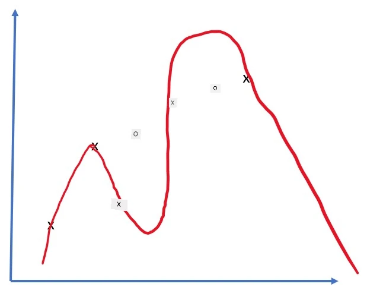
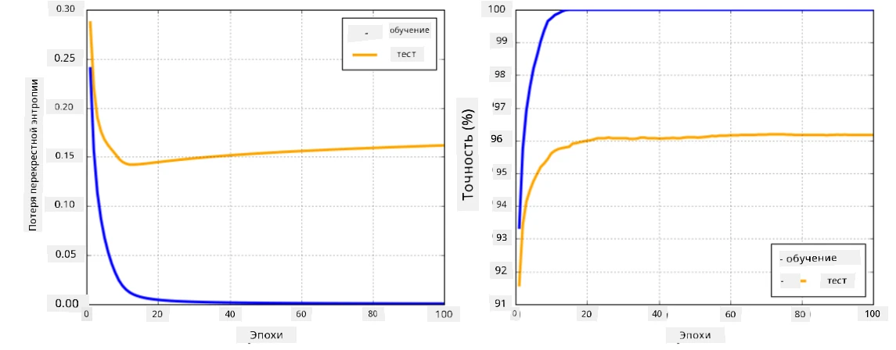

# Фреймворки для нейронных сетей

Как мы уже узнали, для эффективного обучения нейронных сетей необходимо выполнить два действия:

* Работать с тензорами, например, умножать, складывать и вычислять функции, такие как сигмоида или softmax.
* Вычислять градиенты всех выражений, чтобы проводить оптимизацию методом градиентного спуска.

## [Предлекционный тест](https://ff-quizzes.netlify.app/en/ai/quiz/9)

Хотя библиотека `numpy` может выполнять первую задачу, нам нужен механизм для вычисления градиентов. В [нашем фреймворке](../04-OwnFramework/OwnFramework.ipynb), который мы разработали в предыдущем разделе, нам приходилось вручную программировать все производные функции внутри метода `backward`, который выполняет обратное распространение ошибки. Идеально, если фреймворк позволяет вычислять градиенты *любого выражения*, которое мы можем определить.

Еще один важный аспект — возможность выполнять вычисления на GPU или других специализированных вычислительных устройствах, таких как [TPU](https://en.wikipedia.org/wiki/Tensor_Processing_Unit). Обучение глубоких нейронных сетей требует *огромного* количества вычислений, и возможность параллелизовать эти вычисления на GPU крайне важна.

> ✅ Термин "параллелизовать" означает распределение вычислений между несколькими устройствами.

На данный момент два самых популярных фреймворка для нейронных сетей — это [TensorFlow](http://TensorFlow.org) и [PyTorch](https://pytorch.org/). Оба предоставляют низкоуровневый API для работы с тензорами как на CPU, так и на GPU. Помимо низкоуровневого API, также существуют высокоуровневые API, такие как [Keras](https://keras.io/) и [PyTorch Lightning](https://pytorchlightning.ai/) соответственно.

Низкоуровневый API | [TensorFlow](http://TensorFlow.org) | [PyTorch](https://pytorch.org/)
-------------------|-------------------------------------|--------------------------------
Высокоуровневый API| [Keras](https://keras.io/) | [PyTorch Lightning](https://pytorchlightning.ai/)

**Низкоуровневые API** в обоих фреймворках позволяют создавать так называемые **вычислительные графы**. Этот граф определяет, как вычислить выходные данные (обычно функцию потерь) с заданными входными параметрами, и может быть отправлен на выполнение на GPU, если оно доступно. Существуют функции для дифференцирования этого вычислительного графа и вычисления градиентов, которые затем можно использовать для оптимизации параметров модели.

**Высокоуровневые API** рассматривают нейронные сети как **последовательность слоев**, что значительно упрощает создание большинства нейронных сетей. Обучение модели обычно требует подготовки данных и вызова функции `fit`, которая выполняет всю работу.

Высокоуровневый API позволяет быстро создавать типичные нейронные сети, не беспокоясь о множестве деталей. В то же время низкоуровневый API предоставляет гораздо больше контроля над процессом обучения, и поэтому он часто используется в исследованиях, когда вы работаете с новыми архитектурами нейронных сетей.

Также важно понимать, что оба API можно использовать вместе. Например, вы можете разработать собственную архитектуру слоя сети с помощью низкоуровневого API, а затем использовать ее внутри более крупной сети, созданной и обученной с помощью высокоуровневого API. Или вы можете определить сеть с помощью высокоуровневого API как последовательность слоев, а затем использовать собственный низкоуровневый цикл обучения для оптимизации. Оба API используют одни и те же базовые концепции и разработаны для совместной работы.

## Обучение

В этом курсе мы предлагаем большинство материалов как для PyTorch, так и для TensorFlow. Вы можете выбрать предпочитаемый фреймворк и изучать только соответствующие ноутбуки. Если вы не уверены, какой фреймворк выбрать, почитайте обсуждения в интернете на тему **PyTorch vs. TensorFlow**. Также вы можете ознакомиться с обоими фреймворками, чтобы лучше их понять.

Где возможно, мы будем использовать высокоуровневые API для упрощения. Однако мы считаем важным понять, как нейронные сети работают с нуля, поэтому в начале мы начнем с работы с низкоуровневым API и тензорами. Однако, если вы хотите быстро начать и не тратить много времени на изучение этих деталей, вы можете пропустить их и сразу перейти к ноутбукам с высокоуровневым API.

## ✍️ Упражнения: Фреймворки

Продолжите обучение в следующих ноутбуках:

Низкоуровневый API | [TensorFlow+Keras Notebook](IntroKerasTF.ipynb) | [PyTorch](IntroPyTorch.ipynb)
-------------------|-------------------------------------|--------------------------------
Высокоуровневый API| [Keras](IntroKeras.ipynb) | *PyTorch Lightning*

После освоения фреймворков давайте повторим понятие переобучения.

# Переобучение

Переобучение — это чрезвычайно важная концепция в машинном обучении, и очень важно правильно ее понять!

Рассмотрим следующую задачу аппроксимации 5 точек (представленных как `x` на графиках ниже):

 | 
-------------------------|--------------------------
**Линейная модель, 2 параметра** | **Нелинейная модель, 7 параметров**
Ошибка на обучении = 5.3 | Ошибка на обучении = 0
Ошибка на валидации = 5.1 | Ошибка на валидации = 20

* На левом графике мы видим хорошую аппроксимацию прямой линией. Поскольку количество параметров адекватно, модель правильно понимает распределение точек.
* На правом графике модель слишком мощная. Поскольку у нас всего 5 точек, а у модели 7 параметров, она может настроиться так, чтобы проходить через все точки, что делает ошибку на обучении равной 0. Однако это мешает модели понять правильную закономерность в данных, поэтому ошибка на валидации очень высокая.

Очень важно найти правильный баланс между сложностью модели (количеством параметров) и количеством обучающих выборок.

## Почему возникает переобучение

  * Недостаточно обучающих данных
  * Слишком мощная модель
  * Слишком много шума в входных данных

## Как обнаружить переобучение

Как видно из графика выше, переобучение можно обнаружить по очень низкой ошибке на обучении и высокой ошибке на валидации. Обычно во время обучения мы видим, как ошибки на обучении и валидации начинают уменьшаться, а затем в какой-то момент ошибка на валидации может перестать уменьшаться и начать расти. Это будет признаком переобучения и сигналом, что, вероятно, стоит остановить обучение (или хотя бы сохранить текущую версию модели).

## Как предотвратить переобучение

Если вы видите, что происходит переобучение, вы можете сделать следующее:

 * Увеличить объем обучающих данных
 * Уменьшить сложность модели
 * Использовать какую-либо [технику регуляризации](../../4-ComputerVision/08-TransferLearning/TrainingTricks.md), например [Dropout](../../4-ComputerVision/08-TransferLearning/TrainingTricks.md#Dropout), которую мы рассмотрим позже.

## Переобучение и компромисс между смещением и дисперсией

Переобучение — это частный случай более общей проблемы в статистике, называемой [компромисс между смещением и дисперсией](https://en.wikipedia.org/wiki/Bias%E2%80%93variance_tradeoff). Если рассмотреть возможные источники ошибок в нашей модели, можно выделить два типа ошибок:

* **Ошибки смещения** возникают из-за того, что наш алгоритм не может правильно уловить взаимосвязь в обучающих данных. Это может быть связано с тем, что наша модель недостаточно мощная (**недообучение**).
* **Ошибки дисперсии**, которые возникают из-за того, что модель аппроксимирует шум в входных данных вместо значимой взаимосвязи (**переобучение**).

Во время обучения ошибка смещения уменьшается (так как наша модель учится аппроксимировать данные), а ошибка дисперсии увеличивается. Важно остановить обучение — либо вручную (когда мы обнаруживаем переобучение), либо автоматически (введя регуляризацию), чтобы предотвратить переобучение.

## Заключение

В этом уроке вы узнали о различиях между различными API для двух самых популярных фреймворков AI — TensorFlow и PyTorch. Кроме того, вы узнали о очень важной теме — переобучении.

## 🚀 Задание

В сопровождающих ноутбуках вы найдете "задачи" в конце; пройдите через ноутбуки и выполните задачи.

## [Послетекционный тест](https://ff-quizzes.netlify.app/en/ai/quiz/10)

## Обзор и самостоятельное изучение

Изучите следующие темы:

- TensorFlow
- PyTorch
- Переобучение

Задайте себе следующие вопросы:

- В чем разница между TensorFlow и PyTorch?
- В чем разница между переобучением и недообучением?

## [Задание](lab/README.md)

В этой лабораторной работе вам предлагается решить две задачи классификации, используя однослойные и многослойные полностью связанные сети с помощью PyTorch или TensorFlow.

* [Инструкции](lab/README.md)
* [Ноутбук](lab/LabFrameworks.ipynb)

---

