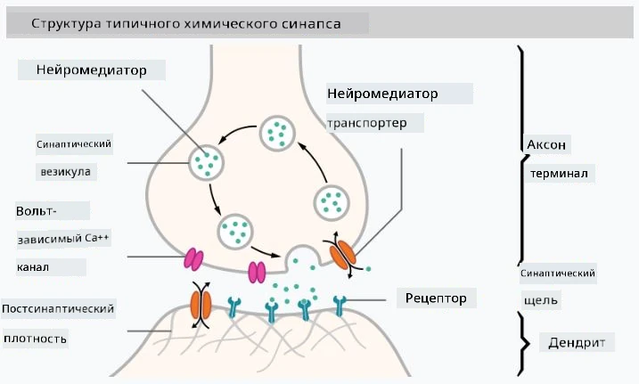

# Введение в нейронные сети

Как мы обсуждали во введении, один из способов достижения интеллекта — это обучение **компьютерной модели** или **искусственного мозга**. С середины XX века исследователи пробовали различные математические модели, и в последние годы этот подход оказался чрезвычайно успешным. Такие математические модели мозга называются **нейронными сетями**.

> Иногда нейронные сети называют *Искусственными нейронными сетями* (Artificial Neural Networks, ANNs), чтобы подчеркнуть, что речь идет о моделях, а не о реальных сетях нейронов.

## Машинное обучение

Нейронные сети являются частью более широкой дисциплины, называемой **Машинным обучением**, цель которого — использовать данные для обучения компьютерных моделей, способных решать задачи. Машинное обучение составляет значительную часть Искусственного интеллекта, однако в данной программе мы не рассматриваем классическое машинное обучение.

> Ознакомьтесь с нашей отдельной программой **[Машинное обучение для начинающих](http://github.com/microsoft/ml-for-beginners)**, чтобы узнать больше о классическом машинном обучении.

В машинном обучении предполагается, что у нас есть некоторый набор данных примеров **X** и соответствующие выходные значения **Y**. Примеры часто представляют собой N-мерные векторы, состоящие из **признаков**, а выходные значения называются **метками**.

Мы рассмотрим две наиболее распространенные задачи машинного обучения:

* **Классификация**, где необходимо классифицировать входной объект на два или более классов.
* **Регрессия**, где необходимо предсказать числовое значение для каждого из входных образцов.

> При представлении входных данных и выходов в виде тензоров входной набор данных представляет собой матрицу размером M&times;N, где M — количество образцов, а N — количество признаков. Выходные метки Y — это вектор размером M.

В данной программе мы будем сосредоточены только на моделях нейронных сетей.

## Модель нейрона

Из биологии мы знаем, что наш мозг состоит из нейронных клеток (нейронов), каждая из которых имеет несколько "входов" (дендритов) и один "выход" (аксон). И дендриты, и аксоны могут проводить электрические сигналы, а соединения между ними — известные как синапсы — могут демонстрировать различные степени проводимости, которые регулируются нейромедиаторами.

 | 
----|----
Реальный нейрон *([Изображение](https://en.wikipedia.org/wiki/Synapse#/media/File:SynapseSchematic_lines.svg) из Википедии)* | Искусственный нейрон *(Изображение автора)*

Таким образом, самая простая математическая модель нейрона содержит несколько входов X1, ..., XN и один выход Y, а также ряд весов W1, ..., WN. Выход вычисляется как:

где f — это некоторая нелинейная **функция активации**.

> Ранние модели нейрона были описаны в классической статье [A logical calculus of the ideas immanent in nervous activity](https://www.cs.cmu.edu/~./epxing/Class/10715/reading/McCulloch.and.Pitts.pdf) Уоррена МакКалока и Уолтера Питтса в 1943 году. Дональд Хебб в своей книге "[The Organization of Behavior: A Neuropsychological Theory](https://books.google.com/books?id=VNetYrB8EBoC)" предложил способ обучения таких сетей.

## В этом разделе

В этом разделе мы изучим:
* [Перцептрон](03-Perceptron/README.md), одну из первых моделей нейронных сетей для классификации на два класса
* [Многослойные сети](04-OwnFramework/README.md) с сопутствующей тетрадью [как создать собственный фреймворк](04-OwnFramework/OwnFramework.ipynb)
* [Фреймворки нейронных сетей](05-Frameworks/README.md), с этими тетрадями: [PyTorch](05-Frameworks/IntroPyTorch.ipynb) и [Keras/Tensorflow](05-Frameworks/IntroKerasTF.ipynb)
* [Переобучение](../../../../lessons/3-NeuralNetworks/05-Frameworks)

---

**Отказ от ответственности**:  
Этот документ был переведен с помощью сервиса автоматического перевода [Co-op Translator](https://github.com/Azure/co-op-translator). Несмотря на наши усилия обеспечить точность, автоматические переводы могут содержать ошибки или неточности. Оригинальный документ на его родном языке следует считать авторитетным источником. Для получения критически важной информации рекомендуется профессиональный перевод человеком. Мы не несем ответственности за любые недоразумения или неправильные интерпретации, возникшие в результате использования данного перевода.