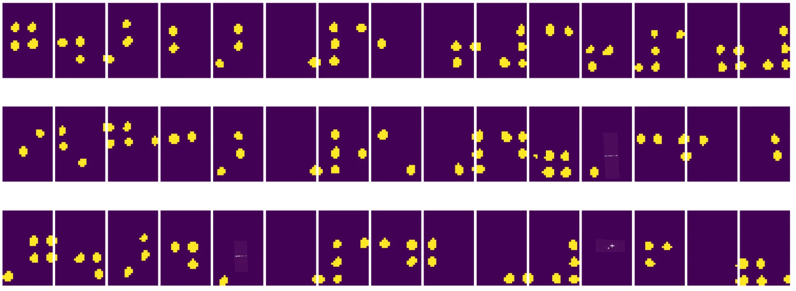
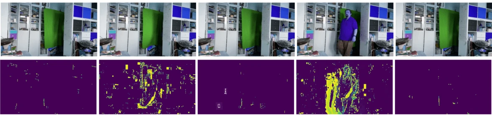

# Введение в компьютерное зрение

[Компьютерное зрение](https://wikipedia.org/wiki/Computer_vision) — это область, цель которой заключается в том, чтобы научить компьютеры понимать цифровые изображения на высоком уровне. Это довольно широкое определение, так как *понимание* может означать множество разных вещей, включая нахождение объекта на изображении (**обнаружение объектов**), понимание происходящего (**обнаружение событий**), описание изображения текстом или реконструкцию сцены в 3D. Существуют также специальные задачи, связанные с изображениями людей: определение возраста и эмоций, обнаружение и идентификация лиц, а также оценка позы в 3D, и это лишь некоторые из них.

## [Тест перед лекцией](https://ff-quizzes.netlify.app/en/ai/quiz/11)

Одна из самых простых задач компьютерного зрения — это **классификация изображений**.

Компьютерное зрение часто рассматривается как часть искусственного интеллекта. Сегодня большинство задач компьютерного зрения решаются с использованием нейронных сетей. Мы подробнее изучим специальный тип нейронных сетей, используемых в компьютерном зрении, [сверточные нейронные сети](../07-ConvNets/README.md), в этом разделе.

Однако, прежде чем передать изображение в нейронную сеть, во многих случаях имеет смысл использовать алгоритмические методы для его улучшения.

Существует несколько библиотек Python для обработки изображений:

* **[imageio](https://imageio.readthedocs.io/en/stable/)** используется для чтения/записи различных форматов изображений. Она также поддерживает ffmpeg — полезный инструмент для преобразования видеокадров в изображения.
* **[Pillow](https://pillow.readthedocs.io/en/stable/index.html)** (также известная как PIL) обладает большими возможностями и поддерживает такие манипуляции с изображениями, как морфинг, настройка палитры и многое другое.
* **[OpenCV](https://opencv.org/)** — мощная библиотека обработки изображений, написанная на C++, которая стала *де-факто* стандартом в этой области. Она имеет удобный интерфейс для Python.
* **[dlib](http://dlib.net/)** — библиотека на C++, реализующая множество алгоритмов машинного обучения, включая некоторые алгоритмы компьютерного зрения. Она также имеет интерфейс для Python и может использоваться для сложных задач, таких как обнаружение лиц и ключевых точек лица.

## OpenCV

[OpenCV](https://opencv.org/) считается *де-факто* стандартом для обработки изображений. Она содержит множество полезных алгоритмов, реализованных на C++. OpenCV можно вызывать и из Python.

Хорошее место для изучения OpenCV — это [курс Learn OpenCV](https://learnopencv.com/getting-started-with-opencv/). В рамках нашей программы мы не ставим цель изучить OpenCV, но покажем несколько примеров, где и как она может быть использована.

### Загрузка изображений

Изображения в Python удобно представлять в виде массивов NumPy. Например, черно-белое изображение размером 320x200 пикселей будет храниться в массиве размером 200x320, а цветное изображение тех же размеров будет иметь форму 200x320x3 (для 3 цветовых каналов). Чтобы загрузить изображение, можно использовать следующий код:

```python
import cv2
import matplotlib.pyplot as plt

im = cv2.imread('image.jpeg')
plt.imshow(im)
```

Традиционно OpenCV использует кодировку BGR (синий-зеленый-красный) для цветных изображений, в то время как остальные инструменты Python используют более привычный RGB (красный-зеленый-синий). Чтобы изображение отображалось правильно, его нужно преобразовать в цветовое пространство RGB, либо поменяв местами измерения в массиве NumPy, либо вызвав функцию OpenCV:

```python
im = cv2.cvtColor(im,cv2.COLOR_BGR2RGB)
```

Та же функция `cvtColor` может использоваться для выполнения других преобразований цветового пространства, таких как преобразование изображения в черно-белое или в HSV (оттенок-насыщенность-яркость).

С помощью OpenCV можно также загружать видео покадрово — пример приведен в упражнении [OpenCV Notebook](OpenCV.ipynb).

### Обработка изображений

Перед передачей изображения в нейронную сеть может быть полезно выполнить несколько шагов предварительной обработки. OpenCV позволяет делать множество вещей, включая:

* **Изменение размера** изображения с помощью `im = cv2.resize(im, (320,200),interpolation=cv2.INTER_LANCZOS)`
* **Размытие** изображения с помощью `im = cv2.medianBlur(im,3)` или `im = cv2.GaussianBlur(im, (3,3), 0)`
* Изменение **яркости и контрастности** изображения можно выполнить с помощью манипуляций с массивами NumPy, как описано [в этой заметке на Stackoverflow](https://stackoverflow.com/questions/39308030/how-do-i-increase-the-contrast-of-an-image-in-python-opencv).
* Использование [пороговой обработки](https://docs.opencv.org/4.x/d7/d4d/tutorial_py_thresholding.html) с помощью функций `cv2.threshold`/`cv2.adaptiveThreshold`, что часто предпочтительнее, чем настройка яркости или контрастности.
* Применение различных [преобразований](https://docs.opencv.org/4.5.5/da/d6e/tutorial_py_geometric_transformations.html) к изображению:
    - **[Афинные преобразования](https://docs.opencv.org/4.5.5/d4/d61/tutorial_warp_affine.html)** полезны, если нужно объединить вращение, изменение размера и наклон изображения, зная исходное и конечное положение трех точек. Афинные преобразования сохраняют параллельность линий.
    - **[Перспективные преобразования](https://medium.com/analytics-vidhya/opencv-perspective-transformation-9edffefb2143)** полезны, если известны исходные и конечные позиции четырех точек на изображении. Например, если вы фотографируете прямоугольный документ с угла, а затем хотите получить прямоугольное изображение самого документа.
* Понимание движения на изображении с помощью **[оптического потока](https://docs.opencv.org/4.5.5/d4/dee/tutorial_optical_flow.html)**.

## Примеры использования компьютерного зрения

В нашем [OpenCV Notebook](OpenCV.ipynb) мы приводим примеры, где компьютерное зрение может быть использовано для выполнения конкретных задач:

* **Предварительная обработка фотографии книги на шрифте Брайля**. Мы показываем, как можно использовать пороговую обработку, обнаружение признаков, перспективное преобразование и манипуляции с NumPy для разделения отдельных символов шрифта Брайля для дальнейшей классификации нейронной сетью.

 |  | 
----|-----|-----

> Изображение из [OpenCV.ipynb](OpenCV.ipynb)

* **Обнаружение движения на видео с помощью разницы кадров**. Если камера фиксирована, то кадры из видеопотока должны быть довольно похожи друг на друга. Так как кадры представлены в виде массивов, просто вычитая массивы двух последовательных кадров, мы получим разницу пикселей, которая будет небольшой для статичных кадров и увеличиваться при значительном движении на изображении.



> Изображение из [OpenCV.ipynb](OpenCV.ipynb)

* **Обнаружение движения с использованием оптического потока**. [Оптический поток](https://docs.opencv.org/3.4/d4/dee/tutorial_optical_flow.html) позволяет понять, как отдельные пиксели на видеокадрах перемещаются. Существует два типа оптического потока:

   - **Плотный оптический поток** вычисляет векторное поле, показывающее, куда перемещается каждый пиксель.
   - **Разреженный оптический поток** основывается на выделении характерных признаков изображения (например, краев) и построении их траектории от кадра к кадру.


> Изображение из [OpenCV.ipynb](OpenCV.ipynb)

## ✍️ Примерные ноутбуки: OpenCV [попробуйте OpenCV в действии](OpenCV.ipynb)

Давайте проведем эксперименты с OpenCV, изучив [OpenCV Notebook](OpenCV.ipynb).

## Заключение

Иногда относительно сложные задачи, такие как обнаружение движения или определение кончиков пальцев, можно решить исключительно с помощью компьютерного зрения. Поэтому очень полезно знать основные техники компьютерного зрения и возможности таких библиотек, как OpenCV.

## 🚀 Задание

Посмотрите [это видео](https://docs.microsoft.com/shows/ai-show/ai-show--2021-opencv-ai-competition--grand-prize-winners--cortic-tigers--episode-32?WT.mc_id=academic-77998-cacaste) из AI Show, чтобы узнать о проекте Cortic Tigers и о том, как они создали решение на основе блоков для демократизации задач компьютерного зрения с помощью робота. Проведите исследование других подобных проектов, которые помогают новичкам освоить эту область.

## [Тест после лекции](https://ff-quizzes.netlify.app/en/ai/quiz/12)

## Обзор и самостоятельное изучение

Прочитайте больше об оптическом потоке [в этом отличном руководстве](https://learnopencv.com/optical-flow-in-opencv/).

## [Задание](lab/README.md)

В этой лабораторной работе вам нужно будет снять видео с простыми жестами, и ваша цель — извлечь движения вверх/вниз/влево/вправо с использованием оптического потока.


---

