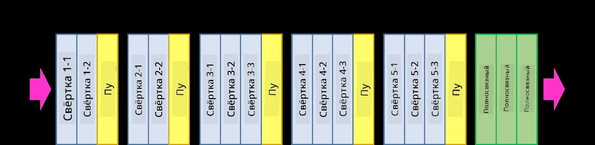
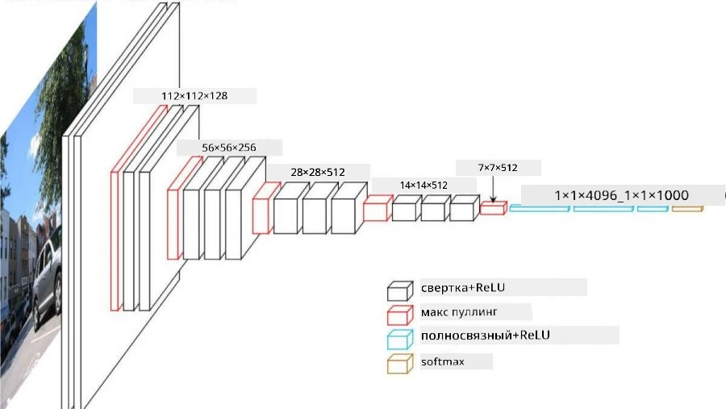
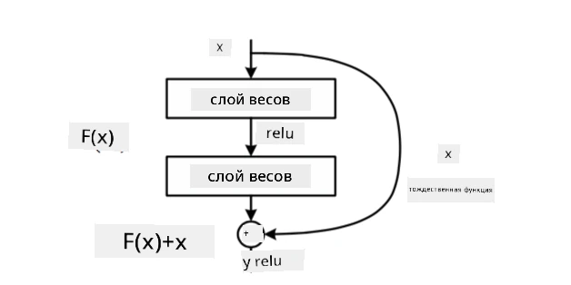
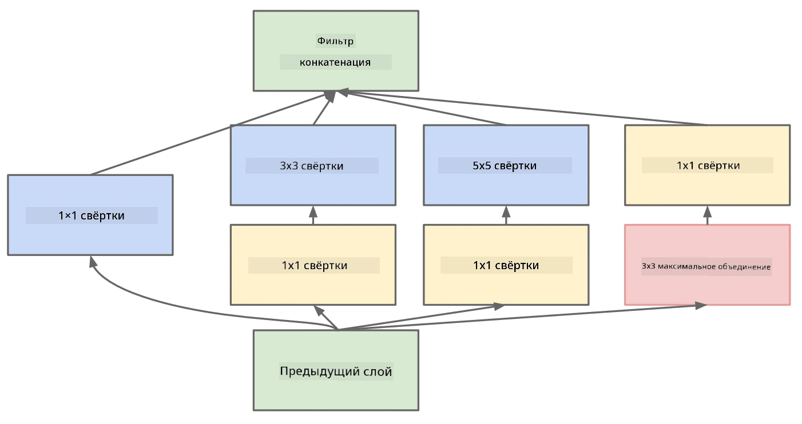

# Известные архитектуры CNN

### VGG-16

VGG-16 — это сеть, которая достигла точности 92.7% в классификации ImageNet (top-5) в 2014 году. Она имеет следующую структуру слоев:

Как видно, VGG следует традиционной пирамидальной архитектуре, представляющей собой последовательность слоев свертки и пуллинга.

> Изображение с [Researchgate](https://www.researchgate.net/figure/Vgg16-model-structure-To-get-the-VGG-NIN-model-we-replace-the-2-nd-4-th-6-th-7-th_fig2_335194493)

### ResNet

ResNet — это семейство моделей, предложенных Microsoft Research в 2015 году. Основная идея ResNet заключается в использовании **остаточных блоков**:

> Изображение из [этой статьи](https://arxiv.org/pdf/1512.03385.pdf)

Причина использования идентичного пропуска заключается в том, чтобы слой предсказывал **разницу** между результатом предыдущего слоя и выходом остаточного блока — отсюда и название *остаточный*. Эти блоки гораздо легче обучать, и можно создавать сети с сотнями таких блоков (наиболее распространенные варианты — ResNet-52, ResNet-101 и ResNet-152).

Эту сеть также можно рассматривать как способ адаптации ее сложности к набору данных. Изначально, когда начинается обучение сети, значения весов малы, и большая часть сигнала проходит через идентичные слои. По мере обучения и увеличения весов значимость параметров сети возрастает, и сеть адаптируется, чтобы обеспечить необходимую выразительность для правильной классификации обучающих изображений.

### Google Inception

Архитектура Google Inception развивает эту идею дальше и строит каждый слой сети как комбинацию нескольких различных путей:

> Изображение с [Researchgate](https://www.researchgate.net/figure/Inception-module-with-dimension-reductions-left-and-schema-for-Inception-ResNet-v1_fig2_355547454)

Здесь важно подчеркнуть роль сверток 1x1, которые на первый взгляд могут показаться бессмысленными. Зачем проходить по изображению с фильтром 1x1? Однако нужно помнить, что фильтры свертки работают с несколькими каналами глубины (изначально — RGB-цвета, в последующих слоях — каналы для различных фильтров), и свертка 1x1 используется для смешивания этих входных каналов с помощью различных обучаемых весов. Это также можно рассматривать как уменьшение размерности (пуллинг) по измерению каналов.

Вот [хороший блог-пост](https://medium.com/analytics-vidhya/talented-mr-1x1-comprehensive-look-at-1x1-convolution-in-deep-learning-f6b355825578) на эту тему и [оригинальная статья](https://arxiv.org/pdf/1312.4400.pdf).

### MobileNet

MobileNet — это семейство моделей с уменьшенным размером, подходящих для мобильных устройств. Используйте их, если у вас ограничены ресурсы и вы готовы пожертвовать небольшой точностью. Основная идея этих моделей — так называемая **глубинно-разделяемая свертка**, которая позволяет представлять фильтры свертки как композицию пространственных сверток и свертки 1x1 по каналам глубины. Это значительно уменьшает количество параметров, делая сеть компактной и более легкой для обучения на меньшем объеме данных.

Вот [хороший блог-пост о MobileNet](https://medium.com/analytics-vidhya/image-classification-with-mobilenet-cc6fbb2cd470).

## Заключение

В этом разделе вы узнали основную концепцию нейронных сетей для компьютерного зрения — сверточные сети. Реальные архитектуры, которые используются для классификации изображений, обнаружения объектов и даже генерации изображений, основаны на CNN, просто с большим количеством слоев и некоторыми дополнительными приемами обучения.

## 🚀 Задание

В сопровождающих ноутбуках есть заметки внизу о том, как добиться большей точности. Проведите эксперименты, чтобы увидеть, сможете ли вы достичь более высокой точности.

## [Тест после лекции](https://ff-quizzes.netlify.app/en/ai/quiz/14)

## Обзор и самостоятельное изучение

Хотя CNN чаще всего используются для задач компьютерного зрения, они в целом хорошо подходят для извлечения фиксированных шаблонов. Например, если мы работаем со звуками, мы также можем использовать CNN для поиска определенных шаблонов в аудиосигнале — в этом случае фильтры будут одномерными (и такая CNN будет называться 1D-CNN). Также иногда используется 3D-CNN для извлечения признаков в многомерном пространстве, например, для анализа событий, происходящих на видео — CNN может захватывать определенные шаблоны изменения признаков во времени. Проведите обзор и самостоятельное изучение других задач, которые можно решать с помощью CNN.

## [Задание](lab/README.md)

В этой лабораторной работе вам предстоит классифицировать различные породы кошек и собак. Эти изображения более сложные, чем набор данных MNIST, имеют более высокие размеры, и классов больше 10.

---

