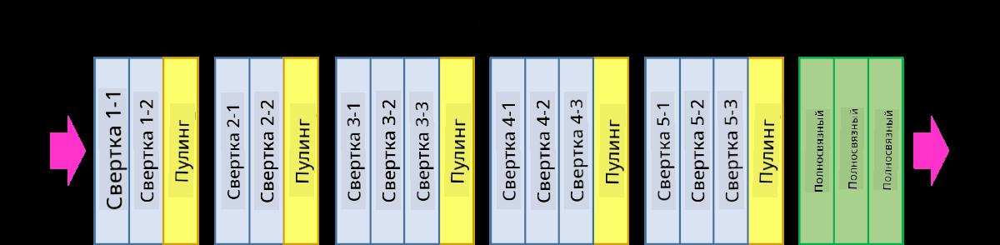

# Сверточные Нейронные Сети

Мы уже видели, что нейронные сети довольно хорошо справляются с обработкой изображений, и даже однослойный перцептрон способен распознавать рукописные цифры из набора данных MNIST с разумной точностью. Однако набор данных MNIST очень специфичен, и все цифры центрированы внутри изображения, что упрощает задачу.

## [Викторина перед лекцией](https://red-field-0a6ddfd03.1.azurestaticapps.net/quiz/107)

В реальной жизни мы хотим уметь распознавать объекты на картинке независимо от их точного местоположения на изображении. Компьютерное зрение отличается от общей классификации, потому что, когда мы пытаемся найти определенный объект на картинке, мы сканируем изображение в поисках каких-то специфических **шаблонов** и их комбинаций. Например, когда мы ищем кошку, сначала мы можем искать горизонтальные линии, которые могут образовывать усы, а затем определенная комбинация усов может сказать нам, что это на самом деле изображение кошки. Относительное положение и наличие определенных шаблонов важны, а не их точное положение на изображении.

Чтобы извлечь шаблоны, мы будем использовать понятие **сверточных фильтров**. Как вы знаете, изображение представлено в виде 2D-матрицы или 3D-тензора с глубиной цвета. Применение фильтра означает, что мы берем относительно маленькую матрицу **ядра фильтра**, и для каждого пикселя в оригинальном изображении мы вычисляем взвешенное среднее с соседними точками. Мы можем рассматривать это как маленькое окно, скользящее по всему изображению и усредняющее все пиксели в соответствии с весами в матрице ядра фильтра.

 | 
----|----

> Изображение Дмитрия Сошникова

Например, если мы применим 3x3 фильтры вертикального и горизонтального краев к цифрам MNIST, мы можем получить акценты (например, высокие значения) там, где находятся вертикальные и горизонтальные края в нашем оригинальном изображении. Таким образом, эти два фильтра могут быть использованы для "поиска" краев. Аналогично, мы можем разработать различные фильтры для поиска других низкоуровневых шаблонов.

> Изображение [Фильтров Люнга-Малика](https://www.robots.ox.ac.uk/~vgg/research/texclass/filters.html)

Тем не менее, хотя мы можем вручную разрабатывать фильтры для извлечения некоторых шаблонов, мы также можем сконструировать сеть таким образом, чтобы она автоматически обучалась находить шаблоны. Это одна из основных идей, лежащих в основе CNN.

## Основные идеи CNN

Работа CNN основана на следующих важных идеях:

* Сверточные фильтры могут извлекать шаблоны
* Мы можем спроектировать сеть таким образом, чтобы фильтры обучались автоматически
* Мы можем использовать тот же подход для поиска шаблонов в высокоуровневых признаках, а не только в оригинальном изображении. Таким образом, извлечение признаков CNN работает на иерархии признаков, начиная с низкоуровневых комбинаций пикселей и заканчивая более высокоуровневыми комбинациями частей изображения.

> Изображение из [статьи Хислопа-Линча](https://www.semanticscholar.org/paper/Computer-vision-based-pedestrian-trajectory-Hislop-Lynch/26e6f74853fc9bbb7487b06dc2cf095d36c9021d), основанной на [их исследовании](https://dl.acm.org/doi/abs/10.1145/1553374.1553453)

## ✍️ Упражнения: Сверточные Нейронные Сети

Давайте продолжим исследовать, как работают сверточные нейронные сети и как мы можем достичь обучаемых фильтров, пройдя соответствующие блокноты:

* [Сверточные Нейронные Сети - PyTorch](../../../../../lessons/4-ComputerVision/07-ConvNets/ConvNetsPyTorch.ipynb)
* [Сверточные Нейронные Сети - TensorFlow](../../../../../lessons/4-ComputerVision/07-ConvNets/ConvNetsTF.ipynb)

## Пирамидальная Архитектура

Большинство CNN, используемых для обработки изображений, следуют так называемой пирамидальной архитектуре. Первый сверточный слой, применяемый к оригинальным изображениям, обычно имеет относительно небольшое количество фильтров (8-16), которые соответствуют различным комбинациям пикселей, таким как горизонтальные/вертикальные линии штрихов. На следующем уровне мы уменьшаем пространственное измерение сети и увеличиваем количество фильтров, что соответствует большему количеству возможных комбинаций простых признаков. С каждым слоем, по мере продвижения к финальному классификатору, пространственные размеры изображения уменьшаются, а количество фильтров увеличивается.

В качестве примера давайте посмотрим на архитектуру VGG-16, сети, которая достигла 92.7% точности в топ-5 классификации ImageNet в 2014 году:

> Изображение из [Researchgate](https://www.researchgate.net/figure/Vgg16-model-structure-To-get-the-VGG-NIN-model-we-replace-the-2-nd-4-th-6-th-7-th_fig2_335194493)

## Наилучшие Известные Архитектуры CNN

[Продолжайте изучение наилучших известных архитектур CNN](CNN_Architectures.md)

**Отказ от ответственности**:  
Этот документ был переведен с использованием услуг машинного перевода на основе ИИ. Хотя мы стремимся к точности, пожалуйста, имейте в виду, что автоматические переводы могут содержать ошибки или неточности. Оригинальный документ на его родном языке следует считать авторитетным источником. Для критически важной информации рекомендуется профессиональный человеческий перевод. Мы не несем ответственности за любые недоразумения или неправильные интерпретации, возникающие в результате использования этого перевода.