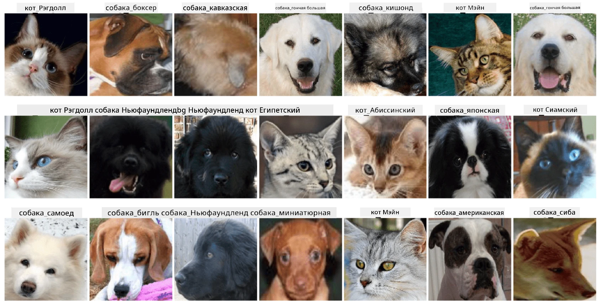

# Классификация лиц домашних животных

Лабораторная работа из [Учебной программы "ИИ для начинающих"](https://github.com/microsoft/ai-for-beginners).

## Задача

Представьте, что вам нужно разработать приложение для питомника, чтобы каталогизировать всех животных. Одной из замечательных функций такого приложения могла бы быть автоматическая идентификация породы по фотографии. Это можно успешно реализовать с помощью нейронных сетей.

Вам нужно обучить сверточную нейронную сеть для классификации различных пород кошек и собак, используя набор данных **Pet Faces**.

## Набор данных

Мы будем использовать [Oxford-IIIT Pet Dataset](https://www.robots.ox.ac.uk/~vgg/data/pets/), который содержит изображения 37 различных пород собак и кошек.



Чтобы скачать набор данных, используйте этот код:

```python
!wget https://thor.robots.ox.ac.uk/~vgg/data/pets/images.tar.gz
!tar xfz images.tar.gz
!rm images.tar.gz
```

**Примечание:** Изображения в наборе данных Oxford-IIIT Pet Dataset организованы по имени файла (например, `Abyssinian_1.jpg`, `Bengal_2.jpg`). В ноутбуке есть код, который организует эти изображения в подкаталоги, соответствующие породам, для упрощения классификации.

## Начало работы с ноутбуком

Начните лабораторную работу, открыв [PetFaces.ipynb](PetFaces.ipynb)

## Итог

Вы решили достаточно сложную задачу классификации изображений с нуля! Было довольно много классов, и вам все равно удалось достичь разумной точности! Также имеет смысл измерять точность top-k, потому что легко спутать некоторые классы, которые даже для человека не очевидно различимы.

---

**Отказ от ответственности**:  
Этот документ был переведен с помощью сервиса автоматического перевода [Co-op Translator](https://github.com/Azure/co-op-translator). Несмотря на наши усилия обеспечить точность, автоматические переводы могут содержать ошибки или неточности. Оригинальный документ на его родном языке следует считать авторитетным источником. Для получения критически важной информации рекомендуется профессиональный перевод человеком. Мы не несем ответственности за любые недоразумения или неправильные интерпретации, возникшие в результате использования данного перевода.