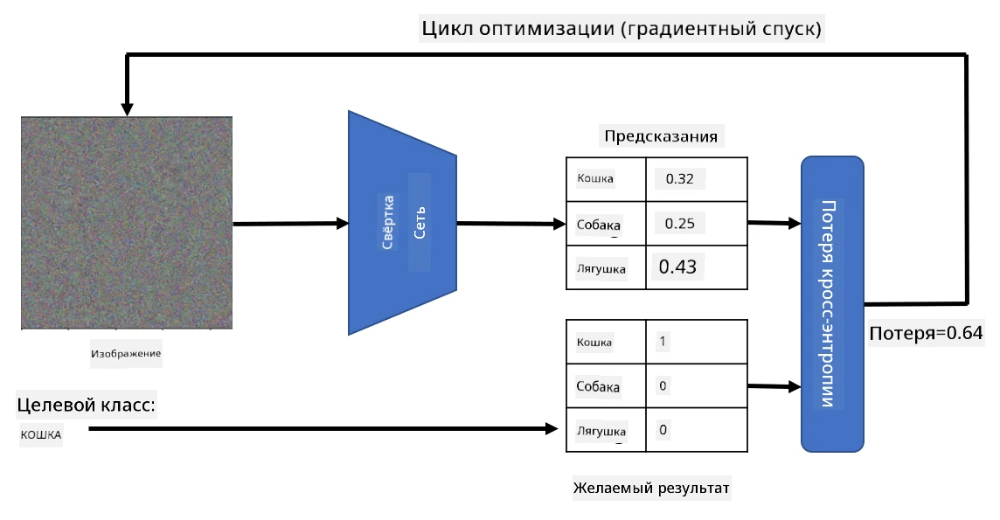

# Предобученные сети и перенос обучения

Обучение CNN может занимать много времени, а для этой задачи требуется большое количество данных. Однако значительная часть времени уходит на изучение лучших низкоуровневых фильтров, которые сеть может использовать для извлечения паттернов из изображений. Возникает естественный вопрос — можем ли мы использовать нейронную сеть, обученную на одном наборе данных, и адаптировать её для классификации других изображений без полного процесса обучения?

## [Викторина перед лекцией](https://ff-quizzes.netlify.app/en/ai/quiz/15)

Этот подход называется **переносом обучения**, потому что мы переносим часть знаний из одной модели нейронной сети в другую. В переносе обучения мы обычно начинаем с предобученной модели, которая была обучена на каком-либо крупном наборе изображений, например, **ImageNet**. Эти модели уже хорошо справляются с извлечением различных признаков из общих изображений, и во многих случаях построение классификатора поверх этих извлечённых признаков может дать хороший результат.

> ✅ Перенос обучения — это термин, который встречается и в других академических областях, таких как образование. Он относится к процессу переноса знаний из одной области в другую.

## Предобученные модели как извлекатели признаков

Сверточные сети, о которых мы говорили в предыдущем разделе, содержат ряд слоёв, каждый из которых предназначен для извлечения признаков из изображения, начиная с низкоуровневых комбинаций пикселей (например, горизонтальных/вертикальных линий или штрихов) и заканчивая высокоуровневыми комбинациями признаков, соответствующими таким вещам, как глаз или пламя. Если мы обучим CNN на достаточно большом наборе общих и разнообразных изображений, сеть должна научиться извлекать эти общие признаки.

И Keras, и PyTorch содержат функции для лёгкой загрузки предобученных весов нейронной сети для некоторых распространённых архитектур, большинство из которых были обучены на изображениях ImageNet. Наиболее часто используемые описаны на странице [Архитектуры CNN](../07-ConvNets/CNN_Architectures.md) из предыдущего урока. В частности, вы можете рассмотреть использование одной из следующих моделей:

* **VGG-16/VGG-19** — относительно простые модели, которые всё же дают хорошую точность. Часто использование VGG в качестве первого подхода — хороший выбор, чтобы увидеть, как работает перенос обучения.
* **ResNet** — семейство моделей, предложенных Microsoft Research в 2015 году. Они имеют больше слоёв, а значит, требуют больше ресурсов.
* **MobileNet** — семейство моделей с уменьшенным размером, подходящих для мобильных устройств. Используйте их, если у вас ограниченные ресурсы и вы готовы пожертвовать небольшой частью точности.

Вот пример признаков, извлечённых из изображения кошки сетью VGG-16:

## Набор данных "Кошки против собак"

В этом примере мы будем использовать набор данных [Кошки и собаки](https://www.microsoft.com/download/details.aspx?id=54765&WT.mc_id=academic-77998-cacaste), который очень близок к реальному сценарию классификации изображений.

## ✍️ Упражнение: перенос обучения

Давайте посмотрим, как работает перенос обучения, в соответствующих ноутбуках:

* [Перенос обучения — PyTorch](TransferLearningPyTorch.ipynb)
* [Перенос обучения — TensorFlow](TransferLearningTF.ipynb)

## Визуализация идеального изображения кошки

Предобученная нейронная сеть содержит различные паттерны внутри своего *"мозга"*, включая представления **идеальной кошки** (а также идеальной собаки, идеальной зебры и т.д.). Было бы интересно как-то **визуализировать это изображение**. Однако это не так просто, потому что паттерны распределены по всем весам сети и организованы в иерархическую структуру.

Один из подходов, который мы можем использовать, — это начать с случайного изображения и затем попытаться применить технику **оптимизации градиентного спуска**, чтобы изменить это изображение так, чтобы сеть начала думать, что это кошка.

Однако, если мы сделаем это, мы получим что-то очень похожее на случайный шум. Это происходит потому, что *существует множество способов заставить сеть думать, что входное изображение — это кошка*, включая те, которые визуально не имеют смысла. Хотя эти изображения содержат множество паттернов, характерных для кошки, ничего не ограничивает их визуальную выразительность.

Чтобы улучшить результат, мы можем добавить ещё один член в функцию потерь, который называется **потеря вариации**. Это метрика, показывающая, насколько похожи соседние пиксели изображения. Минимизация потери вариации делает изображение более гладким и избавляет от шума, раскрывая более визуально привлекательные паттерны. Вот пример таких "идеальных" изображений, которые классифицируются как кошка и как зебра с высокой вероятностью:

 | 
-----|-----
 *Идеальная кошка* | *Идеальная зебра*

Похожий подход можно использовать для выполнения так называемых **атак на нейронную сеть**. Предположим, мы хотим обмануть нейронную сеть и заставить собаку выглядеть как кошка. Если мы возьмём изображение собаки, которое сеть распознаёт как собаку, мы можем немного изменить его с помощью оптимизации градиентного спуска, пока сеть не начнёт классифицировать его как кошку:

 | 
-----|-----
*Оригинальное изображение собаки* | *Изображение собаки, классифицированное как кошка*

Посмотрите код для воспроизведения результатов выше в следующем ноутбуке:

* [Идеальная и атакующая кошка — TensorFlow](AdversarialCat_TF.ipynb)

## Заключение

Используя перенос обучения, вы можете быстро создать классификатор для задачи классификации пользовательских объектов и достичь высокой точности. Вы можете заметить, что более сложные задачи, которые мы решаем сейчас, требуют большей вычислительной мощности и не могут быть легко решены на CPU. В следующем разделе мы попробуем использовать более лёгкую реализацию для обучения той же модели с меньшими вычислительными ресурсами, что приведёт к лишь немного меньшей точности.

## 🚀 Задание

В сопутствующих ноутбуках есть заметки внизу о том, что перенос знаний лучше всего работает с похожими данными для обучения (например, новый вид животных). Проведите эксперименты с совершенно новыми типами изображений, чтобы увидеть, насколько хорошо или плохо работают ваши модели переноса знаний.

## [Викторина после лекции](https://ff-quizzes.netlify.app/en/ai/quiz/16)

## Обзор и самостоятельное изучение

Прочитайте [TrainingTricks.md](TrainingTricks.md), чтобы углубить свои знания о других способах обучения моделей.

## [Задание](lab/README.md)

В этой лабораторной работе мы будем использовать реальный набор данных [Oxford-IIIT](https://www.robots.ox.ac.uk/~vgg/data/pets/) с 35 породами кошек и собак и построим классификатор с использованием переноса обучения.

---

