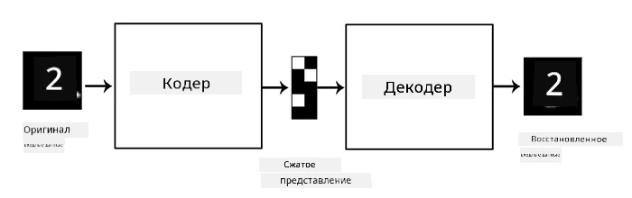
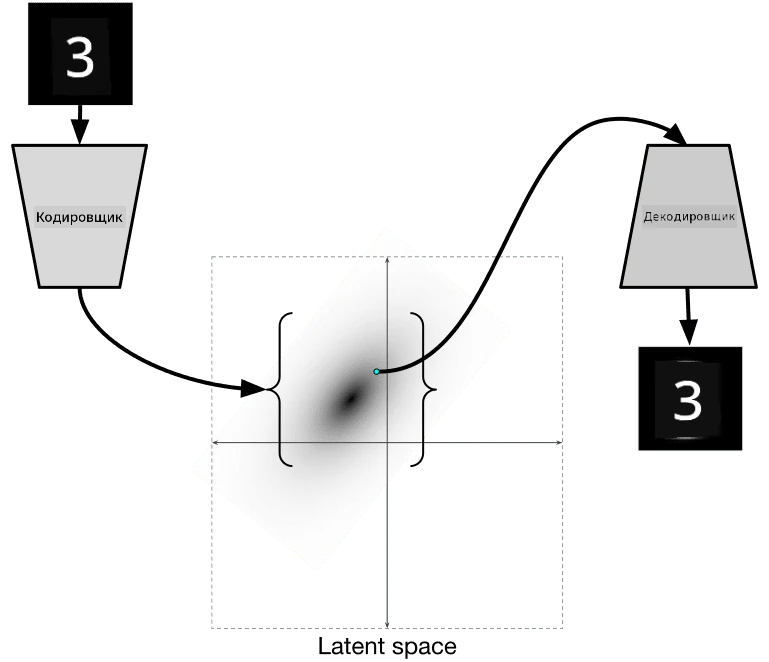

# Автоэнкодеры

При обучении CNN одна из проблем заключается в том, что требуется большое количество размеченных данных. В случае классификации изображений необходимо разделить изображения на разные классы, что требует ручной работы.

## [Тест перед лекцией](https://ff-quizzes.netlify.app/en/ai/quiz/17)

Однако мы можем использовать необработанные (неразмеченные) данные для обучения CNN в качестве извлекателей признаков, что называется **самостоятельным обучением**. Вместо меток мы будем использовать обучающие изображения как входные данные и как выходные. Основная идея **автоэнкодера** заключается в том, что у нас будет **кодирующая сеть**, которая преобразует входное изображение в некоторое **латентное пространство** (обычно это просто вектор меньшего размера), а затем **декодирующая сеть**, цель которой — восстановить исходное изображение.

> ✅ [Автоэнкодер](https://wikipedia.org/wiki/Autoencoder) — это "тип искусственной нейронной сети, используемой для изучения эффективного кодирования неразмеченных данных."

Поскольку мы обучаем автоэнкодер захватывать как можно больше информации из исходного изображения для точного восстановления, сеть пытается найти наилучшее **встраивание** входных изображений, чтобы уловить их смысл.

> Изображение из [блога Keras](https://blog.keras.io/building-autoencoders-in-keras.html)

## Сценарии использования автоэнкодеров

Хотя восстановление исходных изображений само по себе может показаться не слишком полезным, есть несколько сценариев, где автоэнкодеры особенно эффективны:

* **Снижение размерности изображений для визуализации** или **обучение встраиванию изображений**. Обычно автоэнкодеры дают лучшие результаты, чем PCA, поскольку учитывают пространственную природу изображений и иерархические признаки.
* **Удаление шума**, то есть избавление изображения от шума. Поскольку шум содержит много бесполезной информации, автоэнкодер не может вместить его весь в относительно небольшое латентное пространство, и поэтому захватывает только важную часть изображения. При обучении автоэнкодеров для удаления шума мы начинаем с исходных изображений и используем изображения с искусственно добавленным шумом в качестве входных данных.
* **Сверхразрешение**, увеличение разрешения изображения. Мы начинаем с изображений высокого разрешения и используем изображение с более низким разрешением в качестве входных данных для автоэнкодера.
* **Генеративные модели**. После обучения автоэнкодера его декодирующую часть можно использовать для создания новых объектов, начиная с случайных латентных векторов.

## Вариационные автоэнкодеры (VAE)

Традиционные автоэнкодеры уменьшают размерность входных данных, выделяя важные признаки входных изображений. Однако латентные векторы часто не имеют очевидного смысла. Например, если взять набор данных MNIST, определить, какие цифры соответствуют различным латентным векторам, может быть непросто, поскольку близкие латентные векторы не обязательно будут соответствовать одним и тем же цифрам.

С другой стороны, для обучения *генеративных* моделей лучше иметь некоторое представление о латентном пространстве. Эта идея приводит нас к **вариационному автоэнкодеру** (VAE).

VAE — это автоэнкодер, который учится предсказывать *статистическое распределение* латентных параметров, так называемое **латентное распределение**. Например, мы можем захотеть, чтобы латентные векторы имели нормальное распределение с некоторым средним zmean и стандартным отклонением zsigma (оба — векторы некоторой размерности d). Кодировщик в VAE учится предсказывать эти параметры, а затем декодер берет случайный вектор из этого распределения для восстановления объекта.

Итак, подытожим:

 * Из входного вектора мы предсказываем `z_mean` и `z_log_sigma` (вместо предсказания самого стандартного отклонения мы предсказываем его логарифм)
 * Мы выбираем случайный вектор `sample` из распределения N(zmean,exp(zlog\_sigma))
 * Декодер пытается декодировать исходное изображение, используя `sample` в качестве входного вектора

 

> Изображение из [этого блога](https://ijdykeman.github.io/ml/2016/12/21/cvae.html) автора Исаака Дайкмана

Вариационные автоэнкодеры используют сложную функцию потерь, состоящую из двух частей:

* **Потери восстановления** — это функция потерь, показывающая, насколько близко восстановленное изображение к целевому (может быть среднеквадратичная ошибка, или MSE). Это та же функция потерь, что и в обычных автоэнкодерах.
* **KL-потери**, которые обеспечивают, чтобы распределение латентных переменных оставалось близким к нормальному распределению. Они основаны на понятии [дивергенции Кульбака-Лейблера](https://www.countbayesie.com/blog/2017/5/9/kullback-leibler-divergence-explained) — метрике для оценки сходства двух статистических распределений.

Одно из важных преимуществ VAE заключается в том, что они позволяют относительно легко генерировать новые изображения, поскольку мы знаем, из какого распределения выбирать латентные векторы. Например, если мы обучим VAE с 2D латентным вектором на MNIST, мы сможем изменять компоненты латентного вектора, чтобы получать разные цифры:

> Изображение от [Дмитрия Сошникова](http://soshnikov.com)

Обратите внимание, как изображения плавно переходят друг в друга, когда мы начинаем брать латентные векторы из разных областей латентного пространства. Мы также можем визуализировать это пространство в 2D:

 

> Изображение от [Дмитрия Сошникова](http://soshnikov.com)

## ✍️ Упражнения: Автоэнкодеры

Узнайте больше об автоэнкодерах в этих соответствующих ноутбуках:

* [Автоэнкодеры в TensorFlow](AutoencodersTF.ipynb)
* [Автоэнкодеры в PyTorch](AutoEncodersPyTorch.ipynb)

## Свойства автоэнкодеров

* **Специфичность данных** — они хорошо работают только с тем типом изображений, на которых были обучены. Например, если мы обучим сеть сверхразрешения на цветах, она будет плохо работать с портретами. Это связано с тем, что сеть может создавать изображения с более высоким разрешением, используя тонкие детали, извлеченные из признаков, изученных на обучающем наборе данных.
* **Потери** — восстановленное изображение не идентично исходному. Характер потерь определяется *функцией потерь*, используемой во время обучения.
* Работают с **неразмеченными данными**

## [Тест после лекции](https://ff-quizzes.netlify.app/en/ai/quiz/18)

## Заключение

В этом уроке вы узнали о различных типах автоэнкодеров, доступных для исследователя ИИ. Вы узнали, как их строить и использовать для восстановления изображений. Вы также узнали о VAE и о том, как использовать его для генерации новых изображений.

## 🚀 Задание

В этом уроке вы узнали об использовании автоэнкодеров для изображений. Но их также можно использовать для музыки! Ознакомьтесь с проектом Magenta [MusicVAE](https://magenta.tensorflow.org/music-vae), который использует автоэнкодеры для обучения восстановления музыки. Проведите [эксперименты](https://colab.research.google.com/github/magenta/magenta-demos/blob/master/colab-notebooks/Multitrack_MusicVAE.ipynb) с этой библиотекой, чтобы увидеть, что вы можете создать.

## [Тест после лекции](https://ff-quizzes.netlify.app/en/ai/quiz/16)

## Обзор и самостоятельное изучение

Для справки, прочитайте больше об автоэнкодерах в этих ресурсах:

* [Создание автоэнкодеров в Keras](https://blog.keras.io/building-autoencoders-in-keras.html)
* [Статья в блоге NeuroHive](https://neurohive.io/ru/osnovy-data-science/variacionnyj-avtojenkoder-vae/)
* [Объяснение вариационных автоэнкодеров](https://kvfrans.com/variational-autoencoders-explained/)
* [Условные вариационные автоэнкодеры](https://ijdykeman.github.io/ml/2016/12/21/cvae.html)

## Задание

В конце [этого ноутбука с TensorFlow](AutoencodersTF.ipynb) вы найдете "задачу" — используйте ее в качестве вашего задания.

---

