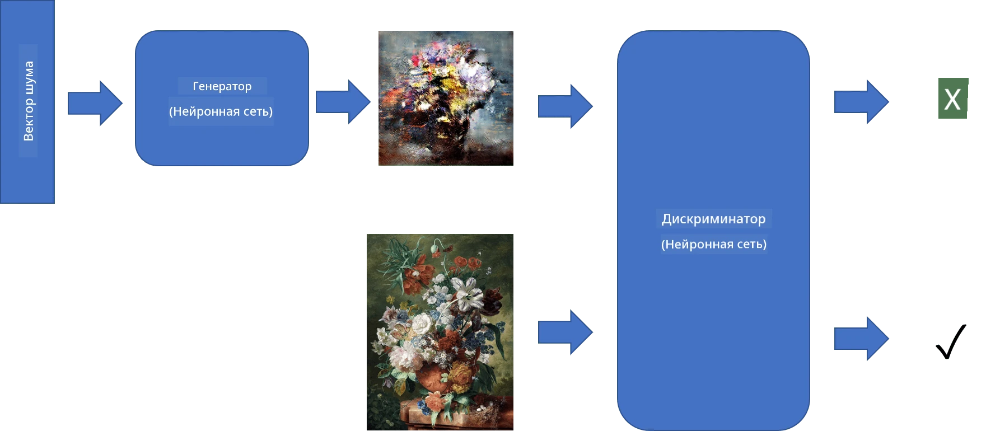
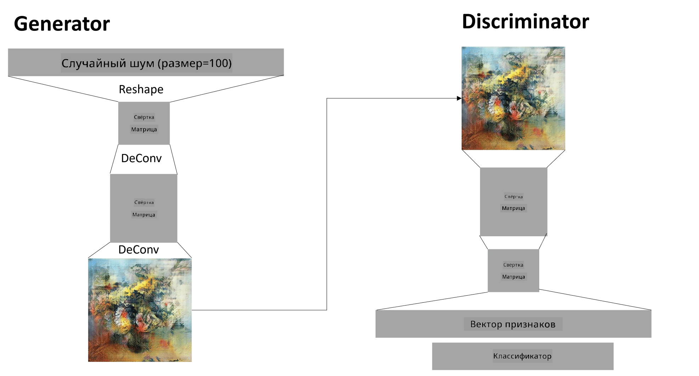

# Генеративно-состязательные сети

В предыдущем разделе мы узнали о **генеративных моделях**: моделях, которые могут создавать новые изображения, похожие на те, что находятся в обучающем наборе данных. VAE был хорошим примером генеративной модели.

## [Квиз перед лекцией](https://ff-quizzes.netlify.app/en/ai/quiz/19)

Однако, если мы попробуем создать что-то действительно значимое, например, картину с разумным разрешением, используя VAE, мы увидим, что обучение не сходится должным образом. Для такого случая стоит изучить другую архитектуру, специально предназначенную для генеративных моделей — **Генеративно-состязательные сети**, или GAN.

Основная идея GAN заключается в использовании двух нейронных сетей, которые обучаются друг против друга:

> Изображение от [Дмитрия Сошникова](http://soshnikov.com)

> ✅ Немного терминологии:
> * **Генератор** — это сеть, которая принимает случайный вектор и создает изображение в качестве результата.
> * **Дискриминатор** — это сеть, которая принимает изображение и должна определить, является ли оно реальным (из обучающего набора данных) или созданным генератором. По сути, это классификатор изображений.

### Дискриминатор

Архитектура дискриминатора не отличается от обычной сети классификации изображений. В простейшем случае это может быть полностью связанный классификатор, но чаще всего это будет [сверточная сеть](../07-ConvNets/README.md).

> ✅ GAN, основанный на сверточных сетях, называется [DCGAN](https://arxiv.org/pdf/1511.06434.pdf)

Сверточный дискриминатор состоит из следующих слоев: несколько сверточных+пулинг слоев (с уменьшением пространственного размера) и одного или нескольких полностью связанных слоев для получения "векторных признаков", а затем финального бинарного классификатора.

> ✅ "Пулинг" в данном контексте — это техника, которая уменьшает размер изображения. "Слои пулинга уменьшают размеры данных, объединяя выходы кластеров нейронов на одном слое в один нейрон на следующем слое." - [источник](https://wikipedia.org/wiki/Convolutional_neural_network#Pooling_layers)

### Генератор

Генератор немного сложнее. Его можно рассматривать как обратный дискриминатор. Начиная с латентного вектора (вместо вектора признаков), он имеет полностью связанный слой для преобразования в требуемый размер/форму, за которым следуют деконволюции+масштабирование. Это похоже на *декодер* в [автокодировщике](../09-Autoencoders/README.md).

> ✅ Поскольку сверточный слой реализован как линейный фильтр, проходящий по изображению, деконволюция по сути аналогична сверточной операции и может быть реализована с использованием той же логики слоя.

> Изображение от [Дмитрия Сошникова](http://soshnikov.com)

### Обучение GAN

GAN называются **состязательными**, потому что между генератором и дискриминатором постоянно идет соревнование. В ходе этого соревнования оба — генератор и дискриминатор — улучшаются, и сеть учится создавать все более качественные изображения.

Обучение происходит в два этапа:

* **Обучение дискриминатора**. Эта задача довольно проста: мы генерируем пакет изображений с помощью генератора, присваивая им метку 0, что означает "поддельное изображение", и берем пакет изображений из входного набора данных (с меткой 1, "реальное изображение"). Мы получаем некоторую *потерю дискриминатора* и выполняем обратное распространение ошибки.
* **Обучение генератора**. Это немного сложнее, потому что мы не знаем ожидаемый выход генератора напрямую. Мы берем всю сеть GAN, состоящую из генератора, за которым следует дискриминатор, подаем ей случайные векторы и ожидаем, что результат будет 1 (соответствующий реальным изображениям). Затем мы "замораживаем" параметры дискриминатора (чтобы он не обучался на этом этапе) и выполняем обратное распространение ошибки.

В процессе обучения потери генератора и дискриминатора обычно не уменьшаются значительно. В идеальной ситуации они должны колебаться, что соответствует улучшению производительности обеих сетей.

## ✍️ Упражнения: GAN

* [Ноутбук GAN в TensorFlow/Keras](GANTF.ipynb)
* [Ноутбук GAN в PyTorch](GANPyTorch.ipynb)

### Проблемы при обучении GAN

GAN известны своей сложностью в обучении. Вот несколько проблем:

* **Коллапс моды**. Это означает, что генератор учится создавать одно успешное изображение, которое обманывает дискриминатор, вместо разнообразия различных изображений.
* **Чувствительность к гиперпараметрам**. Часто можно заметить, что GAN вообще не сходится, а затем внезапное уменьшение скорости обучения приводит к сходимости.
* Сохранение **баланса** между генератором и дискриминатором. Во многих случаях потеря дискриминатора может быстро упасть до нуля, что приводит к невозможности дальнейшего обучения генератора. Чтобы преодолеть это, можно попробовать установить разные скорости обучения для генератора и дискриминатора или пропустить обучение дискриминатора, если его потеря уже слишком мала.
* Обучение для **высокого разрешения**. Эта проблема аналогична проблеме с автокодировщиками и возникает из-за того, что восстановление слишком большого количества слоев сверточной сети приводит к артефактам. Обычно она решается с помощью так называемого **прогрессивного роста**, когда сначала несколько слоев обучаются на изображениях низкого разрешения, а затем слои "разблокируются" или добавляются. Другим решением может быть добавление дополнительных соединений между слоями и обучение нескольких разрешений одновременно — подробнее об этом можно узнать в статье [Multi-Scale Gradient GANs](https://arxiv.org/abs/1903.06048).

## Перенос стиля

GAN — отличный способ создавать художественные изображения. Еще одна интересная техника — так называемый **перенос стиля**, который берет одно **изображение содержимого** и перерисовывает его в другом стиле, применяя фильтры из **изображения стиля**.

Как это работает:
* Мы начинаем с случайного шумового изображения (или с изображения содержимого, но для понимания проще начать с случайного шума).
* Наша цель — создать такое изображение, которое будет близко как к изображению содержимого, так и к изображению стиля. Это определяется двумя функциями потерь:
   - **Потеря содержимого** вычисляется на основе признаков, извлеченных CNN на некоторых слоях из текущего изображения и изображения содержимого.
   - **Потеря стиля** вычисляется между текущим изображением и изображением стиля хитрым способом с использованием матриц Грама (подробнее в [примере ноутбука](StyleTransfer.ipynb)).
* Чтобы сделать изображение более гладким и убрать шум, мы также вводим **потерю вариации**, которая вычисляет среднее расстояние между соседними пикселями.
* Основной цикл оптимизации корректирует текущее изображение с помощью градиентного спуска (или другого алгоритма оптимизации), чтобы минимизировать общую потерю, которая является взвешенной суммой всех трех потерь.

## ✍️ Пример: [Перенос стиля](StyleTransfer.ipynb)

## [Квиз после лекции](https://ff-quizzes.netlify.app/en/ai/quiz/20)

## Заключение

В этом уроке вы узнали о GAN и о том, как их обучать. Вы также узнали о специфических проблемах, с которыми может столкнуться этот тип нейронных сетей, и о некоторых стратегиях их преодоления.

## 🚀 Задание

Пройдите через [ноутбук переноса стиля](StyleTransfer.ipynb), используя свои собственные изображения.

## Обзор и самостоятельное изучение

Для справки, прочитайте больше о GAN в следующих ресурсах:

* Марко Пасини, [10 уроков, которые я усвоил, обучая GAN в течение года](https://towardsdatascience.com/10-lessons-i-learned-training-generative-adversarial-networks-gans-for-a-year-c9071159628)
* [StyleGAN](https://en.wikipedia.org/wiki/StyleGAN), архитектура GAN, которую стоит рассмотреть
* [Создание генеративного искусства с помощью GAN на Azure ML](https://soshnikov.com/scienceart/creating-generative-art-using-gan-on-azureml/)

## Задание

Пересмотрите один из двух ноутбуков, связанных с этим уроком, и переобучите GAN на своих собственных изображениях. Что вы сможете создать?

---

