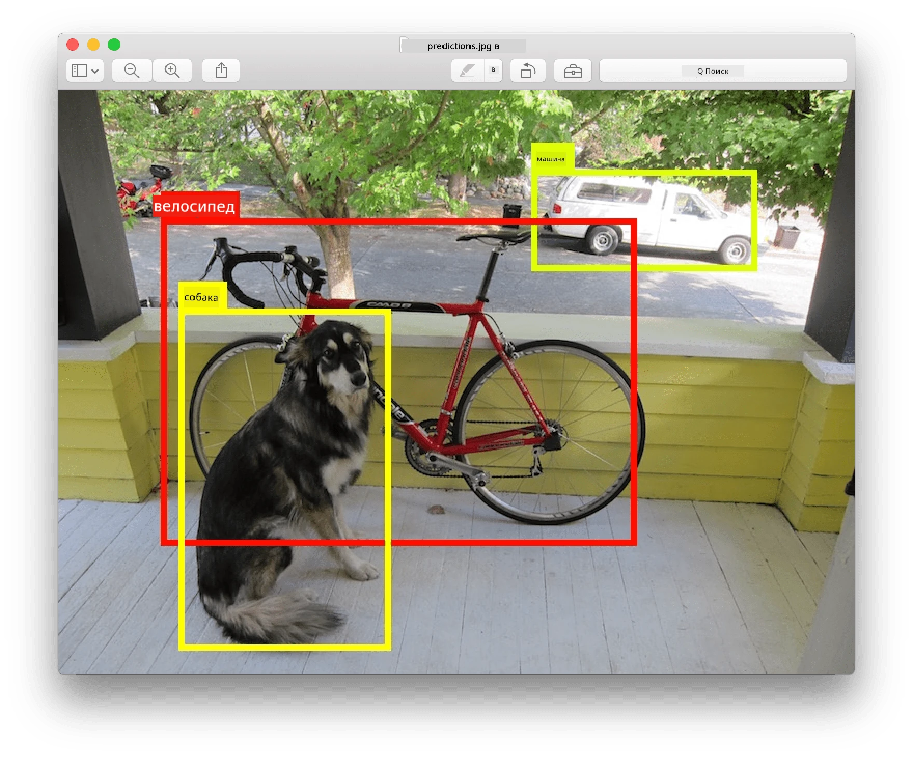
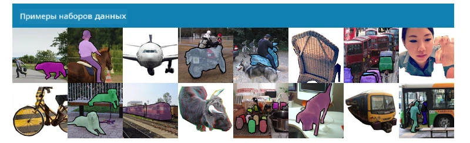
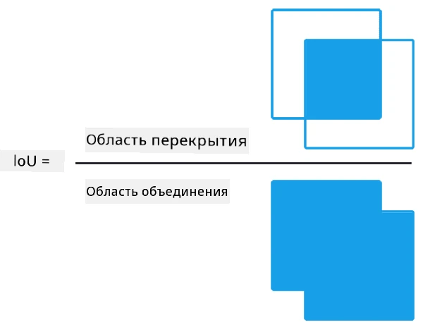
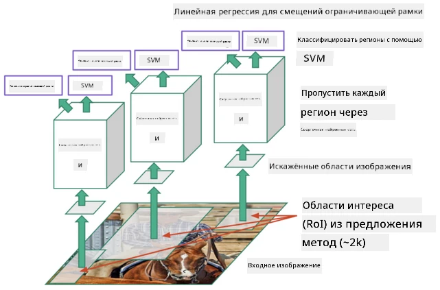
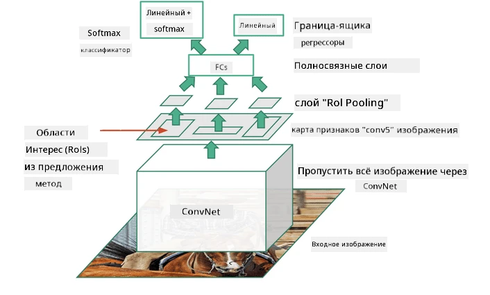
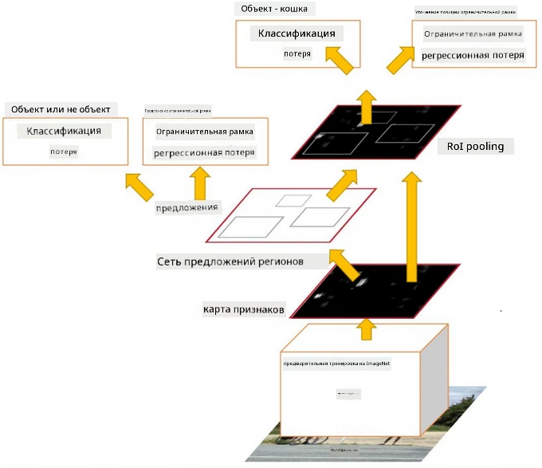
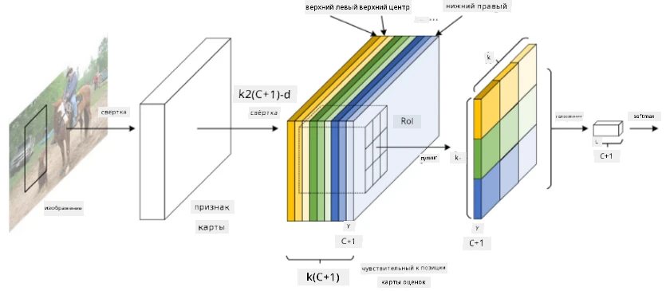
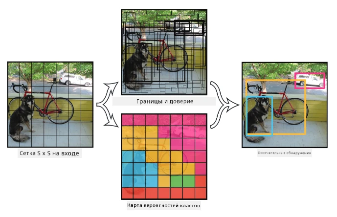

# Обнаружение объектов

Модели классификации изображений, с которыми мы работали до сих пор, принимали изображение и выдавали категориальный результат, например, класс "цифра" в задаче MNIST. Однако во многих случаях нам недостаточно просто знать, что на изображении есть объекты — мы хотим определить их точное местоположение. Именно этим занимается **обнаружение объектов**.

## [Квиз перед лекцией](https://ff-quizzes.netlify.app/en/ai/quiz/21)

> Изображение с [веб-сайта YOLO v2](https://pjreddie.com/darknet/yolov2/)

## Простой подход к обнаружению объектов

Предположим, мы хотим найти кошку на изображении. Очень простой подход к обнаружению объектов может выглядеть следующим образом:

1. Разбить изображение на множество плиток.
2. Запустить классификацию изображений для каждой плитки.
3. Те плитки, которые дают достаточно высокую активацию, можно считать содержащими искомый объект.

> *Изображение из [учебной тетради](ObjectDetection-TF.ipynb)*

Однако этот подход далек от идеала, так как он позволяет алгоритму лишь приблизительно определить границы объекта. Для более точного определения местоположения необходимо использовать **регрессию** для предсказания координат ограничивающих рамок — а для этого нужны специальные наборы данных.

## Регрессия для обнаружения объектов

[Этот блог](https://towardsdatascience.com/object-detection-with-neural-networks-a4e2c46b4491) предлагает отличное введение в обнаружение форм.

## Наборы данных для обнаружения объектов

Вы можете встретить следующие наборы данных для этой задачи:

* [PASCAL VOC](http://host.robots.ox.ac.uk/pascal/VOC/) — 20 классов.
* [COCO](http://cocodataset.org/#home) — Common Objects in Context. 80 классов, ограничивающие рамки и маски сегментации.

## Метрики для обнаружения объектов

### Пересечение над объединением (IoU)

Если для классификации изображений легко измерить, насколько хорошо работает алгоритм, то для обнаружения объектов нужно оценивать как правильность класса, так и точность предсказанных координат ограничивающей рамки. Для последнего используется метрика **Пересечение над объединением** (IoU), которая измеряет, насколько хорошо две рамки (или две произвольные области) перекрываются.

> *Рисунок 2 из [этого отличного блога о IoU](https://pyimagesearch.com/2016/11/07/intersection-over-union-iou-for-object-detection/)*

Идея проста — мы делим площадь пересечения двух фигур на площадь их объединения. Для двух идентичных областей IoU будет равен 1, а для полностью несвязанных областей — 0. В остальных случаях значение будет варьироваться от 0 до 1. Обычно учитываются только те ограничивающие рамки, для которых IoU превышает определенное значение.

### Средняя точность (Average Precision)

Предположим, мы хотим измерить, насколько хорошо распознается определенный класс объектов $C$. Для этого используется метрика **Средняя точность**, которая рассчитывается следующим образом:

1. Рассматривается кривая точности-отзыва (Precision-Recall), показывающая точность в зависимости от порогового значения обнаружения (от 0 до 1).
2. В зависимости от порога мы получим больше или меньше объектов, обнаруженных на изображении, и разные значения точности и отзыва.
3. Кривая будет выглядеть так:

> *Изображение из [NeuroWorkshop](http://github.com/shwars/NeuroWorkshop)*

Средняя точность для данного класса $C$ — это площадь под этой кривой. Более точно, ось отзыва обычно делится на 10 частей, и точность усредняется по всем этим точкам:

$$
AP = {1\over11}\sum_{i=0}^{10}\mbox{Precision}(\mbox{Recall}={i\over10})
$$

### AP и IoU

Мы будем учитывать только те обнаружения, для которых IoU превышает определенное значение. Например, в наборе данных PASCAL VOC обычно предполагается $\mbox{IoU Threshold} = 0.5$, а в COCO AP измеряется для разных значений $\mbox{IoU Threshold}$.

> *Изображение из [NeuroWorkshop](http://github.com/shwars/NeuroWorkshop)*

### Средняя средняя точность (Mean Average Precision — mAP)

Основной метрикой для обнаружения объектов является **Средняя средняя точность** или **mAP**. Это значение средней точности, усредненное по всем классам объектов, а иногда также по $\mbox{IoU Threshold}$. Более подробно процесс расчета **mAP** описан [в этом блоге](https://medium.com/@timothycarlen/understanding-the-map-evaluation-metric-for-object-detection-a07fe6962cf3), а также [здесь с примерами кода](https://gist.github.com/tarlen5/008809c3decf19313de216b9208f3734).

## Различные подходы к обнаружению объектов

Существует два основных класса алгоритмов обнаружения объектов:

* **Сети предложений регионов** (R-CNN, Fast R-CNN, Faster R-CNN). Основная идея заключается в генерации **регионов интереса** (ROI) и запуске CNN для их анализа, чтобы найти максимальную активацию. Это немного похоже на простой подход, за исключением того, что ROI генерируются более умным способом. Одним из основных недостатков таких методов является их медлительность, так как требуется множество проходов классификатора CNN по изображению.
* **Однопроходные** методы (YOLO, SSD, RetinaNet). В этих архитектурах сеть спроектирована так, чтобы предсказывать как классы, так и ROI за один проход.

### R-CNN: CNN на основе регионов

[R-CNN](http://islab.ulsan.ac.kr/files/announcement/513/rcnn_pami.pdf) использует [Selective Search](http://www.huppelen.nl/publications/selectiveSearchDraft.pdf) для генерации иерархической структуры регионов ROI, которые затем проходят через CNN для извлечения признаков, SVM-классификаторы для определения класса объекта и линейную регрессию для определения координат *ограничивающей рамки*. [Официальная статья](https://arxiv.org/pdf/1506.01497v1.pdf)

> *Изображение из van de Sande et al. ICCV’11*

> *Изображения из [этого блога](https://towardsdatascience.com/r-cnn-fast-r-cnn-faster-r-cnn-yolo-object-detection-algorithms-36d53571365e)*

### F-RCNN — Fast R-CNN

Этот подход похож на R-CNN, но регионы определяются после применения сверточных слоев.

> Изображение из [официальной статьи](https://www.cv-foundation.org/openaccess/content_iccv_2015/papers/Girshick_Fast_R-CNN_ICCV_2015_paper.pdf), [arXiv](https://arxiv.org/pdf/1504.08083.pdf), 2015

### Faster R-CNN

Основная идея этого подхода заключается в использовании нейронной сети для предсказания ROI — так называемой *сети предложений регионов* (Region Proposal Network). [Статья](https://arxiv.org/pdf/1506.01497.pdf), 2016

> Изображение из [официальной статьи](https://arxiv.org/pdf/1506.01497.pdf)

### R-FCN: Полностью сверточная сеть на основе регионов

Этот алгоритм еще быстрее, чем Faster R-CNN. Основная идея следующая:

1. Извлекаем признаки с помощью ResNet-101.
2. Признаки обрабатываются **Position-Sensitive Score Map**. Каждый объект из $C$ классов делится на $k\times k$ регионов, и сеть обучается предсказывать части объектов.
3. Для каждой части из $k\times k$ регионов все сети голосуют за классы объектов, и выбирается класс объекта с максимальным количеством голосов.

> Изображение из [официальной статьи](https://arxiv.org/abs/1605.06409)

### YOLO — You Only Look Once

YOLO — это алгоритм реального времени с одним проходом. Основная идея следующая:

 * Изображение делится на $S\times S$ регионы.
 * Для каждого региона **CNN** предсказывает $n$ возможных объектов, координаты *ограничивающей рамки* и *уверенность*=*вероятность* * IoU.

 

> Изображение из [официальной статьи](https://arxiv.org/abs/1506.02640)

### Другие алгоритмы

* RetinaNet: [официальная статья](https://arxiv.org/abs/1708.02002)
   - [Реализация на PyTorch в Torchvision](https://pytorch.org/vision/stable/_modules/torchvision/models/detection/retinanet.html)
   - [Реализация на Keras](https://github.com/fizyr/keras-retinanet)
   - [Обнаружение объектов с RetinaNet](https://keras.io/examples/vision/retinanet/) в примерах Keras
* SSD (Single Shot Detector): [официальная статья](https://arxiv.org/abs/1512.02325)

## ✍️ Упражнения: Обнаружение объектов

Продолжите обучение в следующей тетради:

[ObjectDetection.ipynb](ObjectDetection.ipynb)

## Заключение

В этом уроке вы познакомились с различными способами обнаружения объектов!

## 🚀 Задание

Прочитайте эти статьи и тетради о YOLO и попробуйте их самостоятельно:

* [Хороший блог](https://www.analyticsvidhya.com/blog/2018/12/practical-guide-object-detection-yolo-framewor-python/) о YOLO.
 * [Официальный сайт](https://pjreddie.com/darknet/yolo/)
 * YOLO: [Реализация на Keras](https://github.com/experiencor/keras-yolo2), [пошаговая тетрадь](https://github.com/experiencor/basic-yolo-keras/blob/master/Yolo%20Step-by-Step.ipynb)
 * YOLO v2: [Реализация на Keras](https://github.com/experiencor/keras-yolo2), [пошаговая тетрадь](https://github.com/experiencor/keras-yolo2/blob/master/Yolo%20Step-by-Step.ipynb)

## [Квиз после лекции](https://ff-quizzes.netlify.app/en/ai/quiz/22)

## Обзор и самостоятельное изучение

* [Обнаружение объектов](https://tjmachinelearning.com/lectures/1718/obj/) от Нихила Сарданы.
* [Хорошее сравнение алгоритмов обнаружения объектов](https://lilianweng.github.io/lil-log/2018/12/27/object-detection-part-4.html).
* [Обзор алгоритмов глубокого обучения для обнаружения объектов](https://medium.com/comet-app/review-of-deep-learning-algorithms-for-object-detection-c1f3d437b852).
* [Пошаговое введение в основные алгоритмы обнаружения объектов](https://www.analyticsvidhya.com/blog/2018/10/a-step-by-step-introduction-to-the-basic-object-detection-algorithms-part-1/).
* [Реализация Faster R-CNN на Python для обнаружения объектов](https://www.analyticsvidhya.com/blog/2018/11/implementation-faster-r-cnn-python-object-detection/).

## [Задание: Обнаружение объектов](lab/README.md)

---

