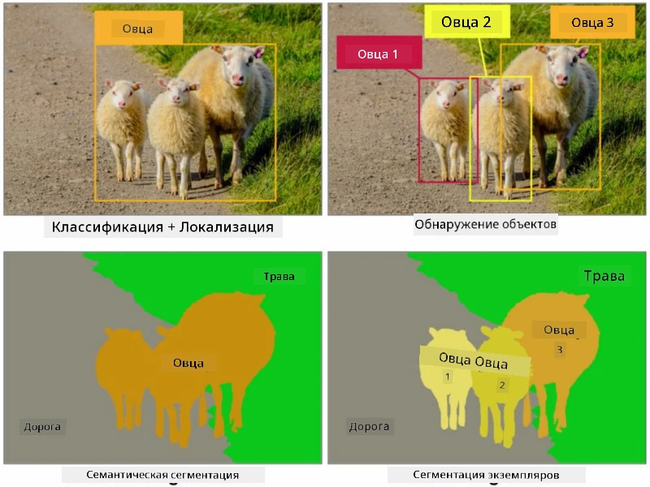
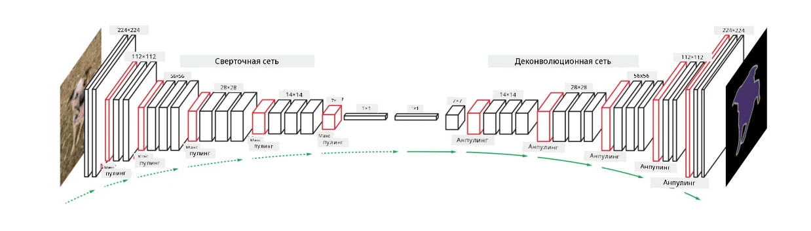

# Сегментация

Ранее мы изучали обнаружение объектов, которое позволяет находить объекты на изображении, предсказывая их *ограничивающие рамки*. Однако для некоторых задач нам нужны не только рамки, но и более точная локализация объектов. Эта задача называется **сегментацией**.

## [Тест перед лекцией](https://ff-quizzes.netlify.app/en/ai/quiz/23)

Сегментацию можно рассматривать как **классификацию пикселей**, где для **каждого** пикселя изображения мы должны предсказать его класс (*фон* является одним из классов). Существует два основных алгоритма сегментации:

* **Семантическая сегментация** определяет только класс пикселя, не различая отдельные объекты одного и того же класса.
* **Сегментация экземпляров** разделяет классы на отдельные экземпляры.

Для сегментации экземпляров эти овцы считаются разными объектами, но для семантической сегментации все овцы представлены одним классом.

> Изображение из [этой статьи](https://nirmalamurali.medium.com/image-classification-vs-semantic-segmentation-vs-instance-segmentation-625c33a08d50)

Существуют различные нейронные архитектуры для сегментации, но все они имеют одинаковую структуру. В некотором смысле, она похожа на автоэнкодер, о котором вы узнали ранее, но вместо деконструкции исходного изображения наша цель — деконструировать **маску**. Таким образом, сеть для сегментации состоит из следующих частей:

* **Энкодер** извлекает признаки из входного изображения.
* **Декодер** преобразует эти признаки в **маску изображения**, с тем же размером и количеством каналов, соответствующих количеству классов.

> Изображение из [этой публикации](https://arxiv.org/pdf/2001.05566.pdf)

Особое внимание следует уделить функции потерь, используемой для сегментации. При использовании классических автоэнкодеров нам нужно измерить сходство между двумя изображениями, и для этого можно использовать среднеквадратичную ошибку (MSE). В сегментации каждый пиксель целевой маски изображения представляет номер класса (закодированный в формате one-hot вдоль третьего измерения), поэтому необходимо использовать функции потерь, специфичные для классификации, такие как кросс-энтропия, усреднённая по всем пикселям. Если маска бинарная, используется **бинарная кросс-энтропия** (BCE).

> ✅ One-hot кодирование — это способ преобразования метки класса в вектор длиной, равной количеству классов. Ознакомьтесь с [этой статьёй](https://datagy.io/sklearn-one-hot-encode/) о данной технике.

## Сегментация в медицинской визуализации

В этом уроке мы увидим сегментацию в действии, обучая сеть распознавать невусы (родинки) на медицинских изображениях. Мы будем использовать <a href="https://www.fc.up.pt/addi/ph2%20database.html">базу данных PH2</a> дерматоскопических изображений в качестве источника данных. Этот набор данных содержит 200 изображений трёх классов: типичный невус, атипичный невус и меланома. Все изображения также содержат соответствующую **маску**, которая выделяет невус.

> ✅ Этот метод особенно подходит для такого типа медицинской визуализации, но какие ещё реальные приложения вы могли бы представить?

> Изображение из базы данных PH2

Мы обучим модель сегментировать любой невус от его фона.

## ✍️ Упражнения: Семантическая сегментация

Откройте ноутбуки ниже, чтобы узнать больше о различных архитектурах семантической сегментации, попрактиковаться в работе с ними и увидеть их в действии.

* [Semantic Segmentation Pytorch](SemanticSegmentationPytorch.ipynb)
* [Semantic Segmentation TensorFlow](SemanticSegmentationTF.ipynb)

## [Тест после лекции](https://ff-quizzes.netlify.app/en/ai/quiz/24)

## Заключение

Сегментация — это очень мощная техника классификации изображений, которая выходит за рамки ограничивающих рамок и позволяет классифицировать пиксели. Она используется в медицинской визуализации и других приложениях.

## 🚀 Задание

Сегментация тела — это лишь одна из распространённых задач, которые можно выполнять с изображениями людей. Другие важные задачи включают **обнаружение скелета** и **определение позы**. Попробуйте библиотеку [OpenPose](https://github.com/CMU-Perceptual-Computing-Lab/openpose), чтобы увидеть, как можно использовать определение позы.

## Обзор и самостоятельное изучение

Эта [статья в Википедии](https://wikipedia.org/wiki/Image_segmentation) предлагает хороший обзор различных приложений данной техники. Узнайте больше самостоятельно о поддомейнах сегментации экземпляров и паноптической сегментации в этой области исследований.

## [Задание](lab/README.md)

В этой лабораторной работе попробуйте **сегментацию человеческого тела** с использованием [Segmentation Full Body MADS Dataset](https://www.kaggle.com/datasets/tapakah68/segmentation-full-body-mads-dataset) из Kaggle.

---

