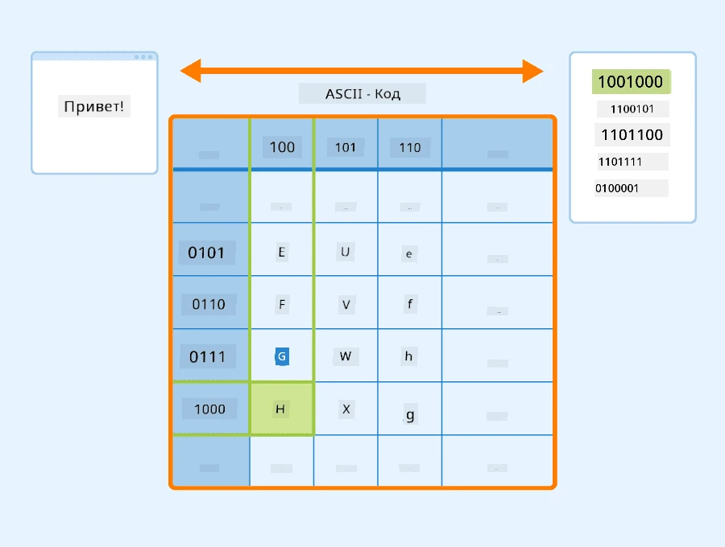
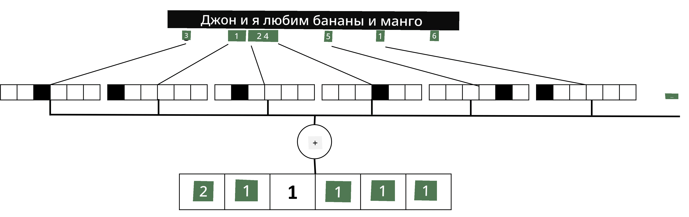

# Представление текста в виде тензоров

## [Викторина перед лекцией](https://ff-quizzes.netlify.app/en/ai/quiz/25)

## Классификация текста

В первой части этого раздела мы сосредоточимся на задаче **классификации текста**. Мы будем использовать [AG News](https://www.kaggle.com/amananandrai/ag-news-classification-dataset) Dataset, который содержит новостные статьи, например:

* Категория: Наука/Технологии  
* Заголовок: Компания из Кентукки получила грант на изучение пептидов (AP)  
* Текст: AP - Компания, основанная исследователем химии из Университета Луисвилля, получила грант на разработку...

Наша цель — классифицировать новостной материал в одну из категорий на основе текста.

## Представление текста

Если мы хотим решать задачи обработки естественного языка (NLP) с помощью нейронных сетей, нам нужно каким-то образом представить текст в виде тензоров. Компьютеры уже представляют текстовые символы в виде чисел, которые отображаются на экране с использованием кодировок, таких как ASCII или UTF-8.

> [Источник изображения](https://www.seobility.net/en/wiki/ASCII)

Как люди, мы понимаем, что означает каждая буква, и как все символы объединяются, чтобы сформировать слова в предложении. Однако компьютеры сами по себе такого понимания не имеют, и нейронная сеть должна обучиться этому значению в процессе тренировки.

Поэтому мы можем использовать разные подходы для представления текста:

* **Побуквенное представление**, когда мы представляем текст, рассматривая каждый символ как число. Если у нас есть *C* различных символов в текстовом корпусе, то слово *Hello* будет представлено тензором размером 5x*C*. Каждая буква будет соответствовать столбцу тензора в one-hot кодировке.  
* **Пословное представление**, при котором мы создаем **словарь** всех слов в тексте и затем представляем слова с использованием one-hot кодировки. Этот подход несколько лучше, так как каждая буква сама по себе не имеет большого значения, и, используя более высокоуровневые семантические концепции — слова, мы упрощаем задачу для нейронной сети. Однако из-за большого размера словаря приходится работать с высокоразмерными разреженными тензорами.

Независимо от подхода, сначала нужно преобразовать текст в последовательность **токенов**, где токеном может быть символ, слово или даже часть слова. Затем токен преобразуется в число, обычно с использованием **словаря**, и это число можно подать в нейронную сеть с помощью one-hot кодировки.

## N-граммы

В естественном языке точное значение слов можно определить только в контексте. Например, значения *нейронная сеть* и *рыболовная сеть* совершенно разные. Один из способов учитывать это — строить модель на основе пар слов, рассматривая пары слов как отдельные токены словаря. Таким образом, предложение *Мне нравится ходить на рыбалку* будет представлено следующей последовательностью токенов: *Мне нравится*, *нравится ходить*, *ходить на*, *на рыбалку*. Проблема этого подхода в том, что размер словаря значительно увеличивается, а комбинации вроде *на рыбалку* и *на шопинг* представлены разными токенами, которые не имеют никакого семантического сходства, несмотря на одинаковый глагол.

В некоторых случаях можно использовать триграммы — комбинации из трех слов. Поэтому такой подход часто называют **n-граммами**. Также имеет смысл использовать n-граммы с побуквенным представлением, где n-граммы будут примерно соответствовать различным слогам.

## Мешок слов и TF/IDF

При решении задач, таких как классификация текста, нам нужно уметь представлять текст в виде одного вектора фиксированного размера, который будет использоваться в качестве входных данных для финального плотного классификатора. Один из самых простых способов сделать это — объединить все отдельные представления слов, например, сложив их. Если мы сложим one-hot кодировки каждого слова, то получим вектор частот, показывающий, сколько раз каждое слово встречается в тексте. Такое представление текста называется **мешок слов** (BoW).

> Изображение автора

BoW по сути показывает, какие слова встречаются в тексте и в каком количестве, что действительно может быть хорошим индикатором содержания текста. Например, новостная статья о политике, скорее всего, будет содержать слова, такие как *президент* и *страна*, а научная публикация — что-то вроде *коллайдер*, *открытие* и т.д. Таким образом, частоты слов во многих случаях могут быть хорошим индикатором содержания текста.

Проблема BoW в том, что определенные распространенные слова, такие как *и*, *это* и т.д., встречаются в большинстве текстов и имеют самые высокие частоты, затмевая слова, которые действительно важны. Мы можем снизить важность таких слов, учитывая частоту их появления во всей коллекции документов. Это основная идея подхода TF/IDF, который более подробно рассматривается в ноутбуках, прикрепленных к этому уроку.

Однако ни один из этих подходов не может полностью учитывать **семантику** текста. Для этого нам нужны более мощные модели нейронных сетей, о которых мы поговорим позже в этом разделе.

## ✍️ Упражнения: Представление текста

Продолжите обучение в следующих ноутбуках:

* [Представление текста с PyTorch](TextRepresentationPyTorch.ipynb)  
* [Представление текста с TensorFlow](TextRepresentationTF.ipynb)  

## Заключение

На данный момент мы изучили техники, которые могут добавлять вес частоты к разным словам. Однако они не способны представлять значение или порядок. Как сказал известный лингвист Дж. Р. Фёрт в 1935 году: "Полное значение слова всегда контекстуально, и никакое изучение значения вне контекста не может быть воспринято всерьез." Позже в курсе мы узнаем, как извлекать контекстуальную информацию из текста с помощью языкового моделирования.

## 🚀 Задание

Попробуйте выполнить другие упражнения, используя мешок слов и различные модели данных. Возможно, вас вдохновит этот [конкурс на Kaggle](https://www.kaggle.com/competitions/word2vec-nlp-tutorial/overview/part-1-for-beginners-bag-of-words).

## [Викторина после лекции](https://ff-quizzes.netlify.app/en/ai/quiz/26)

## Обзор и самостоятельное изучение

Практикуйте свои навыки работы с текстовыми встраиваниями и техниками мешка слов на [Microsoft Learn](https://docs.microsoft.com/learn/modules/intro-natural-language-processing-pytorch/?WT.mc_id=academic-77998-cacaste).

## [Задание: Ноутбуки](assignment.md)

---

