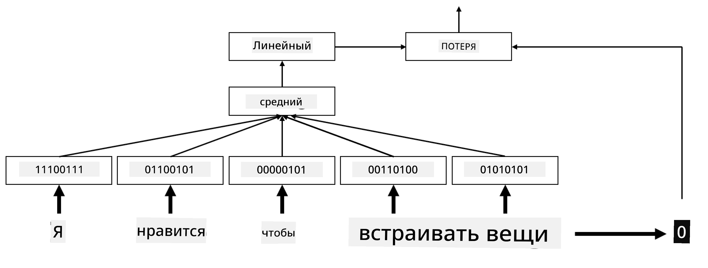

# Встраивания

## [Тест перед лекцией](https://ff-quizzes.netlify.app/en/ai/quiz/27)

При обучении классификаторов на основе BoW или TF/IDF мы работали с высокоразмерными векторами мешка слов длиной `vocab_size`, и явно преобразовывали низкоразмерные векторы позиционного представления в разреженное одноразрядное представление. Однако такое одноразрядное представление неэффективно с точки зрения памяти. Кроме того, каждое слово рассматривается независимо от других, то есть одноразрядные векторы не выражают никакого семантического сходства между словами.

Идея **встраивания** заключается в том, чтобы представлять слова с помощью низкоразмерных плотных векторов, которые каким-то образом отражают семантическое значение слова. Позже мы обсудим, как создавать осмысленные встраивания слов, но пока давайте просто считать встраивания способом уменьшения размерности вектора слова.

Таким образом, слой встраивания принимает слово на вход и выдает выходной вектор заданного размера `embedding_size`. В некотором смысле, он очень похож на слой `Linear`, но вместо того, чтобы принимать одноразрядный вектор, он может принимать номер слова на вход, позволяя нам избежать создания больших одноразрядных векторов.

Используя слой встраивания в качестве первого слоя в нашей сети классификатора, мы можем перейти от модели мешка слов к модели **мешка встраиваний**, где мы сначала преобразуем каждое слово в нашем тексте в соответствующее встраивание, а затем вычисляем некоторую агрегатную функцию для всех этих встраиваний, такую как `sum`, `average` или `max`.  

> Изображение автора

## ✍️ Упражнения: Встраивания

Продолжите обучение в следующих ноутбуках:
* [Встраивания с PyTorch](EmbeddingsPyTorch.ipynb)
* [Встраивания с TensorFlow](EmbeddingsTF.ipynb)

## Семантические встраивания: Word2Vec

Хотя слой встраивания научился отображать слова в векторное представление, это представление не обязательно имеет глубокий семантический смысл. Было бы здорово научиться создавать векторное представление, в котором похожие слова или синонимы соответствуют вектору, близкому друг к другу с точки зрения некоторого расстояния между векторами (например, евклидова расстояния).

Для этого нам нужно предварительно обучить модель встраивания на большом наборе текстов определенным образом. Один из способов обучения семантических встраиваний называется [Word2Vec](https://en.wikipedia.org/wiki/Word2vec). Он основан на двух основных архитектурах, которые используются для создания распределенного представления слов:

 - **Непрерывный мешок слов** (CBoW) — в этой архитектуре мы обучаем модель предсказывать слово по окружающему контексту. Учитывая n-грамму $(W_{-2},W_{-1},W_0,W_1,W_2)$, цель модели — предсказать $W_0$ по $(W_{-2},W_{-1},W_1,W_2)$.
 - **Непрерывный пропуск-грамм** — противоположность CBoW. Модель использует окружающее окно контекстных слов для предсказания текущего слова.

CBoW работает быстрее, а пропуск-грамм медленнее, но лучше справляется с представлением редких слов.

> Изображение из [этой статьи](https://arxiv.org/pdf/1301.3781.pdf)

Предварительно обученные встраивания Word2Vec (а также другие похожие модели, такие как GloVe) могут быть использованы вместо слоя встраивания в нейронных сетях. Однако необходимо учитывать словари, так как словарь, использованный для предварительного обучения Word2Vec/GloVe, скорее всего, будет отличаться от словаря в нашем текстовом корпусе. Ознакомьтесь с вышеупомянутыми ноутбуками, чтобы узнать, как можно решить эту проблему.

## Контекстуальные встраивания

Одним из ключевых ограничений традиционных предварительно обученных представлений встраиваний, таких как Word2Vec, является проблема неоднозначности значений слов. Хотя предварительно обученные встраивания могут захватывать часть значения слов в контексте, каждое возможное значение слова кодируется в одном и том же встраивании. Это может вызывать проблемы в последующих моделях, так как многие слова, такие как слово "play", имеют разные значения в зависимости от контекста, в котором они используются.

Например, слово "play" в этих двух предложениях имеет совершенно разные значения:

- Я ходил на **пьесу** в театр.
- Джон хочет **играть** с друзьями.

Предварительно обученные встраивания выше представляют оба этих значения слова "play" в одном и том же встраивании. Чтобы преодолеть это ограничение, необходимо создавать встраивания на основе **языковой модели**, которая обучена на большом корпусе текста и *знает*, как слова могут сочетаться в разных контекстах. Обсуждение контекстуальных встраиваний выходит за рамки этого урока, но мы вернемся к ним, когда будем говорить о языковых моделях позже в курсе.

## Заключение

В этом уроке вы узнали, как создавать и использовать слои встраивания в TensorFlow и Pytorch для более точного отражения семантического значения слов.

## 🚀 Задание

Word2Vec использовался для некоторых интересных приложений, включая создание текстов песен и стихов. Ознакомьтесь с [этой статьей](https://www.politetype.com/blog/word2vec-color-poems), в которой автор рассказывает, как он использовал Word2Vec для создания стихов. Посмотрите [это видео Дэна Шиффмана](https://www.youtube.com/watch?v=LSS_bos_TPI&ab_channel=TheCodingTrain), чтобы узнать другое объяснение этой техники. Затем попробуйте применить эти методы к своему собственному текстовому корпусу, возможно, взятому с Kaggle.

## [Тест после лекции](https://ff-quizzes.netlify.app/en/ai/quiz/28)

## Обзор и самостоятельное изучение

Прочитайте эту статью о Word2Vec: [Efficient Estimation of Word Representations in Vector Space](https://arxiv.org/pdf/1301.3781.pdf)

## [Задание: Ноутбуки](assignment.md)

---

