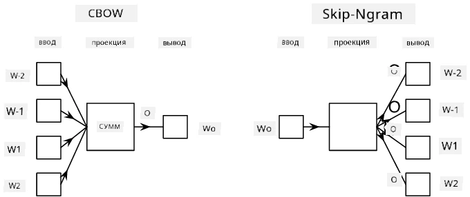

# Моделирование языка

Семантические векторы, такие как Word2Vec и GloVe, на самом деле являются первым шагом к **моделированию языка** — созданию моделей, которые каким-то образом *понимают* (или *представляют*) природу языка.

## [Тест перед лекцией](https://ff-quizzes.netlify.app/en/ai/quiz/29)

Основная идея моделирования языка заключается в обучении моделей на неразмеченных данных в несупервизируемом режиме. Это важно, потому что у нас есть огромные объемы неразмеченного текста, в то время как количество размеченного текста всегда будет ограничено усилиями, которые мы можем потратить на разметку. Чаще всего мы можем создавать языковые модели, которые способны **предсказывать пропущенные слова** в тексте, так как легко замаскировать случайное слово в тексте и использовать его как обучающий пример.

## Обучение векторов

В предыдущих примерах мы использовали заранее обученные семантические векторы, но интересно понять, как эти векторы можно обучать. Существует несколько подходов:

* **Моделирование языка с помощью N-грамм**, когда мы предсказываем токен, основываясь на N предыдущих токенах (N-граммы).
* **Непрерывный мешок слов** (Continuous Bag-of-Words, CBoW), когда мы предсказываем центральный токен $W_0$ в последовательности токенов $W_{-N}$, ..., $W_N$.
* **Skip-gram**, где мы предсказываем набор соседних токенов {$W_{-N},\dots, W_{-1}, W_1,\dots, W_N$} на основе центрального токена $W_0$.

> Изображение из [этой статьи](https://arxiv.org/pdf/1301.3781.pdf)

## ✍️ Пример ноутбуков: Обучение модели CBoW

Продолжите обучение с помощью следующих ноутбуков:

* [Обучение CBoW Word2Vec с использованием TensorFlow](CBoW-TF.ipynb)
* [Обучение CBoW Word2Vec с использованием PyTorch](CBoW-PyTorch.ipynb)

## Заключение

В предыдущем уроке мы увидели, что векторы слов работают как магия! Теперь мы знаем, что обучение векторов слов — это не такая уж сложная задача, и мы можем обучить свои собственные векторы для текстов, специфичных для определенной области, если это потребуется.

## [Тест после лекции](https://ff-quizzes.netlify.app/en/ai/quiz/30)

## Обзор и самостоятельное изучение

* [Официальный учебник PyTorch по моделированию языка](https://pytorch.org/tutorials/beginner/nlp/word_embeddings_tutorial.html).
* [Официальный учебник TensorFlow по обучению модели Word2Vec](https://www.TensorFlow.org/tutorials/text/word2vec).
* Использование фреймворка **gensim** для обучения наиболее популярных векторов всего за несколько строк кода описано [в этой документации](https://pytorch.org/tutorials/beginner/nlp/word_embeddings_tutorial.html).

## 🚀 [Задание: Обучите модель Skip-Gram](lab/README.md)

В лабораторной работе мы предлагаем вам изменить код из этого урока, чтобы обучить модель Skip-Gram вместо CBoW. [Прочитайте подробности](lab/README.md)

---

