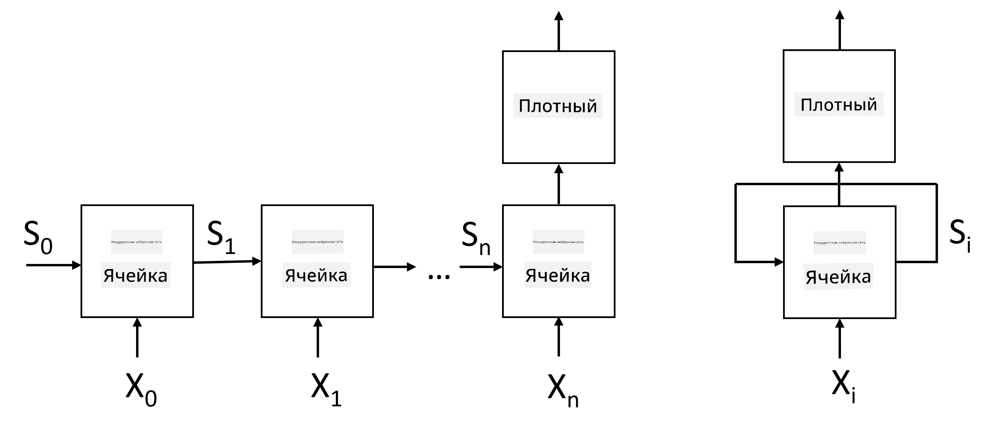
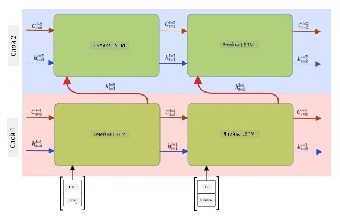

# Рекуррентные нейронные сети

## [Тест перед лекцией](https://ff-quizzes.netlify.app/en/ai/quiz/31)

В предыдущих разделах мы использовали богатые семантические представления текста и простой линейный классификатор поверх эмбеддингов. Такая архитектура позволяет захватывать агрегированное значение слов в предложении, но не учитывает **порядок** слов, так как операция агрегации поверх эмбеддингов удаляет эту информацию из исходного текста. Поскольку такие модели не могут моделировать порядок слов, они не способны решать более сложные или неоднозначные задачи, такие как генерация текста или ответы на вопросы.

Чтобы захватить смысл последовательности текста, необходимо использовать другую архитектуру нейронной сети, которая называется **рекуррентной нейронной сетью** или RNN. В RNN мы пропускаем предложение через сеть по одному символу за раз, и сеть производит некоторое **состояние**, которое затем передается обратно в сеть вместе со следующим символом.

> Изображение автора

Для входной последовательности токенов X0,...,Xn RNN создает последовательность блоков нейронной сети и обучает эту последовательность от начала до конца с использованием обратного распространения ошибки. Каждый блок сети принимает пару (Xi,Si) в качестве входных данных и производит Si+1 в качестве результата. Финальное состояние Sn или (выход Yn) передается в линейный классификатор для получения результата. Все блоки сети имеют одинаковые веса и обучаются от начала до конца с использованием одного прохода обратного распространения.

Благодаря тому, что векторы состояния S0,...,Sn передаются через сеть, она способна изучать последовательные зависимости между словами. Например, если слово *not* появляется где-то в последовательности, сеть может научиться отрицать определенные элементы внутри вектора состояния, что приводит к отрицанию.

> ✅ Поскольку веса всех блоков RNN на изображении выше являются общими, то ту же схему можно представить как один блок (справа) с рекуррентной обратной связью, которая передает выходное состояние сети обратно на вход.

## Анатомия ячейки RNN

Давайте рассмотрим, как устроена простая ячейка RNN. Она принимает предыдущее состояние Si-1 и текущий символ Xi в качестве входных данных и должна произвести выходное состояние Si (а иногда нас также интересует другой выход Yi, как в случае с генеративными сетями).

Простая ячейка RNN имеет две матрицы весов внутри: одна преобразует входной символ (назовем ее W), а другая преобразует входное состояние (H). В этом случае выход сети вычисляется как &sigma;(W&times;Xi+H&times;Si-1+b), где &sigma; — это функция активации, а b — дополнительное смещение.

> Изображение автора

Во многих случаях входные токены проходят через слой эмбеддинга перед тем, как попасть в RNN, чтобы уменьшить размерность. В этом случае, если размерность входных векторов равна *emb_size*, а вектора состояния — *hid_size*, то размер W будет *emb_size*&times;*hid_size*, а размер H — *hid_size*&times;*hid_size*.

## Долгая краткосрочная память (LSTM)

Одна из основных проблем классических RNN — это проблема **затухающих градиентов**. Поскольку RNN обучаются от начала до конца в одном проходе обратного распространения, им сложно передавать ошибку к первым слоям сети, и, следовательно, сеть не может изучать отношения между удаленными токенами. Один из способов избежать этой проблемы — ввести **явное управление состоянием** с помощью так называемых **врат**. Существуют две хорошо известные архитектуры такого типа: **долгая краткосрочная память** (LSTM) и **гейтированная релейная единица** (GRU).

> Источник изображения TBD

Сеть LSTM организована аналогично RNN, но через слои передаются два состояния: фактическое состояние C и скрытый вектор H. В каждой единице скрытый вектор Hi объединяется с входом Xi, и они управляют тем, что происходит с состоянием C через **врата**. Каждые врата представляют собой нейронную сеть с сигмоидной активацией (выход в диапазоне [0,1]), которую можно рассматривать как побитовую маску при умножении на вектор состояния. Существуют следующие врата (слева направо на изображении выше):

* **Врата забывания** принимают скрытый вектор и определяют, какие компоненты вектора C нужно забыть, а какие пропустить.
* **Входные врата** берут некоторую информацию из входного и скрытого векторов и вставляют ее в состояние.
* **Выходные врата** преобразуют состояние через линейный слой с активацией *tanh*, затем выбирают некоторые из его компонентов с помощью скрытого вектора Hi, чтобы произвести новое состояние Ci+1.

Компоненты состояния C можно рассматривать как флаги, которые можно включать и выключать. Например, если мы встречаем имя *Alice* в последовательности, мы можем предположить, что оно относится к женскому персонажу, и установить флаг в состоянии, что в предложении есть женский существительный. Если далее мы встречаем фразу *and Tom*, мы установим флаг, что у нас есть множественное число существительных. Таким образом, манипулируя состоянием, мы можем предположительно отслеживать грамматические свойства частей предложения.

> ✅ Отличный ресурс для понимания внутреннего устройства LSTM — это замечательная статья [Understanding LSTM Networks](https://colah.github.io/posts/2015-08-Understanding-LSTMs/) Кристофера Олаха.

## Двунаправленные и многослойные RNN

Мы обсудили рекуррентные сети, которые работают в одном направлении — от начала последовательности к концу. Это выглядит естественно, так как напоминает способ, которым мы читаем и слушаем речь. Однако, поскольку во многих практических случаях у нас есть случайный доступ к входной последовательности, имеет смысл выполнять рекуррентные вычисления в обоих направлениях. Такие сети называются **двунаправленными** RNN. При работе с двунаправленной сетью нам понадобятся два скрытых вектора состояния — по одному для каждого направления.

Рекуррентная сеть, будь то однонаправленная или двунаправленная, захватывает определенные шаблоны внутри последовательности и может сохранять их в векторе состояния или передавать в выход. Как и в случае с сверточными сетями, мы можем построить еще один рекуррентный слой поверх первого, чтобы захватывать шаблоны более высокого уровня и строить их из шаблонов низкого уровня, извлеченных первым слоем. Это приводит нас к понятию **многослойной RNN**, которая состоит из двух или более рекуррентных сетей, где выход предыдущего слоя передается следующему слою в качестве входа.

*Картинка из [этого замечательного поста](https://towardsdatascience.com/from-a-lstm-cell-to-a-multilayer-lstm-network-with-pytorch-2899eb5696f3) Фернандо Лопеса*

## ✍️ Упражнения: Эмбеддинги

Продолжите обучение в следующих ноутбуках:

* [RNNs с PyTorch](RNNPyTorch.ipynb)
* [RNNs с TensorFlow](RNNTF.ipynb)

## Заключение

В этом разделе мы увидели, что RNN могут использоваться для классификации последовательностей, но на самом деле они могут решать гораздо больше задач, таких как генерация текста, машинный перевод и многое другое. Мы рассмотрим эти задачи в следующем разделе.

## 🚀 Задание

Прочитайте литературу о LSTM и подумайте об их применении:

- [Grid Long Short-Term Memory](https://arxiv.org/pdf/1507.01526v1.pdf)
- [Show, Attend and Tell: Neural Image Caption
Generation with Visual Attention](https://arxiv.org/pdf/1502.03044v2.pdf)

## [Тест после лекции](https://ff-quizzes.netlify.app/en/ai/quiz/32)

## Обзор и самостоятельное изучение

- [Understanding LSTM Networks](https://colah.github.io/posts/2015-08-Understanding-LSTMs/) Кристофера Олаха.

## [Задание: Ноутбуки](assignment.md)

---

