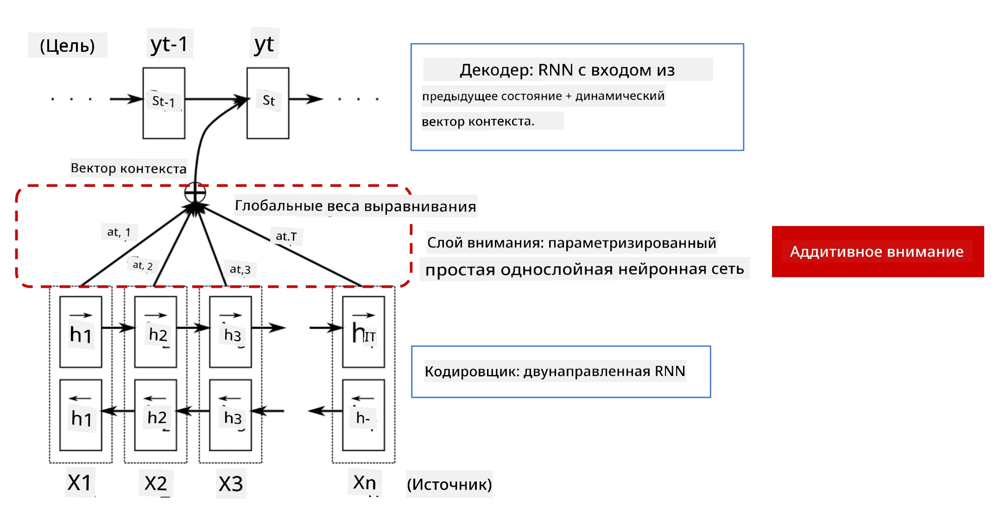
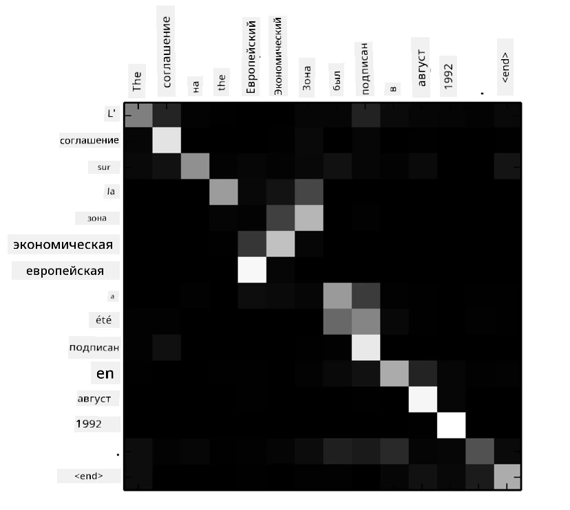
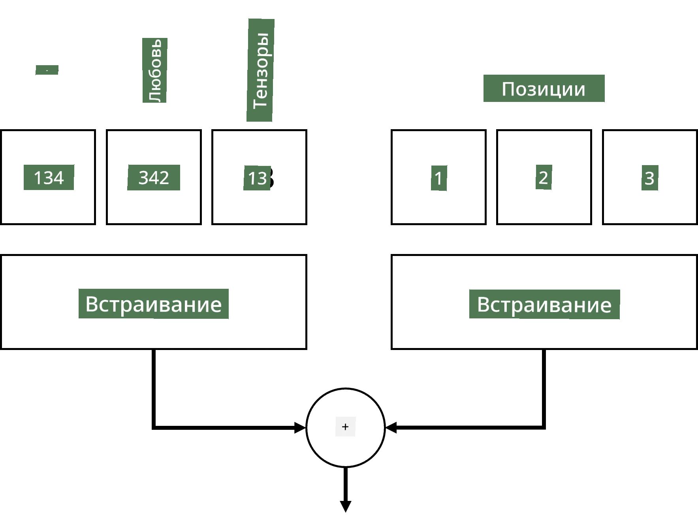
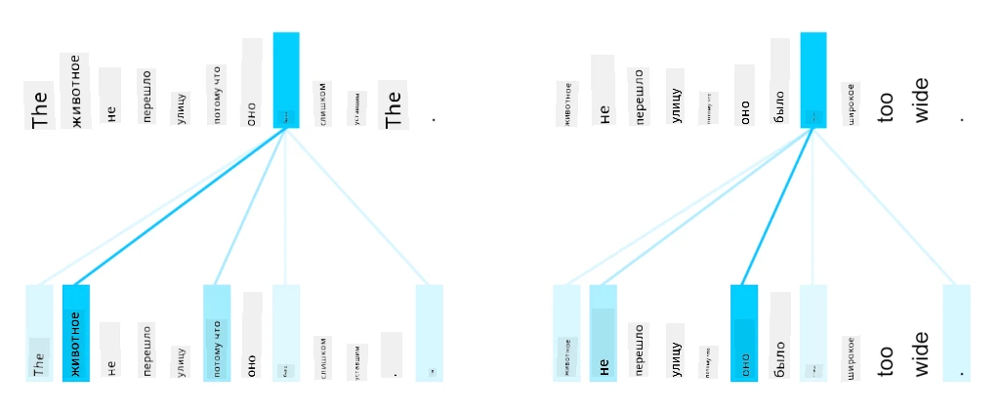
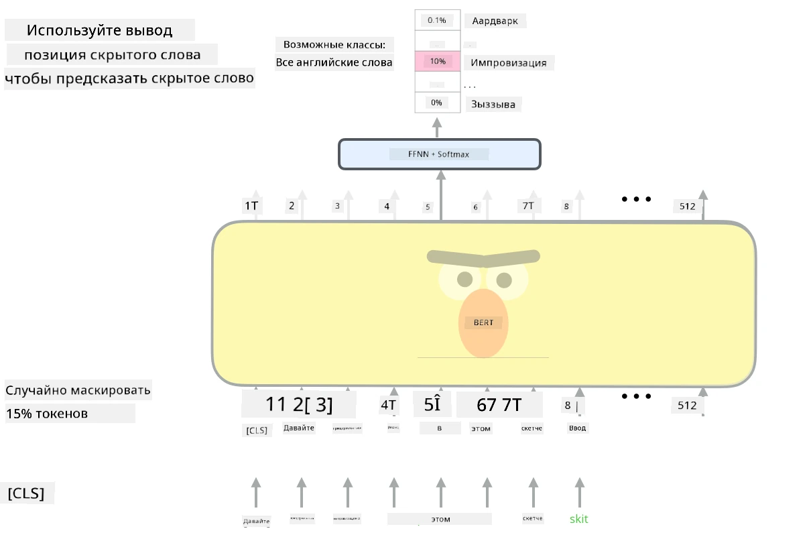

# Механизмы внимания и трансформеры

## [Предлекционный тест](https://ff-quizzes.netlify.app/en/ai/quiz/35)

Одной из самых важных задач в области обработки естественного языка (NLP) является **машинный перевод**, ключевая задача, лежащая в основе таких инструментов, как Google Translate. В этом разделе мы сосредоточимся на машинном переводе или, более широко, на любой задаче *последовательность-к-последовательности* (также называемой **трансдукцией предложений**).

С помощью RNN задачи последовательность-к-последовательности реализуются двумя рекуррентными сетями, где одна сеть, **кодировщик**, преобразует входную последовательность в скрытое состояние, а другая сеть, **декодировщик**, разворачивает это скрытое состояние в результат перевода. Однако у этого подхода есть несколько проблем:

* Финальное состояние сети-кодировщика с трудом запоминает начало предложения, что ухудшает качество модели для длинных предложений.
* Все слова в последовательности оказывают одинаковое влияние на результат. На практике же отдельные слова во входной последовательности часто имеют большее влияние на выходные последовательности, чем другие.

**Механизмы внимания** предоставляют способ взвешивания контекстного влияния каждого входного вектора на каждое предсказание выхода RNN. Это реализуется путем создания "ярлыков" между промежуточными состояниями входной RNN и выходной RNN. Таким образом, при генерации выходного символа yt мы учитываем все скрытые состояния входа hi, с различными весовыми коэффициентами &alpha;t,i.

> Модель кодировщик-декодировщик с механизмом аддитивного внимания из [Bahdanau et al., 2015](https://arxiv.org/pdf/1409.0473.pdf), цитируется из [этого блога](https://lilianweng.github.io/lil-log/2018/06/24/attention-attention.html)

Матрица внимания {&alpha;i,j} представляет степень, в которой определенные входные слова участвуют в генерации данного слова в выходной последовательности. Ниже приведен пример такой матрицы:

> Рисунок из [Bahdanau et al., 2015](https://arxiv.org/pdf/1409.0473.pdf) (Рис.3)

Механизмы внимания ответственны за значительную часть текущего или близкого к текущему уровня развития NLP. Однако добавление внимания значительно увеличивает количество параметров модели, что привело к проблемам масштабирования с RNN. Основным ограничением масштабирования RNN является то, что рекуррентная природа моделей затрудняет пакетную обработку и параллелизацию обучения. В RNN каждый элемент последовательности должен обрабатываться в последовательном порядке, что делает параллелизацию сложной.

> Рисунок из [Google's Blog](https://research.googleblog.com/2016/09/a-neural-network-for-machine.html)

Применение механизмов внимания в сочетании с этим ограничением привело к созданию современных моделей трансформеров, таких как BERT и Open-GPT3, которые мы знаем и используем сегодня.

## Модели трансформеров

Одна из ключевых идей трансформеров заключается в том, чтобы избежать последовательной природы RNN и создать модель, которая может быть параллелизована во время обучения. Это достигается за счет реализации двух идей:

* позиционное кодирование
* использование механизма самовнимания для захвата паттернов вместо RNN (или CNN) (именно поэтому статья, представляющая трансформеры, называется *[Attention is all you need](https://arxiv.org/abs/1706.03762)*)

### Позиционное кодирование/встраивание

Идея позиционного кодирования следующая. 
1. При использовании RNN относительное положение токенов представляется количеством шагов, и поэтому не требует явного представления. 
2. Однако при переходе к вниманию необходимо знать относительные позиции токенов в последовательности. 
3. Чтобы получить позиционное кодирование, мы дополняем нашу последовательность токенов последовательностью позиций токенов в последовательности (т.е. последовательностью чисел 0,1, ...).
4. Затем мы смешиваем позицию токена с вектором встраивания токена. Для преобразования позиции (целого числа) в вектор можно использовать разные подходы:

* Обучаемое встраивание, аналогичное встраиванию токенов. Это подход, который мы рассматриваем здесь. Мы применяем слои встраивания как к токенам, так и к их позициям, получая векторы встраивания одинаковых размеров, которые затем складываем.
* Фиксированная функция позиционного кодирования, предложенная в оригинальной статье.

> Изображение автора

Результат, который мы получаем с позиционным встраиванием, включает как оригинальный токен, так и его позицию в последовательности.

### Многоголовое самовнимание

Далее нам нужно захватить некоторые паттерны внутри нашей последовательности. Для этого трансформеры используют механизм **самовнимания**, который по сути является вниманием, применяемым к одной и той же последовательности как входу, так и выходу. Применение самовнимания позволяет учитывать **контекст** внутри предложения и видеть, какие слова взаимосвязаны. Например, это позволяет понять, к каким словам относятся местоимения, такие как *it*, и учитывать контекст:

> Изображение из [Google Blog](https://research.googleblog.com/2017/08/transformer-novel-neural-network.html)

В трансформерах используется **многоголовое внимание**, чтобы дать сети возможность захватывать несколько различных типов зависимостей, например, долгосрочные и краткосрочные отношения между словами, кореференции и другие.

[Блокнот TensorFlow](TransformersTF.ipynb) содержит больше деталей о реализации слоев трансформера.

### Внимание кодировщика-декодировщика

В трансформерах внимание используется в двух местах:

* Для захвата паттернов внутри входного текста с помощью самовнимания.
* Для выполнения перевода последовательности — это слой внимания между кодировщиком и декодировщиком.

Внимание кодировщика-декодировщика очень похоже на механизм внимания, используемый в RNN, как описано в начале этого раздела. Этот анимированный диаграмма объясняет роль внимания кодировщика-декодировщика.

Поскольку каждая входная позиция сопоставляется независимо с каждой выходной позицией, трансформеры могут лучше параллелизоваться, чем RNN, что позволяет создавать гораздо более крупные и выразительные языковые модели. Каждая голова внимания может быть использована для изучения различных отношений между словами, что улучшает задачи обработки естественного языка.

## BERT

**BERT** (Bidirectional Encoder Representations from Transformers) — это очень большая многослойная сеть трансформеров с 12 слоями для *BERT-base* и 24 для *BERT-large*. Модель сначала предварительно обучается на большом корпусе текстовых данных (WikiPedia + книги) с использованием обучения без учителя (предсказание замаскированных слов в предложении). Во время предварительного обучения модель усваивает значительные уровни понимания языка, которые затем можно использовать с другими наборами данных с помощью тонкой настройки. Этот процесс называется **передача обучения**.

> Изображение [источник](http://jalammar.github.io/illustrated-bert/)

## ✍️ Упражнения: Трансформеры

Продолжите обучение в следующих блокнотах:

* [Трансформеры в PyTorch](TransformersPyTorch.ipynb)
* [Трансформеры в TensorFlow](TransformersTF.ipynb)

## Заключение

В этом уроке вы узнали о трансформерах и механизмах внимания — всех необходимых инструментах в наборе NLP. Существует множество вариаций архитектур трансформеров, включая BERT, DistilBERT, BigBird, OpenGPT3 и другие, которые можно тонко настроить. Пакет [HuggingFace](https://github.com/huggingface/) предоставляет репозиторий для обучения многих из этих архитектур как с PyTorch, так и с TensorFlow.

## 🚀 Задание

## [Послетекционный тест](https://ff-quizzes.netlify.app/en/ai/quiz/36)

## Обзор и самостоятельное изучение

* [Пост в блоге](https://mchromiak.github.io/articles/2017/Sep/12/Transformer-Attention-is-all-you-need/), объясняющий классическую статью [Attention is all you need](https://arxiv.org/abs/1706.03762) о трансформерах.
* [Серия постов в блоге](https://towardsdatascience.com/transformers-explained-visually-part-1-overview-of-functionality-95a6dd460452) о трансформерах, подробно объясняющая архитектуру.

## [Задание](assignment.md)

---

