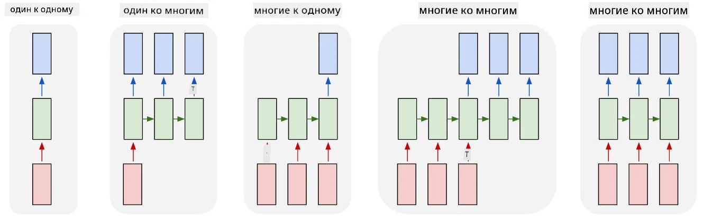

# Распознавание именованных сущностей

До сих пор мы в основном сосредотачивались на одной задаче обработки естественного языка (NLP) — классификации. Однако существуют и другие задачи NLP, которые можно решать с помощью нейронных сетей. Одна из таких задач — **[Распознавание именованных сущностей](https://wikipedia.org/wiki/Named-entity_recognition)** (NER), которая заключается в выявлении конкретных сущностей в тексте, таких как места, имена людей, временные интервалы, химические формулы и многое другое.

## [Викторина перед лекцией](https://ff-quizzes.netlify.app/en/ai/quiz/37)

## Пример использования NER

Представьте, что вы хотите разработать чат-бота, подобного Amazon Alexa или Google Assistant. Интеллектуальные чат-боты работают, *понимая* запрос пользователя с помощью классификации текста во входной фразе. Результатом этой классификации является так называемый **интент**, который определяет, что должен сделать чат-бот.

> Изображение автора

Однако пользователь может указать некоторые параметры в своей фразе. Например, при запросе прогноза погоды он может уточнить местоположение или дату. Бот должен уметь распознавать эти сущности и заполнять соответствующие параметры перед выполнением действия. Именно здесь и используется NER.

> ✅ Другой пример — [анализ научных медицинских статей](https://soshnikov.com/science/analyzing-medical-papers-with-azure-and-text-analytics-for-health/). Одной из главных задач является поиск специфических медицинских терминов, таких как названия болезней и медицинских препаратов. Если небольшое количество болезней можно извлечь с помощью поиска подстрок, то для более сложных сущностей, таких как химические соединения и названия лекарств, требуется более сложный подход.

## NER как классификация токенов

Модели NER по сути являются моделями **классификации токенов**, так как для каждого входного токена нужно определить, относится ли он к какой-либо сущности, и если да, то к какому классу сущностей.

Рассмотрим следующий заголовок статьи:

**Регургитация трикуспидального клапана** и **карбонат лития** **токсичность** у новорожденного.

Сущности здесь:

* Регургитация трикуспидального клапана — это заболевание (`DIS`)
* Карбонат лития — это химическое вещество (`CHEM`)
* Токсичность — это тоже заболевание (`DIS`)

Обратите внимание, что одна сущность может охватывать несколько токенов. И, как в данном случае, нам нужно различать две последовательные сущности. Поэтому обычно используются два класса для каждой сущности: один указывает на первый токен сущности (часто используется префикс `B-`, от **b**eginning), а другой — на продолжение сущности (`I-`, от **i**nner token). Для всех **о**стальных токенов используется класс `O`. Такое тегирование токенов называется [BIO-тегированием](https://en.wikipedia.org/wiki/Inside%E2%80%93outside%E2%80%93beginning_(tagging)) (или IOB). После тегирования наш заголовок будет выглядеть так:

Token | Tag
------|-----
Tricuspid | B-DIS
valve | I-DIS
regurgitation | I-DIS
and | O
lithium | B-CHEM
carbonate | I-CHEM
toxicity | B-DIS
in | O
a | O
newborn | O
infant | O
. | O

Поскольку нам нужно установить однозначное соответствие между токенами и классами, мы можем обучить правую **многие-ко-многим** архитектуру нейронной сети из следующего изображения:

> *Изображение из [этой статьи](http://karpathy.github.io/2015/05/21/rnn-effectiveness/) Андрея Карпати ([Andrej Karpathy](http://karpathy.github.io/)). Модели классификации токенов для NER соответствуют правой архитектуре на этом изображении.*

## Обучение моделей NER

Поскольку модель NER по сути является моделью классификации токенов, для этой задачи можно использовать RNN, с которыми мы уже знакомы. В этом случае каждый блок рекуррентной сети будет возвращать ID токена. Следующий пример ноутбука показывает, как обучить LSTM для классификации токенов.

## ✍️ Примеры ноутбуков: NER

Продолжите обучение с помощью следующего ноутбука:

* [NER с TensorFlow](NER-TF.ipynb)

## Заключение

Модель NER — это **модель классификации токенов**, что означает, что она может использоваться для выполнения классификации токенов. Это очень распространённая задача в NLP, которая помогает распознавать конкретные сущности в тексте, включая места, имена, даты и многое другое.

## 🚀 Задание

Выполните задание по ссылке ниже, чтобы обучить модель распознавания именованных сущностей для медицинских терминов, а затем попробуйте её на другом наборе данных.

## [Викторина после лекции](https://ff-quizzes.netlify.app/en/ai/quiz/38)

## Обзор и самостоятельное изучение

Прочитайте статью [The Unreasonable Effectiveness of Recurrent Neural Networks](http://karpathy.github.io/2015/05/21/rnn-effectiveness/) и изучите раздел "Further Reading" в этой статье, чтобы углубить свои знания.

## [Задание](lab/README.md)

В задании к этому уроку вам нужно будет обучить модель распознавания медицинских сущностей. Вы можете начать с обучения модели LSTM, как описано в этом уроке, а затем перейти к использованию трансформера BERT. Прочитайте [инструкции](lab/README.md), чтобы узнать все детали.

---

