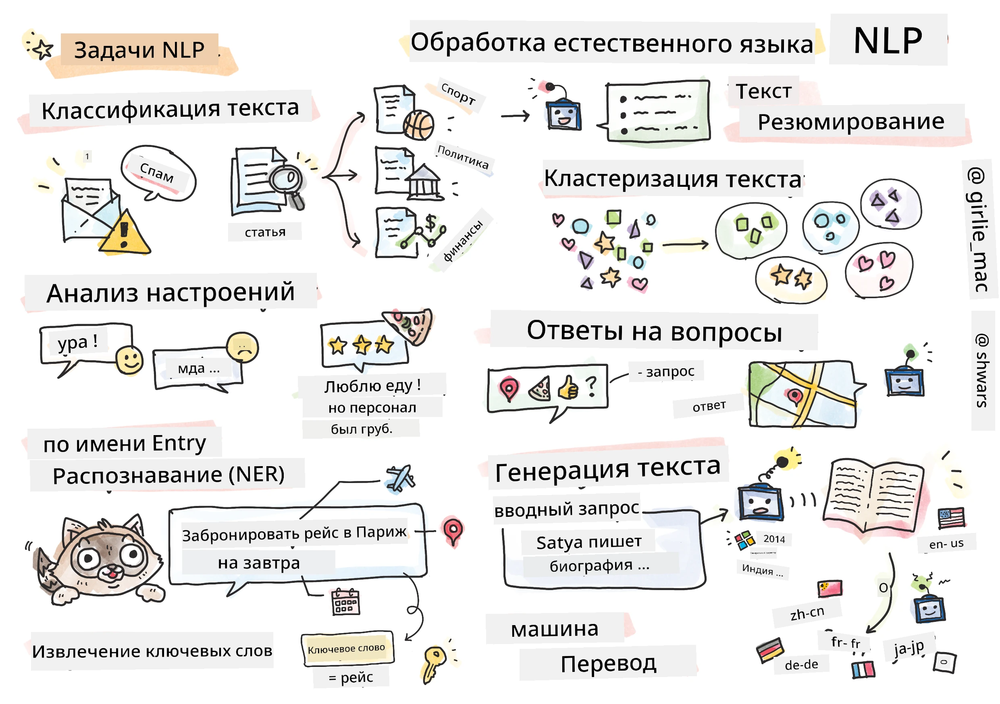

# Обработка естественного языка



В этом разделе мы сосредоточимся на использовании нейронных сетей для решения задач, связанных с **обработкой естественного языка (NLP)**. Существует множество задач NLP, которые мы хотим, чтобы компьютеры могли решать:

* **Классификация текста** — это типичная задача классификации, связанная с текстовыми последовательностями. Примеры включают классификацию электронных писем как спам или не спам, или категоризацию статей по темам, таким как спорт, бизнес, политика и т.д. Также, при разработке чат-ботов часто необходимо понимать, что пользователь хотел сказать — в этом случае мы имеем дело с **классификацией намерений**. Часто в классификации намерений приходится работать с большим количеством категорий.
* **Анализ тональности** — это типичная задача регрессии, где необходимо присвоить числовое значение (тональность), соответствующее тому, насколько положительным или отрицательным является смысл предложения. Более сложная версия анализа тональности — это **анализ тональности на основе аспектов** (ABSA), где тональность присваивается не всему предложению, а его отдельным частям (аспектам), например: *В этом ресторане мне понравилась кухня, но атмосфера была ужасной*.
* **Распознавание именованных сущностей** (NER) — это задача извлечения определенных сущностей из текста. Например, нужно понять, что в фразе *Мне нужно лететь в Париж завтра* слово *завтра* относится к ДАТЕ, а *Париж* — это ЛОКАЦИЯ.  
* **Извлечение ключевых слов** похоже на NER, но здесь необходимо автоматически извлекать слова, важные для смысла предложения, без предварительного обучения для конкретных типов сущностей.
* **Кластеризация текста** может быть полезна, когда нужно сгруппировать похожие предложения, например, похожие запросы в разговорах технической поддержки.
* **Ответы на вопросы** — это способность модели отвечать на конкретный вопрос. Модель получает текстовый отрывок и вопрос в качестве входных данных, и должна указать место в тексте, где содержится ответ на вопрос (или, иногда, сгенерировать текст ответа).
* **Генерация текста** — это способность модели создавать новый текст. Это можно рассматривать как задачу классификации, где предсказывается следующая буква/слово на основе некоторого *текстового запроса*. Продвинутые модели генерации текста, такие как GPT-3, способны решать другие задачи NLP, такие как классификация, используя технику [программирования с подсказками](https://towardsdatascience.com/software-3-0-how-prompting-will-change-the-rules-of-the-game-a982fbfe1e0) или [инженерии подсказок](https://medium.com/swlh/openai-gpt-3-and-prompt-engineering-dcdc2c5fcd29).
* **Суммаризация текста** — это техника, когда мы хотим, чтобы компьютер "прочитал" длинный текст и кратко изложил его в нескольких предложениях.
* **Машинный перевод** можно рассматривать как комбинацию понимания текста на одном языке и генерации текста на другом.

Изначально большинство задач NLP решались с использованием традиционных методов, таких как грамматики. Например, в машинном переводе использовались парсеры для преобразования исходного предложения в синтаксическое дерево, затем извлекались более высокоуровневые семантические структуры для представления смысла предложения, и на основе этого смысла и грамматики целевого языка генерировался результат. В настоящее время многие задачи NLP более эффективно решаются с использованием нейронных сетей.

> Многие классические методы NLP реализованы в библиотеке Python [Natural Language Processing Toolkit (NLTK)](https://www.nltk.org). Существует отличная [книга по NLTK](https://www.nltk.org/book/), доступная онлайн, которая охватывает, как различные задачи NLP могут быть решены с помощью NLTK.

В нашем курсе мы в основном будем сосредоточены на использовании нейронных сетей для NLP, и будем использовать NLTK, где это необходимо.

Мы уже изучили использование нейронных сетей для работы с табличными данными и изображениями. Основное отличие этих типов данных от текста заключается в том, что текст — это последовательность переменной длины, тогда как размер входных данных в случае изображений известен заранее. Хотя сверточные сети могут извлекать шаблоны из входных данных, шаблоны в тексте более сложны. Например, отрицание может быть отделено от субъекта произвольным количеством слов (например, *Мне не нравятся апельсины* vs. *Мне не нравятся эти большие красочные вкусные апельсины*), и это все равно должно интерпретироваться как один шаблон. Таким образом, для обработки языка необходимо вводить новые типы нейронных сетей, такие как *рекуррентные сети* и *трансформеры*.

## Установка библиотек

Если вы используете локальную установку Python для выполнения этого курса, вам может понадобиться установить все необходимые библиотеки для NLP с помощью следующих команд:

**Для PyTorch**
```bash
pip install -r requirements-torch.txt
```
**Для TensorFlow**
```bash
pip install -r requirements-tf.txt
```

> Вы можете попробовать NLP с TensorFlow на [Microsoft Learn](https://docs.microsoft.com/learn/modules/intro-natural-language-processing-tensorflow/?WT.mc_id=academic-77998-cacaste)

## Предупреждение о GPU

В этом разделе в некоторых примерах мы будем обучать довольно крупные модели.
* **Используйте компьютер с поддержкой GPU**: Рекомендуется запускать ваши ноутбуки на компьютере с поддержкой GPU, чтобы сократить время ожидания при работе с крупными моделями.
* **Ограничения памяти GPU**: Работа на GPU может привести к ситуациям, когда у вас закончится память GPU, особенно при обучении крупных моделей.
* **Потребление памяти GPU**: Количество памяти GPU, потребляемой во время обучения, зависит от различных факторов, включая размер минибатча.
* **Минимизируйте размер минибатча**: Если вы столкнулись с проблемами памяти GPU, попробуйте уменьшить размер минибатча в вашем коде как возможное решение.
* **Освобождение памяти GPU в TensorFlow**: Старые версии TensorFlow могут некорректно освобождать память GPU при обучении нескольких моделей в одном ядре Python. Чтобы эффективно управлять использованием памяти GPU, вы можете настроить TensorFlow на выделение памяти GPU только по мере необходимости.
* **Включение кода**: Чтобы настроить TensorFlow на увеличение выделения памяти GPU только при необходимости, включите следующий код в ваши ноутбуки:

```python
physical_devices = tf.config.list_physical_devices('GPU') 
if len(physical_devices)>0:
    tf.config.experimental.set_memory_growth(physical_devices[0], True) 
```

Если вас интересует изучение NLP с точки зрения классического машинного обучения, посетите [этот набор уроков](https://github.com/microsoft/ML-For-Beginners/tree/main/6-NLP)

## В этом разделе
В этом разделе мы изучим:

* [Представление текста в виде тензоров](13-TextRep/README.md)
* [Словарные эмбеддинги](14-Emdeddings/README.md)
* [Моделирование языка](15-LanguageModeling/README.md)
* [Рекуррентные нейронные сети](16-RNN/README.md)
* [Генеративные сети](17-GenerativeNetworks/README.md)
* [Трансформеры](18-Transformers/README.md)

**Отказ от ответственности**:  
Этот документ был переведен с использованием сервиса автоматического перевода [Co-op Translator](https://github.com/Azure/co-op-translator). Несмотря на наши усилия обеспечить точность, автоматические переводы могут содержать ошибки или неточности. Оригинальный документ на его родном языке следует считать авторитетным источником. Для получения критически важной информации рекомендуется профессиональный перевод человеком. Мы не несем ответственности за любые недоразумения или неправильные интерпретации, возникающие в результате использования данного перевода.