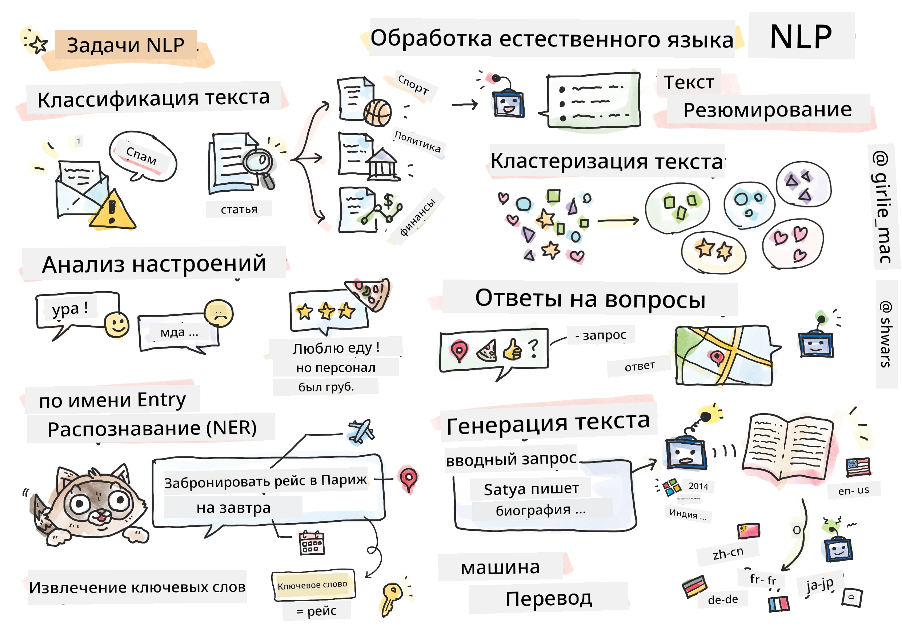

# Обработка Естественного Языка



В этом разделе мы сосредоточимся на использовании нейронных сетей для решения задач, связанных с **обработкой естественного языка (НЛП)**. Существует много задач НЛП, которые мы хотим, чтобы компьютеры могли решать:

* **Классификация текста** — это типичная задача классификации, связанная с текстовыми последовательностями. Примеры включают классификацию электронных писем как спам или не спам, или категоризацию статей по темам: спорт, бизнес, политика и т.д. Также при разработке чат-ботов часто нужно понимать, что хочет сказать пользователь — в этом случае мы имеем дело с **классификацией намерений**. Часто при классификации намерений требуется работать с большим количеством категорий.
* **Анализ сентимента** — это типичная задача регрессии, где необходимо присвоить число (сентимент), отражающее насколько положительно/отрицательно значение предложения. Более продвинутым видом анализа сентимента является **аспектно-ориентированный анализ сентимента** (ABSA), когда сентимент присваивается не всему предложению, а его разным частям (аспектам), например: *В этом ресторане мне понравилась кухня, но атмосфера была ужасной*.
* **Распознавание именованных сущностей** (NER) — это задача извлечения определённых сущностей из текста. Например, нужно понять, что в фразе *Мне нужно лететь в Париж завтра* слово *завтра* относится к ДАТЕ, а *Париж* — к ЛОКАЦИИ.  
* **Извлечение ключевых слов** похоже на NER, но требуется автоматически выделять слова, важные для смысла предложения, без предварительного обучения на конкретных типах сущностей.
* **Кластеризация текста** может быть полезна, если нужно сгруппировать похожие предложения, например, схожие запросы в технической поддержке.
* **Ответы на вопросы** — это способность модели отвечать на конкретный вопрос. Модель получает текстовый фрагмент и вопрос на вход, и должна указать место в тексте, где содержится ответ (или, иногда, сгенерировать текст ответа).
* **Генерация текста** — способность модели создавать новый текст. Это можно рассматривать как задачу классификации, которая предсказывает следующую букву/слово на основе некоторого *текстового примера*. Продвинутые модели генерации текста, такие как GPT-3, могут решать и другие задачи НЛП, например классификацию, с помощью техники, называемой [prompt programming](https://towardsdatascience.com/software-3-0-how-prompting-will-change-the-rules-of-the-game-a982fbfe1e0) или [prompt engineering](https://medium.com/swlh/openai-gpt-3-and-prompt-engineering-dcdc2c5fcd29)
* **Суммирование текста** — это метод, когда мы хотим, чтобы компьютер «прочитал» длинный текст и суммировал его несколькими предложениями.
* **Машинный перевод** можно рассматривать как комбинацию понимания текста на одном языке и генерации текста на другом языке.

Изначально большинство задач НЛП решалось с помощью традиционных методов, таких как грамматики. Например, в машинном переводе использовались парсеры для преобразования исходного предложения в синтаксическое дерево, затем извлекались более высокоуровневые семантические структуры для представления смысла предложения, и на основе этого смысла и грамматики целевого языка генерировался результат. В настоящее время многие задачи НЛП эффективнее решаются с использованием нейронных сетей.

> Многие классические методы НЛП реализованы в библиотеке Python [Natural Language Processing Toolkit (NLTK)](https://www.nltk.org). В интернете доступна отличная [книга по NLTK](https://www.nltk.org/book/), которая раскрывает, как решать различные задачи НЛП с помощью NLTK.

В нашем курсе мы в основном будем сосредоточены на использовании нейронных сетей для НЛП и будем использовать NLTK там, где это нужно.

Мы уже изучили использование нейронных сетей для работы с табличными данными и изображениями. Главное отличие между этими типами данных и текстом заключается в том, что текст — это последовательность переменной длины, тогда как размер входа в случае изображений известен заранее. Хотя сверточные сети могут извлекать паттерны из входных данных, паттерны в тексте более сложные. Например, отрицание может быть отделено от подлежащего произвольным числом слов (например, *Мне не нравятся апельсины* против *Мне не нравятся эти большие цветные вкусные апельсины*), и это всё равно должно интерпретироваться как один паттерн. Поэтому для обработки языка необходимо вводить новые типы нейронных сетей, такие как *рекуррентные сети* и *трансформеры*.

## Установка библиотек

Если вы используете локальную установку Python для изучения этого курса, вам может понадобиться установить все необходимые библиотеки для НЛП с помощью следующих команд:

**Для PyTorch**
```bash
pip install -r requirements-pytorch.txt
```
**Для TensorFlow**
```bash
pip install -r requirements-tf.txt
```

> Вы можете попробовать НЛП с TensorFlow на [Microsoft Learn](https://docs.microsoft.com/learn/modules/intro-natural-language-processing-tensorflow/?WT.mc_id=academic-77998-cacaste)

## Предупреждение по поводу GPU

В этом разделе в некоторых примерах мы будем обучать довольно большие модели.
* **Используйте компьютер с поддержкой GPU**: рекомендуется запускать ноутбуки на компьютере с GPU, чтобы сократить время ожидания при работе с большими моделями.
* **Ограничения памяти GPU**: при работе на GPU могут возникать ситуации, когда заканчивается память GPU, особенно при обучении больших моделей.
* **Потребление памяти GPU**: количество памяти GPU, используемой во время обучения, зависит от различных факторов, включая размер мини-батча.
* **Минимизируйте размер мини-батча**: если возникают проблемы с памятью GPU, рассмотрите возможность уменьшения размера мини-батча в вашем коде как возможное решение.
* **Освобождение памяти GPU в TensorFlow**: старые версии TensorFlow могут некорректно освобождать память GPU при обучении нескольких моделей внутри одного ядра Python. Чтобы эффективно управлять использованием памяти GPU, можно настроить TensorFlow так, чтобы он выделял память на GPU только по мере необходимости.
* **Включение кода**: чтобы настроить TensorFlow на выделение памяти GPU только по мере роста потребности, включите следующий код в ваши ноутбуки:

```python
physical_devices = tf.config.list_physical_devices('GPU') 
if len(physical_devices)>0:
    tf.config.experimental.set_memory_growth(physical_devices[0], True) 
```

Если вам интересен классический подход к НЛП с точки зрения машинного обучения, посетите [этот набор уроков](https://github.com/microsoft/ML-For-Beginners/tree/main/6-NLP)

## В этом разделе
В этом разделе мы изучим:

* [Представление текста в виде тензоров](13-TextRep/README.md)
* [Встраивания слов](14-Embeddings/README.md)
* [Моделирование языка](15-LanguageModeling/README.md)
* [Рекуррентные нейронные сети](16-RNN/README.md)
* [Генеративные сети](17-GenerativeNetworks/README.md)
* [Трансформеры](18-Transformers/README.md)

---

<!-- CO-OP TRANSLATOR DISCLAIMER START -->
**Отказ от ответственности**:
Этот документ был переведен с использованием сервиса машинного перевода [Co-op Translator](https://github.com/Azure/co-op-translator). Несмотря на наши усилия по обеспечению точности, имейте в виду, что автоматический перевод может содержать ошибки или неточности. Оригинальный документ на его исходном языке следует считать авторитетным источником. Для получения критически важной информации рекомендуется обратиться к профессиональному человеческому переводу. Мы не несем ответственности за любые недоразумения или неправильные толкования, возникшие в результате использования этого перевода.
<!-- CO-OP TRANSLATOR DISCLAIMER END -->