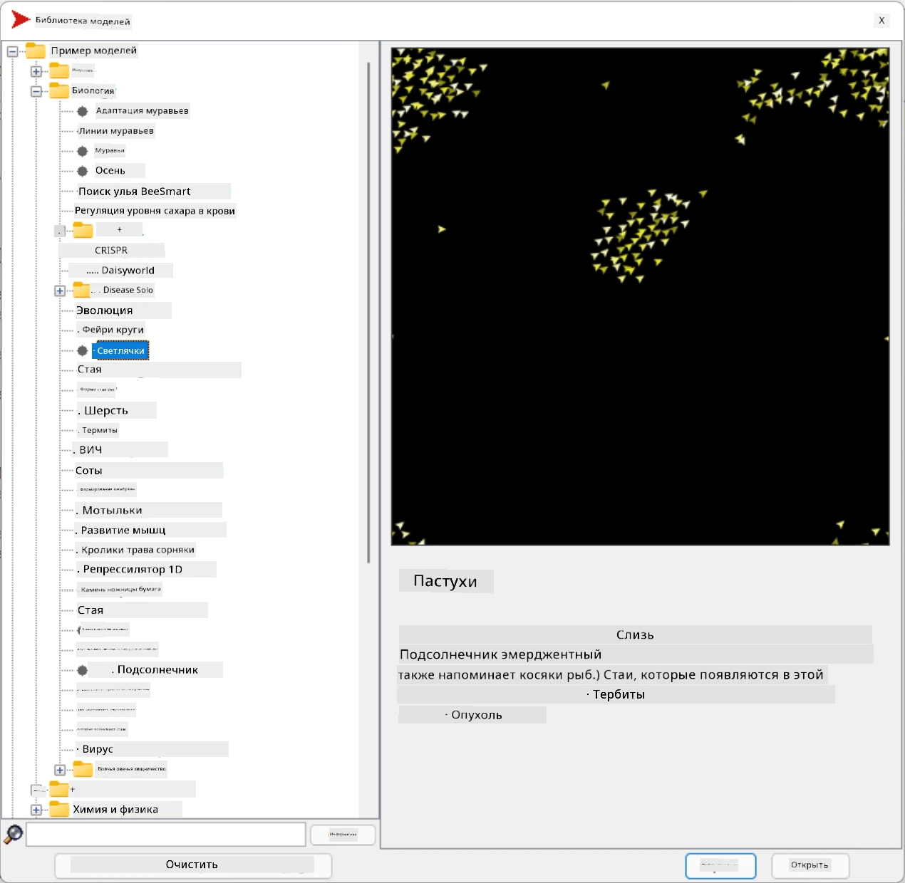
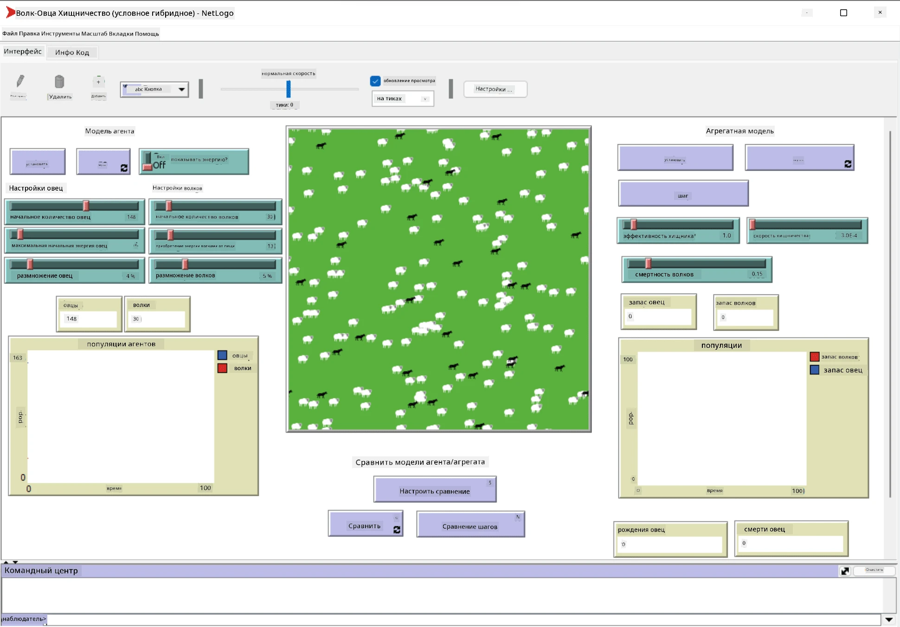

# Мультиагентные системы

Одним из возможных способов достижения интеллекта является так называемый **эмерджентный** (или **синергетический**) подход, который основан на том, что совокупное поведение множества относительно простых агентов может привести к более сложному (или интеллектуальному) поведению системы в целом. Теоретически это основано на принципах [Коллективного интеллекта](https://en.wikipedia.org/wiki/Collective_intelligence), [Эмерджентизма](https://en.wikipedia.org/wiki/Global_brain) и [Эволюционной кибернетики](https://en.wikipedia.org/wiki/Global_brain), которые утверждают, что системы более высокого уровня приобретают дополнительную ценность, если они правильно объединены из систем более низкого уровня (так называемый *принцип перехода к метасистеме*).

## [Тест перед лекцией](https://ff-quizzes.netlify.app/en/ai/quiz/45)

Направление **мультиагентных систем** появилось в ИИ в 1990-х годах как ответ на рост Интернета и распределенных систем. Один из классических учебников по ИИ, [Artificial Intelligence: A Modern Approach](https://en.wikipedia.org/wiki/Artificial_Intelligence:_A_Modern_Approach), рассматривает классический ИИ с точки зрения мультиагентных систем.

Центральным понятием мультиагентного подхода является **агент** — сущность, которая существует в некоторой **среде**, которую она может воспринимать и на которую может воздействовать. Это очень широкое определение, и существует множество различных типов и классификаций агентов:

* По способности к рассуждению:
   - **Реактивные** агенты обычно имеют простое поведение типа "запрос-ответ".
   - **Делиберативные** агенты используют логическое рассуждение и/или возможности планирования.
* По месту выполнения кода агента:
   - **Статические** агенты работают на выделенном узле сети.
   - **Мобильные** агенты могут перемещать свой код между узлами сети.
* По поведению:
   - **Пассивные агенты** не имеют конкретных целей. Такие агенты могут реагировать на внешние стимулы, но не инициируют действия самостоятельно.
   - **Активные агенты** имеют цели, которые они преследуют.
   - **Когнитивные агенты** включают сложное планирование и рассуждение.

Мультиагентные системы сегодня используются в ряде приложений:

* В играх многие персонажи, не управляемые игроком, используют некоторую форму ИИ и могут считаться интеллектуальными агентами.
* В видеопроизводстве рендеринг сложных 3D-сцен, включающих толпы, обычно выполняется с использованием мультиагентного моделирования.
* В моделировании систем мультиагентный подход используется для симуляции поведения сложной модели. Например, мультиагентный подход успешно применялся для прогнозирования распространения COVID-19 по всему миру. Аналогичный подход можно использовать для моделирования городского трафика и анализа реакции на изменения правил дорожного движения.
* В сложных автоматизированных системах каждое устройство может действовать как независимый агент, что делает всю систему менее монолитной и более устойчивой.

Мы не будем углубляться в мультиагентные системы, но рассмотрим один пример **мультиагентного моделирования**.

## NetLogo

[NetLogo](https://ccl.northwestern.edu/netlogo/) — это среда для мультиагентного моделирования, основанная на модифицированной версии языка программирования [Logo](https://en.wikipedia.org/wiki/Logo_(programming_language)). Этот язык был разработан для обучения детей концепциям программирования и позволяет управлять агентом, называемым **черепашкой**, который может двигаться, оставляя след. Это позволяет создавать сложные геометрические фигуры, что является очень наглядным способом понять поведение агента.

В NetLogo мы можем создать множество черепашек с помощью команды `create-turtles`. Затем мы можем командовать всеми черепашками выполнять определенные действия (в примере ниже — двигаться вперед на 10 пунктов):

```
create-turtles 10
ask turtles [
  forward 10
]
```

Конечно, неинтересно, когда все черепашки делают одно и то же, поэтому мы можем `ask` группы черепашек, например, тех, которые находятся вблизи определенной точки. Мы также можем создавать черепашек разных *пород* с помощью команды `breed [cats cat]`. Здесь `cat` — это название породы, и нам нужно указать как единственное, так и множественное число слова, поскольку разные команды используют разные формы для ясности.

> ✅ Мы не будем изучать язык NetLogo, но вы можете посетить замечательный ресурс [Beginner's Interactive NetLogo Dictionary](https://ccl.northwestern.edu/netlogo/bind/), если хотите узнать больше.

Вы можете [скачать](https://ccl.northwestern.edu/netlogo/download.shtml) и установить NetLogo, чтобы попробовать его.

### Библиотека моделей

Замечательной особенностью NetLogo является наличие библиотеки готовых моделей, которые вы можете попробовать. Перейдите в **File &rightarrow; Models Library**, и у вас будет множество категорий моделей на выбор.



> Скриншот библиотеки моделей от Дмитрия Сошникова

Вы можете открыть одну из моделей, например **Biology &rightarrow; Flocking**.

### Основные принципы

После открытия модели вы попадете на главный экран NetLogo. Вот пример модели, описывающей популяцию волков и овец при ограниченных ресурсах (трава).



> Скриншот от Дмитрия Сошникова

На этом экране вы можете увидеть:

* Раздел **Interface**, который содержит:
  - Основное поле, где живут все агенты
  - Различные элементы управления: кнопки, ползунки и т.д.
  - Графики, которые можно использовать для отображения параметров симуляции
* Вкладку **Code**, которая содержит редактор, где вы можете писать программу на NetLogo

В большинстве случаев интерфейс будет иметь кнопку **Setup**, которая инициализирует состояние симуляции, и кнопку **Go**, которая запускает выполнение. Эти кнопки обрабатываются соответствующими обработчиками в коде, которые выглядят следующим образом:

```
to go [
...
]
```

Мир NetLogo состоит из следующих объектов:

* **Агенты** (черепашки), которые могут перемещаться по полю и выполнять действия. Вы управляете агентами с помощью синтаксиса `ask turtles [...]`, и код в скобках выполняется всеми агентами в *режиме черепашки*.
* **Патчи** — это квадратные области поля, на которых живут агенты. Вы можете обращаться ко всем агентам на одном патче или изменять цвета патчей и некоторые другие свойства. Вы также можете `ask patches` выполнять действия.
* **Наблюдатель** — уникальный агент, который управляет миром. Все обработчики кнопок выполняются в *режиме наблюдателя*.

> ✅ Прелесть мультиагентной среды заключается в том, что код, который выполняется в режиме черепашки или патча, выполняется одновременно всеми агентами параллельно. Таким образом, написав немного кода и запрограммировав поведение отдельного агента, вы можете создать сложное поведение всей симуляционной системы.

### Flocking

В качестве примера мультиагентного поведения рассмотрим **[Flocking](https://en.wikipedia.org/wiki/Flocking_(behavior))**. Flocking — это сложный паттерн, очень похожий на то, как стаи птиц летают. Наблюдая за их полетом, можно подумать, что они следуют какому-то коллективному алгоритму или обладают формой *коллективного интеллекта*. Однако это сложное поведение возникает, когда каждый отдельный агент (в данном случае *птица*) наблюдает только за другими агентами на коротком расстоянии и следует трем простым правилам:

* **Выравнивание** — направляется к среднему направлению соседних агентов.
* **Сцепление** — стремится к средней позиции соседей (*долгосрочное притяжение*).
* **Разделение** — при слишком близком приближении к другим птицам старается отдалиться (*краткосрочное отталкивание*).

Вы можете запустить пример flocking и наблюдать за поведением. Вы также можете настроить параметры, такие как *степень разделения* или *радиус обзора*, который определяет, как далеко каждая птица может видеть. Обратите внимание, что если вы уменьшите радиус обзора до 0, все птицы станут "слепыми", и flocking прекратится. Если уменьшить разделение до 0, все птицы соберутся в одну линию.

> ✅ Переключитесь на вкладку **Code** и посмотрите, где три правила flocking (выравнивание, сцепление и разделение) реализованы в коде. Обратите внимание, как мы обращаемся только к тем агентам, которые находятся в поле зрения.

### Другие модели для изучения

Есть еще несколько интересных моделей, которые вы можете попробовать:

* **Art &rightarrow; Fireworks** показывает, как фейерверк можно рассматривать как коллективное поведение отдельных потоков огня.
* **Social Science &rightarrow; Traffic Basic** и **Social Science &rightarrow; Traffic Grid** демонстрируют модель городского трафика в 1D и 2D сетке с или без светофоров. Каждая машина в симуляции следует следующим правилам:
   - Если пространство перед ней свободно — ускоряться (до определенной максимальной скорости).
   - Если видит препятствие впереди — тормозить (и вы можете настроить, как далеко водитель может видеть).
* **Social Science &rightarrow; Party** показывает, как люди группируются на коктейльной вечеринке. Вы можете найти комбинацию параметров, которая приводит к быстрейшему увеличению счастья группы.

Как видно из этих примеров, мультиагентные симуляции могут быть полезным способом понять поведение сложной системы, состоящей из индивидуумов, которые следуют одинаковой или схожей логике. Это также может быть использовано для управления виртуальными агентами, такими как [NPC](https://en.wikipedia.org/wiki/NPC) в компьютерных играх или агентами в 3D-анимированных мирах.

## Делиберативные агенты

Описанные выше агенты очень просты, они реагируют на изменения в среде, используя некоторый алгоритм. Таким образом, они являются **реактивными агентами**. Однако иногда агенты могут рассуждать и планировать свои действия, в этом случае их называют **делиберативными**.

Типичным примером может быть персональный агент, который получает от человека инструкцию забронировать тур. Предположим, что в интернете есть множество агентов, которые могут ему помочь. Он должен связаться с другими агентами, чтобы узнать, какие рейсы доступны, какие цены на отели в разные даты, и попытаться договориться о лучшей цене. Когда план отпуска будет завершен и подтвержден владельцем, агент может приступить к бронированию.

Для этого агенты должны **общаться**. Для успешного общения им необходимо:

* Некоторые **стандартные языки для обмена знаниями**, такие как [Knowledge Interchange Format](https://en.wikipedia.org/wiki/Knowledge_Interchange_Format) (KIF) и [Knowledge Query and Manipulation Language](https://en.wikipedia.org/wiki/Knowledge_Query_and_Manipulation_Language) (KQML). Эти языки разработаны на основе [теории речевых актов](https://en.wikipedia.org/wiki/Speech_act).
* Эти языки также должны включать **протоколы для переговоров**, основанные на различных **типах аукционов**.
* **Общая онтология**, чтобы агенты могли ссылаться на одни и те же концепции, понимая их семантику.
* Способ **обнаружения**, что могут делать разные агенты, также основанный на некоторой онтологии.

Делиберативные агенты гораздо сложнее реактивных, потому что они не только реагируют на изменения в среде, но и должны уметь *инициировать* действия. Одной из предложенных архитектур для делиберативных агентов является так называемый агент "Верования-Желания-Намерения" (BDI):

* **Верования** формируют набор знаний об окружающей среде агента. Они могут быть структурированы как база знаний или набор правил, которые агент может применять к конкретной ситуации в среде.
* **Желания** определяют, чего агент хочет достичь, то есть его цели. Например, цель персонального помощника выше — забронировать тур, а цель агента отеля — максимизировать прибыль.
* **Намерения** — это конкретные действия, которые агент планирует для достижения своих целей. Действия обычно изменяют среду и вызывают общение с другими агентами.

Существуют платформы для создания мультиагентных систем, такие как [JADE](https://jade.tilab.com/). [Эта статья](https://arxiv.org/ftp/arxiv/papers/2007/2007.08961.pdf) содержит обзор мультиагентных платформ, а также краткую историю мультиагентных систем и их различных сценариев использования.

## Заключение

Мультиагентные системы могут принимать самые разные формы и использоваться в самых разных приложениях. 
Они все стремятся сосредоточиться на более простом поведении отдельного агента и достигать более сложного поведения всей системы благодаря **синергетическому эффекту**.

## 🚀 Задание

Примените этот урок к реальному миру и попробуйте концептуализировать мультиагентную систему, которая может решить проблему. Что, например, должна делать мультиагентная система, чтобы оптимизировать маршрут школьного автобуса? Как она могла бы работать в пекарне?

## [Тест после лекции](https://ff-quizzes.netlify.app/en/ai/quiz/46)

## Обзор и самостоятельное изучение

Изучите использование этого типа систем в промышленности. Выберите область, например, производство или индустрию видеоигр, и узнайте, как мультиагентные системы могут использоваться для решения уникальных задач.

## [Задание по NetLogo](assignment.md)

---

