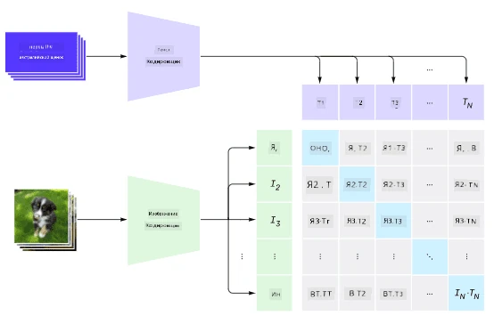
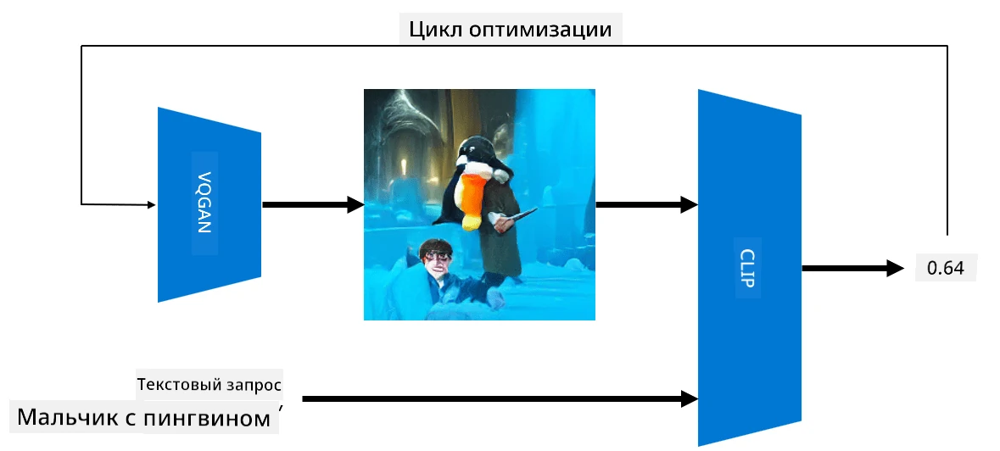

# Мультимодальные сети

После успеха трансформерных моделей в решении задач обработки естественного языка (NLP), те же или похожие архитектуры начали применяться к задачам компьютерного зрения. Растет интерес к созданию моделей, которые могли бы *объединять* возможности обработки изображений и естественного языка. Одной из таких попыток стала разработка OpenAI, известная как CLIP и DALL.E.

## Контрастное предварительное обучение изображений (CLIP)

Основная идея CLIP заключается в способности сравнивать текстовые запросы с изображением и определять, насколько хорошо изображение соответствует запросу.

> *Изображение из [этой статьи](https://openai.com/blog/clip/)*

Модель обучается на изображениях, полученных из Интернета, и их подписях. Для каждого батча мы берем N пар (изображение, текст) и преобразуем их в векторные представления I и T. Эти представления затем сопоставляются друг с другом. Функция потерь определена таким образом, чтобы максимизировать косинусное сходство между векторами, соответствующими одной паре (например, I и T), и минимизировать косинусное сходство между всеми остальными парами. Именно поэтому этот подход называется **контрастным**.

Модель/библиотека CLIP доступна на [GitHub OpenAI](https://github.com/openai/CLIP). Подход описан в [этой статье](https://openai.com/blog/clip/) и более подробно в [этой научной работе](https://arxiv.org/pdf/2103.00020.pdf).

После предварительного обучения модели мы можем подать ей батч изображений и текстовых запросов, и она вернет тензор с вероятностями. CLIP можно использовать для нескольких задач:

**Классификация изображений**

Предположим, нам нужно классифицировать изображения, например, на кошек, собак и людей. В этом случае мы можем подать модели изображение и серию текстовых запросов: "*изображение кошки*", "*изображение собаки*", "*изображение человека*". В полученном векторе из 3 вероятностей нам нужно просто выбрать индекс с наибольшим значением.

> *Изображение из [этой статьи](https://openai.com/blog/clip/)*

**Поиск изображений по тексту**

Мы также можем сделать обратное. Если у нас есть коллекция изображений, мы можем передать эту коллекцию модели и текстовый запрос — это даст нам изображение, которое наиболее похоже на данный запрос.

## ✍️ Пример: [Использование CLIP для классификации изображений и поиска изображений](../../../../../lessons/X-Extras/X1-MultiModal/Clip.ipynb)

Откройте блокнот [Clip.ipynb](../../../../../lessons/X-Extras/X1-MultiModal/Clip.ipynb), чтобы увидеть CLIP в действии.

## Генерация изображений с помощью VQGAN+CLIP

CLIP также можно использовать для **генерации изображений** на основе текстового запроса. Для этого нам нужна **генеративная модель**, которая сможет создавать изображения на основе некоторого входного вектора. Одной из таких моделей является [VQGAN](https://compvis.github.io/taming-transformers/) (Vector-Quantized GAN).

Основные идеи VQGAN, которые отличают его от обычного [GAN](../../4-ComputerVision/10-GANs/README.md), следующие:
* Использование авторегрессионной трансформерной архитектуры для генерации последовательности контекстно-насыщенных визуальных частей, составляющих изображение. Эти визуальные части, в свою очередь, изучаются с помощью [CNN](../../4-ComputerVision/07-ConvNets/README.md).
* Использование дискриминатора подизображений, который определяет, являются ли части изображения "реальными" или "поддельными" (в отличие от подхода "все или ничего" в традиционных GAN).

Узнайте больше о VQGAN на сайте [Taming Transformers](https://compvis.github.io/taming-transformers/).

Одно из важных отличий VQGAN от традиционного GAN заключается в том, что последний может создавать приличное изображение из любого входного вектора, тогда как VQGAN, скорее всего, создаст несогласованное изображение. Поэтому процесс создания изображения необходимо дополнительно направлять, и это можно сделать с помощью CLIP.

Чтобы сгенерировать изображение, соответствующее текстовому запросу, мы начинаем с некоторого случайного вектора кодирования, который передается через VQGAN для создания изображения. Затем CLIP используется для создания функции потерь, которая показывает, насколько хорошо изображение соответствует текстовому запросу. Цель состоит в минимизации этой функции потерь с использованием обратного распространения для корректировки параметров входного вектора.

Отличная библиотека, реализующая VQGAN+CLIP, — это [Pixray](http://github.com/pixray/pixray).

 |   | 
----|----|----
Изображение, созданное по запросу *акварельный портрет молодого учителя литературы с книгой крупным планом* | Изображение, созданное по запросу *масляный портрет молодой учительницы информатики с компьютером крупным планом* | Изображение, созданное по запросу *масляный портрет пожилого учителя математики на фоне доски крупным планом*

> Изображения из коллекции **Искусственные учителя** от [Дмитрия Сошникова](http://soshnikov.com)

## DALL-E
### [DALL-E 1](https://openai.com/research/dall-e)
DALL-E — это версия GPT-3, обученная для генерации изображений по текстовым запросам. Она была обучена с использованием 12 миллиардов параметров.

В отличие от CLIP, DALL-E получает текст и изображение как единый поток токенов для обоих типов данных. Таким образом, из нескольких запросов можно генерировать изображения на основе текста.

### [DALL-E 2](https://openai.com/dall-e-2)
Основное отличие DALL-E 1 от DALL-E 2 заключается в том, что последняя генерирует более реалистичные изображения и произведения искусства.

Примеры генерации изображений с помощью DALL-E:
 |   | 
----|----|----
Изображение, созданное по запросу *акварельный портрет молодого учителя литературы с книгой крупным планом* | Изображение, созданное по запросу *масляный портрет молодой учительницы информатики с компьютером крупным планом* | Изображение, созданное по запросу *масляный портрет пожилого учителя математики на фоне доски крупным планом*

## Ссылки

* Статья о VQGAN: [Taming Transformers for High-Resolution Image Synthesis](https://compvis.github.io/taming-transformers/paper/paper.pdf)
* Статья о CLIP: [Learning Transferable Visual Models From Natural Language Supervision](https://arxiv.org/pdf/2103.00020.pdf)

**Отказ от ответственности**:  
Этот документ был переведен с помощью сервиса автоматического перевода [Co-op Translator](https://github.com/Azure/co-op-translator). Несмотря на наши усилия обеспечить точность, автоматические переводы могут содержать ошибки или неточности. Оригинальный документ на его исходном языке следует считать авторитетным источником. Для получения критически важной информации рекомендуется профессиональный перевод человеком. Мы не несем ответственности за любые недоразумения или неправильные толкования, возникшие в результате использования данного перевода.