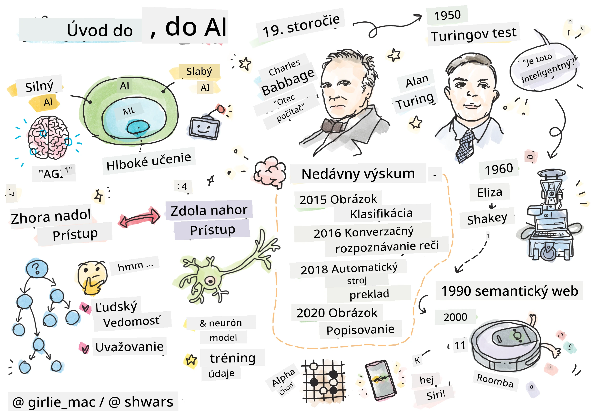
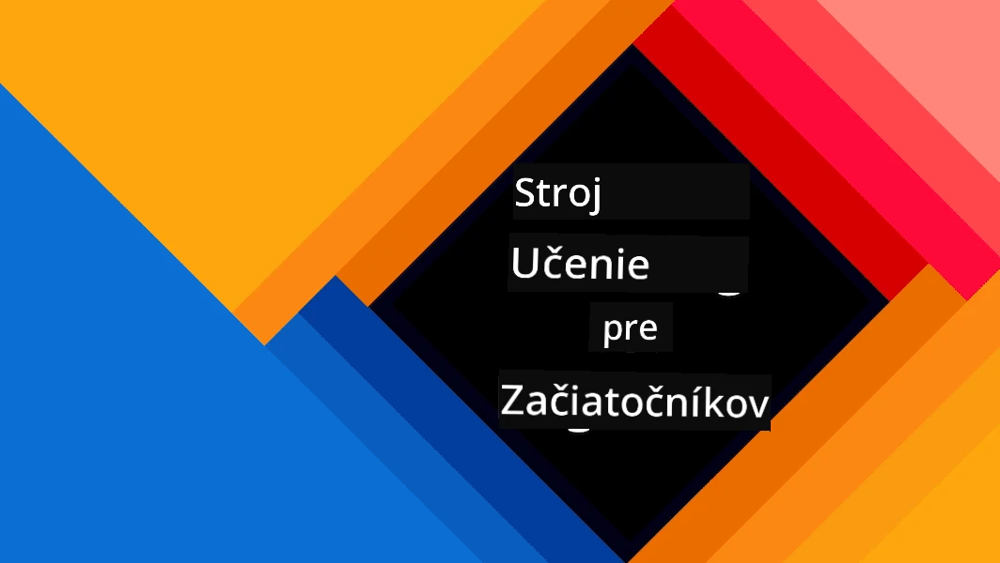
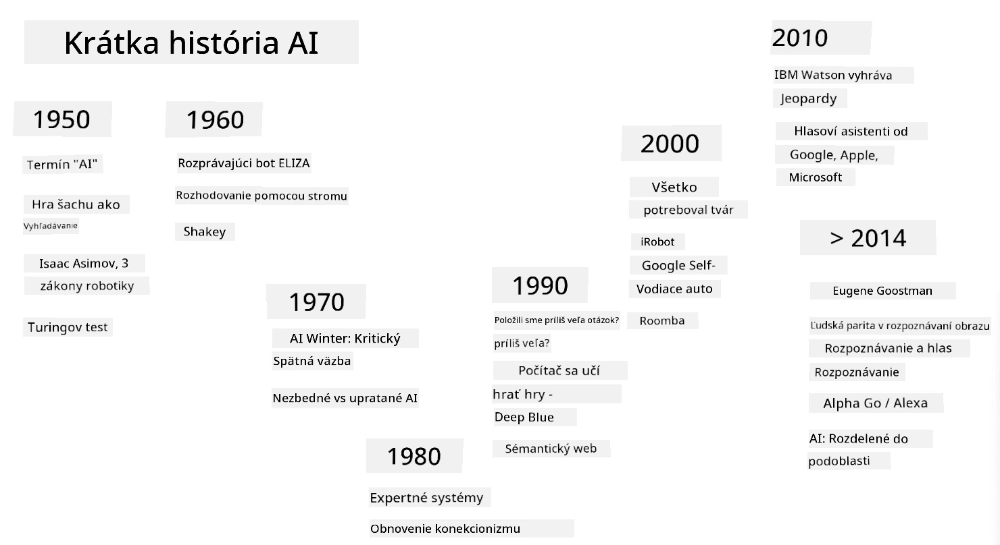
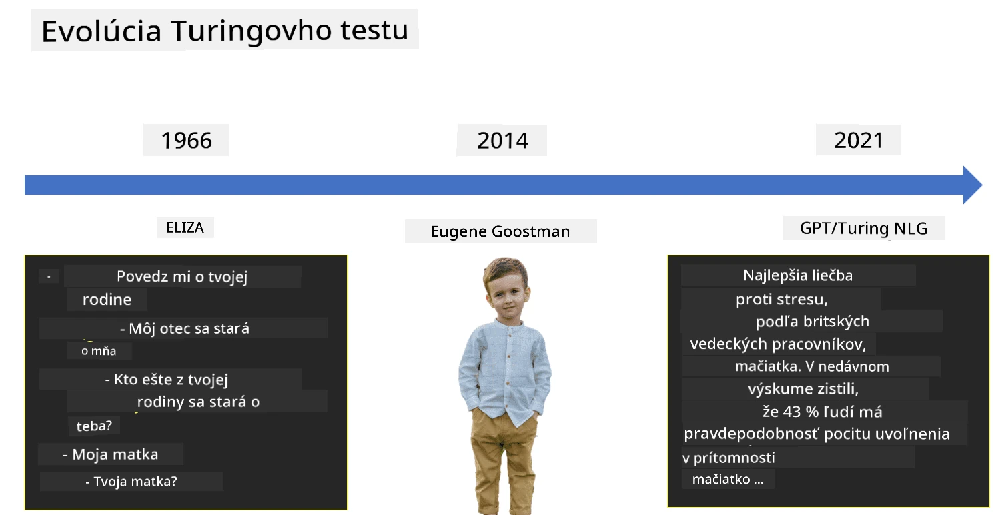

# Úvod do umelej inteligencie

> Kresba od [Tomomi Imura](https://twitter.com/girlie_mac)

## [Kvíz pred prednáškou](https://ff-quizzes.netlify.app/en/ai/quiz/1)

**Umelá inteligencia** je vzrušujúca vedecká disciplína, ktorá skúma, ako môžeme naučiť počítače prejavovať inteligentné správanie, napríklad robiť veci, v ktorých sú ľudia dobrí.

Pôvodne boli počítače vynájdené [Charlesom Babbageom](https://en.wikipedia.org/wiki/Charles_Babbage) na prácu s číslami podľa presne definovaného postupu – algoritmu. Moderné počítače, hoci sú oveľa pokročilejšie ako pôvodný model navrhnutý v 19. storočí, stále fungujú na rovnakom princípe riadených výpočtov. Preto je možné naprogramovať počítač na vykonanie úlohy, ak poznáme presnú postupnosť krokov potrebných na dosiahnutie cieľa.

> Fotografia od [Vickie Soshnikova](http://twitter.com/vickievalerie)

> ✅ Určenie veku osoby z jej fotografie je úloha, ktorú nemožno explicitne naprogramovať, pretože nevieme, ako v hlave prichádzame k číslu, keď to robíme.

---

Existujú však úlohy, ktoré nevieme explicitne vyriešiť. Zoberme si napríklad určenie veku osoby z jej fotografie. Nejako sa to naučíme, pretože sme videli veľa príkladov ľudí rôzneho veku, ale nevieme presne vysvetliť, ako to robíme, ani to nevieme naprogramovať do počítača. Práve tento druh úloh je predmetom záujmu **umelej inteligencie** (skrátene AI).

✅ Zamyslite sa nad niektorými úlohami, ktoré by ste mohli prenechať počítaču a ktoré by mohli ťažiť z umelej inteligencie. Zvážte oblasti ako financie, medicína a umenie – ako tieto oblasti dnes profitujú z AI?

## Slabá AI vs. Silná AI

Slabá AI | Silná AI
---------------------------------------|-------------------------------------
Slabá AI označuje systémy AI, ktoré sú navrhnuté a trénované na konkrétnu úlohu alebo úzky súbor úloh.|Silná AI, alebo všeobecná umelá inteligencia (AGI), označuje systémy AI s inteligenciou a porozumením na úrovni človeka.
Tieto systémy AI nie sú všeobecne inteligentné; vynikajú v plnení preddefinovanej úlohy, ale nemajú skutočné porozumenie alebo vedomie.|Tieto systémy AI majú schopnosť vykonávať akúkoľvek intelektuálnu úlohu, ktorú dokáže človek, prispôsobiť sa rôznym oblastiam a disponovať formou vedomia alebo sebauvedomenia.
Príklady slabej AI zahŕňajú virtuálnych asistentov ako Siri alebo Alexa, odporúčacie algoritmy používané streamovacími službami a chatboty navrhnuté na konkrétne úlohy zákazníckeho servisu.|Dosiahnutie silnej AI je dlhodobým cieľom výskumu AI a vyžadovalo by vývoj systémov AI, ktoré dokážu uvažovať, učiť sa, chápať a prispôsobovať sa širokému spektru úloh a kontextov.
Slabá AI je vysoko špecializovaná a nemá kognitívne schopnosti podobné ľuďom ani všeobecné schopnosti riešiť problémy mimo svojej úzkej oblasti.|Silná AI je v súčasnosti teoretický koncept a žiadny systém AI nedosiahol túto úroveň všeobecnej inteligencie.

Viac informácií nájdete v článku **[Artificial General Intelligence](https://en.wikipedia.org/wiki/Artificial_general_intelligence)** (AGI).

## Definícia inteligencie a Turingov test

Jedným z problémov pri zaoberaní sa pojmom **[inteligencia](https://en.wikipedia.org/wiki/Intelligence)** je, že neexistuje jasná definícia tohto pojmu. Dá sa argumentovať, že inteligencia súvisí s **abstraktným myslením** alebo so **sebauvedomením**, ale nemôžeme ju presne definovať.

> [Fotografia](https://unsplash.com/photos/75715CVEJhI) od [Amber Kipp](https://unsplash.com/@sadmax) z Unsplash

Aby sme videli nejednoznačnosť pojmu *inteligencia*, skúste odpovedať na otázku: „Je mačka inteligentná?“. Rôzni ľudia majú tendenciu dávať rôzne odpovede na túto otázku, pretože neexistuje univerzálne akceptovaný test na preukázanie pravdivosti tohto tvrdenia. A ak si myslíte, že existuje – skúste dať svojej mačke IQ test...

✅ Zamyslite sa na chvíľu nad tým, ako definujete inteligenciu. Je vrana, ktorá dokáže vyriešiť bludisko a dostať sa k jedlu, inteligentná? Je dieťa inteligentné?

---

Keď hovoríme o AGI, potrebujeme nejaký spôsob, ako zistiť, či sme vytvorili skutočne inteligentný systém. [Alan Turing](https://en.wikipedia.org/wiki/Alan_Turing) navrhol spôsob nazývaný **[Turingov test](https://en.wikipedia.org/wiki/Turing_test)**, ktorý zároveň slúži ako definícia inteligencie. Test porovnáva daný systém s niečím inherentne inteligentným – skutočným človekom, a pretože akékoľvek automatické porovnanie môže byť obídené počítačovým programom, používame ľudského vyšetrovateľa. Ak človek nedokáže rozlíšiť medzi skutočnou osobou a počítačovým systémom v textovom dialógu – systém sa považuje za inteligentný.

> Chatbot nazvaný [Eugene Goostman](https://en.wikipedia.org/wiki/Eugene_Goostman), vyvinutý v Petrohrade, sa v roku 2014 priblížil k prekonaniu Turingovho testu použitím šikovného triku s osobnosťou. Vopred oznámil, že je 13-ročný ukrajinský chlapec, čo by vysvetľovalo nedostatok vedomostí a niektoré nezrovnalosti v texte. Bot presvedčil 30 % sudcov, že je človek, po 5-minútovom dialógu, čo je metrika, ktorú Turing predpokladal, že stroj bude schopný dosiahnuť do roku 2000. Avšak treba pochopiť, že to neznamená, že sme vytvorili inteligentný systém, alebo že počítačový systém oklamal ľudského vyšetrovateľa – systém neoklamal ľudí, ale skôr tvorcovia bota!

✅ Už vás niekedy chatbot oklamal, že si myslíte, že hovoríte s človekom? Ako vás presvedčil?

## Rôzne prístupy k AI

Ak chceme, aby sa počítač správal ako človek, musíme nejako modelovať naše myslenie vo vnútri počítača. Preto musíme skúsiť pochopiť, čo robí človeka inteligentným.

> Aby sme mohli naprogramovať inteligenciu do stroja, musíme pochopiť, ako fungujú naše vlastné procesy rozhodovania. Ak sa trochu zamyslíte nad sebou, uvedomíte si, že niektoré procesy prebiehajú podvedome – napr. vieme rozlíšiť mačku od psa bez rozmýšľania – zatiaľ čo iné zahŕňajú uvažovanie.

Existujú dva možné prístupy k tomuto problému:

Prístup zhora nadol (symbolické uvažovanie) | Prístup zdola nahor (neurónové siete)
---------------------------------------|-------------------------------------
Prístup zhora nadol modeluje spôsob, akým človek uvažuje pri riešení problému. Zahŕňa extrakciu **vedomostí** od človeka a ich reprezentáciu v počítačovo čitateľnej forme. Tiež musíme vyvinúť spôsob modelovania **uvažovania** vo vnútri počítača. | Prístup zdola nahor modeluje štruktúru ľudského mozgu, pozostávajúcu z obrovského množstva jednoduchých jednotiek nazývaných **neuróny**. Každý neurón funguje ako vážený priemer svojich vstupov a môžeme trénovať sieť neurónov na riešenie užitočných problémov poskytovaním **tréningových dát**.

Existujú aj iné možné prístupy k inteligencii:

* **Emergentný**, **synergetický** alebo **multi-agentný prístup** sú založené na tom, že komplexné inteligentné správanie môže vzniknúť interakciou veľkého množstva jednoduchých agentov. Podľa [evolučnej kybernetiky](https://en.wikipedia.org/wiki/Global_brain#Evolutionary_cybernetics) môže inteligencia *vyplynúť* z jednoduchšieho, reaktívneho správania v procese *metasystémového prechodu*.

* **Evolučný prístup**, alebo **genetický algoritmus**, je optimalizačný proces založený na princípoch evolúcie.

Tieto prístupy budeme skúmať neskôr v kurze, ale teraz sa zameriame na dva hlavné smery: zhora nadol a zdola nahor.

### Prístup zhora nadol

Pri **prístupe zhora nadol** sa snažíme modelovať naše uvažovanie. Pretože môžeme sledovať naše myšlienky, keď uvažujeme, môžeme sa pokúsiť tento proces formalizovať a naprogramovať ho do počítača. Toto sa nazýva **symbolické uvažovanie**.

Ľudia majú tendenciu mať vo svojej hlave určité pravidlá, ktoré riadia ich rozhodovacie procesy. Napríklad, keď lekár diagnostikuje pacienta, môže si uvedomiť, že osoba má horúčku, a teda môže ísť o nejaký zápal v tele. Použitím veľkej sady pravidiel na konkrétny problém môže lekár dospieť k záverečnej diagnóze.

Tento prístup sa silno spolieha na **reprezentáciu vedomostí** a **uvažovanie**. Extrahovanie vedomostí od ľudského experta môže byť najťažšou časťou, pretože lekár v mnohých prípadoch nemusí presne vedieť, prečo dospel k určitej diagnóze. Niekedy riešenie jednoducho príde do jeho hlavy bez explicitného myslenia. Niektoré úlohy, ako napríklad určenie veku osoby z fotografie, sa vôbec nedajú zredukovať na manipuláciu s vedomosťami.

### Prístup zdola nahor

Alternatívne môžeme skúsiť modelovať najjednoduchšie prvky v našom mozgu – neurón. Môžeme v počítači vytvoriť takzvanú **umelú neurónovú sieť** a potom sa ju pokúsiť naučiť riešiť problémy poskytovaním príkladov. Tento proces je podobný tomu, ako sa novorodené dieťa učí o svojom okolí pozorovaním.

✅ Urobte si malý výskum o tom, ako sa deti učia. Aké sú základné prvky mozgu dieťaťa?

> | Čo tak ML?         |      |
> |--------------|-----------|
> | Časť umelej inteligencie, ktorá je založená na tom, že počítač sa učí riešiť problém na základe niektorých dát, sa nazýva **strojové učenie**. V tomto kurze sa nebudeme zaoberať klasickým strojovým učením – odkazujeme vás na samostatný [kurz Strojové učenie pre začiatočníkov](http://aka.ms/ml-beginners). |       |

## Stručná história AI

Umelá inteligencia vznikla ako oblasť v polovici 20. storočia. Spočiatku bol symbolický prístup dominantný a viedol k niekoľkým dôležitým úspechom, ako napríklad expertné systémy – počítačové programy, ktoré dokázali pôsobiť ako odborníci v niektorých obmedzených problémových oblastiach. Avšak čoskoro sa ukázalo, že tento prístup nie je dobre škálovateľný. Extrahovanie vedomostí od experta, ich reprezentácia v počítači a udržiavanie tejto databázy vedomostí presnej sa ukázalo byť veľmi zložitou úlohou a príliš nákladnou na to, aby bola praktická v mnohých prípadoch. To viedlo k takzvanej [AI zime](https://en.wikipedia.org/wiki/AI_winter) v 70. rokoch.

> Obrázok od [Dmitry Soshnikov](http://soshnikov.com)

Ako čas plynul, výpočtové zdroje sa stali lacnejšími a dostupných bolo viac dát, takže prístupy založené na neurónových sieťach začali vykazovať skvelý výkon v súťažení s ľuďmi v mnohých oblastiach, ako je počítačové videnie alebo porozumenie reči. V poslednom desaťročí sa pojem umelá inteligencia väčšinou používa ako synonymum pre neurónové siete, pretože väčšina úspechov AI, o ktorých počujeme, je založená na nich.

Môžeme pozorovať, ako sa prístupy menili, napríklad pri vytváraní počítačového programu na hranie šachu:

* Skoré šachové programy boli založené na vyhľadávaní – program sa explicitne pokúšal odhadnúť možné ťahy súpera na určitý počet nasledujúcich ťahov a vybral optimálny ťah na základe optimálnej pozície, ktorú možno dosiahnuť v niekoľkých ťahoch. To viedlo k vývoju takzvaného [alpha-beta prerezávania](https://en.wikipedia.org/wiki/Alpha%E2%80%93beta_pruning).
* Vyhľadávacie stratégie fungujú dobre na konci hry, kde je vyhľadávací priestor obmedzený malým počtom možných ťahov. Avšak na začiatku hry je vyhľadávací priestor obrovský a algoritmus možno zlepšiť učením sa z existujúcich zápasov medzi ľudskými hráčmi. Následné experimenty využívali takzvané [prípadové uvažovanie](https://en.wikipedia.org/wiki/Case-based_reasoning), kde program hľadal prípady v databáze vedomostí veľmi podobné aktuálnej pozícii v hre.
* Moderné programy, ktoré vyhrávajú nad ľudskými hráčmi, sú založené na neurónových sieťach a [posilňovacom učení](https://en.wikipedia.org/wiki/Reinforcement_learning), kde sa programy učia hrať výlučne tým, že dlhý čas hrajú proti sebe a učia sa zo svojich vlastných chýb – podobne ako ľudia, keď sa učia hrať šach. Avšak počítačový program môže odohrať oveľa viac hier za oveľa kratší čas, a tak sa môže učiť oveľa rýchlejšie.

✅ Urobte si malý výskum o iných hrách, ktoré boli hrané AI.

Podobne môžeme vidieť, ako sa prístup k vytváraniu „hovoriacich programov“ (ktoré by mohli prejsť Turingovým testom) zmenil:

* Skoré programy tohto druhu, ako napríklad [Eliza](https://en.wikipedia.org/wiki/ELIZA), boli založené na veľmi jednoduchých gramatických pravidlách a preformulovaní vstupnej vety na otázku.
* Moderní asistenti, ako Cortana, Siri alebo Google Assistant, sú všetci hybridné systémy, ktoré používajú neurónové siete na prevod reči na text a rozpoznanie nášho zámeru, a potom využívajú nejaké uvažovanie alebo explicitné algoritmy na vykonanie požadovaných akcií.
* V budúcnosti môžeme očakávať kompletný model založený na neurónových sieťach, ktorý bude sám zvládať dialóg. Nedávne GPT a [Turing-NLG](https://www.microsoft.com/research/blog/turing-nlg-a-17-billion-parameter-language-model-by-microsoft) rodiny neurónových sietí ukazujú veľký úspech v tomto smere.

 Obrázok od Dmitry Soshnikov, [fotografia](https://unsplash.com/photos/r8LmVbUKgns) od [Marina Abrosimova](https://unsplash.com/@abrosimova_marina_foto), Unsplash

## Nedávny výskum v oblasti AI

Obrovský nárast výskumu neurónových sietí začal okolo roku 2010, keď sa začali sprístupňovať veľké verejné dátové súbory. Obrovská zbierka obrázkov nazvaná [ImageNet](https://en.wikipedia.org/wiki/ImageNet), ktorá obsahuje približne 14 miliónov anotovaných obrázkov, dala vzniknúť [ImageNet Large Scale Visual Recognition Challenge](https://image-net.org/challenges/LSVRC/).

> Obrázok od [Dmitry Soshnikov](http://soshnikov.com)

V roku 2012 boli [Konvolučné neurónové siete](../4-ComputerVision/07-ConvNets/README.md) prvýkrát použité na klasifikáciu obrázkov, čo viedlo k výraznému poklesu chybovosti klasifikácie (z takmer 30% na 16,4%). V roku 2015 architektúra ResNet od Microsoft Research [dosiahla presnosť na úrovni človeka](https://doi.org/10.1109/ICCV.2015.123).

Odvtedy neurónové siete preukázali veľmi úspešné správanie v mnohých úlohách:

---

Rok | Dosiahnutá úroveň človeka
-----|--------
2015 | [Klasifikácia obrázkov](https://doi.org/10.1109/ICCV.2015.123)
2016 | [Rozpoznávanie konverzačnej reči](https://arxiv.org/abs/1610.05256)
2018 | [Automatický preklad](https://arxiv.org/abs/1803.05567) (z čínštiny do angličtiny)
2020 | [Popisovanie obrázkov](https://arxiv.org/abs/2009.13682)

Za posledné roky sme boli svedkami obrovských úspechov veľkých jazykových modelov, ako sú BERT a GPT-3. Toto sa stalo najmä vďaka tomu, že je k dispozícii veľké množstvo všeobecných textových dát, ktoré nám umožňujú trénovať modely na zachytenie štruktúry a významu textov, predtrénovať ich na všeobecných textových zbierkach a následne špecializovať tieto modely na konkrétnejšie úlohy. Viac sa o [Spracovaní prirodzeného jazyka](../5-NLP/README.md) dozvieme neskôr v tomto kurze.

## 🚀 Výzva

Preskúmajte internet a určte, kde je podľa vás AI najefektívnejšie využívaná. Je to v aplikácii na mapovanie, službe na prevod reči na text alebo vo videohre? Preskúmajte, ako bol systém vytvorený.

## [Kvíz po prednáške](https://ff-quizzes.netlify.app/en/ai/quiz/2)

## Prehľad & Samoštúdium

Preskúmajte históriu AI a ML prečítaním [tejto lekcie](https://github.com/microsoft/ML-For-Beginners/tree/main/1-Introduction/2-history-of-ML). Vyberte si prvok zo sketchnote na začiatku tejto lekcie alebo tejto a preskúmajte ho podrobnejšie, aby ste pochopili kultúrny kontext, ktorý ovplyvnil jeho vývoj.

**Úloha**: [Game Jam](assignment.md)

---

<!-- CO-OP TRANSLATOR DISCLAIMER START -->
**Zrieknutie sa zodpovednosti**:  
Tento dokument bol preložený pomocou služby AI prekladu [Co-op Translator](https://github.com/Azure/co-op-translator). Hoci sa snažíme o presnosť, prosím, berte na vedomie, že automatizované preklady môžu obsahovať chyby alebo nepresnosti. Pôvodný dokument v jeho rodnom jazyku by mal byť považovaný za autoritatívny zdroj. Pre kritické informácie sa odporúča profesionálny ľudský preklad. Nenesieme zodpovednosť za akékoľvek nedorozumenia alebo nesprávne interpretácie vyplývajúce z použitia tohto prekladu.
<!-- CO-OP TRANSLATOR DISCLAIMER END -->