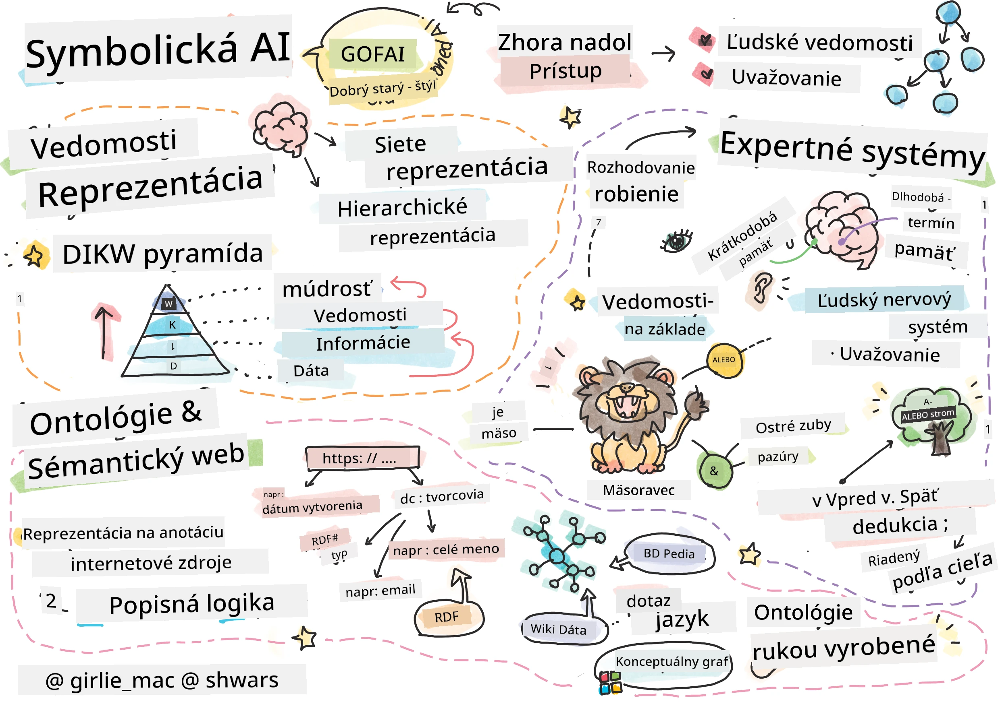
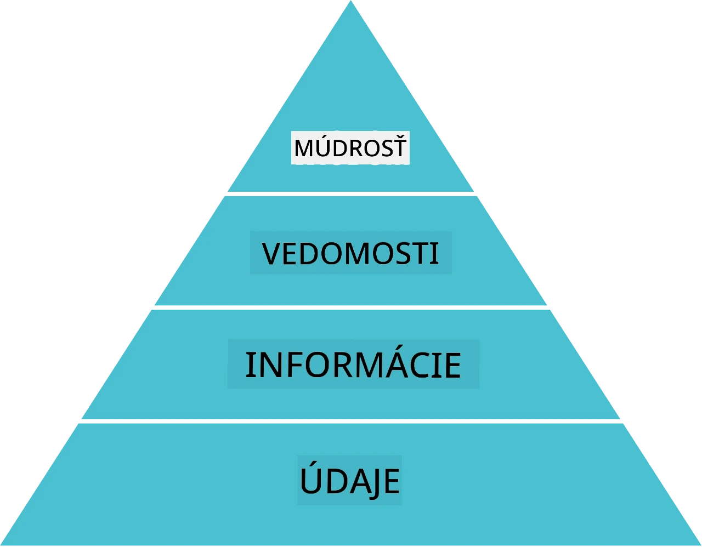
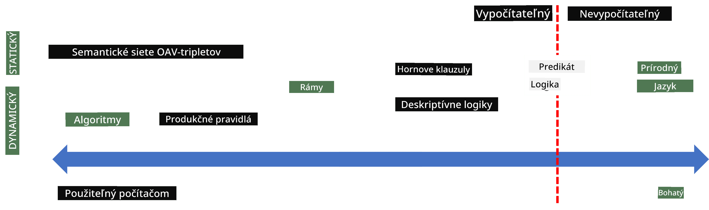
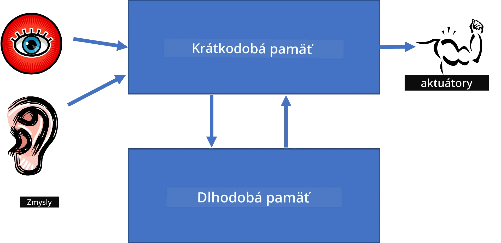
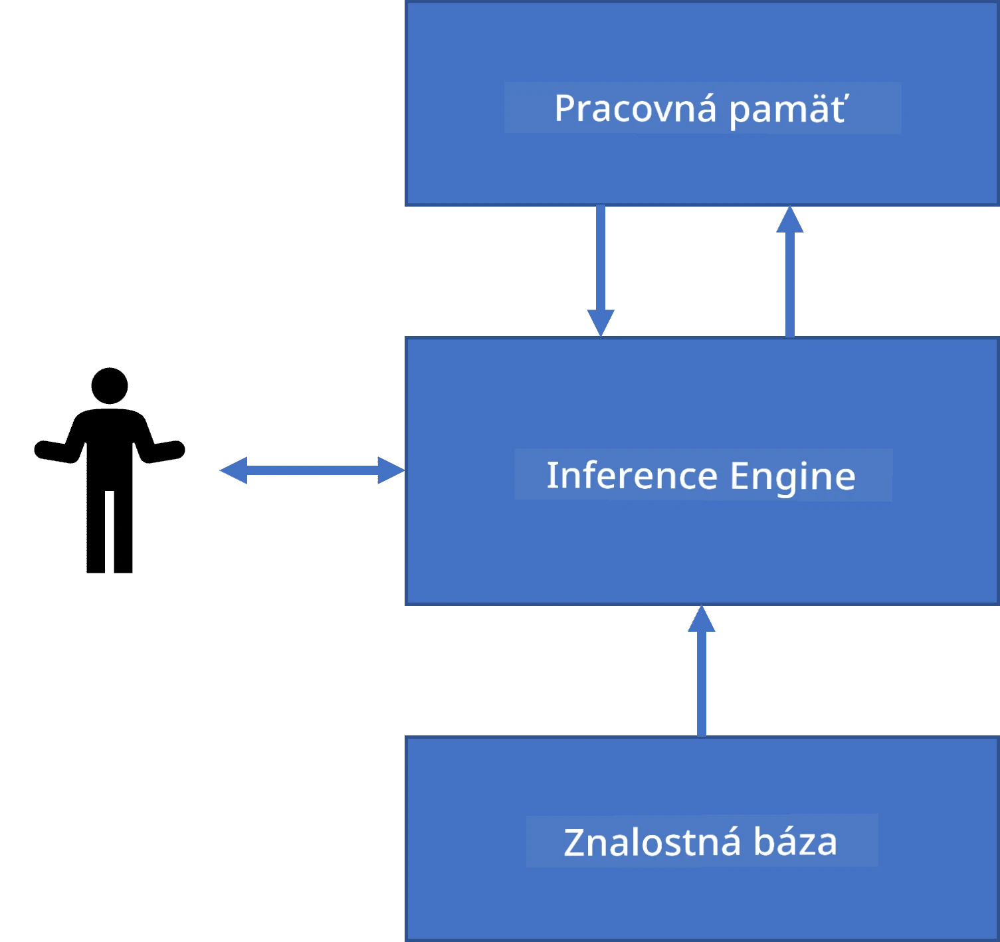
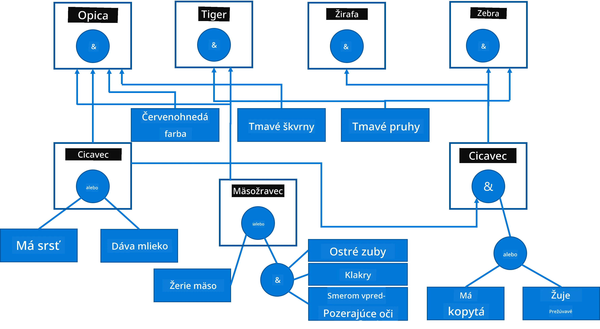
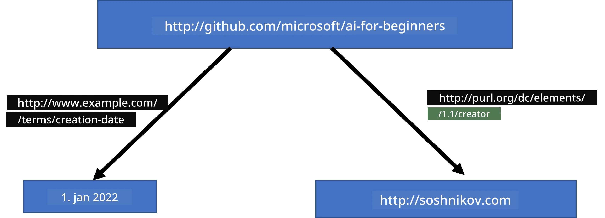
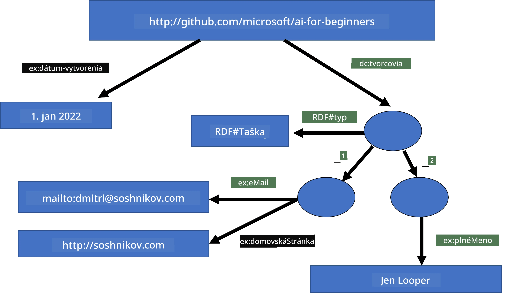
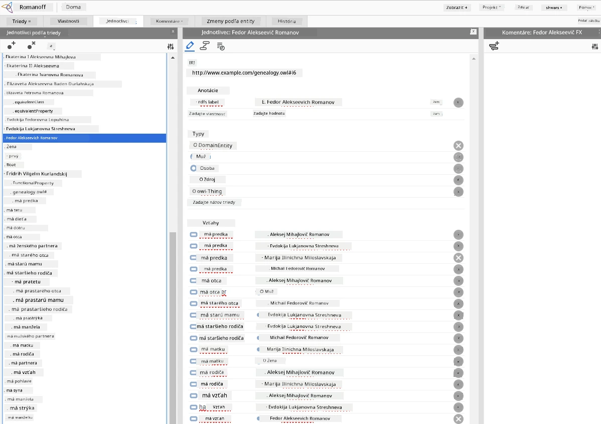

# Reprezentácia znalostí a expertné systémy



> Sketchnote od [Tomomi Imura](https://twitter.com/girlie_mac)

Hľadanie umelej inteligencie je založené na vyhľadávaní znalostí, aby sme porozumeli svetu podobne ako ľudia. Ale ako to urobiť?

## [Prednáškový kvíz](https://ff-quizzes.netlify.app/en/ai/quiz/3)

V počiatočných dňoch AI bola populárna prístup zhora nadol k tvorbe inteligentných systémov (diskutovaný v predchádzajúcej lekcii). Myšlienka bola extrahovať znalosti od ľudí do strojom čitateľnej formy a potom ich používať na automatické riešenie problémov. Tento prístup bol založený na dvoch hlavných myšlienkach:

* Reprezentácia znalostí
* Odvodenie (dedukcia)

## Reprezentácia znalostí

Jedným z dôležitých pojmov v symbolickej AI je **znalosť**. Je dôležité rozlíšiť znalosť od *informácie* alebo *dát*. Napríklad môžeme povedať, že knihy obsahujú znalosti, pretože si ich môžeme študovať a stať sa expertom. Avšak to, čo knihy obsahujú, sa vlastne nazýva *dáta*, a čítaním kníh a integráciou týchto dát do nášho modelu sveta meníme tieto dáta na znalosti.

> ✅ **Znalosť** je niečo, čo máme v hlave a predstavuje naše pochopenie sveta. Získava sa aktívnym procesom **učenia**, ktorý integruje kúsky informácií, ktoré dostávame, do nášho aktívneho modelu sveta.

Najčastejšie neformálne definujeme znalosť, ale zladíme ju s inými súvisiacimi pojmami pomocou [DIKW pyramídy](https://en.wikipedia.org/wiki/DIKW_pyramid). Obsahuje nasledujúce pojmy:

* **Dáta** sú niečo reprezentované vo fyzickej forme, ako je písaný text alebo hovorené slová. Dáta existujú nezávisle od ľudí a môžu byť medzi ľuďmi prenášané.
* **Informácia** je, ako interpretujeme dáta v hlave. Napríklad keď počujeme slovo *počítač*, máme určitú predstavu, čo to je.
* **Znalosť** je informácia integrovaná do nášho modelu sveta. Napríklad keď sa naučíme, čo je počítač, začneme mať predstavy o tom, ako funguje, koľko stojí a na čo sa používa. Táto sieť prepojených pojmov tvorí naše znalosti.
* **Múdrosť** je ešte vyššia úroveň nášho pochopenia sveta a predstavuje *metaznalosť*, napríklad predstavu o tom, kedy a ako používať znalosti.



*Obrázok [z Wikipédie](https://commons.wikimedia.org/w/index.php?curid=37705247), autor Longlivetheux - vlastná práca, CC BY-SA 4.0*

Problém **reprezentácie znalostí** je teda nájsť efektívny spôsob, ako reprezentovať znalosti vo vnútri počítača vo forme dát, aby boli automaticky použiteľné. Dá sa to vidieť ako spektrum:



> Obrázok od [Dmitryho Soshnikova](http://soshnikov.com)

* Naľavo sú veľmi jednoduché typy reprezentácie znalostí, ktoré môže počítač efektívne používať. Najjednoduchšou je algoritmická reprezentácia, keď je znalosť reprezentovaná počítačovým programom. Toto však nie je najlepší spôsob reprezentácie znalostí, pretože nie je flexibilný. Znalosť v našej hlave často nie je algoritmická.
* Napravo sú reprezentácie ako prírodný text. Ide o najsilnejšiu formu, no nemožno ich použiť na automatické uvažovanie.

> ✅ Zamyslite sa, ako reprezentujete znalosti vo svojej hlave a ako ich prevádzate do poznámok. Existuje nejaký formát, ktorý vám pomáha lepšie si zapamätať?

## Klasifikácia spôsobov reprezentácie znalostí v počítači

Môžeme klasifikovať rôzne metódy počítačovej reprezentácie znalostí do nasledujúcich kategórií:

* **Sieťové reprezentácie** vychádzajú z toho, že máme v hlave sieť prepojených pojmov. Môžeme sa pokúsiť reprodukovať tieto siete ako graf v počítači - takzvanú **sémantickú sieť**.

1. **Tripletové objekty-atribút-hodnota** alebo **páry atribút-hodnota**. Keďže graf môže byť v počítači reprezentovaný ako zoznam uzlov a hrán, môžeme reprezentovať sémantickú sieť zoznamom tripletov obsahujúcich objekty, atribúty a hodnoty. Napríklad vytvárame nasledujúce tripletové záznamy o programovacích jazykoch:

Objekt | Atribút | Hodnota
-------|---------|--------
Python | je | Nezadaný-jazyk
Python | vynálezca | Guido van Rossum
Python | syntax-bloku | odsadenie
Nezadaný-jazyk | nemá | definície typov

> ✅ Zamyslite sa, ako by tripletové zápisy mohli reprezentovať iné typy znalostí.

2. **Hierarchické reprezentácie** zdôrazňujú fakt, že často vytvárame hierarchiu objektov v hlave. Napríklad vieme, že kanárik je vták, a všetky vtáky majú krídla. Máme tiež predstavu o farbe kanárika a jeho rýchlosti letu.

   - **Reprezentácia rámcov** je založená na reprezentácii každého objektu alebo triedy objektov ako **rámca**, ktorý obsahuje **sloty**. Sloty môžu mať prednastavené hodnoty, obmedzenia hodnôt alebo uložené procedúry, ktoré možno zavolať na získanie hodnoty slotu. Všetky rámce tvoria hierarchiu podobne ako hierarchia objektov v objektovo orientovaných programovacích jazykoch.
   - **Scenáre** sú špeciálnym druhom rámcov, ktoré reprezentujú komplexné situácie vyvíjajúce sa v čase.

**Python**

Slot | Hodnota | Prednastavená hodnota | Interval |
-----|---------|------------------------|----------|
Meno | Python | | |
Je-typom | Nezadaný-jazyk | | |
Písanie premenných | | CamelCase | |
Dĺžka programu | | | 5-5000 riadkov |
Syntax bloku | Odsadenie | | |

3. **Procedurálne reprezentácie** sú založené na reprezentácii znalostí ako zoznamu akcií, ktoré sa môžu vykonať, keď nastane určitá podmienka.
   - Produkčné pravidlá sú výrazy typu ak-potom, ktoré nám umožňujú vyvodiť závery. Napríklad lekár môže mať pravidlo, že **AK** má pacient vysokú horúčku **ALEBO** vysokú hladinu C-reaktívneho proteínu v krvnom teste, **POTOM** má zápal. Ak spĺňame niektorú z podmienok, môžeme urobiť záver o zápale a použiť ho na ďalšie uvažovanie.
   - Algoritmy môžu byť považované za inú formu procedurálnej reprezentácie, hoci sa takmer nikdy priamo nepoužívajú v systémoch založených na znalostiach.

4. **Logika** bola pôvodne navrhnutá Aristotelom ako spôsob reprezentácie univerzálnych ľudských znalostí.
   - Predikatová logika ako matematická teória je príliš bohatá na výpočtovosť, preto sa zvyčajne používa jej podmnožina, napríklad Hornove klauzuly používané v Prologu.
   - Deskriptívna logika je rodina logických systémov používaných na reprezentáciu a odôvodňovanie o hierarchiách objektov v distribuovaných reprezentáciách znalostí, ako je *sémantický web*.

## Expertné systémy

Jedným z prvých úspechov symbolickej AI boli takzvané **expertné systémy** – počítačové systémy navrhnuté tak, aby sa správali ako expert v obmedzenej problémovej oblasti. Boli založené na **znalostnej báze** extrahovanej od jedného alebo viacerých ľudských expertov a obsahovali **odvodzovací modul** vykonávajúci uvažovanie na jej základe.

 | 
---------------------------------------------|------------------------------------------------
Zjednodušená štruktúra ľudského neurónového systému | Architektúra systému založeného na znalostiach

Expertné systémy sú postavené podobne ako ľudský uvažovací systém, ktorý obsahuje **krátkodobú pamäť** a **dlhodobú pamäť**. Podobne v systémoch založených na znalostiach rozlišujeme nasledujúce komponenty:

* **Pamäť problému**: obsahuje znalosti o probléme, ktorý sa práve rieši, napríklad teplotu pacienta, krvný tlak, či má zápal alebo nie. Táto znalosť sa nazýva **statická znalosť**, pretože obsahuje momentálny „snímok“ toho, čo práve o probléme vieme – tzv. *stav problému*.
* **Znalostná báza**: predstavuje dlhodobé znalosti o problémovej oblasti. Je ručne získaná od ľudských expertov a nemení sa počas konzultácií. Keďže nám umožňuje navigovať zo stavu problému do iného, nazýva sa aj **dynamická znalosť**.
* **Odvodzovací modul**: riadi celý proces vyhľadávania v priestore stavov problému, v prípade potreby kladie používateľovi otázky. Tiež zodpovedá za vyhľadanie správnych pravidiel, ktoré sa majú použiť v danom stave.

Ako príklad si vezmime expertný systém určujúci zviera na základe jeho fyzických vlastností:



> Obrázok od [Dmitryho Soshnikova](http://soshnikov.com)

Tento diagram sa nazýva **AND-OR strom** a je grafickým znázornením množiny produkčných pravidiel. Kreslenie stromu je užitočné na začiatku extrakcie znalostí od experta. Pre reprezentáciu znalostí v počítači je výhodnejšie použiť pravidlá:

```
IF the animal eats meat
OR (animal has sharp teeth
    AND animal has claws
    AND animal has forward-looking eyes
) 
THEN the animal is a carnivore
```

Môžete si všimnúť, že každá podmienka na ľavej strane pravidla aj akcia sú v podstate objekty-atribút-hodnota (OAV) tripletové zápisy. **Pracovná pamäť** obsahuje OAV tripletové zápisy, ktoré zodpovedajú momentálne riešenému problému. **Pravidlový modul** vyhľadáva pravidlá, ktorých podmienka je splnená, a aplikuje ich, čím pridá ďalší triplet do pracovnej pamäte.

> ✅ Nakreslite si vlastný AND-OR strom na tému, ktorá vás zaujíma!

### Dopredné vs. spätne odvodenie

Popísaný proces sa nazýva **dopredné odvodenie**. Začína sa nejakými počiatočnými údajmi o probléme dostupnými v pracovnej pamäti a potom vykonáva nasledujúcu slučku uvažovania:

1. Ak je cieľový atribút v pracovnej pamäti – zastav a vyhodnoť výsledok
2. Vyhľadaj všetky pravidlá, ktorých podmienka je momentálne splnená – získaj **množinu konfliktov** pravidiel.
3. Vykonaj **riešenie konfliktov** – vyber jedno pravidlo, ktoré sa vykoná v tomto kroku. Existujú rôzne stratégie riešenia konfliktu:
   - Vybrať prvé použiteľné pravidlo zo znalostnej bázy
   - Vybrať náhodné pravidlo
   - Vybrať *špecifickejšie* pravidlo, teda také, ktoré spĺňa najviac podmienok z ľavej strany (LHS)
4. Aplikuj vybrané pravidlo a vlož nový kúsok znalosti do stavu problému
5. Opakuj od kroku 1.

V niektorých prípadoch však môžeme chcieť začať s prázdnymi znalosťami o probléme a klásť otázky, ktoré nám pomôžu dospieť k záveru. Napríklad pri lekárskej diagnostike zvyčajne nevykonávame všetky analýzy dopredu, ale robíme ich podľa potreby.

Tento proces môžeme modelovať pomocou **spätného odvodenia**. To je riadené **cieľom** – hodnotou atribútu, ktorú chceme nájsť:

1. Vyber všetky pravidlá, ktoré môžu dať hodnotu cieľa (t.j. majú cieľ v pravej strane (RHS)) – konfliktný súbor
1. Ak neexistujú žiadne pravidlá pre daný atribút alebo je pravidlo, ktoré hovorí, že sa má hodnota opýtať používateľa – pýtaj sa, inak:
1. Použi stratégiu riešenia konfliktov a vyber jedno pravidlo, ktoré budeme používať ako *hypotézu* – pokúsime sa ju dokázať
1. Rekurzívne opakuj proces pre všetky atribúty v ľavej strane (LHS) pravidla ako ciele
1. Ak proces kedykoľvek zlyhá – použij iné pravidlo v kroku 3.

> ✅ V ktorých situáciách je dopredné odvodenie vhodnejšie? A ako naopak spätné odvodenie?

### Implementácia expertných systémov

Expertné systémy možno implementovať rôznymi spôsobmi:

* Priamo programovaním v niektorom vyššom programovacom jazyku. Nie je to najlepší nápad, pretože hlavná výhoda znalostného systému je v tom, že znalosti sú oddelené od procesu odvodenia a teoreticky by expert na problémovú doménu mal byť schopný pravidlá tvoriť bez nutnosti rozumeť detailom odvodzovania.
* Použitím **shellu pre expertné systémy**, teda systému, ktorý je špeciálne navrhnutý na vyplňovanie znalostí pomocou niektorého jazyka reprezentácie znalostí.

## ✍️ Cvičenie: Odvodenie zvieraťa

Pozrite si [Animals.ipynb](https://github.com/microsoft/AI-For-Beginners/blob/main/lessons/2-Symbolic/Animals.ipynb) ako príklad implementácie dopredného a spätného odvodenia v expertnom systéme.

> **Poznámka**: Tento príklad je pomerne jednoduchý a len približuje, ako expertný systém vyzerá. Ak začnete tvoriť taký systém, *inteligentné* správanie si všimnete až pri počte pravidiel okolo 200+. V určitom bode pravidlá nadobudnú príliš veľkú komplexnosť na to, aby ste si ich všetky vedeli zapamätať, a začnete sa pýtať, prečo systém robí jednotlivé rozhodnutia. Dôležitou vlastnosťou znalostných systémov je však to, že môžete vždy *vysvetliť*, ako bolo ktorékoľvek rozhodnutie urobené.

## Ontológie a sémantický web

Na konci 20. storočia vznikla iniciatíva používať reprezentáciu znalostí na označovanie internetových zdrojov tak, aby bolo možné nájsť zdroje, ktoré vyhovujú veľmi špecifickým požiadavkám. Táto iniciatíva sa nazývala **Sémantický web** a spoliehala sa na niekoľko konceptov:

- Špeciálna reprezentácia znalostí založená na **[deskriptívnej logike](https://en.wikipedia.org/wiki/Description_logic)** (DL). Je podobná reprezentácii znalostí pomocou rámcov, pretože vytvára hierarchiu objektov s vlastnosťami, ale má formálnu logickú sémantiku a odvodzovanie. Existuje celá rodina DL, ktoré vyvažujú medzi expresívnosťou a algoritmickou zložitosťou odvodenia.
- Distribuovaná reprezentácia znalostí, kde všetky pojmy majú globálny URI identifikátor, čo umožňuje vytvárať hierarchie znalostí rozprestierajúce sa po internete.
- Rodina jazykov založených na XML pre opis poznatkov: RDF (Resource Description Framework), RDFS (RDF Schema), OWL (Ontology Web Language).

Kľúčovým konceptom na Semantickom webe je pojem **ontológia**. Označuje explicitnú špecifikáciu problému pomocou nejakej formálnej reprezentácie poznatkov. Najjednoduchšia ontológia môže byť len hierarchia objektov v problémovej oblasti, no zložitejšie ontológie budú obsahovať pravidlá, ktoré sa dajú použiť na odvodenie záverov.

Na semantickom webe sú všetky reprezentácie založené na trojiciach. Každý objekt a každý vzťah sú jednoznačne identifikované URI. Napríklad, ak chceme vyjadriť fakt, že tento AI kurz vyvinul Dmitry Soshnikov 1. januára 2022 - môžeme použiť nasledujúce trojice:



```
http://github.com/microsoft/ai-for-beginners http://www.example.com/terms/creation-date “Jan 1, 2022”
http://github.com/microsoft/ai-for-beginners http://purl.org/dc/elements/1.1/creator http://soshnikov.com
```

> ✅ Tu `http://www.example.com/terms/creation-date` a `http://purl.org/dc/elements/1.1/creator` sú dobre známe a univerzálne akceptované URIs na vyjadrenie pojmov *tvorca* a *dátum vytvorenia*.

V zložitejšom prípade, ak chceme definovať zoznam tvorcov, môžeme použiť niektoré dátové štruktúry definované v RDF.



> Diagramy vyššie od [Dmitry Soshnikov](http://soshnikov.com)

Pokrok pri budovaní Semantického webu bol do istej miery spomalený úspechom vyhľadávačov a techník spracovania prirodzeného jazyka, ktoré umožňujú extrahovať štruktúrované dáta z textu. Avšak v niektorých oblastiach sa stále vyvíjajú významné úsilie na správu ontológií a databáz poznatkov. Niekoľko projektov stojacich za zmienku:

* [WikiData](https://wikidata.org/) je zbierka strojovo čitateľných znalostných báz spojených s Wikipédiou. Väčšina dát pochádza z Wikipedických *InfoBoxov*, čiastok štruktúrovaného obsahu vo Wikipedických stránkach. WikiData môžete [dotazovať](https://query.wikidata.org/) pomocou jazyka SPARQL, špeciálneho dotazovacieho jazyka pre Semantický web. Tu je ukážkový dotaz, ktorý zobrazuje najpopulárnejšie farby očí medzi ľuďmi:

```sparql
#defaultView:BubbleChart
SELECT ?eyeColorLabel (COUNT(?human) AS ?count)
WHERE
{
  ?human wdt:P31 wd:Q5.       # human instance-of homo sapiens
  ?human wdt:P1340 ?eyeColor. # human eye-color ?eyeColor
  SERVICE wikibase:label { bd:serviceParam wikibase:language "en". }
}
GROUP BY ?eyeColorLabel
```

* [DBpedia](https://www.dbpedia.org/) je ďalší projekt podobný WikiData.

> ✅ Ak chcete experimentovať s tvorbou vlastných ontológií alebo otváraním existujúcich, existuje skvelý vizuálny editor ontológií s názvom [Protégé](https://protege.stanford.edu/). Stiahnite si ho, alebo ho používajte online.



*Webový editor Protégé otvorený s ontológiou rodiny Romanovcov. Screenshot od Dmitry Soshnikov*

## ✍️ Cvičenie: Ontológia rodiny


Pozrite si [FamilyOntology.ipynb](https://github.com/Ezana135/AI-For-Beginners/blob/main/lessons/2-Symbolic/FamilyOntology.ipynb) ako príklad použitia techník Semantického webu na dedukovanie rodinných vzťahov. Vezmeme rodokmeň reprezentovaný v bežnom formáte GEDCOM a ontológiu rodinných vzťahov a vytvoríme graf všetkých rodinných väzieb pre danú množinu osôb.

## Microsoft Concept Graph

Vo väčšine prípadov sú ontológie starostlivo vytvárané ručne. Je však tiež možné ontológie **vydolovať** z nestruktúrovaných údajov, napríklad z textov v prirodzenom jazyku.

Takýto pokus uskutočnil Microsoft Research a vznikol [Microsoft Concept Graph](https://blogs.microsoft.com/ai/microsoft-researchers-release-graph-that-helps-machines-conceptualize/?WT.mc_id=academic-77998-cacaste).

Je to veľká kolekcia entít zoskupených pomocou dedičnej vzťahovej väzby `is-a`. Umožňuje odpovedať na otázky typu "Čo je Microsoft?" - odpoveďou je niečo ako "spoločnosť s pravdepodobnosťou 0.87 a značka s pravdepodobnosťou 0.75".

Graf je dostupný buď ako REST API, alebo ako veľký stiahnuteľný textový súbor, ktorý obsahuje všetky páry entít.

## ✍️ Cvičenie: Graf konceptov

Vyskúšajte notebook [MSConceptGraph.ipynb](https://github.com/microsoft/AI-For-Beginners/blob/main/lessons/2-Symbolic/MSConceptGraph.ipynb), aby ste videli, ako môžeme využiť Microsoft Concept Graph na zoskupovanie správ do viacerých kategórií.

## Záver

V súčasnosti je umelá inteligencia často považovaná za synonymum pre *Strojové učenie* alebo *Neurónové siete*. Človek však vykazuje aj explicitné uvažovanie, čo je niečo, čo aktuálne neurónové siete neobsluhujú. V reálnych projektoch sa explicitné uvažovanie stále používa na úlohy, ktoré vyžadujú vysvetlenia alebo možnosť kontrolovaným spôsobom modifikovať správanie systému.

## 🚀 Výzva

V notebooku Ontológia rodiny, priradenom k tejto lekcii, je možnosť experimentovať s inými rodinnými vzťahmi. Skúste objaviť nové väzby medzi ľuďmi v rodokmeni.

## [Kvíz po prednáške](https://ff-quizzes.netlify.app/en/ai/quiz/4)

## Prehľad a samostatné štúdium

Vyhľadajte na internete oblasti, kde sa ľudia snažili kvantifikovať a kódifikovať poznatky. Pozrite sa na Bloomovu taxonómiu a vráťte sa v histórii, aby ste sa dozvedeli, ako ľudia snahou o pochopenie sveta vytvárali svoje predstavy. Prezrite si prácu Linnéa na vytvorenie taxonómie organizmov a všimnite si spôsob, akým Dmitrij Mendelejev vytvoril systém pre popis a zoskupenie chemických prvkov. Aké ďalšie zaujímavé príklady nájdete?

**Úloha**: [Vytvorte ontológiu](assignment.md)

---

<!-- CO-OP TRANSLATOR DISCLAIMER START -->
**Disclaimer**:  
Tento dokument bol preložený pomocou AI prekladateľskej služby [Co-op Translator](https://github.com/Azure/co-op-translator). Aj keď sa snažíme o presnosť, vezmite prosím na vedomie, že automatické preklady môžu obsahovať chyby alebo nepresnosti. Originálny dokument v jeho pôvodnom jazyku by mal byť považovaný za autoritatívny zdroj. Pre kritické informácie sa odporúča profesionálny ľudský preklad. Neručíme za akékoľvek nedorozumenia alebo nesprávne výklady vyplývajúce z použitia tohto prekladu.
<!-- CO-OP TRANSLATOR DISCLAIMER END -->