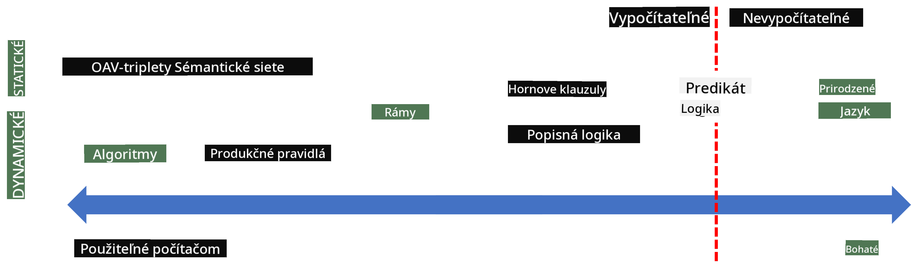

<!--
CO_OP_TRANSLATOR_METADATA:
{
  "original_hash": "98c5222ff9556b55223fed2337145e18",
  "translation_date": "2025-08-26T00:21:47+00:00",
  "source_file": "lessons/2-Symbolic/README.md",
  "language_code": "sk"
}
-->
# Reprezentácia znalostí a expertné systémy


> Sketchnote od [Tomomi Imura](https://twitter.com/girlie_mac)

Hľadanie umelej inteligencie je založené na snahe o získanie znalostí, aby sme dokázali chápať svet podobne ako ľudia. Ale ako to dosiahnuť?

## [Kvíz pred prednáškou](https://ff-quizzes.netlify.app/en/ai/quiz/3)

V začiatkoch AI bol populárny prístup zhora nadol pri vytváraní inteligentných systémov (diskutovaný v predchádzajúcej lekcii). Myšlienka spočívala v extrakcii znalostí od ľudí do strojovo čitateľnej formy, ktorú by bolo možné automaticky použiť na riešenie problémov. Tento prístup bol založený na dvoch hlavných myšlienkach:

* Reprezentácia znalostí
* Odvodzovanie

## Reprezentácia znalostí

Jedným z dôležitých konceptov v Symbolickej AI sú **znalosti**. Je dôležité odlíšiť znalosti od *informácií* alebo *dát*. Napríklad, môžeme povedať, že knihy obsahujú znalosti, pretože ich štúdiom sa môžeme stať odborníkmi. Avšak to, čo knihy obsahujú, sa v skutočnosti nazýva *dáta*, a čítaním kníh a integráciou týchto dát do nášho modelu sveta ich premieňame na znalosti.

> ✅ **Znalosti** sú niečo, čo máme v našej hlave a predstavujú naše chápanie sveta. Získavajú sa aktívnym procesom **učenia**, ktorý integruje kúsky informácií, ktoré prijímame, do nášho aktívneho modelu sveta.

Najčastejšie znalosti nedefinujeme striktne, ale zosúladíme ich s inými súvisiacimi konceptmi pomocou [DIKW pyramídy](https://en.wikipedia.org/wiki/DIKW_pyramid). Obsahuje nasledujúce koncepty:

* **Dáta** sú niečo, čo je reprezentované na fyzických médiách, ako je písaný text alebo hovorené slová. Dáta existujú nezávisle od ľudí a môžu byť medzi nimi prenášané.
* **Informácie** sú spôsob, akým interpretujeme dáta v našej hlave. Napríklad, keď počujeme slovo *počítač*, máme určitú predstavu o tom, čo to je.
* **Znalosti** sú informácie integrované do nášho modelu sveta. Napríklad, keď sa naučíme, čo je počítač, začneme mať predstavy o tom, ako funguje, koľko stojí a na čo sa dá použiť. Táto sieť vzájomne prepojených konceptov tvorí naše znalosti.
* **Múdrosť** je ešte jedna úroveň nášho chápania sveta a predstavuje *meta-znalosti*, napríklad predstavu o tom, ako a kedy by sa mali znalosti použiť.

*Obrázok [z Wikipédie](https://commons.wikimedia.org/w/index.php?curid=37705247), od Longlivetheux - Vlastná práca, CC BY-SA 4.0*

Problém **reprezentácie znalostí** teda spočíva v nájdení efektívneho spôsobu, ako reprezentovať znalosti vo forme dát v počítači, aby boli automaticky použiteľné. To možno vnímať ako spektrum:



> Obrázok od [Dmitry Soshnikov](http://soshnikov.com)

* Naľavo sú veľmi jednoduché typy reprezentácií znalostí, ktoré môžu byť efektívne použité počítačmi. Najjednoduchšou je algoritmická reprezentácia, keď sú znalosti reprezentované počítačovým programom. Toto však nie je najlepší spôsob reprezentácie znalostí, pretože nie je flexibilný. Znalosti v našej hlave sú často nealgoritmické.
* Napravo sú reprezentácie ako prirodzený text. Je to najvýkonnejšie, ale nemôže byť použité na automatické odvodzovanie.

> ✅ Zamyslite sa na chvíľu nad tým, ako reprezentujete znalosti vo svojej hlave a premieňate ich na poznámky. Existuje konkrétny formát, ktorý vám pomáha pri zapamätaní?

## Klasifikácia počítačových reprezentácií znalostí

Rôzne metódy reprezentácie znalostí v počítači môžeme klasifikovať do nasledujúcich kategórií:

* **Sieťové reprezentácie** sú založené na tom, že v našej hlave máme sieť vzájomne prepojených konceptov. Môžeme sa pokúsiť reprodukovať rovnaké siete ako graf v počítači - tzv. **sémantická sieť**.

1. **Trojičky objekt-atribút-hodnota** alebo **páry atribút-hodnota**. Keďže graf môže byť reprezentovaný v počítači ako zoznam uzlov a hrán, môžeme reprezentovať sémantickú sieť zoznamom trojičiek obsahujúcich objekty, atribúty a hodnoty. Napríklad, vytvoríme nasledujúce trojičky o programovacích jazykoch:

Objekt | Atribút | Hodnota
-------|---------|--------
Python | je | Neotypovaný jazyk
Python | vynálezca | Guido van Rossum
Python | bloková syntax | odsadenie
Neotypovaný jazyk | nemá | definície typov

> ✅ Zamyslite sa, ako by sa trojičky dali použiť na reprezentáciu iných typov znalostí.

2. **Hierarchické reprezentácie** zdôrazňujú fakt, že často vytvárame hierarchiu objektov vo svojej hlave. Napríklad vieme, že kanárik je vták, a všetky vtáky majú krídla. Máme tiež predstavu o tom, akú farbu má kanárik zvyčajne a aká je jeho rýchlosť letu.

   - **Reprezentácia rámcov** je založená na reprezentácii každého objektu alebo triedy objektov ako **rámca**, ktorý obsahuje **sloty**. Sloty majú možné predvolené hodnoty, obmedzenia hodnôt alebo uložené procedúry, ktoré môžu byť volané na získanie hodnoty slotu. Všetky rámce tvoria hierarchiu podobnú hierarchii objektov v objektovo orientovaných programovacích jazykoch.
   - **Scenáre** sú špeciálny druh rámcov, ktoré reprezentujú komplexné situácie, ktoré sa môžu rozvíjať v čase.

**Python**

Slot | Hodnota | Predvolená hodnota | Interval |
-----|---------|---------------------|----------|
Názov | Python | | |
Je-A | Neotypovaný jazyk | | |
Prípad premenných | | CamelCase | |
Dĺžka programu | | | 5-5000 riadkov |
Bloková syntax | Odsadenie | | |

3. **Procedurálne reprezentácie** sú založené na reprezentácii znalostí zoznamom akcií, ktoré môžu byť vykonané, keď nastane určitá podmienka.
   - Produkčné pravidlá sú if-then vyhlásenia, ktoré nám umožňujú robiť závery. Napríklad, lekár môže mať pravidlo hovoriace, že **AK** má pacient vysokú horúčku **ALEBO** vysokú hladinu C-reaktívneho proteínu v krvnom teste **POTOM** má zápal. Keď sa stretneme s jednou z podmienok, môžeme urobiť záver o zápale a potom ho použiť pri ďalšom odvodzovaní.
   - Algoritmy môžu byť považované za ďalšiu formu procedurálnej reprezentácie, hoci sa takmer nikdy nepoužívajú priamo v systémoch založených na znalostiach.

4. **Logika** bola pôvodne navrhnutá Aristotelom ako spôsob reprezentácie univerzálnych ľudských znalostí.
   - Predikátová logika ako matematická teória je príliš bohatá na to, aby bola výpočtovo realizovateľná, preto sa zvyčajne používa jej podmnožina, ako napríklad Hornove klauzuly používané v Prologu.
   - Deskriptívna logika je rodina logických systémov používaných na reprezentáciu a odvodzovanie hierarchií objektov distribuovaných reprezentácií znalostí, ako je *sémantický web*.

## Expertné systémy

Jedným z prvých úspechov symbolickej AI boli tzv. **expertné systémy** - počítačové systémy navrhnuté tak, aby pôsobili ako odborník v obmedzenej oblasti problémov. Boli založené na **báze znalostí** získanej od jedného alebo viacerých ľudských odborníkov a obsahovali **odvodzovací mechanizmus**, ktorý vykonával odvodzovanie na jej základe.

 | 
---------------------------------------------|------------------------------------------------
Zjednodušená štruktúra ľudského nervového systému | Architektúra systému založeného na znalostiach

Expertné systémy sú postavené podobne ako systém ľudského odvodzovania, ktorý obsahuje **krátkodobú pamäť** a **dlhodobú pamäť**. Podobne v systémoch založených na znalostiach rozlišujeme nasledujúce komponenty:

* **Pamäť problému**: obsahuje znalosti o probléme, ktorý sa práve rieši, napr. teplotu alebo krvný tlak pacienta, či má zápal alebo nie, atď. Tieto znalosti sa tiež nazývajú **statické znalosti**, pretože obsahujú snímku toho, čo aktuálne vieme o probléme - tzv. *stav problému*.
* **Báza znalostí**: reprezentuje dlhodobé znalosti o oblasti problémov. Získava sa manuálne od ľudských odborníkov a nemení sa od konzultácie ku konzultácii. Pretože nám umožňuje navigovať z jedného stavu problému do druhého, nazýva sa tiež **dynamické znalosti**.
* **Odvodzovací mechanizmus**: orchestruje celý proces hľadania v priestore stavov problému, kladenia otázok používateľovi, keď je to potrebné. Je tiež zodpovedný za nájdenie správnych pravidiel, ktoré sa majú aplikovať na každý stav.

Ako príklad si vezmime nasledujúci expertný systém na určenie zvieraťa na základe jeho fyzických charakteristík:


> Obrázok od [Dmitry Soshnikov](http://soshnikov.com)

Tento diagram sa nazýva **AND-OR strom** a je grafickou reprezentáciou množiny produkčných pravidiel. Nakreslenie stromu je užitočné na začiatku získavania znalostí od odborníka. Na reprezentáciu znalostí v počítači je však pohodlnejšie používať pravidlá:

```
IF the animal eats meat
OR (animal has sharp teeth
    AND animal has claws
    AND animal has forward-looking eyes
) 
THEN the animal is a carnivore
```

Môžete si všimnúť, že každá podmienka na ľavej strane pravidla a akcia sú v podstate trojičky objekt-atribút-hodnota (OAV). **Pracovná pamäť** obsahuje množinu OAV trojičiek, ktoré zodpovedajú problému, ktorý sa práve rieši. **Mechanizmus pravidiel** hľadá pravidlá, pre ktoré je podmienka splnená, a aplikuje ich, čím pridáva ďalšiu trojičku do pracovnej pamäti.

> ✅ Nakreslite svoj vlastný AND-OR strom na tému, ktorá vás zaujíma!

### Dopredné vs. spätné odvodzovanie

Proces opísaný vyššie sa nazýva **dopredné odvodzovanie**. Začína s niektorými počiatočnými údajmi o probléme dostupnými v pracovnej pamäti a potom vykonáva nasledujúcu odvodzovaciu slučku:

1. Ak je cieľový atribút prítomný v pracovnej pamäti - zastavte a poskytnite výsledok
2. Vyhľadajte všetky pravidlá, ktorých podmienka je aktuálne splnená - získajte **konfliktnú množinu** pravidiel.
3. Vykonajte **riešenie konfliktov** - vyberte jedno pravidlo, ktoré bude vykonané v tomto kroku. Môžu existovať rôzne stratégie riešenia konfliktov:
   - Vyberte prvé použiteľné pravidlo v báze znalostí
   - Vyberte náhodné pravidlo
   - Vyberte *špecifickejšie* pravidlo, t.j. to, ktoré spĺňa najviac podmienok na "ľavej strane" (LHS)
4. Aplikujte vybrané pravidlo a vložte nový kúsok znalostí do stavu problému
5. Opakujte od kroku 1.

Avšak v niektorých prípadoch môžeme chcieť začať s prázdnymi znalosťami o probléme a klásť otázky, ktoré nám pomôžu dospieť k záveru. Napríklad pri diagnostike pacienta zvyčajne nevykonávame všetky lekárske analýzy vopred pred začatím diagnostiky. Skôr chceme vykonať analýzy, keď je potrebné urobiť rozhodnutie.

Tento proces môže byť modelovaný pomocou **spätného odvodzovania**. Je riadený **cieľom** - hodnotou atribútu, ktorú hľadáme:

1. Vyberte všetky pravidlá, ktoré môžu poskytnúť hodnotu cieľa (t.j. s cieľom na RHS ("pravej strane")) - konfliktnú množinu
1. Ak neexistujú pravidlá pre tento atribút alebo existuje pravidlo hovoriace, že by sme mali hodnotu získať od používateľa - opýtajte sa na ňu, inak:
1. Použite stratégiu riešenia konfliktov na výber jedného pravidla, ktoré použijeme ako *hypotézu* - pokúsime sa ju dokázať
1. Rekurzívne opakujte proces pre všetky atribúty na LHS pravidla, pokúšajúc sa ich dokázať ako ciele
1. Ak proces v ktoromkoľvek bode zlyhá - použite iné pravidlo v kroku 3.

> ✅ V ktorých situáciách je vhodnejšie dopredné odvodzovanie? A čo spätné odvodzovanie?

### Implementácia expertných systémov

Expertné systémy môžu byť implementované pomocou rôznych nástrojov:

* Priamo ich naprogramovanie v nejakom vysokoúrovňovom programovacom jazyku. Toto nie je najlepší nápad, pretože hlavnou výhodou systému založeného na znalostiach je, že znalosti sú oddelené od odvodzovania, a potenciálne by odborník na danú oblasť mal byť schopný písať pravidlá bez pochopenia detailov procesu odvodzovania.
* Použitie **shellu expertných systémov**, t.j. systému špeciálne navrhnutého na naplnenie znalostí pomocou nejakého jazyka reprezentácie znalostí.

## ✍️ Cvičenie: Odvodzovanie zvierat

Pozrite si [Animals.ipynb](https://github.com/microsoft/AI-For-Beginners/blob/main/lessons/2-Symbolic/Animals.ipynb) pre príklad implementácie expertného systému s dopredným a spätným odvodzovaním.
> **Poznámka**: Tento príklad je pomerne jednoduchý a iba poskytuje predstavu o tom, ako vyzerá expertný systém. Keď začnete vytvárať takýto systém, všimnete si *inteligentné* správanie až po dosiahnutí určitého počtu pravidiel, približne 200+. V určitom bode sa pravidlá stanú príliš zložité na to, aby ste si ich všetky zapamätali, a vtedy sa môžete začať pýtať, prečo systém robí určité rozhodnutia. Avšak dôležitou vlastnosťou systémov založených na znalostiach je, že vždy môžete *vysvetliť*, ako bolo každé rozhodnutie urobené.
## Ontológie a Sémantický web

Na konci 20. storočia vznikla iniciatíva využívať reprezentáciu znalostí na anotáciu internetových zdrojov, aby bolo možné nájsť zdroje, ktoré zodpovedajú veľmi špecifickým dopytom. Táto iniciatíva sa nazývala **Sémantický web** a bola založená na niekoľkých konceptoch:

- Špeciálna reprezentácia znalostí založená na **[logikách deskripcie](https://en.wikipedia.org/wiki/Description_logic)** (DL). Táto reprezentácia je podobná rámcovej reprezentácii znalostí, pretože vytvára hierarchiu objektov s vlastnosťami, ale má formálnu logickú sémantiku a inferenciu. Existuje celá rodina DL, ktoré vyvažujú medzi expresivitou a algoritmickou zložitosťou inferencie.
- Distribuovaná reprezentácia znalostí, kde sú všetky koncepty reprezentované globálnym URI identifikátorom, čo umožňuje vytvárať hierarchie znalostí, ktoré pokrývajú celý internet.
- Rodina jazykov založených na XML na popis znalostí: RDF (Resource Description Framework), RDFS (RDF Schema), OWL (Ontology Web Language).

Kľúčovým konceptom v Sémantickom webe je koncept **ontológie**. Ontológia označuje explicitnú špecifikáciu problémovej domény pomocou formálnej reprezentácie znalostí. Najjednoduchšia ontológia môže byť len hierarchia objektov v problémovej doméne, ale zložitejšie ontológie budú zahŕňať pravidlá, ktoré môžu byť použité na inferenciu.

V Sémantickom webe sú všetky reprezentácie založené na trojiciach. Každý objekt a každá relácia sú jednoznačne identifikované URI. Napríklad, ak chceme uviesť fakt, že tento AI kurz bol vytvorený Dmitrijom Soshnikovom 1. januára 2022, môžeme použiť tieto trojice:


```
http://github.com/microsoft/ai-for-beginners http://www.example.com/terms/creation-date “Jan 13, 2007”
http://github.com/microsoft/ai-for-beginners http://purl.org/dc/elements/1.1/creator http://soshnikov.com
```

> ✅ Tu `http://www.example.com/terms/creation-date` a `http://purl.org/dc/elements/1.1/creator` sú známe a univerzálne akceptované URI na vyjadrenie konceptov *tvorca* a *dátum vytvorenia*.

V zložitejšom prípade, ak chceme definovať zoznam tvorcov, môžeme použiť niektoré dátové štruktúry definované v RDF.


> Diagramy vyššie od [Dmitrija Soshnikova](http://soshnikov.com)

Pokrok v budovaní Sémantického webu bol do istej miery spomalený úspechom vyhľadávačov a techník spracovania prirodzeného jazyka, ktoré umožňujú extrahovať štruktúrované dáta z textu. Avšak v niektorých oblastiach stále existujú významné snahy o udržiavanie ontológií a znalostných báz. Niekoľko projektov, ktoré stoja za zmienku:

* [WikiData](https://wikidata.org/) je kolekcia strojovo čitateľných znalostných báz spojených s Wikipédiou. Väčšina dát je extrahovaná z *InfoBoxov* na stránkach Wikipédie, čo sú štruktúrované časti obsahu. Môžete [dotazovať](https://query.wikidata.org/) WikiData pomocou SPARQL, špeciálneho dotazovacieho jazyka pre Sémantický web. Tu je ukážkový dotaz, ktorý zobrazuje najčastejšie farby očí medzi ľuďmi:

```sparql
#defaultView:BubbleChart
SELECT ?eyeColorLabel (COUNT(?human) AS ?count)
WHERE
{
  ?human wdt:P31 wd:Q5.       # human instance-of homo sapiens
  ?human wdt:P1340 ?eyeColor. # human eye-color ?eyeColor
  SERVICE wikibase:label { bd:serviceParam wikibase:language "en". }
}
GROUP BY ?eyeColorLabel
```

* [DBpedia](https://www.dbpedia.org/) je ďalšia iniciatíva podobná WikiData.

> ✅ Ak chcete experimentovať s vytváraním vlastných ontológií alebo otváraním existujúcich, existuje skvelý vizuálny editor ontológií nazývaný [Protégé](https://protege.stanford.edu/). Stiahnite si ho alebo použite online.


*Webový editor Protégé otvorený s ontológiou rodiny Romanovcov. Screenshot od Dmitrija Soshnikova*

## ✍️ Cvičenie: Ontológia rodiny

Pozrite si [FamilyOntology.ipynb](https://github.com/Ezana135/AI-For-Beginners/blob/main/lessons/2-Symbolic/FamilyOntology.ipynb) pre príklad použitia techník Sémantického webu na odvodzovanie rodinných vzťahov. Vezmeme rodokmeň reprezentovaný v bežnom formáte GEDCOM a ontológiu rodinných vzťahov a vytvoríme graf všetkých rodinných vzťahov pre danú skupinu jednotlivcov.

## Microsoft Concept Graph

Vo väčšine prípadov sú ontológie starostlivo vytvárané ručne. Avšak je tiež možné **extrahovať** ontológie z neštruktúrovaných dát, napríklad z textov v prirodzenom jazyku.

Jedným z takýchto pokusov bol projekt Microsoft Research, ktorý viedol k vzniku [Microsoft Concept Graph](https://blogs.microsoft.com/ai/microsoft-researchers-release-graph-that-helps-machines-conceptualize/?WT.mc_id=academic-77998-cacaste).

Je to veľká kolekcia entít zoskupených pomocou vzťahu `is-a` (je-to). Umožňuje odpovedať na otázky ako "Čo je Microsoft?" - odpoveďou môže byť niečo ako "spoločnosť s pravdepodobnosťou 0,87 a značka s pravdepodobnosťou 0,75".

Graf je dostupný buď ako REST API, alebo ako veľký stiahnuteľný textový súbor, ktorý uvádza všetky páry entít.

## ✍️ Cvičenie: Konceptuálny graf

Vyskúšajte notebook [MSConceptGraph.ipynb](https://github.com/microsoft/AI-For-Beginners/blob/main/lessons/2-Symbolic/MSConceptGraph.ipynb), aby ste videli, ako môžeme použiť Microsoft Concept Graph na zoskupenie spravodajských článkov do niekoľkých kategórií.

## Záver

V súčasnosti sa AI často považuje za synonymum pre *strojové učenie* alebo *neurónové siete*. Avšak človek tiež vykazuje explicitné uvažovanie, čo je niečo, čo neurónové siete momentálne nedokážu zvládnuť. V reálnych projektoch sa explicitné uvažovanie stále používa na vykonávanie úloh, ktoré vyžadujú vysvetlenia alebo schopnosť kontrolovane meniť správanie systému.

## 🚀 Výzva

V notebooku Family Ontology priradenom k tejto lekcii máte možnosť experimentovať s inými rodinnými vzťahmi. Skúste objaviť nové spojenia medzi ľuďmi v rodokmeni.

## [Kvíz po prednáške](https://ff-quizzes.netlify.app/en/ai/quiz/4)

## Prehľad a samostatné štúdium

Preskúmajte internet a objavte oblasti, kde sa ľudia snažili kvantifikovať a kodifikovať znalosti. Pozrite si Bloomovu taxonómiu a vráťte sa v histórii, aby ste sa dozvedeli, ako sa ľudia snažili pochopiť svoj svet. Preskúmajte prácu Linnéa na vytvorení taxonómie organizmov a pozorujte, ako Dmitrij Mendelejev vytvoril spôsob na opis a zoskupenie chemických prvkov. Aké ďalšie zaujímavé príklady nájdete?

**Úloha**: [Vytvorte ontológiu](assignment.md)

**Upozornenie**:  
Tento dokument bol preložený pomocou služby na automatický preklad [Co-op Translator](https://github.com/Azure/co-op-translator). Hoci sa snažíme o presnosť, upozorňujeme, že automatické preklady môžu obsahovať chyby alebo nepresnosti. Pôvodný dokument v jeho pôvodnom jazyku by mal byť považovaný za autoritatívny zdroj. Pre kritické informácie sa odporúča profesionálny ľudský preklad. Nenesieme zodpovednosť za akékoľvek nedorozumenia alebo nesprávne interpretácie vyplývajúce z použitia tohto prekladu.