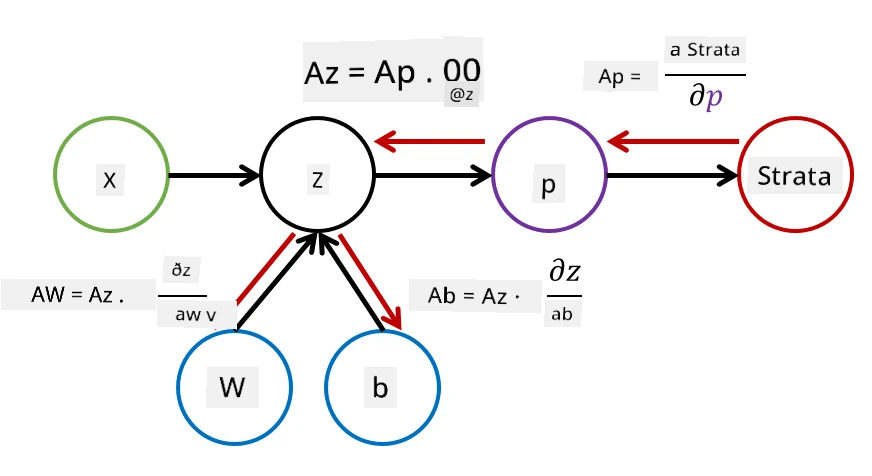

# Úvod do neurónových sietí. Viacvrstvový perceptron

V predchádzajúcej sekcii ste sa naučili o najjednoduchšom modeli neurónovej siete – jednovrstvovom perceptrone, lineárnom modeli pre dvojtriednu klasifikáciu.

V tejto sekcii rozšírime tento model na flexibilnejší rámec, ktorý nám umožní:

* vykonávať **viactriednu klasifikáciu** okrem dvojtriednej
* riešiť **regresné problémy** okrem klasifikácie
* oddeľovať triedy, ktoré nie sú lineárne oddeliteľné

Taktiež si vyvineme vlastný modulárny rámec v Pythone, ktorý nám umožní konštruovať rôzne architektúry neurónových sietí.

## [Kvíz pred prednáškou](https://ff-quizzes.netlify.app/en/ai/quiz/7)

## Formalizácia strojového učenia

Začnime formalizáciou problému strojového učenia. Predpokladajme, že máme tréningovú dátovú sadu **X** s označeniami **Y**, a potrebujeme vytvoriť model *f*, ktorý bude robiť čo najpresnejšie predpovede. Kvalita predpovedí sa meria pomocou **stratovej funkcie** &lagran;. Často sa používajú nasledujúce stratové funkcie:

* Pri regresnom probléme, keď potrebujeme predpovedať číslo, môžeme použiť **absolútnu chybu** &sum;i|f(x(i))-y(i)| alebo **kvadratickú chybu** &sum;i(f(x(i))-y(i))2
* Pri klasifikácii používame **0-1 stratu** (čo je v podstate to isté ako **presnosť** modelu) alebo **logistickú stratu**.

Pre jednovrstvový perceptron bola funkcia *f* definovaná ako lineárna funkcia *f(x)=wx+b* (tu *w* je matica váh, *x* je vektor vstupných vlastností a *b* je vektor biasu). Pre rôzne architektúry neurónových sietí môže táto funkcia nadobudnúť zložitejšiu formu.

> V prípade klasifikácie je často žiaduce získať pravdepodobnosti príslušných tried ako výstup siete. Na konverziu ľubovoľných čísel na pravdepodobnosti (napr. na normalizáciu výstupu) často používame funkciu **softmax** &sigma;, a funkcia *f* sa stáva *f(x)=&sigma;(wx+b)*.

V definícii *f* vyššie sa *w* a *b* nazývajú **parametre** &theta;=⟨*w,b*⟩. Na základe dátovej sady ⟨**X**,**Y**⟩ môžeme vypočítať celkovú chybu na celej dátovej sade ako funkciu parametrov &theta;.

> ✅ **Cieľom tréningu neurónovej siete je minimalizovať chybu zmenou parametrov &theta;**

## Optimalizácia pomocou gradientného zostupu

Existuje známa metóda optimalizácie funkcií nazývaná **gradientný zostup**. Myšlienka je, že môžeme vypočítať deriváciu (v multidimenzionálnom prípade nazývanú **gradient**) stratovej funkcie vzhľadom na parametre a meniť parametre tak, aby sa chyba znižovala. To sa dá formalizovať nasledovne:

* Inicializujte parametre náhodnými hodnotami w(0), b(0)
* Opakujte nasledujúci krok mnohokrát:
    - w(i+1) = w(i)-&eta;&part;&lagran;/&part;w
    - b(i+1) = b(i)-&eta;&part;&lagran;/&part;b

Počas tréningu sa optimalizačné kroky majú počítať s ohľadom na celú dátovú sadu (pamätajte, že strata sa počíta ako súčet cez všetky tréningové vzorky). Avšak v praxi berieme malé časti dátovej sady nazývané **minibatch-e** a počítame gradienty na základe podmnožiny dát. Keďže podmnožina sa berie náhodne pri každom kroku, takáto metóda sa nazýva **stochastický gradientný zostup** (SGD).

## Viacvrstvové perceptrony a spätná propagácia

Jednovrstvová sieť, ako sme videli vyššie, je schopná klasifikovať lineárne oddeliteľné triedy. Na vytvorenie bohatšieho modelu môžeme kombinovať niekoľko vrstiev siete. Matematicky by to znamenalo, že funkcia *f* by mala zložitejšiu formu a bude sa počítať v niekoľkých krokoch:
* z1=w1x+b1
* z2=w2&alpha;(z1)+b2
* f = &sigma;(z2)

Tu &alpha; je **nelineárna aktivačná funkcia**, &sigma; je softmax funkcia a parametre &theta;=<*w1,b1,w2,b2*>.

Algoritmus gradientného zostupu by zostal rovnaký, ale výpočet gradientov by bol zložitejší. Na základe pravidla reťazovej diferenciácie môžeme vypočítať derivácie nasledovne:

* &part;&lagran;/&part;w2 = (&part;&lagran;/&part;&sigma;)(&part;&sigma;/&part;z2)(&part;z2/&part;w2)
* &part;&lagran;/&part;w1 = (&part;&lagran;/&part;&sigma;)(&part;&sigma;/&part;z2)(&part;z2/&part;&alpha;)(&part;&alpha;/&part;z1)(&part;z1/&part;w1)

> ✅ Pravidlo reťazovej diferenciácie sa používa na výpočet derivácií stratovej funkcie vzhľadom na parametre.

Všimnite si, že ľavá časť všetkých týchto výrazov je rovnaká, a preto môžeme efektívne počítať derivácie začínajúc stratovou funkciou a postupovať "späť" cez výpočtový graf. Preto sa metóda tréningu viacvrstvového perceptronu nazýva **spätná propagácia**, alebo 'backprop'.

> TODO: citácia obrázku

> ✅ Spätnú propagáciu pokryjeme oveľa podrobnejšie v našom príklade v notebooku.  

## Záver

V tejto lekcii sme si vytvorili vlastnú knižnicu neurónových sietí a použili sme ju na jednoduchú dvojrozmernú klasifikačnú úlohu.

## 🚀 Výzva

V priloženom notebooku implementujete vlastný rámec na vytváranie a tréning viacvrstvových perceptronov. Budete môcť detailne vidieť, ako moderné neurónové siete fungujú.

Pokračujte do notebooku [OwnFramework](OwnFramework.ipynb) a prejdite si ho.

## [Kvíz po prednáške](https://ff-quizzes.netlify.app/en/ai/quiz/8)

## Prehľad a samostatné štúdium

Spätná propagácia je bežný algoritmus používaný v AI a ML, stojí za to ju [študovať podrobnejšie](https://wikipedia.org/wiki/Backpropagation).

## [Úloha](lab/README.md)

V tomto laboratóriu sa od vás požaduje použiť rámec, ktorý ste si vytvorili v tejto lekcii, na riešenie klasifikácie ručne písaných číslic MNIST.

* [Pokyny](lab/README.md)
* [Notebook](lab/MyFW_MNIST.ipynb)

---

