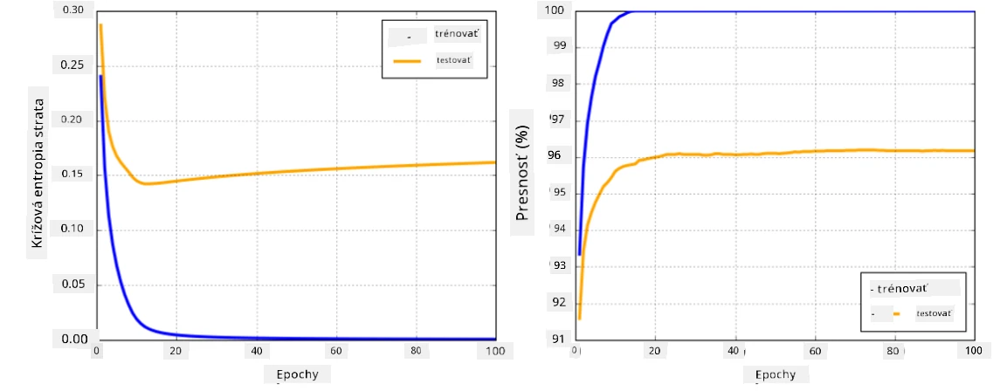

# Frameworky pre neurónové siete

Ako sme sa už naučili, na efektívne trénovanie neurónových sietí musíme urobiť dve veci:

* Pracovať s tenzormi, napr. násobiť, sčítať a počítať niektoré funkcie ako sigmoid alebo softmax
* Počítať gradienty všetkých výrazov, aby sme mohli vykonávať optimalizáciu pomocou gradientného zostupu

## [Kvíz pred prednáškou](https://ff-quizzes.netlify.app/en/ai/quiz/9)

Kým knižnica `numpy` dokáže vykonávať prvú časť, potrebujeme mechanizmus na výpočet gradientov. V [našom frameworku](../04-OwnFramework/OwnFramework.ipynb), ktorý sme vyvinuli v predchádzajúcej sekcii, sme museli manuálne programovať všetky derivácie funkcií v metóde `backward`, ktorá vykonáva spätnú propagáciu. Ideálne by mal framework umožniť výpočet gradientov *akéhokoľvek výrazu*, ktorý môžeme definovať.

Ďalšou dôležitou vecou je schopnosť vykonávať výpočty na GPU alebo iných špecializovaných výpočtových jednotkách, ako napríklad [TPU](https://en.wikipedia.org/wiki/Tensor_Processing_Unit). Trénovanie hlbokých neurónových sietí vyžaduje *veľké množstvo* výpočtov, a možnosť paralelizovať tieto výpočty na GPU je veľmi dôležitá.

> ✅ Termín 'paralelizovať' znamená rozložiť výpočty na viaceré zariadenia.

V súčasnosti sú najpopulárnejšie frameworky pre neurónové siete: [TensorFlow](http://TensorFlow.org) a [PyTorch](https://pytorch.org/). Oba poskytujú nízkoúrovňové API na prácu s tenzormi na CPU aj GPU. Na vrchole nízkoúrovňového API existuje aj vysokoúrovňové API, nazývané [Keras](https://keras.io/) a [PyTorch Lightning](https://pytorchlightning.ai/) zodpovedajúco.

Nízkoúrovňové API | [TensorFlow](http://TensorFlow.org) | [PyTorch](https://pytorch.org/)
------------------|-------------------------------------|--------------------------------
Vysokoúrovňové API| [Keras](https://keras.io/) | [PyTorch Lightning](https://pytorchlightning.ai/)

**Nízkoúrovňové API** v oboch frameworkoch umožňujú vytvárať tzv. **výpočtové grafy**. Tento graf definuje, ako vypočítať výstup (zvyčajne funkciu straty) s danými vstupnými parametrami, a môže byť posunutý na výpočet na GPU, ak je dostupný. Existujú funkcie na diferenciáciu tohto výpočtového grafu a výpočet gradientov, ktoré môžu byť následne použité na optimalizáciu parametrov modelu.

**Vysokoúrovňové API** považujú neurónové siete za **sekvenciu vrstiev** a uľahčujú konštrukciu väčšiny neurónových sietí. Trénovanie modelu zvyčajne vyžaduje prípravu dát a následné zavolanie funkcie `fit`, ktorá vykoná prácu.

Vysokoúrovňové API umožňuje rýchlo konštruovať typické neurónové siete bez starostí o množstvo detailov. Na druhej strane, nízkoúrovňové API poskytuje oveľa väčšiu kontrolu nad procesom trénovania, a preto sa často používa vo výskume, keď pracujete s novými architektúrami neurónových sietí.

Je tiež dôležité pochopiť, že môžete používať obe API spoločne, napr. môžete vyvinúť vlastnú architektúru vrstvy pomocou nízkoúrovňového API a potom ju použiť vo väčšej sieti konštruovanej a trénovanej pomocou vysokoúrovňového API. Alebo môžete definovať sieť pomocou vysokoúrovňového API ako sekvenciu vrstiev a potom použiť vlastný nízkoúrovňový tréningový cyklus na vykonanie optimalizácie. Obe API používajú rovnaké základné koncepty a sú navrhnuté tak, aby spolu dobre fungovali.

## Učenie

V tomto kurze ponúkame väčšinu obsahu pre PyTorch aj TensorFlow. Môžete si vybrať preferovaný framework a prejsť iba zodpovedajúce notebooky. Ak si nie ste istí, ktorý framework si vybrať, prečítajte si diskusie na internete o **PyTorch vs. TensorFlow**. Môžete sa tiež pozrieť na oba frameworky, aby ste získali lepšie pochopenie.

Kde je to možné, použijeme vysokoúrovňové API pre jednoduchosť. Veríme však, že je dôležité pochopiť, ako neurónové siete fungujú od základov, preto na začiatku začíname prácou s nízkoúrovňovým API a tenzormi. Ak sa však chcete rýchlo pohnúť a nechcete tráviť veľa času učením týchto detailov, môžete ich preskočiť a ísť priamo do notebookov s vysokoúrovňovým API.

## ✍️ Cvičenia: Frameworky

Pokračujte vo svojom učení v nasledujúcich notebookoch:

Nízkoúrovňové API | [TensorFlow+Keras Notebook](IntroKerasTF.ipynb) | [PyTorch](IntroPyTorch.ipynb)
------------------|-------------------------------------|--------------------------------
Vysokoúrovňové API| [Keras](IntroKeras.ipynb) | *PyTorch Lightning*

Po zvládnutí frameworkov si zopakujme koncept pretrénovania.

# Pretrénovanie (Overfitting)

Pretrénovanie je mimoriadne dôležitý koncept v strojovom učení, a je veľmi dôležité ho správne pochopiť!

Zvážte nasledujúci problém aproximácie 5 bodov (reprezentovaných `x` na grafoch nižšie):

 | 
-------------------------|--------------------------
**Lineárny model, 2 parametre** | **Nelineárny model, 7 parametrov**
Chyba trénovania = 5.3 | Chyba trénovania = 0
Chyba validácie = 5.1 | Chyba validácie = 20

* Naľavo vidíme dobrú aproximáciu priamkou. Pretože počet parametrov je primeraný, model správne pochopí rozloženie bodov.
* Napravo je model príliš výkonný. Pretože máme iba 5 bodov a model má 7 parametrov, dokáže sa prispôsobiť tak, aby prešiel všetkými bodmi, čím sa chyba trénovania stane 0. To však zabraňuje modelu pochopiť správny vzor v dátach, a preto je chyba validácie veľmi vysoká.

Je veľmi dôležité nájsť správnu rovnováhu medzi bohatstvom modelu (počet parametrov) a počtom trénovacích vzoriek.

## Prečo dochádza k pretrénovaniu

  * Nedostatok trénovacích dát
  * Príliš výkonný model
  * Príliš veľa šumu vo vstupných dátach

## Ako detekovať pretrénovanie

Ako môžete vidieť na grafe vyššie, pretrénovanie možno detekovať veľmi nízkou chybou trénovania a vysokou chybou validácie. Normálne počas trénovania vidíme, že chyby trénovania aj validácie začínajú klesať, a potom v určitom bode chyba validácie môže prestať klesať a začať stúpať. Toto bude znak pretrénovania a indikátor, že by sme mali pravdepodobne zastaviť trénovanie (alebo aspoň urobiť snímku modelu).

## Ako predísť pretrénovaniu

Ak vidíte, že dochádza k pretrénovaniu, môžete urobiť jedno z nasledujúcich:

 * Zvýšiť množstvo trénovacích dát
 * Znížiť komplexnosť modelu
 * Použiť nejakú [regularizačnú techniku](../../4-ComputerVision/08-TransferLearning/TrainingTricks.md), ako napríklad [Dropout](../../4-ComputerVision/08-TransferLearning/TrainingTricks.md#Dropout), ktorú si neskôr rozoberieme.

## Pretrénovanie a kompromis medzi biasom a varianciou

Pretrénovanie je vlastne prípad všeobecnejšieho problému v štatistike nazývaného [kompromis medzi biasom a varianciou](https://en.wikipedia.org/wiki/Bias%E2%80%93variance_tradeoff). Ak zvážime možné zdroje chyby v našom modeli, môžeme vidieť dva typy chýb:

* **Chyby biasu** sú spôsobené tým, že náš algoritmus nedokáže správne zachytiť vzťah medzi trénovacími dátami. Môže to byť výsledok toho, že náš model nie je dostatočne výkonný (**podtrénovanie**).
* **Chyby variancie**, ktoré sú spôsobené tým, že model aproximuje šum vo vstupných dátach namiesto zmysluplného vzťahu (**pretrénovanie**).

Počas trénovania chyba biasu klesá (keď sa náš model učí aproximovať dáta) a chyba variancie stúpa. Je dôležité zastaviť trénovanie - buď manuálne (keď detekujeme pretrénovanie) alebo automaticky (zavedením regularizácie) - aby sme predišli pretrénovaniu.

## Záver

V tejto lekcii ste sa naučili rozdiely medzi rôznymi API pre dva najpopulárnejšie AI frameworky, TensorFlow a PyTorch. Okrem toho ste sa naučili o veľmi dôležitej téme, pretrénovaní.

## 🚀 Výzva

V sprievodných notebookoch nájdete 'úlohy' na konci; prejdite si notebooky a splňte úlohy.

## [Kvíz po prednáške](https://ff-quizzes.netlify.app/en/ai/quiz/10)

## Prehľad & Samoštúdium

Preskúmajte nasledujúce témy:

- TensorFlow
- PyTorch
- Pretrénovanie

Položte si nasledujúce otázky:

- Aký je rozdiel medzi TensorFlow a PyTorch?
- Aký je rozdiel medzi pretrénovaním a podtrénovaním?

## [Úloha](lab/README.md)

V tomto laboratóriu máte za úlohu vyriešiť dva klasifikačné problémy pomocou jedno- a viacvrstvových plne prepojených sietí s použitím PyTorch alebo TensorFlow.

* [Inštrukcie](lab/README.md)
* [Notebook](lab/LabFrameworks.ipynb)

---

