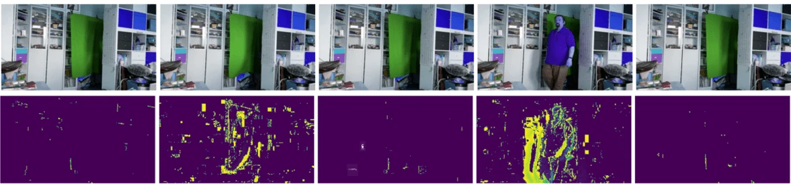

# Úvod do počítačového videnia

[Počítačové videnie](https://wikipedia.org/wiki/Computer_vision) je disciplína, ktorej cieľom je umožniť počítačom získavať vysokú úroveň porozumenia digitálnym obrázkom. Ide o pomerne širokú definíciu, pretože *porozumenie* môže znamenať mnoho rôznych vecí, vrátane nájdenia objektu na obrázku (**detekcia objektov**), pochopenia, čo sa deje (**detekcia udalostí**), opísania obrázku textom alebo rekonštrukcie scény v 3D. Existujú aj špeciálne úlohy týkajúce sa ľudských obrázkov: odhad veku a emócií, detekcia a identifikácia tváre, či odhad 3D pozície, aby sme spomenuli aspoň niektoré.

## [Kvíz pred prednáškou](https://ff-quizzes.netlify.app/en/ai/quiz/11)

Jednou z najjednoduchších úloh počítačového videnia je **klasifikácia obrázkov**.

Počítačové videnie sa často považuje za odvetvie AI. V súčasnosti sa väčšina úloh počítačového videnia rieši pomocou neurónových sietí. Viac sa dozvieme o špeciálnom type neurónových sietí používaných v počítačovom videní, [konvolučných neurónových sieťach](../07-ConvNets/README.md), v priebehu tejto sekcie.

Avšak predtým, než obrázok prejde neurónovou sieťou, v mnohých prípadoch má zmysel použiť niektoré algoritmické techniky na jeho vylepšenie.

Existuje niekoľko knižníc v Pythone dostupných na spracovanie obrázkov:

* **[imageio](https://imageio.readthedocs.io/en/stable/)** sa dá použiť na čítanie/zapisovanie rôznych formátov obrázkov. Podporuje tiež ffmpeg, užitočný nástroj na konverziu video snímok na obrázky.
* **[Pillow](https://pillow.readthedocs.io/en/stable/index.html)** (známy aj ako PIL) je o niečo výkonnejší a podporuje aj manipuláciu s obrázkami, ako je morfovanie, úprava palety a ďalšie.
* **[OpenCV](https://opencv.org/)** je výkonná knižnica na spracovanie obrázkov napísaná v C++, ktorá sa stala *de facto* štandardom pre spracovanie obrázkov. Má pohodlné rozhranie pre Python.
* **[dlib](http://dlib.net/)** je knižnica v C++, ktorá implementuje mnoho algoritmov strojového učenia, vrátane niektorých algoritmov počítačového videnia. Má tiež rozhranie pre Python a dá sa použiť na náročné úlohy, ako je detekcia tváre a detekcia orientačných bodov na tvári.

## OpenCV

[OpenCV](https://opencv.org/) sa považuje za *de facto* štandard pre spracovanie obrázkov. Obsahuje množstvo užitočných algoritmov implementovaných v C++. OpenCV môžete používať aj z Pythonu.

Dobré miesto na učenie sa OpenCV je [tento kurz Learn OpenCV](https://learnopencv.com/getting-started-with-opencv/). V našom učebnom pláne nie je cieľom naučiť sa OpenCV, ale ukázať vám niektoré príklady, kedy ho možno použiť a ako.

### Načítanie obrázkov

Obrázky v Pythone môžu byť pohodlne reprezentované pomocou NumPy polí. Napríklad, čiernobiele obrázky s rozmermi 320x200 pixelov by boli uložené v poli 200x320 a farebné obrázky rovnakých rozmerov by mali tvar 200x320x3 (pre 3 farebné kanály). Na načítanie obrázku môžete použiť nasledujúci kód:

```python
import cv2
import matplotlib.pyplot as plt

im = cv2.imread('image.jpeg')
plt.imshow(im)
```

Tradične OpenCV používa kódovanie BGR (modrá-zelená-červená) pre farebné obrázky, zatiaľ čo ostatné nástroje v Pythone používajú tradičnejšie RGB (červená-zelená-modrá). Aby obrázok vyzeral správne, musíte ho previesť do farebného priestoru RGB, buď výmenou rozmerov v NumPy poli, alebo zavolaním funkcie OpenCV:

```python
im = cv2.cvtColor(im,cv2.COLOR_BGR2RGB)
```

Tá istá funkcia `cvtColor` sa dá použiť na vykonanie iných transformácií farebného priestoru, ako je prevod obrázku na čiernobiely alebo na HSV (odtieň-sýtosť-hodnota).

OpenCV môžete tiež použiť na načítanie videa snímku po snímke - príklad je uvedený v cvičení [OpenCV Notebook](OpenCV.ipynb).

### Spracovanie obrázkov

Predtým, než obrázok prejde neurónovou sieťou, môžete chcieť aplikovať niekoľko krokov predspracovania. OpenCV dokáže mnoho vecí, vrátane:

* **Zmenšenia/zväčšenia** obrázku pomocou `im = cv2.resize(im, (320,200),interpolation=cv2.INTER_LANCZOS)`
* **Rozmazania** obrázku pomocou `im = cv2.medianBlur(im,3)` alebo `im = cv2.GaussianBlur(im, (3,3), 0)`
* Zmena **jasu a kontrastu** obrázku sa dá vykonať manipuláciou NumPy polí, ako je popísané [v tejto poznámke na Stackoverflow](https://stackoverflow.com/questions/39308030/how-do-i-increase-the-contrast-of-an-image-in-python-opencv).
* Použitie [prahovania](https://docs.opencv.org/4.x/d7/d4d/tutorial_py_thresholding.html) zavolaním funkcií `cv2.threshold`/`cv2.adaptiveThreshold`, čo je často výhodnejšie ako úprava jasu alebo kontrastu.
* Aplikácia rôznych [transformácií](https://docs.opencv.org/4.5.5/da/d6e/tutorial_py_geometric_transformations.html) na obrázok:
    - **[Afinné transformácie](https://docs.opencv.org/4.5.5/d4/d61/tutorial_warp_affine.html)** môžu byť užitočné, ak potrebujete kombinovať rotáciu, zmenšenie/zväčšenie a skosenie obrázku a poznáte zdrojovú a cieľovú polohu troch bodov na obrázku. Afinné transformácie zachovávajú paralelné čiary.
    - **[Perspektívne transformácie](https://medium.com/analytics-vidhya/opencv-perspective-transformation-9edffefb2143)** môžu byť užitočné, keď poznáte zdrojové a cieľové polohy štyroch bodov na obrázku. Napríklad, ak urobíte fotografiu obdĺžnikového dokumentu pomocou kamery smartfónu z určitého uhla a chcete vytvoriť obdĺžnikový obrázok samotného dokumentu.
* Pochopenie pohybu v obrázku pomocou **[optického toku](https://docs.opencv.org/4.5.5/d4/dee/tutorial_optical_flow.html)**.

## Príklady použitia počítačového videnia

V našom [OpenCV Notebook](OpenCV.ipynb) uvádzame niekoľko príkladov, kedy sa počítačové videnie môže použiť na vykonanie konkrétnych úloh:

* **Predspracovanie fotografie Braillovej knihy**. Zameriavame sa na to, ako môžeme použiť prahovanie, detekciu vlastností, perspektívnu transformáciu a manipuláciu s NumPy na oddelenie jednotlivých Braillových symbolov na ďalšiu klasifikáciu neurónovou sieťou.

 |  | 
----|-----|-----

> Obrázok z [OpenCV.ipynb](OpenCV.ipynb)

* **Detekcia pohybu vo videu pomocou rozdielu snímok**. Ak je kamera pevná, snímky z kamery by mali byť veľmi podobné. Keďže snímky sú reprezentované ako polia, jednoduchým odčítaním týchto polí pre dve po sebe idúce snímky získame rozdiel pixelov, ktorý by mal byť nízky pre statické snímky a vyšší, keď je v obrázku výrazný pohyb.



> Obrázok z [OpenCV.ipynb](OpenCV.ipynb)

* **Detekcia pohybu pomocou optického toku**. [Optický tok](https://docs.opencv.org/3.4/d4/dee/tutorial_optical_flow.html) nám umožňuje pochopiť, ako sa jednotlivé pixely na video snímkach pohybujú. Existujú dva typy optického toku:

   - **Hustý optický tok** vypočíta vektorové pole, ktoré ukazuje, kam sa každý pixel pohybuje.
   - **Riedky optický tok** je založený na výbere niektorých výrazných vlastností na obrázku (napr. hrany) a budovaní ich trajektórie zo snímky na snímku.


> Obrázok z [OpenCV.ipynb](OpenCV.ipynb)

## ✍️ Príkladové notebooky: OpenCV [vyskúšajte OpenCV v akcii](OpenCV.ipynb)

Poďme urobiť niekoľko experimentov s OpenCV preskúmaním [OpenCV Notebook](OpenCV.ipynb)

## Záver

Niekedy je možné relatívne zložité úlohy, ako je detekcia pohybu alebo detekcia končekov prstov, vyriešiť čisto pomocou počítačového videnia. Preto je veľmi užitočné poznať základné techniky počítačového videnia a čo knižnice ako OpenCV dokážu.

## 🚀 Výzva

Pozrite si [toto video](https://docs.microsoft.com/shows/ai-show/ai-show--2021-opencv-ai-competition--grand-prize-winners--cortic-tigers--episode-32?WT.mc_id=academic-77998-cacaste) zo série AI show, aby ste sa dozvedeli o projekte Cortic Tigers a o tom, ako vytvorili riešenie založené na blokoch na demokratizáciu úloh počítačového videnia prostredníctvom robota. Urobte si prieskum o ďalších podobných projektoch, ktoré pomáhajú novým záujemcom vstúpiť do tejto oblasti.

## [Kvíz po prednáške](https://ff-quizzes.netlify.app/en/ai/quiz/12)

## Prehľad a samostatné štúdium

Prečítajte si viac o optickom toku [v tomto skvelom tutoriáli](https://learnopencv.com/optical-flow-in-opencv/).

## [Úloha](lab/README.md)

V tomto laboratóriu natočíte video s jednoduchými gestami a vaším cieľom bude extrahovať pohyby hore/dole/vľavo/vpravo pomocou optického toku.


---

