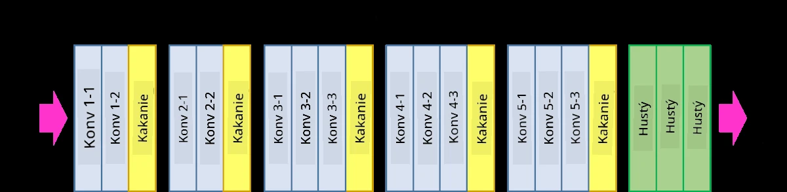
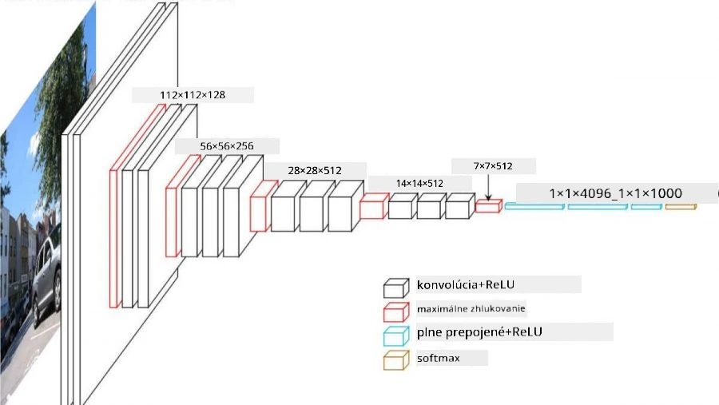
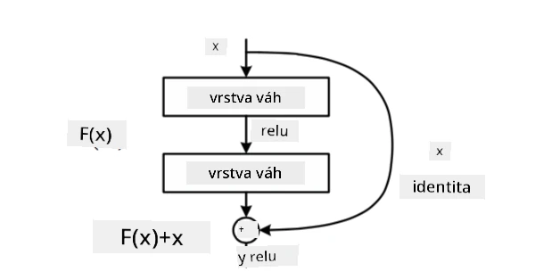
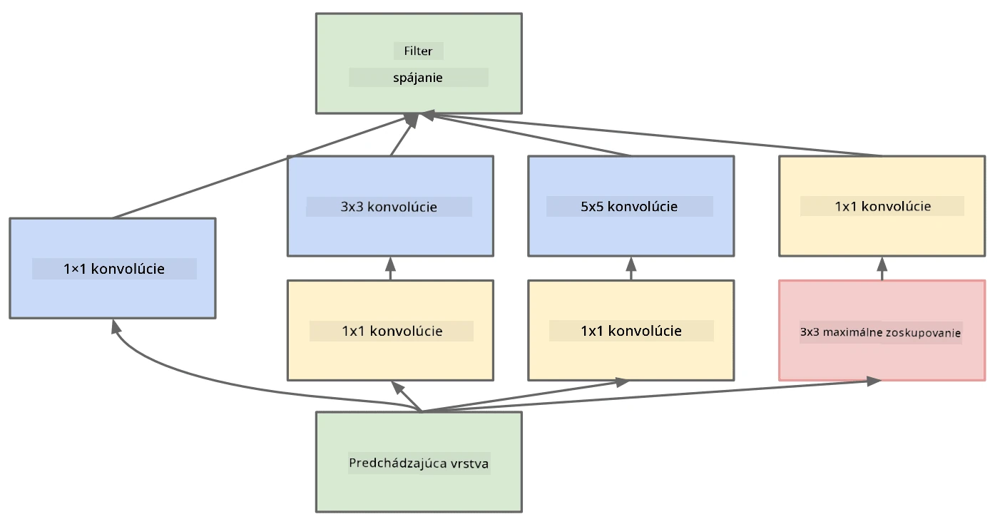

# Známe architektúry CNN

### VGG-16

VGG-16 je sieť, ktorá dosiahla 92,7% presnosť v klasifikácii ImageNet top-5 v roku 2014. Má nasledujúcu štruktúru vrstiev:

Ako môžete vidieť, VGG nasleduje tradičnú pyramídovú architektúru, ktorá je sekvenciou vrstiev konvolúcie a pooling.

> Obrázok z [Researchgate](https://www.researchgate.net/figure/Vgg16-model-structure-To-get-the-VGG-NIN-model-we-replace-the-2-nd-4-th-6-th-7-th_fig2_335194493)

### ResNet

ResNet je rodina modelov navrhnutá Microsoft Research v roku 2015. Hlavnou myšlienkou ResNet je použitie **reziduálnych blokov**:

> Obrázok z [tohto článku](https://arxiv.org/pdf/1512.03385.pdf)

Dôvodom použitia identity pass-through je, aby naša vrstva predpovedala **rozdiel** medzi výsledkom predchádzajúcej vrstvy a výstupom reziduálneho bloku - odtiaľ názov *reziduálny*. Tieto bloky sú oveľa jednoduchšie na trénovanie a je možné vytvoriť siete s niekoľkými stovkami týchto blokov (najbežnejšie varianty sú ResNet-52, ResNet-101 a ResNet-152).

Môžete si tiež predstaviť túto sieť ako schopnú prispôsobiť svoju komplexnosť datasetu. Na začiatku, keď začínate trénovať sieť, hodnoty váh sú malé a väčšina signálu prechádza cez identity vrstvy. Ako tréning pokračuje a váhy sa zväčšujú, význam parametrov siete rastie a sieť sa prispôsobuje, aby poskytla potrebnú expresívnu silu na správnu klasifikáciu tréningových obrázkov.

### Google Inception

Architektúra Google Inception posúva túto myšlienku o krok ďalej a buduje každú vrstvu siete ako kombináciu niekoľkých rôznych ciest:

> Obrázok z [Researchgate](https://www.researchgate.net/figure/Inception-module-with-dimension-reductions-left-and-schema-for-Inception-ResNet-v1_fig2_355547454)

Tu je potrebné zdôrazniť úlohu konvolúcií 1x1, pretože na prvý pohľad nedávajú zmysel. Prečo by sme mali prechádzať obrázok s filtrom 1x1? Avšak, je potrebné si uvedomiť, že konvolučné filtre pracujú aj s viacerými hĺbkovými kanálmi (pôvodne - RGB farby, v následných vrstvách - kanály pre rôzne filtre) a konvolúcia 1x1 sa používa na miešanie týchto vstupných kanálov pomocou rôznych trénovateľných váh. Môže byť tiež vnímaná ako downsampling (pooling) cez dimenziu kanálov.

Tu je [dobrý blogový príspevok](https://medium.com/analytics-vidhya/talented-mr-1x1-comprehensive-look-at-1x1-convolution-in-deep-learning-f6b355825578) na túto tému a [pôvodný článok](https://arxiv.org/pdf/1312.4400.pdf).

### MobileNet

MobileNet je rodina modelov so zmenšenou veľkosťou, vhodná pre mobilné zariadenia. Použite ich, ak máte obmedzené zdroje a môžete obetovať trochu presnosti. Hlavnou myšlienkou za nimi je tzv. **depthwise separable convolution**, ktorá umožňuje reprezentovať konvolučné filtre ako kompozíciu priestorových konvolúcií a konvolúcie 1x1 cez hĺbkové kanály. To výrazne znižuje počet parametrov, čím sa sieť zmenšuje a je tiež jednoduchšia na trénovanie s menším množstvom dát.

Tu je [dobrý blogový príspevok o MobileNet](https://medium.com/analytics-vidhya/image-classification-with-mobilenet-cc6fbb2cd470).

## Záver

V tejto jednotke ste sa naučili hlavný koncept za neurónovými sieťami pre počítačové videnie - konvolučné siete. Architektúry z reálneho života, ktoré poháňajú klasifikáciu obrázkov, detekciu objektov a dokonca aj generovanie obrázkov, sú všetky založené na CNN, len s viacerými vrstvami a niektorými dodatočnými trikmi pri tréningu.

## 🚀 Výzva

V sprievodných notebookoch sú poznámky na spodku o tom, ako dosiahnuť vyššiu presnosť. Urobte niekoľko experimentov a zistite, či dokážete dosiahnuť vyššiu presnosť.

## [Kvíz po prednáške](https://ff-quizzes.netlify.app/en/ai/quiz/14)

## Prehľad & Samoštúdium

Aj keď sa CNN najčastejšie používajú na úlohy počítačového videnia, sú všeobecne dobré na extrakciu vzorov s pevnou veľkosťou. Napríklad, ak pracujeme so zvukmi, môžeme tiež chcieť použiť CNN na hľadanie špecifických vzorov v audio signále - v takom prípade by filtre boli 1-dimenzionálne (a táto CNN by sa nazývala 1D-CNN). Tiež sa niekedy používa 3D-CNN na extrakciu vlastností v multidimenzionálnom priestore, ako sú určité udalosti odohrávajúce sa na videu - CNN dokáže zachytiť určité vzory zmien vlastností v priebehu času. Urobte si prehľad a samoštúdium o ďalších úlohách, ktoré je možné vykonávať pomocou CNN.

## [Úloha](lab/README.md)

V tomto laboratóriu máte za úlohu klasifikovať rôzne plemená mačiek a psov. Tieto obrázky sú zložitejšie ako dataset MNIST, majú vyššie rozmery a je ich viac ako 10 tried.

---

