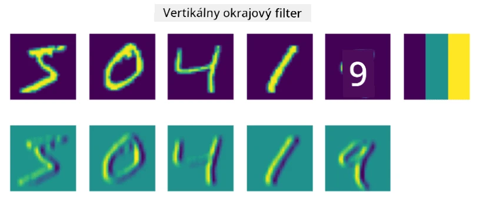
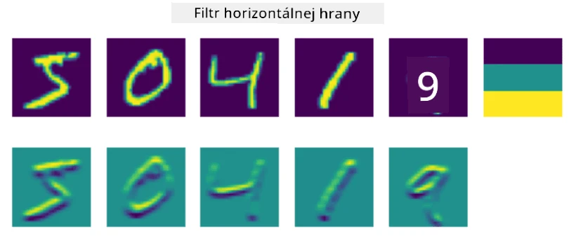
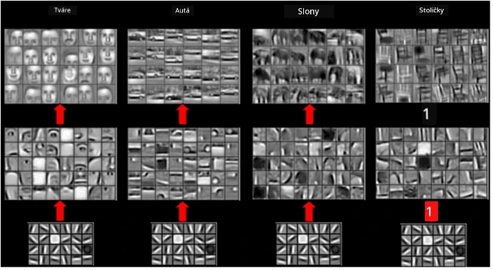

# Konvolučné neurónové siete

Už sme videli, že neurónové siete sú veľmi dobré pri práci s obrázkami, a dokonca aj jednovrstvový perceptron dokáže rozpoznať ručne písané číslice z datasetu MNIST s primeranou presnosťou. Dataset MNIST je však veľmi špecifický, pretože všetky číslice sú centrované v obrázku, čo úlohu značne zjednodušuje.

## [Kvíz pred prednáškou](https://ff-quizzes.netlify.app/en/ai/quiz/13)

V reálnom živote chceme byť schopní rozpoznať objekty na obrázku bez ohľadu na ich presnú polohu v rámci obrázka. Počítačové videnie sa líši od všeobecnej klasifikácie, pretože keď sa snažíme nájsť určitý objekt na obrázku, prehľadávame obrázok a hľadáme špecifické **vzory** a ich kombinácie. Napríklad, keď hľadáme mačku, najskôr môžeme hľadať horizontálne čiary, ktoré môžu tvoriť fúzy, a potom určitá kombinácia fúzov nám môže naznačiť, že ide o obrázok mačky. Relatívna poloha a prítomnosť určitých vzorov sú dôležité, nie ich presná poloha na obrázku.

Na extrakciu vzorov použijeme koncept **konvolučných filtrov**. Ako viete, obrázok je reprezentovaný ako 2D-matica alebo 3D-tenzor s farebnou hĺbkou. Aplikácia filtra znamená, že vezmeme relatívne malú **jadrovú maticu filtra** a pre každý pixel v pôvodnom obrázku vypočítame vážený priemer so susednými bodmi. Môžeme si to predstaviť ako malé okno, ktoré sa posúva po celom obrázku a spriemeruje všetky pixely podľa váh v jadrovej matici filtra.

 | 
----|----

> Obrázok od Dmitry Soshnikov

Napríklad, ak aplikujeme 3x3 vertikálny a horizontálny filter hrán na číslice MNIST, môžeme získať zvýraznenia (napr. vysoké hodnoty) tam, kde sú vertikálne a horizontálne hrany v pôvodnom obrázku. Tieto dva filtre teda môžeme použiť na "hľadanie" hrán. Podobne môžeme navrhnúť rôzne filtre na hľadanie iných nízkoúrovňových vzorov:

> Obrázok [Leung-Malik Filter Bank](https://www.robots.ox.ac.uk/~vgg/research/texclass/filters.html)

Avšak, zatiaľ čo môžeme manuálne navrhnúť filtre na extrakciu určitých vzorov, môžeme tiež navrhnúť sieť tak, aby sa vzory učila automaticky. Toto je jedna z hlavných myšlienok za CNN.

## Hlavné myšlienky za CNN

Princíp fungovania CNN je založený na nasledujúcich dôležitých myšlienkach:

* Konvolučné filtre dokážu extrahovať vzory
* Môžeme navrhnúť sieť tak, aby sa filtre učili automaticky
* Rovnaký prístup môžeme použiť na hľadanie vzorov vo vysokoúrovňových vlastnostiach, nielen v pôvodnom obrázku. Extrakcia vlastností pomocou CNN teda funguje na hierarchii vlastností, od nízkoúrovňových kombinácií pixelov až po vysokoúrovňové kombinácie častí obrázku.

> Obrázok z [práce Hislop-Lynch](https://www.semanticscholar.org/paper/Computer-vision-based-pedestrian-trajectory-Hislop-Lynch/26e6f74853fc9bbb7487b06dc2cf095d36c9021d), založený na [ich výskume](https://dl.acm.org/doi/abs/10.1145/1553374.1553453)

## ✍️ Cvičenia: Konvolučné neurónové siete

Pokračujme v skúmaní, ako konvolučné neurónové siete fungujú a ako môžeme dosiahnuť trénovateľné filtre, prostredníctvom nasledujúcich notebookov:

* [Konvolučné neurónové siete - PyTorch](ConvNetsPyTorch.ipynb)
* [Konvolučné neurónové siete - TensorFlow](ConvNetsTF.ipynb)

## Pyramídová architektúra

Väčšina CNN používaných na spracovanie obrázkov nasleduje tzv. pyramídovú architektúru. Prvá konvolučná vrstva aplikovaná na pôvodné obrázky má zvyčajne relatívne nízky počet filtrov (8-16), ktoré zodpovedajú rôznym kombináciám pixelov, ako sú horizontálne/vertikálne čiary alebo ťahy. Na ďalšej úrovni znižujeme priestorovú dimenziu siete a zvyšujeme počet filtrov, čo zodpovedá väčšiemu počtu možných kombinácií jednoduchých vlastností. S každou vrstvou, ako sa posúvame k finálnemu klasifikátoru, priestorové rozmery obrázka klesajú a počet filtrov rastie.

Ako príklad sa pozrime na architektúru VGG-16, siete, ktorá dosiahla 92,7% presnosť v top-5 klasifikácii ImageNet v roku 2014:

> Obrázok z [Researchgate](https://www.researchgate.net/figure/Vgg16-model-structure-To-get-the-VGG-NIN-model-we-replace-the-2-nd-4-th-6-th-7-th_fig2_335194493)

## Najznámejšie architektúry CNN

[Pokračujte v štúdiu najznámejších architektúr CNN](CNN_Architectures.md)

---

