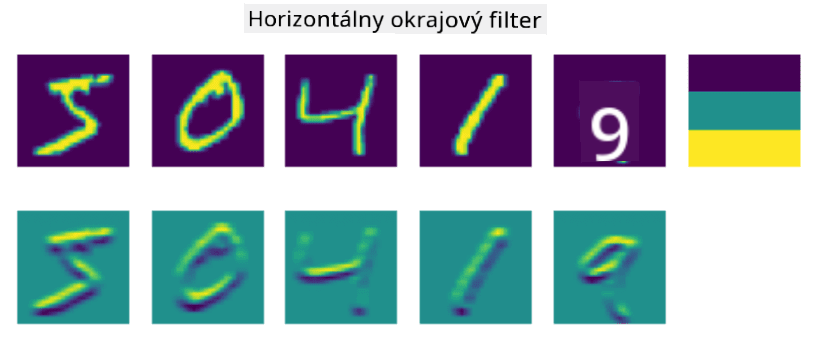

<!--
CO_OP_TRANSLATOR_METADATA:
{
  "original_hash": "088837b42b7d99198bf62db8a42411e0",
  "translation_date": "2025-08-25T22:51:56+00:00",
  "source_file": "lessons/4-ComputerVision/07-ConvNets/README.md",
  "language_code": "sk"
}
-->
# Konvolučné neurónové siete

Už sme videli, že neurónové siete sú veľmi dobré pri práci s obrázkami, a dokonca aj jednovrstvový perceptron dokáže rozpoznať ručne písané číslice z datasetu MNIST s primeranou presnosťou. Dataset MNIST je však veľmi špecifický, pretože všetky číslice sú vycentrované v obrázku, čo úlohu zjednodušuje.

## [Kvíz pred prednáškou](https://ff-quizzes.netlify.app/en/ai/quiz/13)

V reálnom živote chceme byť schopní rozpoznať objekty na obrázku bez ohľadu na ich presnú polohu v rámci obrázka. Počítačové videnie sa líši od všeobecnej klasifikácie, pretože pri hľadaní konkrétneho objektu na obrázku prehľadávame obraz a hľadáme špecifické **vzory** a ich kombinácie. Napríklad, pri hľadaní mačky môžeme najskôr hľadať horizontálne línie, ktoré môžu tvoriť fúzy, a potom určitá kombinácia fúzov nám môže naznačiť, že ide o obrázok mačky. Relatívna poloha a prítomnosť určitých vzorov sú dôležité, nie ich presná poloha na obrázku.

Na extrakciu vzorov použijeme pojem **konvolučné filtre**. Ako viete, obrázok je reprezentovaný 2D maticou alebo 3D tenzorom s farebnou hĺbkou. Aplikácia filtra znamená, že vezmeme relatívne malú maticu nazývanú **jadro filtra** a pre každý pixel v pôvodnom obrázku vypočítame vážený priemer so susednými bodmi. Môžeme si to predstaviť ako malé okno, ktoré sa posúva po celom obrázku a spriemeruje všetky pixely podľa váh v matici jadra filtra.

 | 
----|----

> Obrázok od Dmitry Soshnikov

Napríklad, ak aplikujeme 3x3 vertikálny a horizontálny okrajový filter na číslice z MNIST, môžeme zvýrazniť (napr. vysoké hodnoty) miesta, kde sú vertikálne a horizontálne okraje v pôvodnom obrázku. Tieto dva filtre teda môžeme použiť na "hľadanie" okrajov. Podobne môžeme navrhnúť rôzne filtre na hľadanie iných nízkoúrovňových vzorov:

> Obrázok [Leung-Malik Filter Bank](https://www.robots.ox.ac.uk/~vgg/research/texclass/filters.html)

Avšak, zatiaľ čo filtre môžeme navrhnúť manuálne na extrakciu určitých vzorov, môžeme tiež navrhnúť sieť tak, aby sa vzory učila automaticky. To je jedna z hlavných myšlienok za CNN.

## Hlavné myšlienky za CNN

Fungovanie CNN je založené na nasledujúcich dôležitých myšlienkach:

* Konvolučné filtre dokážu extrahovať vzory
* Môžeme navrhnúť sieť tak, aby sa filtre trénovali automaticky
* Rovnaký prístup môžeme použiť na hľadanie vzorov vo vysokoúrovňových črtách, nielen v pôvodnom obrázku. Extrakcia čŕt v CNN teda funguje na hierarchii čŕt, počnúc nízkoúrovňovými kombináciami pixelov až po vysokoúrovňové kombinácie častí obrázka.

> Obrázok z [práce Hislop-Lynch](https://www.semanticscholar.org/paper/Computer-vision-based-pedestrian-trajectory-Hislop-Lynch/26e6f74853fc9bbb7487b06dc2cf095d36c9021d), založené na [ich výskume](https://dl.acm.org/doi/abs/10.1145/1553374.1553453)

## ✍️ Cvičenia: Konvolučné neurónové siete

Pokračujme v skúmaní, ako fungujú konvolučné neurónové siete a ako môžeme dosiahnuť trénovateľné filtre, prostredníctvom nasledujúcich notebookov:

* [Konvolučné neurónové siete - PyTorch](../../../../../lessons/4-ComputerVision/07-ConvNets/ConvNetsPyTorch.ipynb)
* [Konvolučné neurónové siete - TensorFlow](../../../../../lessons/4-ComputerVision/07-ConvNets/ConvNetsTF.ipynb)

## Pyramídová architektúra

Väčšina CNN používaných na spracovanie obrázkov nasleduje tzv. pyramídovú architektúru. Prvá konvolučná vrstva aplikovaná na pôvodné obrázky má zvyčajne relatívne nízky počet filtrov (8-16), ktoré zodpovedajú rôznym kombináciám pixelov, ako sú horizontálne/vertikálne línie alebo ťahy. Na ďalšej úrovni znižujeme priestorovú dimenziu siete a zvyšujeme počet filtrov, čo zodpovedá väčšiemu počtu možných kombinácií jednoduchých čŕt. S každou vrstvou, ako sa približujeme k finálnemu klasifikátoru, sa priestorové rozmery obrázka zmenšujú a počet filtrov rastie.

Ako príklad sa pozrime na architektúru VGG-16, siete, ktorá dosiahla 92,7% presnosť v top-5 klasifikácii ImageNet v roku 2014:

> Obrázok z [Researchgate](https://www.researchgate.net/figure/Vgg16-model-structure-To-get-the-VGG-NIN-model-we-replace-the-2-nd-4-th-6-th-7-th_fig2_335194493)

## Najznámejšie architektúry CNN

[Pokračujte v štúdiu o najznámejších architektúrach CNN](CNN_Architectures.md)

**Zrieknutie sa zodpovednosti**:  
Tento dokument bol preložený pomocou služby AI prekladu [Co-op Translator](https://github.com/Azure/co-op-translator). Hoci sa snažíme o presnosť, prosím, berte na vedomie, že automatizované preklady môžu obsahovať chyby alebo nepresnosti. Pôvodný dokument v jeho rodnom jazyku by mal byť považovaný za autoritatívny zdroj. Pre kritické informácie sa odporúča profesionálny ľudský preklad. Nenesieme zodpovednosť za akékoľvek nedorozumenia alebo nesprávne interpretácie vyplývajúce z použitia tohto prekladu.