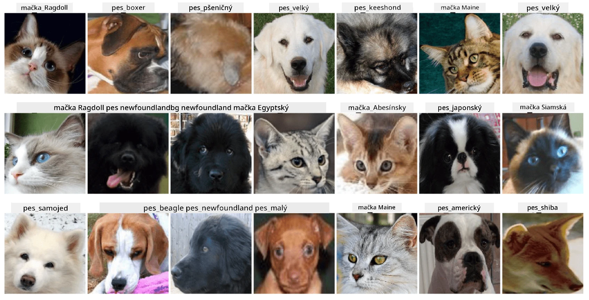

# Klasifikácia tvárí domácich zvierat

Laboratórna úloha z [AI for Beginners Curriculum](https://github.com/microsoft/ai-for-beginners).

## Úloha

Predstavte si, že potrebujete vyvinúť aplikáciu pre škôlku domácich zvierat na katalogizáciu všetkých zvierat. Jednou z výnimočných funkcií takejto aplikácie by bolo automatické rozpoznanie plemena z fotografie. Toto je možné úspešne dosiahnuť pomocou neurónových sietí.

Vašou úlohou je vytrénovať konvolučnú neurónovú sieť na klasifikáciu rôznych plemien mačiek a psov pomocou datasetu **Pet Faces**.

## Dataset

Použijeme [Oxford-IIIT Pet Dataset](https://www.robots.ox.ac.uk/~vgg/data/pets/), ktorý obsahuje obrázky 37 rôznych plemien psov a mačiek.



Na stiahnutie datasetu použite tento kód:

```python
!wget https://thor.robots.ox.ac.uk/~vgg/data/pets/images.tar.gz
!tar xfz images.tar.gz
!rm images.tar.gz
```

**Poznámka:** Obrázky v Oxford-IIIT Pet Dataset sú organizované podľa názvu súboru (napr. `Abyssinian_1.jpg`, `Bengal_2.jpg`). Notebook obsahuje kód na usporiadanie týchto obrázkov do podadresárov podľa plemien pre jednoduchšiu klasifikáciu.

## Začiatok práce s notebookom

Začnite laboratórnu úlohu otvorením [PetFaces.ipynb](PetFaces.ipynb)

## Záver

Podarilo sa vám vyriešiť pomerne zložitý problém klasifikácie obrázkov od základu! Bolo tu veľa tried, a napriek tomu ste dokázali dosiahnuť rozumnú presnosť! Má tiež zmysel merať top-k presnosť, pretože je ľahké zameniť niektoré triedy, ktoré nie sú jasne odlišné ani pre ľudí.

---

**Upozornenie**:  
Tento dokument bol preložený pomocou služby AI prekladu [Co-op Translator](https://github.com/Azure/co-op-translator). Hoci sa snažíme o presnosť, prosím, uvedomte si, že automatizované preklady môžu obsahovať chyby alebo nepresnosti. Pôvodný dokument v jeho pôvodnom jazyku by mal byť považovaný za autoritatívny zdroj. Pre kritické informácie sa odporúča profesionálny ľudský preklad. Nezodpovedáme za žiadne nedorozumenia alebo nesprávne interpretácie vyplývajúce z použitia tohto prekladu.