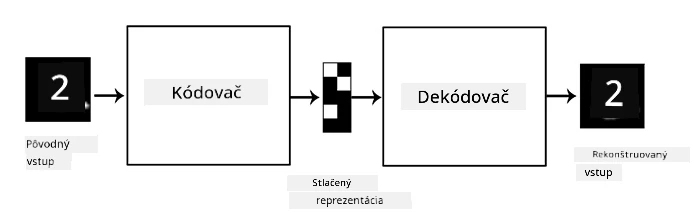
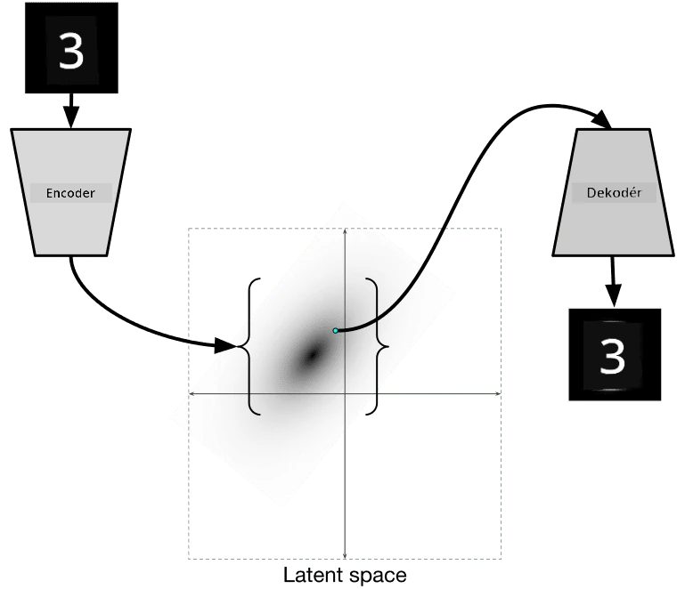

# Autoenkodéry

Pri trénovaní CNN je jedným z problémov, že potrebujeme veľké množstvo označených dát. V prípade klasifikácie obrázkov musíme obrázky rozdeliť do rôznych tried, čo si vyžaduje manuálnu prácu.

## [Kvíz pred prednáškou](https://ff-quizzes.netlify.app/en/ai/quiz/17)

Avšak, môžeme chcieť použiť surové (neoznačené) dáta na trénovanie CNN extraktorov vlastností, čo sa nazýva **samoriadené učenie**. Namiesto označení použijeme trénovacie obrázky ako vstup aj výstup siete. Hlavná myšlienka **autoenkodéra** je, že budeme mať **enkodérovú sieť**, ktorá konvertuje vstupný obrázok do určitého **latentného priestoru** (zvyčajne je to len vektor menšej veľkosti), a potom **dekodérovú sieť**, ktorej cieľom bude rekonštruovať pôvodný obrázok.

> ✅ [Autoenkodér](https://wikipedia.org/wiki/Autoencoder) je "typ umelej neurónovej siete, ktorá sa používa na učenie efektívneho kódovania neoznačených dát."

Keďže trénujeme autoenkodér, aby zachytil čo najviac informácií z pôvodného obrázku na presnú rekonštrukciu, sieť sa snaží nájsť najlepšie **zobrazenie** vstupných obrázkov, aby zachytila ich význam.

> Obrázok z [blogu Keras](https://blog.keras.io/building-autoencoders-in-keras.html)

## Scenáre použitia autoenkodérov

Aj keď rekonštrukcia pôvodných obrázkov nemusí byť sama o sebe užitočná, existuje niekoľko scenárov, kde sú autoenkodéry obzvlášť užitočné:

* **Zníženie dimenzie obrázkov na vizualizáciu** alebo **trénovanie zobrazení obrázkov**. Autoenkodéry zvyčajne poskytujú lepšie výsledky ako PCA, pretože berú do úvahy priestorovú povahu obrázkov a hierarchické vlastnosti.
* **Odstraňovanie šumu**, t.j. odstránenie šumu z obrázku. Keďže šum obsahuje veľa nepotrebných informácií, autoenkodér ho nedokáže všetok zapísať do relatívne malého latentného priestoru, a tak zachytí iba dôležitú časť obrázku. Pri trénovaní odstraňovačov šumu začíname s pôvodnými obrázkami a používame obrázky s umelo pridaným šumom ako vstup pre autoenkodér.
* **Super-rezolúcia**, zvýšenie rozlíšenia obrázkov. Začíname s obrázkami vo vysokom rozlíšení a používame obrázky s nižším rozlíšením ako vstup pre autoenkodér.
* **Generatívne modely**. Po natrénovaní autoenkodéra môžeme dekodérovú časť použiť na vytváranie nových objektov začínajúc od náhodných latentných vektorov.

## Variabilné autoenkodéry (VAE)

Tradičné autoenkodéry znižujú dimenziu vstupných dát určitým spôsobom, pričom identifikujú dôležité vlastnosti vstupných obrázkov. Avšak, latentné vektory často nedávajú veľký zmysel. Inými slovami, ak vezmeme dataset MNIST ako príklad, zistiť, ktoré číslice zodpovedajú rôznym latentným vektorom, nie je jednoduchá úloha, pretože blízke latentné vektory nemusia nevyhnutne zodpovedať rovnakým čísliciam.

Na druhej strane, na trénovanie *generatívnych* modelov je lepšie mať určitú predstavu o latentnom priestore. Táto myšlienka nás privádza k **variabilnému autoenkodéru** (VAE).

VAE je autoenkodér, ktorý sa učí predpovedať *štatistické rozdelenie* latentných parametrov, tzv. **latentné rozdelenie**. Napríklad môžeme chcieť, aby latentné vektory boli normálne rozdelené s určitým priemerom zmean a štandardnou odchýlkou zsigma (oba, priemer aj štandardná odchýlka, sú vektory určitej dimenzie d). Enkodér vo VAE sa učí predpovedať tieto parametre, a potom dekodér vezme náhodný vektor z tohto rozdelenia na rekonštrukciu objektu.

Zhrnutie:

 * Zo vstupného vektora predpovedáme `z_mean` a `z_log_sigma` (namiesto predpovedania samotnej štandardnej odchýlky predpovedáme jej logaritmus)
 * Vzorkujeme vektor `sample` z rozdelenia N(zmean,exp(zlog\_sigma))
 * Dekodér sa snaží dekódovať pôvodný obrázok pomocou `sample` ako vstupného vektora

 

> Obrázok z [tohto blogového príspevku](https://ijdykeman.github.io/ml/2016/12/21/cvae.html) od Isaaka Dykemana

Variabilné autoenkodéry používajú komplexnú funkciu straty, ktorá pozostáva z dvoch častí:

* **Rekonštrukčná strata** je funkcia straty, ktorá ukazuje, ako blízko je rekonštruovaný obrázok k cieľu (môže to byť Mean Squared Error, alebo MSE). Je to rovnaká funkcia straty ako pri bežných autoenkodéroch.
* **KL strata**, ktorá zabezpečuje, že rozdelenie latentných premenných zostáva blízko normálnemu rozdeleniu. Je založená na pojme [Kullback-Leiblerova divergencia](https://www.countbayesie.com/blog/2017/5/9/kullback-leibler-divergence-explained) - metrika na odhad, ako podobné sú dve štatistické rozdelenia.

Jednou z dôležitých výhod VAE je, že nám umožňujú generovať nové obrázky relatívne jednoducho, pretože vieme, z ktorého rozdelenia vzorkovať latentné vektory. Napríklad, ak trénujeme VAE s 2D latentným vektorom na MNIST, môžeme potom meniť komponenty latentného vektora, aby sme získali rôzne číslice:

> Obrázok od [Dmitry Soshnikov](http://soshnikov.com)

Pozorujte, ako sa obrázky prelínajú, keď začíname získavať latentné vektory z rôznych častí latentného priestoru parametrov. Tento priestor môžeme tiež vizualizovať v 2D:

 

> Obrázok od [Dmitry Soshnikov](http://soshnikov.com)

## ✍️ Cvičenia: Autoenkodéry

Získajte viac informácií o autoenkodéroch v týchto príslušných notebookoch:

* [Autoenkodéry v TensorFlow](AutoencodersTF.ipynb)
* [Autoenkodéry v PyTorch](AutoEncodersPyTorch.ipynb)

## Vlastnosti autoenkodérov

* **Špecifické pre dáta** - fungujú dobre iba s typom obrázkov, na ktorých boli trénované. Napríklad, ak trénujeme sieť na super-rezolúciu na kvetoch, nebude dobre fungovať na portrétoch. Je to preto, že sieť dokáže vytvoriť obrázok vo vyššom rozlíšení tým, že berie jemné detaily z vlastností naučených z trénovacieho datasetu.
* **Stratové** - rekonštruovaný obrázok nie je rovnaký ako pôvodný obrázok. Povaha straty je definovaná *funkciou straty* použitou počas trénovania.
* Funguje na **neoznačených dátach**

## [Kvíz po prednáške](https://ff-quizzes.netlify.app/en/ai/quiz/18)

## Záver

V tejto lekcii ste sa naučili o rôznych typoch autoenkodérov dostupných pre AI vedca. Naučili ste sa, ako ich vytvoriť a ako ich použiť na rekonštrukciu obrázkov. Tiež ste sa naučili o VAE a ako ich použiť na generovanie nových obrázkov.

## 🚀 Výzva

V tejto lekcii ste sa naučili používať autoenkodéry na obrázky. Ale môžu byť použité aj na hudbu! Pozrite si projekt Magenta [MusicVAE](https://magenta.tensorflow.org/music-vae), ktorý používa autoenkodéry na učenie rekonštrukcie hudby. Vyskúšajte niektoré [experimenty](https://colab.research.google.com/github/magenta/magenta-demos/blob/master/colab-notebooks/Multitrack_MusicVAE.ipynb) s touto knižnicou a zistite, čo dokážete vytvoriť.

## [Kvíz po prednáške](https://ff-quizzes.netlify.app/en/ai/quiz/16)

## Prehľad a samostatné štúdium

Pre referenciu si prečítajte viac o autoenkodéroch v týchto zdrojoch:

* [Budovanie autoenkodérov v Keras](https://blog.keras.io/building-autoencoders-in-keras.html)
* [Blogový príspevok na NeuroHive](https://neurohive.io/ru/osnovy-data-science/variacionnyj-avtojenkoder-vae/)
* [Vysvetlenie variabilných autoenkodérov](https://kvfrans.com/variational-autoencoders-explained/)
* [Podmienené variabilné autoenkodéry](https://ijdykeman.github.io/ml/2016/12/21/cvae.html)

## Zadanie

Na konci [tohto notebooku s TensorFlow](AutoencodersTF.ipynb) nájdete 'úlohu' - použite ju ako svoje zadanie.

---

