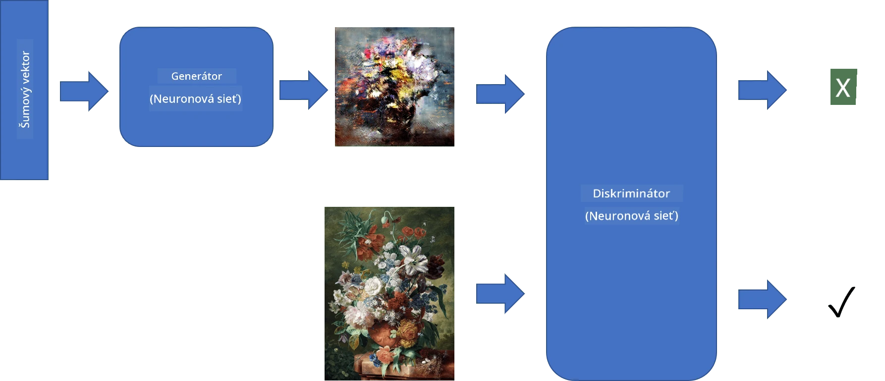
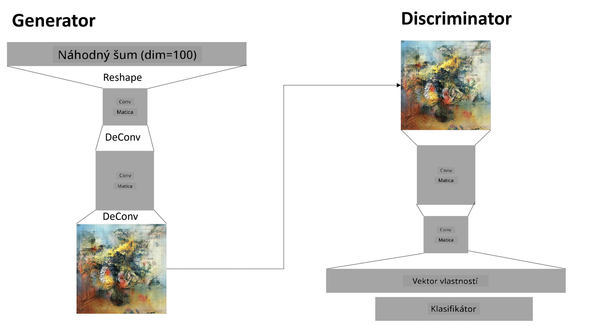

# Generatívne Adverzárne Siete

V predchádzajúcej sekcii sme sa naučili o **generatívnych modeloch**: modeloch, ktoré dokážu generovať nové obrázky podobné tým v tréningovej množine. VAE bol dobrým príkladom generatívneho modelu.

## [Kvíz pred prednáškou](https://ff-quizzes.netlify.app/en/ai/quiz/19)

Ak sa však pokúsime generovať niečo naozaj zmysluplné, napríklad maľbu v rozumnej kvalite, pomocou VAE, zistíme, že tréning neprebieha dobre. Pre tento prípad použitia by sme sa mali naučiť o inej architektúre špecificky zameranej na generatívne modely - **Generatívne Adverzárne Siete**, alebo GANs.

Hlavná myšlienka GAN je mať dve neurónové siete, ktoré sa budú trénovať proti sebe:

> Obrázok od [Dmitry Soshnikov](http://soshnikov.com)

> ✅ Malý slovník:
> * **Generátor** je sieť, ktorá prijíma náhodný vektor a ako výsledok produkuje obrázok.
> * **Diskriminátor** je sieť, ktorá prijíma obrázok a má určiť, či ide o skutočný obrázok (z tréningovej množiny), alebo bol generovaný generátorom. V podstate ide o klasifikátor obrázkov.

### Diskriminátor

Architektúra diskriminátora sa nelíši od bežnej siete na klasifikáciu obrázkov. V najjednoduchšom prípade môže ísť o plne prepojený klasifikátor, ale pravdepodobne to bude [konvolučná sieť](../07-ConvNets/README.md).

> ✅ GAN založený na konvolučných sieťach sa nazýva [DCGAN](https://arxiv.org/pdf/1511.06434.pdf)

Diskriminátor CNN pozostáva z nasledujúcich vrstiev: niekoľko konvolúcií+poolingov (s klesajúcou priestorovou veľkosťou) a jednej alebo viacerých plne prepojených vrstiev na získanie "vektora vlastností", finálneho binárneho klasifikátora.

> ✅ 'Pooling' v tomto kontexte je technika, ktorá zmenšuje veľkosť obrázku. "Poolingové vrstvy znižujú rozmery dát kombinovaním výstupov klastrov neurónov na jednej vrstve do jedného neurónu na nasledujúcej vrstve." - [zdroj](https://wikipedia.org/wiki/Convolutional_neural_network#Pooling_layers)

### Generátor

Generátor je o niečo zložitejší. Môžete ho považovať za obrátený diskriminátor. Začína od latentného vektora (namiesto vektora vlastností), má plne prepojenú vrstvu na jeho konverziu do požadovanej veľkosti/tvaru, nasledovanú dekonvolúciami+zväčšovaním. Toto je podobné *dekodéru* v [autoenkóderi](../09-Autoencoders/README.md).

> ✅ Keďže konvolučná vrstva je implementovaná ako lineárny filter prechádzajúci obrázkom, dekonvolúcia je v podstate podobná konvolúcii a môže byť implementovaná pomocou rovnakej logiky vrstvy.

> Obrázok od [Dmitry Soshnikov](http://soshnikov.com)

### Tréning GAN

GAN sa nazývajú **adverzárne**, pretože medzi generátorom a diskriminátorom prebieha neustála súťaž. Počas tejto súťaže sa obidva generátor a diskriminátor zlepšujú, čím sa sieť učí produkovať stále lepšie obrázky.

Tréning prebieha v dvoch fázach:

* **Tréning diskriminátora**. Táto úloha je pomerne jednoduchá: generujeme dávku obrázkov pomocou generátora, označíme ich 0, čo znamená falošný obrázok, a vezmeme dávku obrázkov z vstupnej množiny (s označením 1, skutočný obrázok). Získame nejakú *stratu diskriminátora* a vykonáme spätné šírenie.
* **Tréning generátora**. Toto je o niečo zložitejšie, pretože nepoznáme očakávaný výstup generátora priamo. Vezmeme celú GAN sieť pozostávajúcu z generátora nasledovaného diskriminátorom, nakŕmime ju náhodnými vektormi a očakávame výsledok 1 (zodpovedajúci skutočným obrázkom). Potom zmrazíme parametre diskriminátora (nechceme, aby sa v tomto kroku trénoval) a vykonáme spätné šírenie.

Počas tohto procesu straty generátora aj diskriminátora výrazne neklesajú. V ideálnej situácii by mali oscilovať, čo zodpovedá zlepšovaniu výkonu oboch sietí.

## ✍️ Cvičenia: GANs

* [GAN Notebook v TensorFlow/Keras](GANTF.ipynb)
* [GAN Notebook v PyTorch](GANPyTorch.ipynb)

### Problémy s tréningom GAN

GAN sú známe tým, že sú obzvlášť náročné na tréning. Tu je niekoľko problémov:

* **Kolaps módu**. Tento termín znamená, že generátor sa naučí produkovať jeden úspešný obrázok, ktorý oklame diskriminátor, a nie rôznorodé obrázky.
* **Citlivosť na hyperparametre**. Často môžete vidieť, že GAN vôbec nekonverguje, a potom náhle zníženie rýchlosti učenia vedie ku konvergencii.
* Udržiavanie **rovnováhy** medzi generátorom a diskriminátorom. V mnohých prípadoch strata diskriminátora môže relatívne rýchlo klesnúť na nulu, čo spôsobí, že generátor už nie je schopný ďalej trénovať. Na prekonanie tohto problému môžeme skúsiť nastaviť rôzne rýchlosti učenia pre generátor a diskriminátor, alebo preskočiť tréning diskriminátora, ak je strata už príliš nízka.
* Tréning pre **vysoké rozlíšenie**. Tento problém, podobný problému s autoenkódermi, nastáva, pretože rekonštrukcia príliš mnohých vrstiev konvolučnej siete vedie k artefaktom. Tento problém sa zvyčajne rieši tzv. **progresívnym rastom**, keď sa najprv niekoľko vrstiev trénuje na obrázkoch s nízkym rozlíšením, a potom sa vrstvy "odomknú" alebo pridajú. Ďalším riešením by bolo pridanie extra spojení medzi vrstvami a tréning viacerých rozlíšení naraz - podrobnosti nájdete v tomto [Multi-Scale Gradient GANs článku](https://arxiv.org/abs/1903.06048).

## Prenos štýlu

GAN sú skvelým spôsobom, ako generovať umelecké obrázky. Ďalšou zaujímavou technikou je tzv. **prenos štýlu**, ktorý vezme jeden **obrázok obsahu** a prekreslí ho v inom štýle, aplikujúc filtre z **obrázku štýlu**.

Ako to funguje:
* Začíname s náhodným šumovým obrázkom (alebo s obrázkom obsahu, ale pre lepšie pochopenie je jednoduchšie začať s náhodným šumom).
* Naším cieľom je vytvoriť taký obrázok, ktorý bude blízky obrázku obsahu aj obrázku štýlu. Toto bude určené dvoma stratovými funkciami:
   - **Strata obsahu** sa vypočíta na základe vlastností extrahovaných CNN na niektorých vrstvách z aktuálneho obrázku a obrázku obsahu.
   - **Strata štýlu** sa vypočíta medzi aktuálnym obrázkom a obrázkom štýlu šikovným spôsobom pomocou Gramových matíc (viac podrobností v [príkladovom notebooku](StyleTransfer.ipynb)).
* Aby bol obrázok hladší a odstránil šum, zavádzame tiež **stratu variácie**, ktorá vypočíta priemernú vzdialenosť medzi susednými pixelmi.
* Hlavná optimalizačná slučka upravuje aktuálny obrázok pomocou gradientného zostupu (alebo iného optimalizačného algoritmu) na minimalizáciu celkovej straty, ktorá je váženým súčtom všetkých troch strát.

## ✍️ Príklad: [Prenos štýlu](StyleTransfer.ipynb)

## [Kvíz po prednáške](https://ff-quizzes.netlify.app/en/ai/quiz/20)

## Záver

V tejto lekcii ste sa naučili o GAN a ako ich trénovať. Tiež ste sa naučili o špeciálnych výzvach, ktorým tento typ neurónovej siete môže čeliť, a o niektorých stratégiách, ako ich prekonať.

## 🚀 Výzva

Prejdite si [notebook Prenos štýlu](StyleTransfer.ipynb) s použitím vlastných obrázkov.

## Prehľad a samostatné štúdium

Pre referenciu si prečítajte viac o GAN v týchto zdrojoch:

* Marco Pasini, [10 lekcií, ktoré som sa naučil pri tréningu GAN počas jedného roka](https://towardsdatascience.com/10-lessons-i-learned-training-generative-adversarial-networks-gans-for-a-year-c9071159628)
* [StyleGAN](https://en.wikipedia.org/wiki/StyleGAN), *de facto* GAN architektúra na zváženie
* [Vytváranie generatívneho umenia pomocou GAN na Azure ML](https://soshnikov.com/scienceart/creating-generative-art-using-gan-on-azureml/)

## Zadanie

Znovu si prejdite jeden z dvoch notebookov priradených k tejto lekcii a znovu natrénujte GAN na vlastných obrázkoch. Čo dokážete vytvoriť?

---

