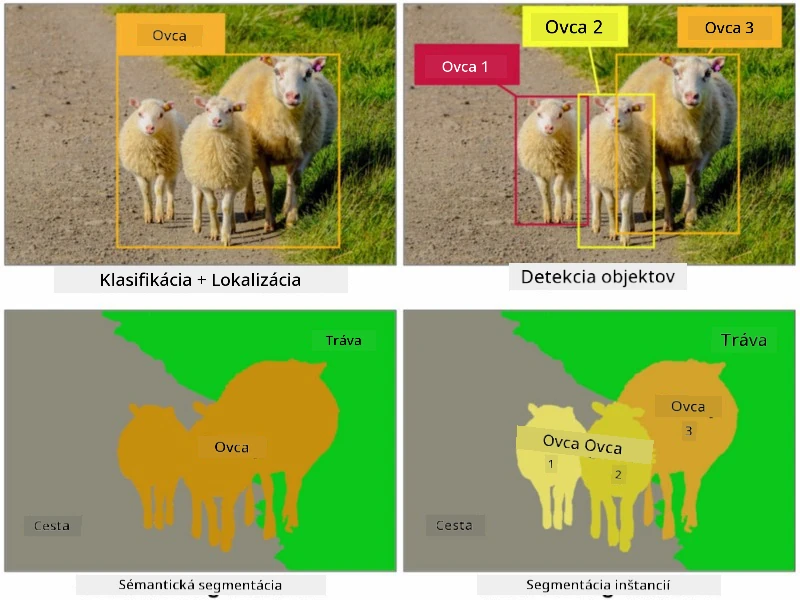
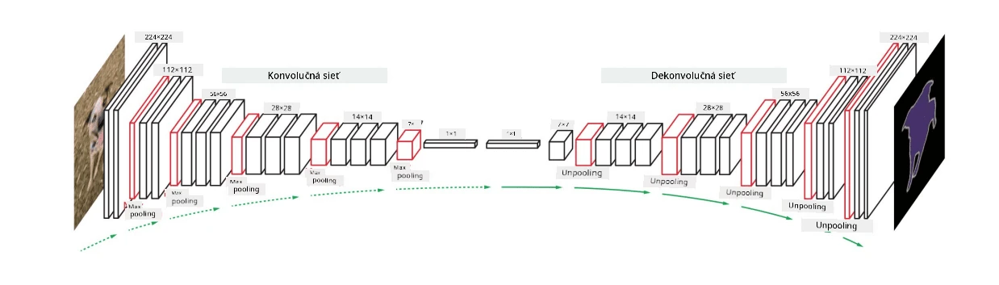

# Segmentácia

Predtým sme sa naučili o detekcii objektov, ktorá nám umožňuje lokalizovať objekty na obrázku predpovedaním ich *ohraničujúcich rámčekov*. Pre niektoré úlohy však nepotrebujeme len ohraničujúce rámčeky, ale aj presnejšiu lokalizáciu objektov. Táto úloha sa nazýva **segmentácia**.

## [Kvíz pred prednáškou](https://ff-quizzes.netlify.app/en/ai/quiz/23)

Segmentáciu môžeme vnímať ako **klasifikáciu pixelov**, kde pre **každý** pixel obrázka musíme predpovedať jeho triedu (*pozadie* je jednou z tried). Existujú dva hlavné algoritmy segmentácie:

* **Semantická segmentácia** určuje iba triedu pixelu a nerozlišuje medzi rôznymi objektmi tej istej triedy.
* **Inštančná segmentácia** rozdeľuje triedy na rôzne inštancie.

Pri inštančnej segmentácii sú tieto ovce rôzne objekty, ale pri semantickej segmentácii sú všetky ovce reprezentované jednou triedou.

> Obrázok z [tohto blogového príspevku](https://nirmalamurali.medium.com/image-classification-vs-semantic-segmentation-vs-instance-segmentation-625c33a08d50)

Existujú rôzne neurónové architektúry pre segmentáciu, ale všetky majú rovnakú štruktúru. Istým spôsobom je to podobné autoenkóderu, o ktorom ste sa už učili, ale namiesto rekonštrukcie pôvodného obrázka je naším cieľom rekonštruovať **masku**. Segmentačná sieť má teda nasledujúce časti:

* **Kódovač (Encoder)** extrahuje črty z vstupného obrázka.
* **Dekóder (Decoder)** transformuje tieto črty na **obrázok masky**, ktorý má rovnakú veľkosť a počet kanálov zodpovedajúci počtu tried.

> Obrázok z [tejto publikácie](https://arxiv.org/pdf/2001.05566.pdf)

Osobitne by sme mali spomenúť funkciu straty, ktorá sa používa pri segmentácii. Pri použití klasických autoenkóderov musíme merať podobnosť medzi dvoma obrázkami, na čo môžeme použiť strednú kvadratickú chybu (MSE). Pri segmentácii každý pixel v cieľovom obrázku masky reprezentuje číslo triedy (one-hot-enkódované v tretej dimenzii), takže musíme použiť funkcie straty špecifické pre klasifikáciu - krížovú entropiu, spriemerovanú cez všetky pixely. Ak je maska binárna, používa sa **binárna krížová entropia (BCE)**.

> ✅ One-hot enkódovanie je spôsob, ako zakódovať triedu do vektora s dĺžkou rovnou počtu tried. Pozrite si [tento článok](https://datagy.io/sklearn-one-hot-encode/) o tejto technike.

## Segmentácia v medicínskom zobrazovaní

V tejto lekcii uvidíme segmentáciu v praxi tým, že natrénujeme sieť na rozpoznávanie ľudských névov (známych aj ako materské znamienka) na medicínskych obrázkoch. Ako zdroj obrázkov použijeme <a href="https://www.fc.up.pt/addi/ph2%20database.html">PH2 databázu</a> dermoskopických obrázkov. Táto databáza obsahuje 200 obrázkov troch tried: typický névus, atypický névus a melanóm. Všetky obrázky obsahujú aj zodpovedajúcu **masku**, ktorá ohraničuje névus.

> ✅ Táto technika je obzvlášť vhodná pre tento typ medicínskeho zobrazovania, ale aké iné reálne aplikácie by ste si vedeli predstaviť?

> Obrázok z PH2 databázy

Natrénujeme model na segmentáciu akéhokoľvek névusu z jeho pozadia.

## ✍️ Cvičenia: Semantická segmentácia

Otvorte nižšie uvedené notebooky, aby ste sa dozvedeli viac o rôznych architektúrach semantickej segmentácie, precvičili si prácu s nimi a videli ich v akcii.

* [Semantická segmentácia v Pytorch](SemanticSegmentationPytorch.ipynb)
* [Semantická segmentácia v TensorFlow](SemanticSegmentationTF.ipynb)

## [Kvíz po prednáške](https://ff-quizzes.netlify.app/en/ai/quiz/24)

## Záver

Segmentácia je veľmi silná technika pre klasifikáciu obrázkov, ktorá ide nad rámec ohraničujúcich rámčekov a umožňuje klasifikáciu na úrovni pixelov. Táto technika sa používa v medicínskom zobrazovaní, ale aj v iných aplikáciách.

## 🚀 Výzva

Segmentácia tela je len jednou z bežných úloh, ktoré môžeme vykonávať s obrázkami ľudí. Ďalšie dôležité úlohy zahŕňajú **detekciu kostry** a **detekciu póz**. Vyskúšajte knižnicu [OpenPose](https://github.com/CMU-Perceptual-Computing-Lab/openpose), aby ste videli, ako sa dá detekcia póz využiť.

## Prehľad a samostatné štúdium

Tento [článok na Wikipédii](https://wikipedia.org/wiki/Image_segmentation) ponúka dobrý prehľad o rôznych aplikáciách tejto techniky. Zistite viac o poddoménach inštančnej segmentácie a panoptickej segmentácie v tejto oblasti výskumu.

## [Úloha](lab/README.md)

V tomto laboratóriu vyskúšajte **segmentáciu ľudského tela** pomocou [Segmentation Full Body MADS Dataset](https://www.kaggle.com/datasets/tapakah68/segmentation-full-body-mads-dataset) z Kaggle.

---

