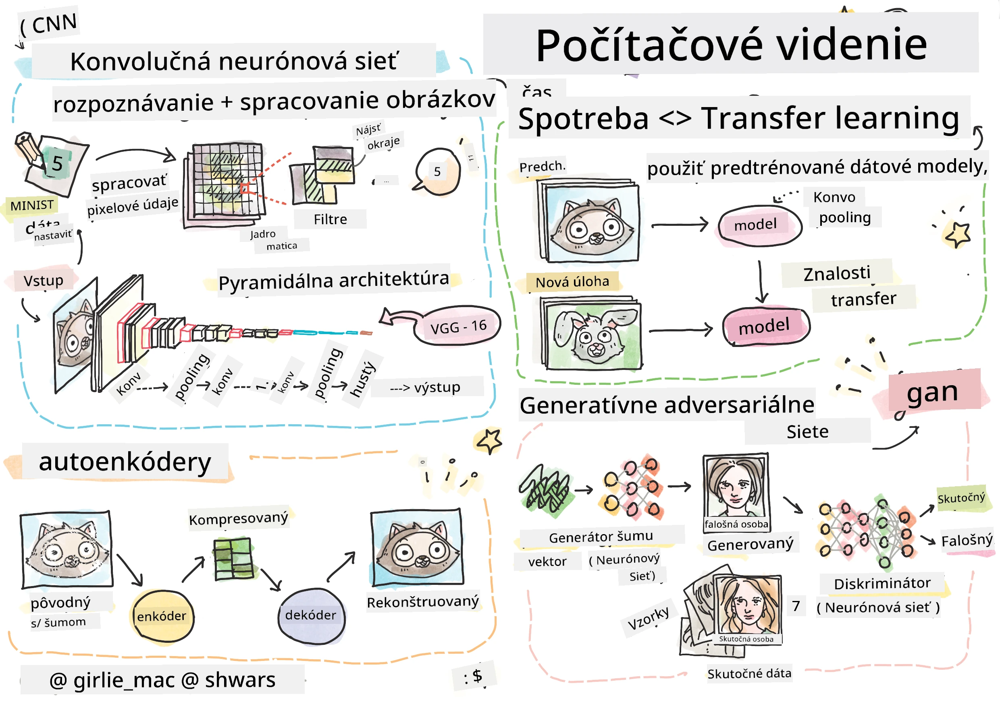

# Počítačové videnie

V tejto sekcii sa naučíme:

* [Úvod do počítačového videnia a OpenCV](06-IntroCV/README.md)
* [Konvolučné neurónové siete](07-ConvNets/README.md)
* [Predtrénované siete a transferové učenie](08-TransferLearning/README.md) 
* [Autoenkodéry](09-Autoencoders/README.md)
* [Generatívne protivnícke siete](10-GANs/README.md)
* [Detekcia objektov](11-ObjectDetection/README.md)
* [Semantická segmentácia](12-Segmentation/README.md)

**Zrieknutie sa zodpovednosti**:  
Tento dokument bol preložený pomocou služby AI prekladu [Co-op Translator](https://github.com/Azure/co-op-translator). Aj keď sa snažíme o presnosť, prosím, berte na vedomie, že automatizované preklady môžu obsahovať chyby alebo nepresnosti. Pôvodný dokument v jeho rodnom jazyku by mal byť považovaný za autoritatívny zdroj. Pre kritické informácie sa odporúča profesionálny ľudský preklad. Nenesieme zodpovednosť za akékoľvek nedorozumenia alebo nesprávne interpretácie vyplývajúce z použitia tohto prekladu.