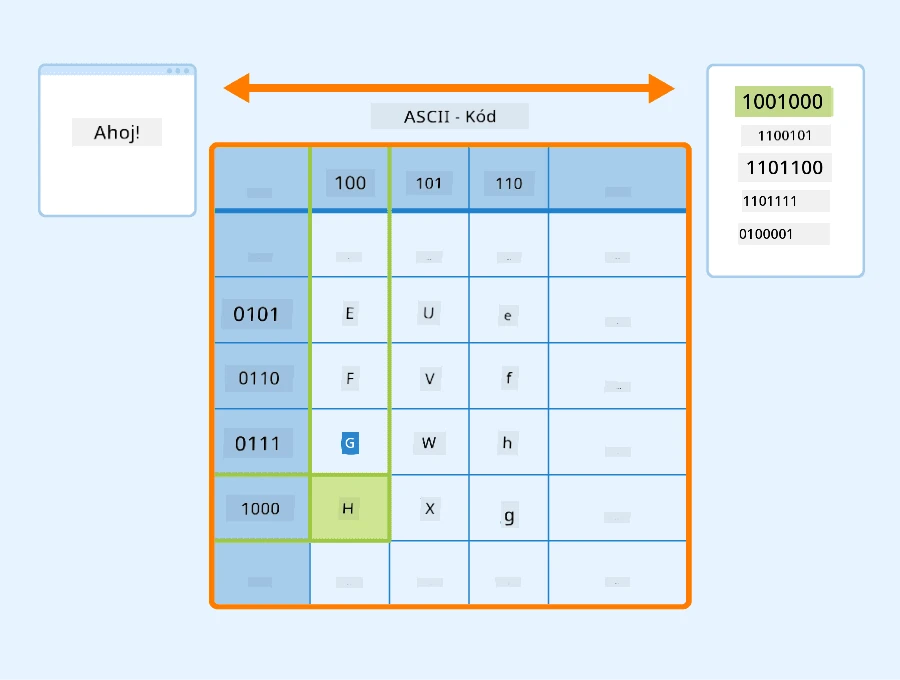
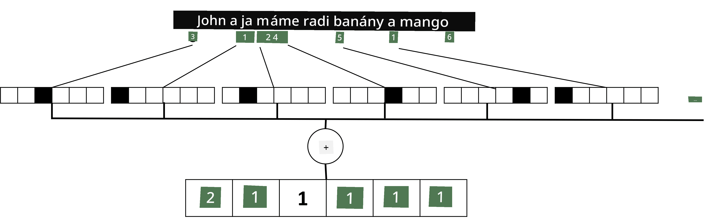

# Reprezentácia textu ako tenzorov

## [Kvíz pred prednáškou](https://ff-quizzes.netlify.app/en/ai/quiz/25)

## Klasifikácia textu

V prvej časti tejto sekcie sa zameriame na úlohu **klasifikácie textu**. Použijeme dataset [AG News](https://www.kaggle.com/amananandrai/ag-news-classification-dataset), ktorý obsahuje spravodajské články ako napríklad:

* Kategória: Veda/Technológie
* Názov: Ky. spoločnosť získala grant na štúdium peptidov (AP)
* Text: AP - Spoločnosť založená chemickým výskumníkom na Univerzite v Louisville získala grant na vývoj...

Naším cieľom bude klasifikovať spravodajský článok do jednej z kategórií na základe textu.

## Reprezentácia textu

Ak chceme riešiť úlohy spracovania prirodzeného jazyka (NLP) pomocou neurónových sietí, potrebujeme spôsob, ako reprezentovať text ako tenzory. Počítače už reprezentujú textové znaky ako čísla, ktoré mapujú na fonty na vašej obrazovke pomocou kódovaní, ako sú ASCII alebo UTF-8.

> [Zdroj obrázku](https://www.seobility.net/en/wiki/ASCII)

Ako ľudia rozumieme, čo každý znak **reprezentuje**, a ako všetky znaky spolu tvoria slová vo vete. Počítače však samy o sebe takému porozumeniu nemajú, a neurónová sieť sa musí naučiť význam počas tréningu.

Preto môžeme použiť rôzne prístupy pri reprezentácii textu:

* **Reprezentácia na úrovni znakov**, keď reprezentujeme text tak, že každý znak považujeme za číslo. Ak máme *C* rôznych znakov v našom textovom korpuse, slovo *Hello* by bolo reprezentované ako tenzor 5x*C*. Každé písmeno by zodpovedalo stĺpcu tenzora v one-hot kódovaní.
* **Reprezentácia na úrovni slov**, pri ktorej vytvoríme **slovník** všetkých slov v našom texte a potom reprezentujeme slová pomocou one-hot kódovania. Tento prístup je o niečo lepší, pretože každé písmeno samo o sebe nemá veľký význam, a tak použitím vyšších semantických konceptov - slov - zjednodušujeme úlohu pre neurónovú sieť. Avšak vzhľadom na veľkosť slovníka musíme pracovať s vysoko dimenzionálnymi riedkymi tenzormi.

Bez ohľadu na reprezentáciu musíme najskôr konvertovať text na sekvenciu **tokenov**, pričom jeden token môže byť znak, slovo alebo dokonca časť slova. Potom token konvertujeme na číslo, zvyčajne pomocou **slovníka**, a toto číslo môže byť vložené do neurónovej siete pomocou one-hot kódovania.

## N-Gramy

V prirodzenom jazyku je presný význam slov možné určiť iba v kontexte. Napríklad významy *neurónová sieť* a *rybárska sieť* sú úplne odlišné. Jedným zo spôsobov, ako to zohľadniť, je vytvoriť model na základe dvojíc slov a považovať dvojice slov za samostatné tokeny slovníka. Týmto spôsobom bude veta *Rád chodím na ryby* reprezentovaná nasledujúcou sekvenciou tokenov: *Rád chodím*, *chodím na*, *na ryby*. Problémom tohto prístupu je, že veľkosť slovníka sa výrazne zväčšuje a kombinácie ako *na ryby* a *na nákupy* sú reprezentované rôznymi tokenmi, ktoré nezdieľajú žiadnu semantickú podobnosť napriek rovnakému slovesu.

V niektorých prípadoch môžeme zvážiť použitie tri-gramov -- kombinácií troch slov -- tiež. Tento prístup sa často nazýva **n-gramy**. Tiež má zmysel používať n-gramy s reprezentáciou na úrovni znakov, v takom prípade n-gramy približne zodpovedajú rôznym slabikám.

## Bag-of-Words a TF/IDF

Pri riešení úloh, ako je klasifikácia textu, musíme byť schopní reprezentovať text jedným vektorom pevnej veľkosti, ktorý použijeme ako vstup pre konečný hustý klasifikátor. Jedným z najjednoduchších spôsobov, ako to urobiť, je kombinovať všetky individuálne reprezentácie slov, napr. ich sčítaním. Ak sčítame one-hot kódovania každého slova, skončíme s vektorom frekvencií, ktorý ukazuje, koľkokrát sa každé slovo objaví v texte. Takáto reprezentácia textu sa nazýva **bag of words** (BoW).

> Obrázok od autora

BoW v podstate reprezentuje, ktoré slová sa objavujú v texte a v akých množstvách, čo môže byť dobrým indikátorom toho, o čom text je. Napríklad spravodajský článok o politike pravdepodobne obsahuje slová ako *prezident* a *krajina*, zatiaľ čo vedecká publikácia by mala niečo ako *urýchľovač*, *objavené*, atď. Frekvencie slov môžu v mnohých prípadoch byť dobrým indikátorom obsahu textu.

Problémom BoW je, že určité bežné slová, ako *a*, *je*, atď., sa objavujú vo väčšine textov a majú najvyššie frekvencie, čím zakrývajú slová, ktoré sú skutočne dôležité. Môžeme znížiť dôležitosť týchto slov tým, že zohľadníme frekvenciu, s akou sa slová vyskytujú v celej kolekcii dokumentov. Toto je hlavná myšlienka prístupu TF/IDF, ktorý je podrobnejšie pokrytý v notebookoch pripojených k tejto lekcii.

Avšak žiadny z týchto prístupov nedokáže plne zohľadniť **semantiku** textu. Na to potrebujeme výkonnejšie modely neurónových sietí, o ktorých budeme diskutovať neskôr v tejto sekcii.

## ✍️ Cvičenia: Reprezentácia textu

Pokračujte vo svojom učení v nasledujúcich notebookoch:

* [Reprezentácia textu s PyTorch](TextRepresentationPyTorch.ipynb)
* [Reprezentácia textu s TensorFlow](TextRepresentationTF.ipynb)

## Záver

Doteraz sme študovali techniky, ktoré môžu pridať váhu frekvencie rôznym slovám. Nie sú však schopné reprezentovať význam alebo poradie. Ako povedal slávny lingvista J. R. Firth v roku 1935: "Úplný význam slova je vždy kontextový a žiadna štúdia významu mimo kontextu nemôže byť braná vážne." Neskôr v kurze sa naučíme, ako zachytiť kontextové informácie z textu pomocou jazykového modelovania.

## 🚀 Výzva

Vyskúšajte niektoré ďalšie cvičenia s bag-of-words a rôznymi dátovými modelmi. Môžete sa inšpirovať touto [súťažou na Kaggle](https://www.kaggle.com/competitions/word2vec-nlp-tutorial/overview/part-1-for-beginners-bag-of-words)

## [Kvíz po prednáške](https://ff-quizzes.netlify.app/en/ai/quiz/26)

## Prehľad & Samoštúdium

Precvičte si svoje zručnosti s textovými embeddingmi a technikami bag-of-words na [Microsoft Learn](https://docs.microsoft.com/learn/modules/intro-natural-language-processing-pytorch/?WT.mc_id=academic-77998-cacaste)

## [Úloha: Notebooky](assignment.md)

---

