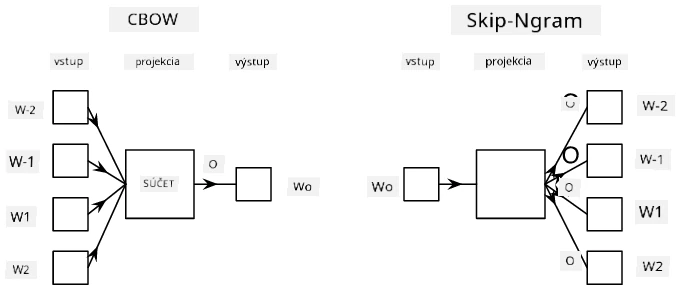

# Vstavané reprezentácie (Embeddings)

## [Kvíz pred prednáškou](https://ff-quizzes.netlify.app/en/ai/quiz/27)

Pri trénovaní klasifikátorov založených na BoW alebo TF/IDF sme pracovali s vysokodimenzionálnymi vektormi bag-of-words s dĺžkou `vocab_size` a explicitne sme prevádzali nízkodimenzionálne pozičné reprezentácie na riedke one-hot reprezentácie. Táto one-hot reprezentácia však nie je pamäťovo efektívna. Navyše, každé slovo je považované za nezávislé od ostatných, t.j. one-hot kódované vektory nevyjadrujú žiadnu sémantickú podobnosť medzi slovami.

Myšlienka **vstavaných reprezentácií (embedding)** spočíva v reprezentovaní slov pomocou nízkodimenzionálnych hustých vektorov, ktoré určitým spôsobom odrážajú sémantický význam slova. Neskôr si povieme, ako vytvoriť zmysluplné vstavané reprezentácie slov, ale zatiaľ ich môžeme chápať ako spôsob zníženia dimenzionality vektora slova.

Vstavaná vrstva (embedding layer) teda prijíma slovo ako vstup a produkuje výstupný vektor so špecifikovanou veľkosťou `embedding_size`. V istom zmysle je veľmi podobná vrstve `Linear`, ale namiesto prijímania one-hot kódovaného vektora dokáže prijať číslo slova ako vstup, čím sa vyhneme vytváraniu veľkých one-hot kódovaných vektorov.

Použitím vstavanej vrstvy ako prvej vrstvy v našej klasifikačnej sieti môžeme prejsť z modelu bag-of-words na model **embedding bag**, kde najprv každé slovo v texte prevedieme na zodpovedajúcu vstavanú reprezentáciu a potom vypočítame nejakú agregačnú funkciu nad všetkými týmito reprezentáciami, ako napríklad `sum`, `average` alebo `max`.

> Obrázok od autora

## ✍️ Cvičenia: Vstavané reprezentácie

Pokračujte v učení v nasledujúcich notebookoch:
* [Vstavané reprezentácie s PyTorch](EmbeddingsPyTorch.ipynb)
* [Vstavané reprezentácie s TensorFlow](EmbeddingsTF.ipynb)

## Sémantické vstavané reprezentácie: Word2Vec

Aj keď sa vstavaná vrstva naučila mapovať slová na vektorovú reprezentáciu, táto reprezentácia nemusí nevyhnutne obsahovať veľa sémantického významu. Bolo by užitočné naučiť sa vektorovú reprezentáciu, kde podobné slová alebo synonymá zodpovedajú vektorom, ktoré sú si blízke podľa nejakej vektorovej vzdialenosti (napr. Euklidovskej vzdialenosti).

Na to potrebujeme predtrénovať náš model vstavaných reprezentácií na veľkej zbierke textov špecifickým spôsobom. Jedným zo spôsobov trénovania sémantických vstavaných reprezentácií je metóda [Word2Vec](https://en.wikipedia.org/wiki/Word2vec). Táto metóda je založená na dvoch hlavných architektúrach, ktoré sa používajú na vytváranie distribuovaných reprezentácií slov:

 - **Kontinuálny bag-of-words** (CBoW) — v tejto architektúre trénujeme model na predpovedanie slova na základe okolitých slov v kontexte. Pre ngram $(W_{-2},W_{-1},W_0,W_1,W_2)$ je cieľom modelu predpovedať $W_0$ na základe $(W_{-2},W_{-1},W_1,W_2)$.
 - **Kontinuálny skip-gram** je opakom CBoW. Model používa okno kontextových slov na predpovedanie aktuálneho slova.

CBoW je rýchlejší, zatiaľ čo skip-gram je pomalší, ale lepšie reprezentuje zriedkavé slová.

> Obrázok z [tohto článku](https://arxiv.org/pdf/1301.3781.pdf)

Predtrénované vstavané reprezentácie Word2Vec (ako aj iné podobné modely, napríklad GloVe) môžu byť použité namiesto vstavanej vrstvy v neurónových sieťach. Musíme sa však vysporiadať so slovníkmi, pretože slovník použitý na predtrénovanie Word2Vec/GloVe sa pravdepodobne líši od slovníka v našom textovom korpuse. Pozrite si vyššie uvedené notebooky, aby ste zistili, ako tento problém vyriešiť.

## Kontextové vstavané reprezentácie

Jedným z hlavných obmedzení tradičných predtrénovaných vstavaných reprezentácií, ako je Word2Vec, je problém rozlišovania významu slov (word sense disambiguation). Zatiaľ čo predtrénované reprezentácie dokážu zachytiť určitý význam slov v kontexte, každý možný význam slova je zakódovaný do tej istej reprezentácie. To môže spôsobiť problémy v následných modeloch, pretože mnohé slová, ako napríklad slovo 'play', majú rôzne významy v závislosti od kontextu, v ktorom sú použité.

Napríklad slovo 'play' má v týchto dvoch vetách úplne odlišný význam:

- Išiel som na **hru** do divadla.
- John chce **hrať** so svojimi priateľmi.

Vyššie uvedené predtrénované reprezentácie reprezentujú oba tieto významy slova 'play' rovnakou reprezentáciou. Na prekonanie tohto obmedzenia potrebujeme vytvoriť reprezentácie založené na **jazykovom modeli**, ktorý je trénovaný na veľkom korpuse textov a *vie*, ako sa slová môžu skladať v rôznych kontextoch. Diskusia o kontextových vstavaných reprezentáciách presahuje rámec tohto tutoriálu, ale vrátime sa k nim, keď budeme neskôr hovoriť o jazykových modeloch.

## Záver

V tejto lekcii ste sa naučili, ako vytvárať a používať vstavané vrstvy v TensorFlow a PyTorch na lepšie odrážanie sémantických významov slov.

## 🚀 Výzva

Word2Vec bol použitý na niektoré zaujímavé aplikácie, vrátane generovania textov piesní a poézie. Pozrite si [tento článok](https://www.politetype.com/blog/word2vec-color-poems), ktorý popisuje, ako autor použil Word2Vec na generovanie poézie. Pozrite si aj [toto video od Dana Shiffmanna](https://www.youtube.com/watch?v=LSS_bos_TPI&ab_channel=TheCodingTrain), kde nájdete iné vysvetlenie tejto techniky. Potom sa pokúste aplikovať tieto techniky na svoj vlastný textový korpus, možno získaný z Kaggle.

## [Kvíz po prednáške](https://ff-quizzes.netlify.app/en/ai/quiz/28)

## Prehľad a samostatné štúdium

Prečítajte si tento článok o Word2Vec: [Efficient Estimation of Word Representations in Vector Space](https://arxiv.org/pdf/1301.3781.pdf)

## [Úloha: Notebooky](assignment.md)

---

