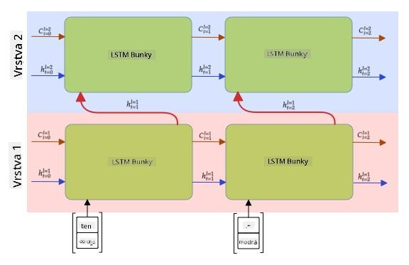

<!--
CO_OP_TRANSLATOR_METADATA:
{
  "original_hash": "58bf4adb210aab53e8f78c8082040e7c",
  "translation_date": "2025-08-25T21:32:45+00:00",
  "source_file": "lessons/5-NLP/16-RNN/README.md",
  "language_code": "sk"
}
-->
# Rekurentné neurónové siete

## [Kvíz pred prednáškou](https://red-field-0a6ddfd03.1.azurestaticapps.net/quiz/116)

V predchádzajúcich sekciách sme používali bohaté sémantické reprezentácie textu a jednoduchý lineárny klasifikátor nad embeddingmi. Táto architektúra zachytáva agregovaný význam slov vo vete, ale neberie do úvahy **poradie** slov, pretože operácia agregácie nad embeddingmi túto informáciu z pôvodného textu odstránila. Keďže tieto modely nedokážu modelovať poradie slov, nemôžu riešiť zložitejšie alebo nejednoznačné úlohy, ako je generovanie textu alebo odpovedanie na otázky.

Na zachytenie významu textovej sekvencie potrebujeme použiť inú architektúru neurónovej siete, ktorá sa nazýva **rekurentná neurónová sieť** alebo RNN. V RNN prechádzame vetou cez sieť jeden symbol po druhom a sieť produkuje určitý **stav**, ktorý následne odovzdávame s ďalším symbolom späť do siete.

> Obrázok od autora

Pri danej vstupnej sekvencii tokenov X0,...,Xn RNN vytvára sekvenciu blokov neurónovej siete a trénuje túto sekvenciu end-to-end pomocou backpropagácie. Každý blok siete prijíma dvojicu (Xi,Si) ako vstup a produkuje Si+1 ako výsledok. Konečný stav Sn (alebo výstup Yn) prechádza do lineárneho klasifikátora, aby sa vytvoril výsledok. Všetky bloky siete zdieľajú rovnaké váhy a sú trénované end-to-end pomocou jedného prechodu backpropagácie.

Keďže stavové vektory S0,...,Sn prechádzajú sieťou, dokáže sa naučiť sekvenčné závislosti medzi slovami. Napríklad, keď sa niekde v sekvencii objaví slovo *not*, sieť sa môže naučiť negovať určité prvky v stavovom vektore, čo vedie k negácii.

> ✅ Keďže váhy všetkých RNN blokov na obrázku vyššie sú zdieľané, ten istý obrázok môže byť reprezentovaný ako jeden blok (vpravo) s rekurentnou spätnou väzbou, ktorá odovzdáva výstupný stav siete späť na vstup.

## Anatómia RNN bunky

Pozrime sa, ako je organizovaná jednoduchá RNN bunka. Prijíma predchádzajúci stav Si-1 a aktuálny symbol Xi ako vstupy a musí produkovať výstupný stav Si (a niekedy nás zaujíma aj iný výstup Yi, ako v prípade generatívnych sietí).

Jednoduchá RNN bunka má vo vnútri dve matice váh: jedna transformuje vstupný symbol (nazvime ju W) a druhá transformuje vstupný stav (H). V tomto prípade sa výstup siete vypočíta ako σ(W×Xi+H×Si-1+b), kde σ je aktivačná funkcia a b je dodatočný bias.

> Obrázok od autora

V mnohých prípadoch prechádzajú vstupné tokeny pred vstupom do RNN cez embedding vrstvu, aby sa znížila dimenzionalita. V tomto prípade, ak je dimenzia vstupných vektorov *emb_size* a stavového vektora *hid_size*, veľkosť W je *emb_size*×*hid_size* a veľkosť H je *hid_size*×*hid_size*.

## Long Short Term Memory (LSTM)

Jedným z hlavných problémov klasických RNN je tzv. problém **miznúcich gradientov**. Keďže RNN sú trénované end-to-end v jednom prechode backpropagácie, majú problém s propagáciou chyby do prvých vrstiev siete, a preto sa sieť nedokáže naučiť vzťahy medzi vzdialenými tokenmi. Jedným zo spôsobov, ako sa tomuto problému vyhnúť, je zavedenie **explicitného riadenia stavu** pomocou tzv. **brán**. Existujú dve známe architektúry tohto typu: **Long Short Term Memory** (LSTM) a **Gated Relay Unit** (GRU).

> Zdroj obrázku TBD

LSTM sieť je organizovaná podobne ako RNN, ale existujú dva stavy, ktoré sa prenášajú z vrstvy do vrstvy: aktuálny stav C a skrytý vektor H. V každej jednotke je skrytý vektor Hi spojený so vstupom Xi a tieto kontrolujú, čo sa deje so stavom C prostredníctvom **brán**. Každá brána je neurónová sieť so sigmoidnou aktiváciou (výstup v rozsahu [0,1]), ktorú si môžeme predstaviť ako bitovú masku, keď sa vynásobí stavovým vektorom. Existujú nasledujúce brány (zľava doprava na obrázku vyššie):

* **Forget gate** (brána zabúdania) prijíma skrytý vektor a určuje, ktoré komponenty vektora C je potrebné zabudnúť a ktoré preniesť ďalej.
* **Input gate** (vstupná brána) prijíma informácie zo vstupného a skrytého vektora a vkladá ich do stavu.
* **Output gate** (výstupná brána) transformuje stav cez lineárnu vrstvu s *tanh* aktiváciou, potom vyberá niektoré z jeho komponentov pomocou skrytého vektora Hi, aby vytvorila nový stav Ci+1.

Komponenty stavu C si môžeme predstaviť ako určité príznaky, ktoré môžu byť zapnuté alebo vypnuté. Napríklad, keď v sekvencii narazíme na meno *Alice*, môžeme predpokladať, že ide o ženskú postavu, a zvýšiť príznak v stave, že vo vete máme ženské podstatné meno. Keď ďalej narazíme na frázu *and Tom*, zvýšime príznak, že máme množné číslo. Takto môžeme manipuláciou so stavom údajne sledovať gramatické vlastnosti častí vety.

> ✅ Skvelým zdrojom na pochopenie vnútorného fungovania LSTM je tento výborný článok [Understanding LSTM Networks](https://colah.github.io/posts/2015-08-Understanding-LSTMs/) od Christophera Olaha.

## Bidirekčné a viacvrstvové RNN

Diskutovali sme o rekurentných sieťach, ktoré fungujú jedným smerom, od začiatku sekvencie po jej koniec. Vyzerá to prirodzene, pretože to pripomína spôsob, akým čítame a počúvame reč. Avšak, keďže v mnohých praktických prípadoch máme náhodný prístup k vstupnej sekvencii, môže mať zmysel spustiť rekurentné výpočty v oboch smeroch. Takéto siete sa nazývajú **bidirekčné** RNN. Pri práci s bidirekčnou sieťou by sme potrebovali dva skryté stavové vektory, jeden pre každý smer.

Rekurentná sieť, či už jednosmerná alebo bidirekčná, zachytáva určité vzory v sekvencii a môže ich uložiť do stavového vektora alebo odovzdať do výstupu. Rovnako ako pri konvolučných sieťach môžeme na prvú vrstvu postaviť ďalšiu rekurentnú vrstvu, aby sme zachytili vzory vyššej úrovne a vytvorili ich z nízkoúrovňových vzorov extrahovaných prvou vrstvou. To nás privádza k pojmu **viacvrstvová RNN**, ktorá pozostáva z dvoch alebo viacerých rekurentných sietí, kde výstup predchádzajúcej vrstvy prechádza do ďalšej vrstvy ako vstup.

*Obrázok z [tohto skvelého článku](https://towardsdatascience.com/from-a-lstm-cell-to-a-multilayer-lstm-network-with-pytorch-2899eb5696f3) od Fernanda Lópeza*

## ✍️ Cvičenia: Embeddingy

Pokračujte vo svojom učení v nasledujúcich notebookoch:

* [RNNs s PyTorch](../../../../../lessons/5-NLP/16-RNN/RNNPyTorch.ipynb)
* [RNNs s TensorFlow](../../../../../lessons/5-NLP/16-RNN/RNNTF.ipynb)

## Záver

V tejto jednotke sme videli, že RNN môžu byť použité na klasifikáciu sekvencií, ale v skutočnosti dokážu zvládnuť oveľa viac úloh, ako je generovanie textu, strojový preklad a ďalšie. Týmto úlohám sa budeme venovať v ďalšej jednotke.

## 🚀 Výzva

Prečítajte si niektoré materiály o LSTM a zvážte ich aplikácie:

- [Grid Long Short-Term Memory](https://arxiv.org/pdf/1507.01526v1.pdf)
- [Show, Attend and Tell: Neural Image Caption
Generation with Visual Attention](https://arxiv.org/pdf/1502.03044v2.pdf)

## [Kvíz po prednáške](https://red-field-0a6ddfd03.1.azurestaticapps.net/quiz/216)

## Prehľad a samostatné štúdium

- [Understanding LSTM Networks](https://colah.github.io/posts/2015-08-Understanding-LSTMs/) od Christophera Olaha.

## [Úloha: Notebooky](assignment.md)

**Upozornenie**:  
Tento dokument bol preložený pomocou služby AI prekladu [Co-op Translator](https://github.com/Azure/co-op-translator). Aj keď sa snažíme o presnosť, prosím, berte na vedomie, že automatizované preklady môžu obsahovať chyby alebo nepresnosti. Pôvodný dokument v jeho rodnom jazyku by mal byť považovaný za autoritatívny zdroj. Pre kritické informácie sa odporúča profesionálny ľudský preklad. Nie sme zodpovední za akékoľvek nedorozumenia alebo nesprávne interpretácie vyplývajúce z použitia tohto prekladu.