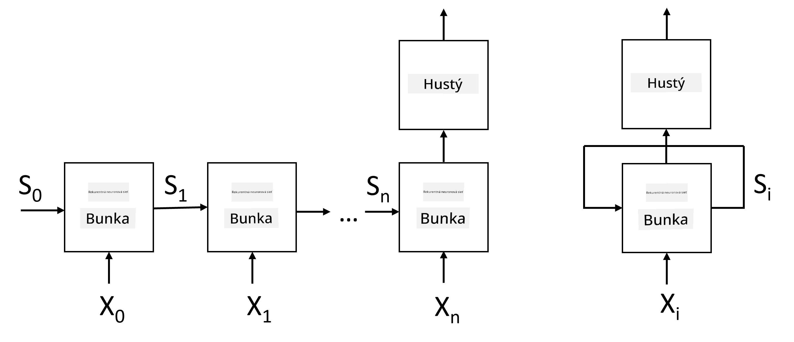
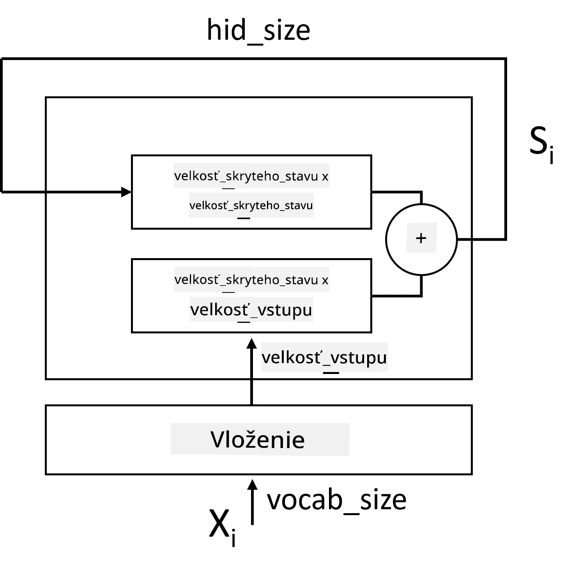
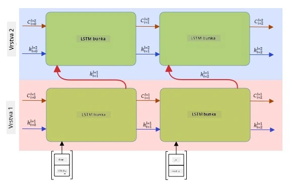

# Rekurentné neurónové siete

## [Kvíz pred prednáškou](https://ff-quizzes.netlify.app/en/ai/quiz/31)

V predchádzajúcich sekciách sme používali bohaté sémantické reprezentácie textu a jednoduchý lineárny klasifikátor nad embeddingami. Táto architektúra zachytáva agregovaný význam slov vo vete, ale neberie do úvahy **poradie** slov, pretože operácia agregácie nad embeddingami odstránila túto informáciu z pôvodného textu. Keďže tieto modely nedokážu modelovať poradie slov, nemôžu riešiť zložitejšie alebo nejednoznačné úlohy, ako je generovanie textu alebo odpovedanie na otázky.

Na zachytenie významu textovej sekvencie potrebujeme použiť inú architektúru neurónovej siete, ktorá sa nazýva **rekurentná neurónová sieť** alebo RNN. V RNN prechádzame vetou cez sieť jeden symbol po druhom a sieť produkuje určitý **stav**, ktorý následne posunieme do siete spolu s ďalším symbolom.

> Obrázok od autora

Pri danej vstupnej sekvencii tokenov X0,...,Xn, RNN vytvára sekvenciu blokov neurónovej siete a trénuje túto sekvenciu end-to-end pomocou backpropagácie. Každý blok siete prijíma dvojicu (Xi,Si) ako vstup a produkuje Si+1 ako výsledok. Konečný stav Sn alebo (výstup Yn) ide do lineárneho klasifikátora, ktorý produkuje výsledok. Všetky bloky siete zdieľajú rovnaké váhy a sú trénované end-to-end pomocou jednej backpropagačnej pasáže.

Keďže stavové vektory S0,...,Sn prechádzajú sieťou, dokáže sa naučiť sekvenčné závislosti medzi slovami. Napríklad, keď sa v sekvencii objaví slovo *nie*, sieť sa môže naučiť negovať určité prvky v stavovom vektore, čo vedie k negácii.

> ✅ Keďže váhy všetkých blokov RNN na obrázku vyššie sú zdieľané, rovnaký obrázok môže byť reprezentovaný ako jeden blok (vpravo) s rekurentnou spätnou väzbou, ktorá posúva výstupný stav siete späť na vstup.

## Anatómia bunky RNN

Pozrime sa, ako je organizovaná jednoduchá bunka RNN. Prijíma predchádzajúci stav Si-1 a aktuálny symbol Xi ako vstupy a musí produkovať výstupný stav Si (a niekedy nás zaujíma aj iný výstup Yi, ako v prípade generatívnych sietí).

Jednoduchá bunka RNN má vo vnútri dve matice váh: jedna transformuje vstupný symbol (nazvime ju W) a druhá transformuje vstupný stav (H). V tomto prípade sa výstup siete vypočíta ako &sigma;(W&times;Xi+H&times;Si-1+b), kde &sigma; je aktivačná funkcia a b je dodatočná bias.

> Obrázok od autora

V mnohých prípadoch sú vstupné tokeny pred vstupom do RNN prechádzané cez embedding vrstvu na zníženie dimenzionality. V tomto prípade, ak je dimenzia vstupných vektorov *emb_size* a stavový vektor je *hid_size* - veľkosť W je *emb_size*&times;*hid_size* a veľkosť H je *hid_size*&times;*hid_size*.

## Long Short Term Memory (LSTM)

Jedným z hlavných problémov klasických RNN je tzv. **problém miznúcich gradientov**. Keďže RNN sú trénované end-to-end v jednej backpropagačnej pasáži, majú problém propagovať chybu do prvých vrstiev siete, a teda sieť nedokáže naučiť vzťahy medzi vzdialenými tokenmi. Jedným zo spôsobov, ako sa tomuto problému vyhnúť, je zavedenie **explicitného riadenia stavu** pomocou tzv. **brán**. Existujú dve známe architektúry tohto typu: **Long Short Term Memory** (LSTM) a **Gated Relay Unit** (GRU).

> Zdroj obrázku TBD

LSTM sieť je organizovaná podobne ako RNN, ale existujú dva stavy, ktoré sa prenášajú z vrstvy do vrstvy: aktuálny stav C a skrytý vektor H. V každej jednotke je skrytý vektor Hi spojený so vstupom Xi, a tieto kontrolujú, čo sa stane so stavom C prostredníctvom **brán**. Každá brána je neurónová sieť so sigmoidnou aktiváciou (výstup v rozsahu [0,1]), ktorú možno považovať za bitovú masku pri násobení stavovým vektorom. Existujú nasledujúce brány (zľava doprava na obrázku vyššie):

* **Brána zabudnutia** prijíma skrytý vektor a určuje, ktoré komponenty vektora C je potrebné zabudnúť a ktoré preniesť ďalej.
* **Vstupná brána** prijíma informácie zo vstupného a skrytého vektora a vkladá ich do stavu.
* **Výstupná brána** transformuje stav cez lineárnu vrstvu s *tanh* aktiváciou, potom vyberá niektoré z jeho komponentov pomocou skrytého vektora Hi, aby produkovala nový stav Ci+1.

Komponenty stavu C možno považovať za určité príznaky, ktoré možno zapnúť a vypnúť. Napríklad, keď v sekvencii narazíme na meno *Alice*, môžeme predpokladať, že ide o ženskú postavu, a nastaviť príznak v stave, že máme ženské podstatné meno vo vete. Keď ďalej narazíme na frázu *a Tom*, nastavíme príznak, že máme množné číslo. Týmto spôsobom manipuláciou so stavom môžeme údajne sledovať gramatické vlastnosti častí vety.

> ✅ Skvelým zdrojom na pochopenie vnútorného fungovania LSTM je tento výborný článok [Understanding LSTM Networks](https://colah.github.io/posts/2015-08-Understanding-LSTMs/) od Christophera Olaha.

## Obojstranné a viacvrstvové RNN

Diskutovali sme o rekurentných sieťach, ktoré fungujú jedným smerom, od začiatku sekvencie po jej koniec. Vyzerá to prirodzene, pretože to pripomína spôsob, akým čítame a počúvame reč. Avšak, keďže v mnohých praktických prípadoch máme náhodný prístup k vstupnej sekvencii, môže dávať zmysel spustiť rekurentné výpočty v oboch smeroch. Takéto siete sa nazývajú **obojstranné** RNN. Pri práci s obojstrannou sieťou by sme potrebovali dva skryté stavové vektory, jeden pre každý smer.

Rekurentná sieť, či už jednosmerná alebo obojstranná, zachytáva určité vzory v rámci sekvencie a môže ich uložiť do stavového vektora alebo preniesť do výstupu. Rovnako ako pri konvolučných sieťach, môžeme na prvú vrstvu postaviť ďalšiu rekurentnú vrstvu, aby sme zachytili vzory vyššej úrovne a stavali na vzoroch nižšej úrovne extrahovaných prvou vrstvou. To nás privádza k pojmu **viacvrstvová RNN**, ktorá pozostáva z dvoch alebo viacerých rekurentných sietí, kde výstup predchádzajúcej vrstvy je posunutý do ďalšej vrstvy ako vstup.

*Obrázok z [tohto skvelého príspevku](https://towardsdatascience.com/from-a-lstm-cell-to-a-multilayer-lstm-network-with-pytorch-2899eb5696f3) od Fernanda Lópeza*

## ✍️ Cvičenia: Embeddingy

Pokračujte vo svojom učení v nasledujúcich notebookoch:

* [RNNs s PyTorch](RNNPyTorch.ipynb)
* [RNNs s TensorFlow](RNNTF.ipynb)

## Záver

V tejto jednotke sme videli, že RNN môžu byť použité na klasifikáciu sekvencií, ale v skutočnosti dokážu zvládnuť oveľa viac úloh, ako je generovanie textu, strojový preklad a ďalšie. Tieto úlohy budeme skúmať v ďalšej jednotke.

## 🚀 Výzva

Prečítajte si literatúru o LSTM a zvážte ich aplikácie:

- [Grid Long Short-Term Memory](https://arxiv.org/pdf/1507.01526v1.pdf)
- [Show, Attend and Tell: Neural Image Caption
Generation with Visual Attention](https://arxiv.org/pdf/1502.03044v2.pdf)

## [Kvíz po prednáške](https://ff-quizzes.netlify.app/en/ai/quiz/32)

## Prehľad a samostatné štúdium

- [Understanding LSTM Networks](https://colah.github.io/posts/2015-08-Understanding-LSTMs/) od Christophera Olaha.

## [Úloha: Notebooky](assignment.md)

---

