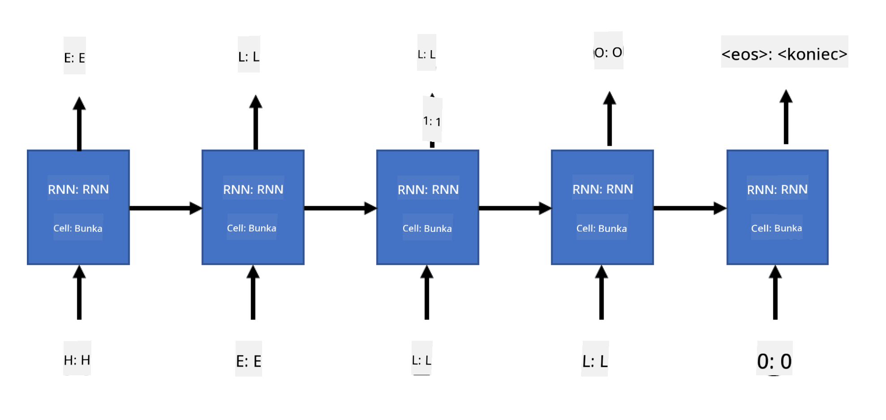

<!--
CO_OP_TRANSLATOR_METADATA:
{
  "original_hash": "d9de7847385eeeda67cfdcce1640ab72",
  "translation_date": "2025-08-25T21:44:24+00:00",
  "source_file": "lessons/5-NLP/17-GenerativeNetworks/README.md",
  "language_code": "sk"
}
-->
# Generatívne siete

## [Kvíz pred prednáškou](https://ff-quizzes.netlify.app/en/ai/quiz/33)

Rekurentné neurónové siete (RNN) a ich varianty s bránkovými bunkami, ako sú Long Short Term Memory Cells (LSTM) a Gated Recurrent Units (GRU), poskytujú mechanizmus na modelovanie jazyka, pretože dokážu naučiť sa poradie slov a predpovedať nasledujúce slovo v sekvencii. To nám umožňuje používať RNN na **generatívne úlohy**, ako je generovanie bežného textu, strojový preklad a dokonca aj popisovanie obrázkov.

> ✅ Zamyslite sa nad všetkými situáciami, kedy ste využili generatívne úlohy, ako je napríklad dopĺňanie textu počas písania. Urobte si prieskum o svojich obľúbených aplikáciách a zistite, či využívajú RNN.

V architektúre RNN, ktorú sme preberali v predchádzajúcej jednotke, každá jednotka RNN produkovala ako výstup nasledujúci skrytý stav. Môžeme však pridať ďalší výstup ku každej rekurentnej jednotke, čo by nám umožnilo generovať **sekvenciu** (rovnakej dĺžky ako pôvodná sekvencia). Navyše môžeme použiť RNN jednotky, ktoré neprijímajú vstup na každom kroku, ale len nejaký počiatočný stavový vektor, a potom generujú sekvenciu výstupov.

To umožňuje rôzne neurónové architektúry, ktoré sú znázornené na obrázku nižšie:


> Obrázok z blogového príspevku [Unreasonable Effectiveness of Recurrent Neural Networks](http://karpathy.github.io/2015/05/21/rnn-effectiveness/) od [Andreja Karpatyho](http://karpathy.github.io/)

* **One-to-one** je tradičná neurónová sieť s jedným vstupom a jedným výstupom
* **One-to-many** je generatívna architektúra, ktorá prijíma jednu vstupnú hodnotu a generuje sekvenciu výstupných hodnôt. Napríklad, ak chceme trénovať sieť na **popisovanie obrázkov**, ktorá by vytvorila textový popis obrázka, môžeme použiť obrázok ako vstup, prehnať ho cez CNN na získanie skrytého stavu a potom nechať rekurentný reťazec generovať popis slovo po slove
* **Many-to-one** zodpovedá RNN architektúram, ktoré sme popisovali v predchádzajúcej jednotke, ako je klasifikácia textu
* **Many-to-many**, alebo **sekvencia na sekvenciu**, zodpovedá úlohám, ako je **strojový preklad**, kde prvá RNN zhromažďuje všetky informácie zo vstupnej sekvencie do skrytého stavu a ďalší reťazec RNN rozvinie tento stav do výstupnej sekvencie.

V tejto jednotke sa zameriame na jednoduché generatívne modely, ktoré nám pomáhajú generovať text. Pre jednoduchosť použijeme tokenizáciu na úrovni znakov.

Budeme trénovať túto RNN na generovanie textu krok za krokom. Na každom kroku vezmeme sekvenciu znakov dĺžky `nchars` a požiadame sieť, aby pre každý vstupný znak vygenerovala nasledujúci výstupný znak:



Pri generovaní textu (počas inferencie) začíname s nejakým **podnetom**, ktorý prechádza cez RNN bunky na generovanie jeho medzistavu, a potom z tohto stavu začína generovanie. Generujeme jeden znak naraz a stav spolu s vygenerovaným znakom odovzdávame ďalšej RNN bunke na generovanie ďalšieho znaku, až kým nevygenerujeme dostatok znakov.


> Obrázok od autora

## ✍️ Cvičenia: Generatívne siete

Pokračujte vo svojom učení v nasledujúcich notebookoch:

* [Generatívne siete s PyTorch](../../../../../lessons/5-NLP/17-GenerativeNetworks/GenerativePyTorch.ipynb)
* [Generatívne siete s TensorFlow](../../../../../lessons/5-NLP/17-GenerativeNetworks/GenerativeTF.ipynb)

## Mäkké generovanie textu a teplota

Výstup každej RNN bunky je pravdepodobnostné rozdelenie znakov. Ak vždy vyberieme znak s najvyššou pravdepodobnosťou ako nasledujúci znak v generovanom texte, text sa často môže "zacykliť" medzi rovnakými sekvenciami znakov znova a znova, ako v tomto príklade:

```
today of the second the company and a second the company ...
```

Ak sa však pozrieme na pravdepodobnostné rozdelenie pre nasledujúci znak, môže sa stať, že rozdiel medzi niekoľkými najvyššími pravdepodobnosťami nie je veľký, napr. jeden znak môže mať pravdepodobnosť 0,2, iný 0,19 atď. Napríklad, pri hľadaní nasledujúceho znaku v sekvencii '*play*' môže byť nasledujúci znak rovnako dobre medzera alebo **e** (ako v slove *player*).

To nás vedie k záveru, že nie je vždy "spravodlivé" vybrať znak s najvyššou pravdepodobnosťou, pretože výber druhého najvyššieho môže stále viesť k zmysluplnému textu. Je rozumnejšie **vzorkovať** znaky z pravdepodobnostného rozdelenia, ktoré poskytuje výstup siete. Môžeme tiež použiť parameter **teplota**, ktorý vyhladí pravdepodobnostné rozdelenie, ak chceme pridať viac náhodnosti, alebo ho urobiť strmším, ak chceme viac dodržiavať znaky s najvyššou pravdepodobnosťou.

Preskúmajte, ako je toto mäkké generovanie textu implementované v notebookoch uvedených vyššie.

## Záver

Aj keď generovanie textu môže byť užitočné samo o sebe, hlavné výhody prichádzajú zo schopnosti generovať text pomocou RNN z nejakého počiatočného vektorového znaku. Napríklad generovanie textu sa používa ako súčasť strojového prekladu (sekvencia na sekvenciu, v tomto prípade sa stavový vektor z *enkódera* používa na generovanie alebo *dekódovanie* preloženej správy) alebo na generovanie textového popisu obrázka (v tomto prípade by vektor znakov pochádzal z CNN extraktora).

## 🚀 Výzva

Absolvujte niektoré lekcie na Microsoft Learn na túto tému:

* Generovanie textu s [PyTorch](https://docs.microsoft.com/learn/modules/intro-natural-language-processing-pytorch/6-generative-networks/?WT.mc_id=academic-77998-cacaste)/[TensorFlow](https://docs.microsoft.com/learn/modules/intro-natural-language-processing-tensorflow/5-generative-networks/?WT.mc_id=academic-77998-cacaste)

## [Kvíz po prednáške](https://ff-quizzes.netlify.app/en/ai/quiz/34)

## Prehľad a samoštúdium

Tu sú niektoré články na rozšírenie vašich vedomostí:

* Rôzne prístupy k generovaniu textu s Markovovým reťazcom, LSTM a GPT-2: [blogový príspevok](https://towardsdatascience.com/text-generation-gpt-2-lstm-markov-chain-9ea371820e1e)
* Ukážka generovania textu v [dokumentácii Keras](https://keras.io/examples/generative/lstm_character_level_text_generation/)

## [Úloha](lab/README.md)

Videli sme, ako generovať text znak po znaku. V laboratóriu preskúmate generovanie textu na úrovni slov.

**Zrieknutie sa zodpovednosti**:  
Tento dokument bol preložený pomocou služby AI prekladu [Co-op Translator](https://github.com/Azure/co-op-translator). Aj keď sa snažíme o presnosť, prosím, berte na vedomie, že automatizované preklady môžu obsahovať chyby alebo nepresnosti. Pôvodný dokument v jeho rodnom jazyku by mal byť považovaný za autoritatívny zdroj. Pre kritické informácie sa odporúča profesionálny ľudský preklad. Nenesieme zodpovednosť za akékoľvek nedorozumenia alebo nesprávne interpretácie vyplývajúce z použitia tohto prekladu.