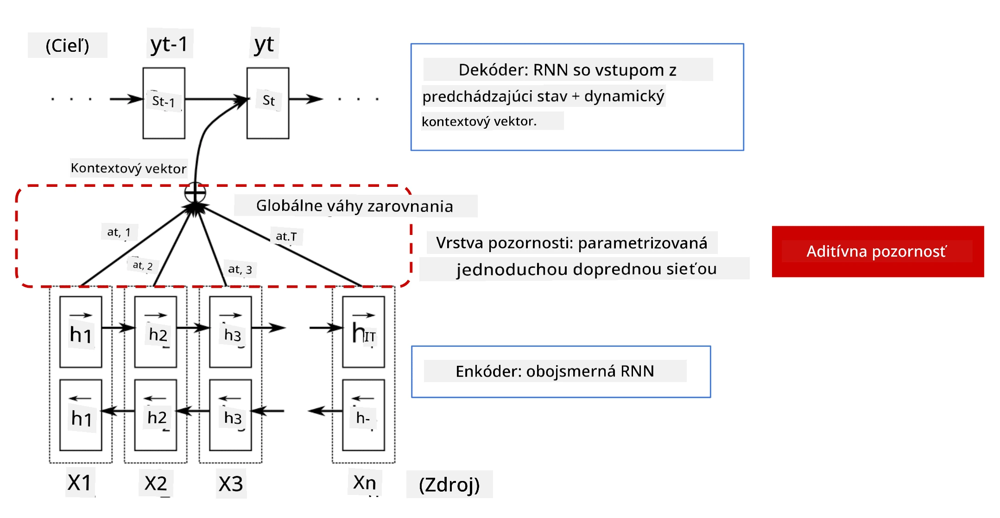
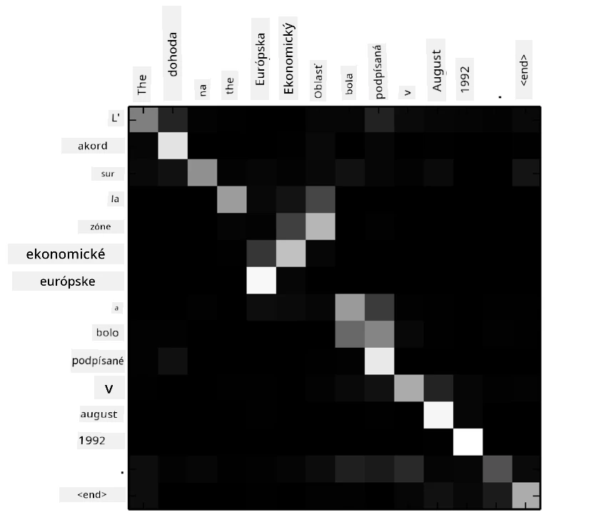
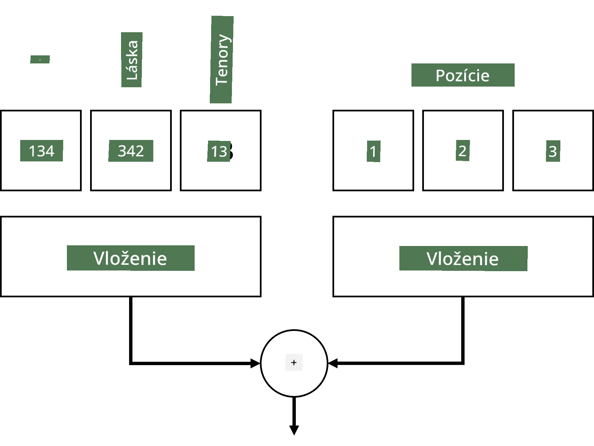
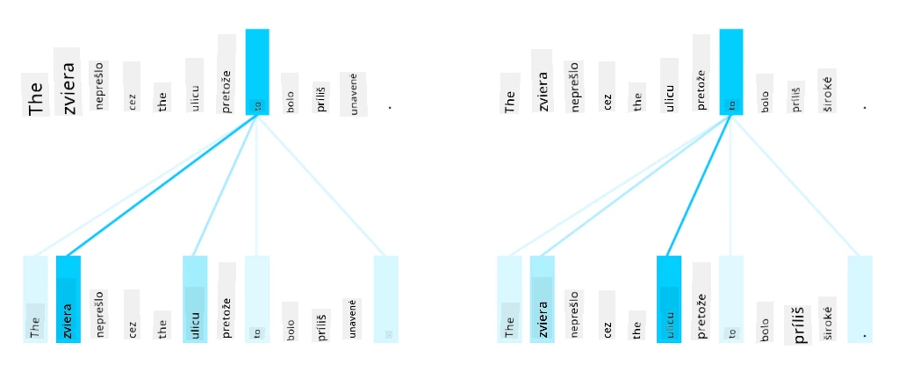
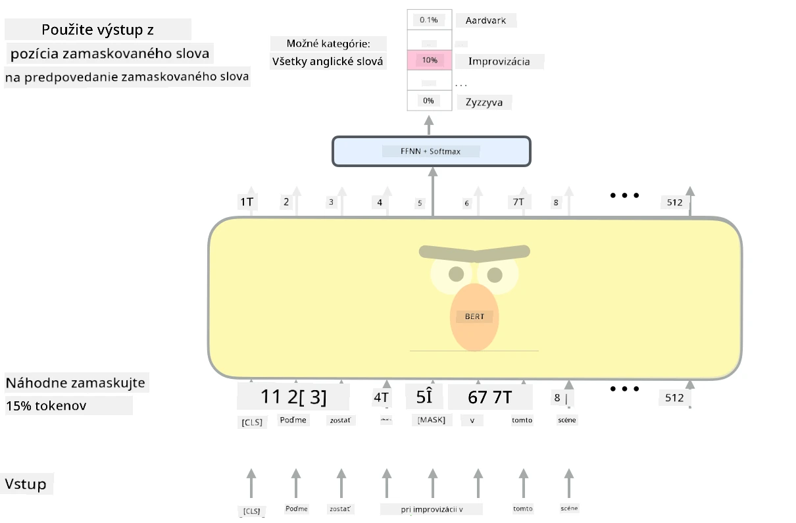

# Mechanizmy pozornosti a transformery

## [Kvíz pred prednáškou](https://ff-quizzes.netlify.app/en/ai/quiz/35)

Jedným z najdôležitejších problémov v oblasti NLP je **strojový preklad**, základná úloha, ktorá je základom nástrojov ako Google Translate. V tejto sekcii sa zameriame na strojový preklad, alebo všeobecnejšie na akúkoľvek úlohu *sekvencia na sekvenciu* (ktorá sa tiež nazýva **transformácia viet**).

Pri RNN sa sekvencia na sekvenciu implementuje pomocou dvoch rekurentných sietí, kde jedna sieť, **enkodér**, zhrnie vstupnú sekvenciu do skrytého stavu, zatiaľ čo druhá sieť, **dekodér**, rozvinie tento skrytý stav do preloženého výsledku. Tento prístup má niekoľko problémov:

* Konečný stav enkodérovej siete má problém zapamätať si začiatok vety, čo spôsobuje nízku kvalitu modelu pri dlhých vetách.
* Všetky slová v sekvencii majú rovnaký vplyv na výsledok. V skutočnosti však konkrétne slová vo vstupnej sekvencii často majú väčší vplyv na výstupy sekvencie než iné.

**Mechanizmy pozornosti** poskytujú spôsob váženia kontextového vplyvu každého vstupného vektora na každú výstupnú predikciu RNN. Implementuje sa to vytvorením skratiek medzi medzistavmi vstupného RNN a výstupného RNN. Týmto spôsobom, pri generovaní výstupného symbolu yt, zohľadníme všetky skryté stavy vstupu hi, s rôznymi váhovými koeficientmi &alpha;t,i.

> Model enkodér-dekodér s aditívnym mechanizmom pozornosti podľa [Bahdanau et al., 2015](https://arxiv.org/pdf/1409.0473.pdf), citované z [tohto blogového príspevku](https://lilianweng.github.io/lil-log/2018/06/24/attention-attention.html)

Maticu pozornosti {&alpha;i,j} by sme mohli interpretovať ako mieru, do akej určité vstupné slová ovplyvňujú generovanie daného slova vo výstupnej sekvencii. Nižšie je príklad takejto matice:

> Obrázok z [Bahdanau et al., 2015](https://arxiv.org/pdf/1409.0473.pdf) (Obr.3)

Mechanizmy pozornosti sú zodpovedné za veľkú časť súčasného alebo takmer súčasného stavu umenia v NLP. Pridanie pozornosti však výrazne zvyšuje počet parametrov modelu, čo viedlo k problémom so škálovaním RNN. Kľúčovým obmedzením škálovania RNN je, že rekurentná povaha modelov sťažuje dávkovanie a paralelizáciu tréningu. V RNN musí byť každý prvok sekvencie spracovaný v sekvenčnom poradí, čo znamená, že ho nemožno ľahko paralelizovať.

> Obrázok z [Google Blogu](https://research.googleblog.com/2016/09/a-neural-network-for-machine.html)

Adopcia mechanizmov pozornosti v kombinácii s týmto obmedzením viedla k vytvoreniu dnes už špičkových modelov Transformer, ktoré poznáme a používame, ako napríklad BERT a Open-GPT3.

## Modely Transformer

Jednou z hlavných myšlienok za transformermi je vyhnúť sa sekvenčnej povahe RNN a vytvoriť model, ktorý je paralelizovateľný počas tréningu. To sa dosahuje implementáciou dvoch myšlienok:

* pozičné kódovanie
* použitie mechanizmu vlastnej pozornosti na zachytenie vzorov namiesto RNN (alebo CNN) (preto sa článok, ktorý predstavuje transformery, nazýva *[Attention is all you need](https://arxiv.org/abs/1706.03762)*)

### Pozičné kódovanie/embedding

Myšlienka pozičného kódovania je nasledovná. 
1. Pri použití RNN je relatívna pozícia tokenov reprezentovaná počtom krokov, a teda ju netreba explicitne reprezentovať. 
2. Avšak, keď prejdeme na pozornosť, potrebujeme vedieť relatívne pozície tokenov v rámci sekvencie. 
3. Na získanie pozičného kódovania doplníme našu sekvenciu tokenov o sekvenciu pozícií tokenov v sekvencii (t.j. sekvenciu čísel 0,1, ...).
4. Potom zmiešame pozíciu tokenu s vektorom embeddingu tokenu. Na transformáciu pozície (celého čísla) na vektor môžeme použiť rôzne prístupy:

* Trénovateľný embedding, podobný embeddingu tokenov. Toto je prístup, ktorý tu zvažujeme. Aplikujeme vrstvy embeddingu na tokeny aj ich pozície, čím získame embeddingové vektory rovnakých rozmerov, ktoré potom sčítame.
* Fixná funkcia pozičného kódovania, ako je navrhnuté v pôvodnom článku.

> Obrázok od autora

Výsledok, ktorý získame s pozičným embeddingom, zahŕňa pôvodný token aj jeho pozíciu v rámci sekvencie.

### Multi-Head Self-Attention

Ďalej potrebujeme zachytiť nejaké vzory v rámci našej sekvencie. Na tento účel transformery používajú mechanizmus **vlastnej pozornosti**, ktorý je v podstate pozornosť aplikovaná na tú istú sekvenciu ako vstup a výstup. Aplikovanie vlastnej pozornosti nám umožňuje zohľadniť **kontext** v rámci vety a vidieť, ktoré slová sú navzájom prepojené. Napríklad nám umožňuje vidieť, na ktoré slová odkazujú koreferencie, ako *to*, a tiež zohľadniť kontext:

> Obrázok z [Google Blogu](https://research.googleblog.com/2017/08/transformer-novel-neural-network.html)

V transformeroch používame **Multi-Head Attention**, aby sme dali sieti schopnosť zachytiť niekoľko rôznych typov závislostí, napr. dlhodobé vs. krátkodobé vzťahy medzi slovami, koreferencie vs. niečo iné, atď.

[TensorFlow Notebook](TransformersTF.ipynb) obsahuje viac detailov o implementácii vrstiev transformera.

### Pozornosť enkodér-dekodér

V transformeroch sa pozornosť používa na dvoch miestach:

* Na zachytenie vzorov v rámci vstupného textu pomocou vlastnej pozornosti.
* Na vykonanie prekladu sekvencie - ide o vrstvu pozornosti medzi enkodérom a dekodérom.

Pozornosť enkodér-dekodér je veľmi podobná mechanizmu pozornosti používanému v RNN, ako je opísané na začiatku tejto sekcie. Tento animovaný diagram vysvetľuje úlohu pozornosti enkodér-dekodér.

Keďže každá vstupná pozícia je nezávisle mapovaná na každú výstupnú pozíciu, transformery môžu lepšie paralelizovať než RNN, čo umožňuje oveľa väčšie a expresívnejšie jazykové modely. Každá hlava pozornosti môže byť použitá na učenie rôznych vzťahov medzi slovami, čo zlepšuje úlohy spracovania prirodzeného jazyka.

## BERT

**BERT** (Bidirectional Encoder Representations from Transformers) je veľmi veľká viacvrstvová sieť transformera s 12 vrstvami pre *BERT-base* a 24 pre *BERT-large*. Model je najprv predtrénovaný na veľkom korpuse textových dát (WikiPedia + knihy) pomocou nesupervidovaného tréningu (predikcia maskovaných slov vo vete). Počas predtrénovania model absorbuje významné úrovne porozumenia jazyka, ktoré môžu byť následne využité s inými datasetmi pomocou jemného doladenia. Tento proces sa nazýva **transfer learning**.

> Obrázok [zdroj](http://jalammar.github.io/illustrated-bert/)

## ✍️ Cvičenia: Transformery

Pokračujte vo svojom učení v nasledujúcich notebookoch:

* [Transformery v PyTorch](TransformersPyTorch.ipynb)
* [Transformery v TensorFlow](TransformersTF.ipynb)

## Záver

V tejto lekcii ste sa naučili o Transformeroch a Mechanizmoch pozornosti, všetko základné nástroje v NLP. Existuje mnoho variácií architektúr Transformera vrátane BERT, DistilBERT, BigBird, OpenGPT3 a ďalších, ktoré je možné jemne doladiť. Balík [HuggingFace](https://github.com/huggingface/) poskytuje úložisko na tréning mnohých z týchto architektúr s použitím PyTorch aj TensorFlow.

## 🚀 Výzva

## [Kvíz po prednáške](https://ff-quizzes.netlify.app/en/ai/quiz/36)

## Prehľad & Samoštúdium

* [Blogový príspevok](https://mchromiak.github.io/articles/2017/Sep/12/Transformer-Attention-is-all-you-need/), vysvetľujúci klasický článok [Attention is all you need](https://arxiv.org/abs/1706.03762) o transformeroch.
* [Séria blogových príspevkov](https://towardsdatascience.com/transformers-explained-visually-part-1-overview-of-functionality-95a6dd460452) o transformeroch, vysvetľujúca architektúru podrobne.

## [Úloha](assignment.md)

---

