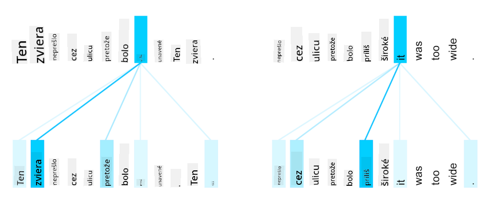

<!--
CO_OP_TRANSLATOR_METADATA:
{
  "original_hash": "7e617f0b8de85a43957a853aba09bfeb",
  "translation_date": "2025-08-25T22:00:55+00:00",
  "source_file": "lessons/5-NLP/18-Transformers/README.md",
  "language_code": "sk"
}
-->
# Mechanizmy pozornosti a transformery

## [Kvíz pred prednáškou](https://red-field-0a6ddfd03.1.azurestaticapps.net/quiz/118)

Jedným z najdôležitejších problémov v oblasti NLP je **strojový preklad**, základná úloha, ktorá je základom nástrojov ako Google Translate. V tejto sekcii sa zameriame na strojový preklad, alebo všeobecnejšie na akúkoľvek úlohu *sekvencia na sekvenciu* (ktorá sa tiež nazýva **transformácia viet**).

Pri RNN je sekvencia na sekvenciu implementovaná dvoma rekurentnými sieťami, kde jedna sieť, **enkóder**, zhrnie vstupnú sekvenciu do skrytého stavu, zatiaľ čo druhá sieť, **dekóder**, rozvinie tento skrytý stav do preloženého výsledku. Tento prístup má však niekoľko problémov:

* Konečný stav enkóderovej siete má problém zapamätať si začiatok vety, čo spôsobuje nízku kvalitu modelu pri dlhých vetách.
* Všetky slová v sekvencii majú rovnaký vplyv na výsledok. V skutočnosti však konkrétne slová vo vstupnej sekvencii často majú väčší vplyv na výstupy sekvencie než iné.

**Mechanizmy pozornosti** poskytujú spôsob váženia kontextového vplyvu každého vstupného vektora na každú predikciu výstupu RNN. Implementuje sa to vytvorením skratiek medzi medzistavmi vstupného RNN a výstupného RNN. Týmto spôsobom, pri generovaní výstupného symbolu yt, zohľadníme všetky skryté stavy vstupu hi, s rôznymi váhovými koeficientmi αt,i.

> Model enkóder-dekóder s mechanizmom aditívnej pozornosti podľa [Bahdanau et al., 2015](https://arxiv.org/pdf/1409.0473.pdf), citované z [tohto blogového príspevku](https://lilianweng.github.io/lil-log/2018/06/24/attention-attention.html)

Matica pozornosti {αi,j} by reprezentovala mieru, do akej určité vstupné slová zohrávajú úlohu pri generovaní daného slova vo výstupnej sekvencii. Nižšie je príklad takejto matice:

> Obrázok z [Bahdanau et al., 2015](https://arxiv.org/pdf/1409.0473.pdf) (Obr.3)

Mechanizmy pozornosti sú zodpovedné za veľkú časť súčasného alebo takmer súčasného stavu umenia v NLP. Pridanie pozornosti však výrazne zvyšuje počet parametrov modelu, čo viedlo k problémom so škálovaním RNN. Kľúčovým obmedzením škálovania RNN je, že rekurentná povaha modelov sťažuje dávkovanie a paralelizáciu tréningu. V RNN musí byť každý prvok sekvencie spracovaný v sekvenčnom poradí, čo znamená, že ho nemožno ľahko paralelizovať.

> Obrázok z [Google Blogu](https://research.googleblog.com/2016/09/a-neural-network-for-machine.html)

Prijatie mechanizmov pozornosti v kombinácii s týmto obmedzením viedlo k vytvoreniu dnes známych a používaných modelov transformérov, ako sú BERT a Open-GPT3.

## Modely transformérov

Jednou z hlavných myšlienok transformérov je vyhnúť sa sekvenčnej povahe RNN a vytvoriť model, ktorý je paralelizovateľný počas tréningu. To sa dosahuje implementáciou dvoch myšlienok:

* pozičné kódovanie
* použitie mechanizmu vlastnej pozornosti na zachytenie vzorov namiesto RNN (alebo CNN) (preto sa článok, ktorý predstavuje transforméry, nazýva *[Attention is all you need](https://arxiv.org/abs/1706.03762)*)

### Pozičné kódovanie/vkladanie

Myšlienka pozičného kódovania je nasledovná. 
1. Pri použití RNN je relatívna pozícia tokenov reprezentovaná počtom krokov, a teda ju netreba explicitne reprezentovať. 
2. Avšak, keď prejdeme na pozornosť, potrebujeme vedieť relatívne pozície tokenov v rámci sekvencie. 
3. Na získanie pozičného kódovania rozšírime našu sekvenciu tokenov o sekvenciu pozícií tokenov v sekvencii (t.j. sekvenciu čísel 0,1, ...).
4. Potom zmiešame pozíciu tokenu s vektorom vkladania tokenu. Na transformáciu pozície (celého čísla) na vektor môžeme použiť rôzne prístupy:

* Trénovateľné vkladanie, podobné vkladaniu tokenov. Toto je prístup, ktorý tu zvažujeme. Aplikujeme vrstvy vkladania na tokeny aj ich pozície, čím získame vektory vkladania rovnakých rozmerov, ktoré potom sčítame.
* Fixná funkcia pozičného kódovania, ako je navrhnuté v pôvodnom článku.

> Obrázok od autora

Výsledok, ktorý získame s pozičným vkladaním, vkladá pôvodný token aj jeho pozíciu v rámci sekvencie.

### Multi-Head Self-Attention

Ďalej potrebujeme zachytiť niektoré vzory v rámci našej sekvencie. Na tento účel transforméry používajú mechanizmus **vlastnej pozornosti**, ktorý je v podstate pozornosť aplikovaná na tú istú sekvenciu ako vstup a výstup. Aplikovanie vlastnej pozornosti nám umožňuje zohľadniť **kontext** v rámci vety a vidieť, ktoré slová sú navzájom prepojené. Napríklad nám umožňuje vidieť, na ktoré slová sa odkazuje pomocou koreferencií, ako *to*, a tiež zohľadniť kontext:

> Obrázok z [Google Blogu](https://research.googleblog.com/2017/08/transformer-novel-neural-network.html)

V transforméroch používame **Multi-Head Attention**, aby sme dali sieti schopnosť zachytiť niekoľko rôznych typov závislostí, napr. dlhodobé vs. krátkodobé vzťahy medzi slovami, koreferencie vs. niečo iné, atď.

[TensorFlow Notebook](../../../../../lessons/5-NLP/18-Transformers/TransformersTF.ipynb) obsahuje viac detailov o implementácii vrstiev transformérov.

### Pozornosť enkóder-dekóder

V transforméroch sa pozornosť používa na dvoch miestach:

* Na zachytenie vzorov v rámci vstupného textu pomocou vlastnej pozornosti.
* Na vykonanie prekladu sekvencie - ide o vrstvu pozornosti medzi enkóderom a dekóderom.

Pozornosť enkóder-dekóder je veľmi podobná mechanizmu pozornosti používanému v RNN, ako je opísané na začiatku tejto sekcie. Tento animovaný diagram vysvetľuje úlohu pozornosti enkóder-dekóder.

Keďže každá vstupná pozícia je mapovaná nezávisle na každú výstupnú pozíciu, transforméry môžu lepšie paralelizovať než RNN, čo umožňuje oveľa väčšie a expresívnejšie jazykové modely. Každá hlava pozornosti môže byť použitá na učenie rôznych vzťahov medzi slovami, čo zlepšuje následné úlohy spracovania prirodzeného jazyka.

## BERT

**BERT** (Bidirectional Encoder Representations from Transformers) je veľmi veľká viacvrstvová sieť transformérov s 12 vrstvami pre *BERT-base* a 24 pre *BERT-large*. Model je najprv predtrénovaný na veľkom korpuse textových dát (WikiPedia + knihy) pomocou nesupervidovaného tréningu (predpovedanie maskovaných slov vo vete). Počas predtrénovania model absorbuje významné úrovne porozumenia jazyka, ktoré môžu byť následne využité s inými datasetmi pomocou jemného doladenia. Tento proces sa nazýva **transfer learning**.

> Obrázok [zdroj](http://jalammar.github.io/illustrated-bert/)

## ✍️ Cvičenia: Transforméry

Pokračujte vo svojom učení v nasledujúcich notebookoch:

* [Transforméry v PyTorch](../../../../../lessons/5-NLP/18-Transformers/TransformersPyTorch.ipynb)
* [Transforméry v TensorFlow](../../../../../lessons/5-NLP/18-Transformers/TransformersTF.ipynb)

## Záver

V tejto lekcii ste sa naučili o transforméroch a mechanizmoch pozornosti, všetko základné nástroje v NLP. Existuje mnoho variácií architektúr transformérov vrátane BERT, DistilBERT, BigBird, OpenGPT3 a ďalších, ktoré je možné jemne doladiť. Balík [HuggingFace](https://github.com/huggingface/) poskytuje úložisko na tréning mnohých z týchto architektúr s použitím PyTorch aj TensorFlow.

## 🚀 Výzva

## [Kvíz po prednáške](https://red-field-0a6ddfd03.1.azurestaticapps.net/quiz/218)

## Prehľad a samostatné štúdium

* [Blogový príspevok](https://mchromiak.github.io/articles/2017/Sep/12/Transformer-Attention-is-all-you-need/), vysvetľujúci klasický článok [Attention is all you need](https://arxiv.org/abs/1706.03762) o transforméroch.
* [Séria blogových príspevkov](https://towardsdatascience.com/transformers-explained-visually-part-1-overview-of-functionality-95a6dd460452) o transforméroch, vysvetľujúca architektúru podrobne.

## [Úloha](assignment.md)

**Zrieknutie sa zodpovednosti**:  
Tento dokument bol preložený pomocou služby AI prekladu [Co-op Translator](https://github.com/Azure/co-op-translator). Aj keď sa snažíme o presnosť, prosím, berte na vedomie, že automatizované preklady môžu obsahovať chyby alebo nepresnosti. Pôvodný dokument v jeho rodnom jazyku by mal byť považovaný za autoritatívny zdroj. Pre kritické informácie sa odporúča profesionálny ľudský preklad. Nenesieme zodpovednosť za akékoľvek nedorozumenia alebo nesprávne interpretácie vyplývajúce z použitia tohto prekladu.